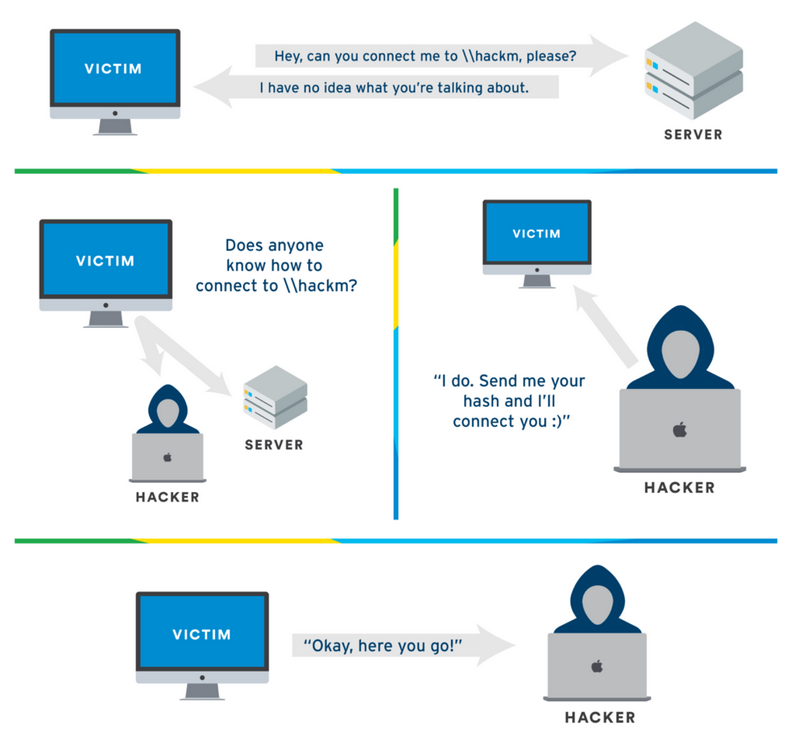
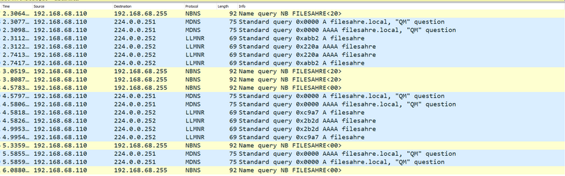
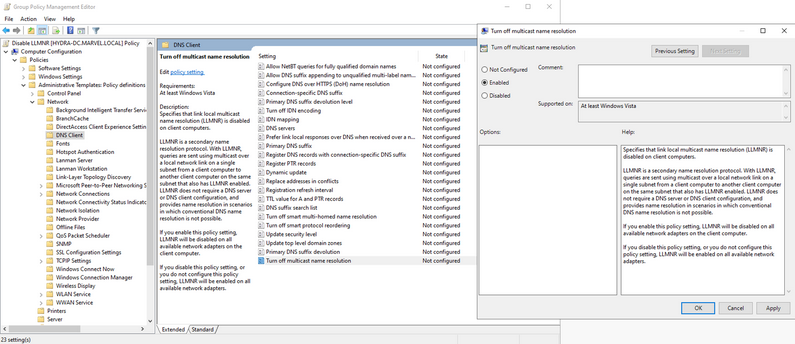
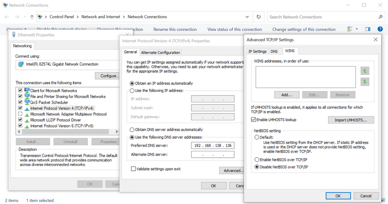

# What is Name Resolution?
---
Name Resolution is a series of procedures where a machine tries to retrieve a host's IP address by its hostname. A rough procedure is as follows:
1. The hostname fileshare‘s IP address is required
2. The local hostfile will be checked for suitable records
3. If no records were found, the machine will move on to the local DNS cache, which archives recently resolved names
4. No local DNS record found? A query will be sent to the configured DNS server
5. If all else fails – the machine will send a multicast query, asking other machines in the network for fileshare‘s IP address

The three main protocols for multicast name resolution: NBT-NS (NetBIOS Name Service), LLMNR (Link-Local Multicast Name Resolution) and mDNS (multicast DNS).  

# What is LLMNR?
---
Link-Local Multicast Name Resolution (LLMNR) is a Microsoft protocol for resolving names on the same link when DNS cannot answer. The purpose of this protocol is to allow IPv4/IPv6 hosts to resolve each other's names without any DNS server or configuration, typically as a fallback when DNS fails.  

This protocol is typically exploited by attackers due to the lack of authentication mechanisms.

LLMNR operates over UDP port 5355.  

# What is NBT-NS?
---
NetBIOS Name Service (NBT-NS) is a protocol to resolve NetBIOS names to IP addresses typically for older Windows networks. Similar to LLMNR, it lacks authentication mechanisms.

NBT-NS operates over UDP port 137.  

# LLMNR/NBT-NS Poisoning Attack
---
When a victim machine tries to connect to a a shared folder's name, it will typically ask the DNS server for the IP address of the folder name. If the DNS server does not have a record, the victim machine will send out a series of mDNS, NBT-NS, and LLMNR queries to find the IP address of the hostname.  

An attacker may spoof the identity of the requested hostname by replying to the request and telling the victim machine that the hostname resolves to their own IP address. With no verification in place, the victim machine trusts the response and will send traffic to the attacker's IP address.  

With this attack, cybercriminals may perform man-in-the-middle attacks, redirect traffic, and harvest sensitive information like user credentials.  
  


  
> This is a Wireshark PCAP traffic. Here, A shared folder's name is mistyped (`\\filesahre` instead of `\\fileshare`) which resulted in a series of mDNS, NBT-NS, and LLMNR queries.

# LLMNR Poisoning Mitigation
---
It is recommended to disable LLMNR and NBT-NS services.  

To disable LLMNR, navigate to Computer Configuration > Administrative Templates > Network > DNS Client > Turn off multicast name resolution and select **Enabled**.  
  

To disable NBT-NS, navigate to Network Connections > Network Adapter Properties, > TCP/IPv4 Properties > Advanced Tab > WINS tab and select **Disable NetBIOS over TCP/IP** in Active Directory. Note that this only works locally.  
  

To disable NBT-NS using GPO in Active Directory, use the following PowerShell script and save it as a Startup Script.  
```powershell
set-ItemProperty -Path HKLM:\SYSTEM\CurrentControlSet\services\NetBT\Parameters\Interfaces\tcpip* -Name NetbiosOptions -Value 2
```

# References
---
- [LLMNR Poisoning and How to Prevent It in Active Directory](https://tcm-sec.com/llmnr-poisoning-and-how-to-prevent-it/)
- [Adversary-in-the-Middle: LLMNR/NBT-NS Poisoning and SMB Relay](https://attack.mitre.org/techniques/T1557/001/)
- [LLMNR & NBT-NS Poisoning and Credential Access using Responder](https://www.cynet.com/attack-techniques-hands-on/llmnr-nbt-ns-poisoning-and-credential-access-using-responder/)