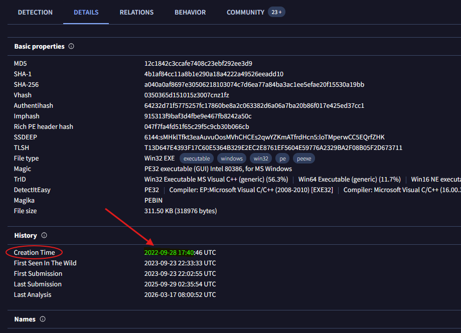
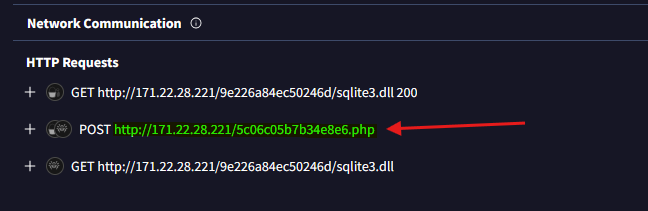
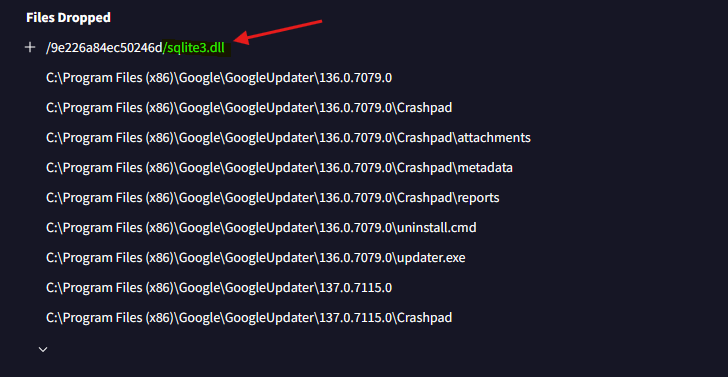
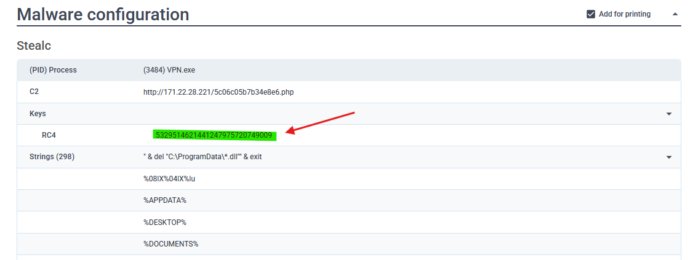
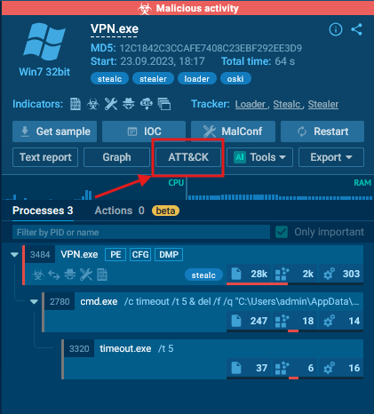
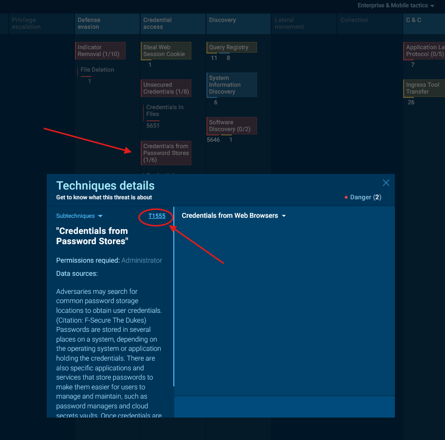
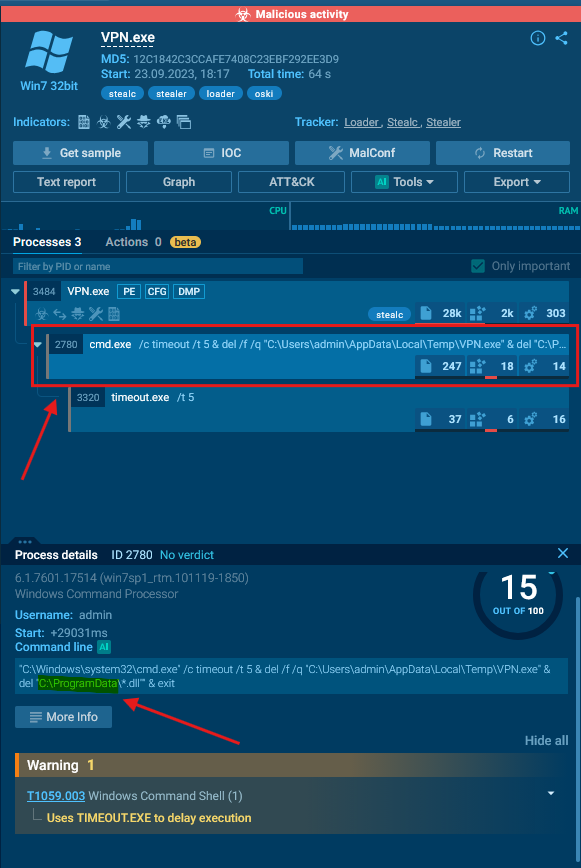
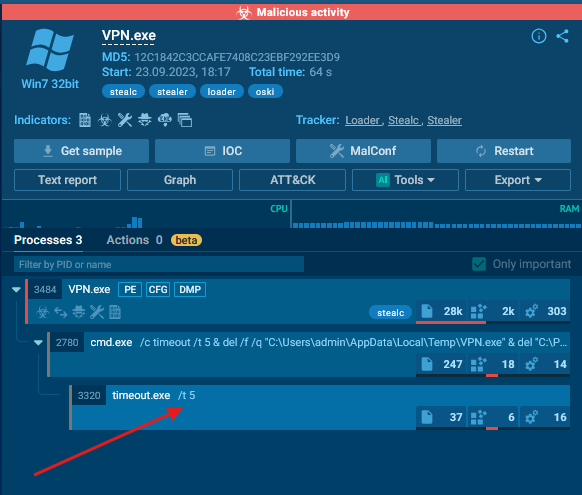

# Challenge Overview
---
**Challenge:** [Oski](https://cyberdefenders.org/blueteam-ctf-challenges/oski/)  
**Platform:** CyberDefender  
**Category:** Threat Intel  
**Difficulty:** Easy  
**Tools:** VirusTotal, Any.Run  

# Summary
---

# Scenario
---
The accountant at the company received an email titled "Urgent New Order" from a client late in the afternoon. When he attempted to access the attached invoice, he discovered it contained false order information. Subsequently, the SIEM solution generated an alert regarding downloading a potentially malicious file. Upon initial investigation, it was found that the PPT file might be responsible for this download. Could you please conduct a detailed examination of this file?

# Challenge
---
## Determining the creation time of the malware can provide insights into its origin. What was the time of malware creation?

Copy the given MD5 hash into VirusTotal, then navigate to the Details tab to find the creation time.  
  

## Identifying the command and control (C2) server that the malware communicates with can help trace back to the attacker. Which C2 server does the malware in the PPT file communicate with?

In VirusTotal, navigate to the Behavior tab to show key information about the behavior of the malware. Under Network Communication, we can observe multiple requests to a suspicious server.  
The POST request is what we are interested in because this indicates that the malware is sending data out via POST.  
  

## Identifying the initial actions of the malware post-infection can provide insights into its primary objectives. What is the first library that the malware requests post-infection?

Under the **File system actions** section, if we look at the files dropped we can see the first file being a dll.  
  

## By examining the provided [Any.run report](https://any.run/report/a040a0af8697e30506218103074c7d6ea77a84ba3ac1ee5efae20f15530a19bb/d55e2294-5377-4a45-b393-f5a8b20f7d44) what RC4 key is used by the malware to decrypt its base64-encoded string?

We can find the RC4 key that was used to decrypt the base64-encoded string under the **Malware configuration** section.  
  

## By examining the MITRE ATT&CK techniques displayed in the [Any.run sandbox](https://app.any.run/tasks/d55e2294-5377-4a45-b393-f5a8b20f7d44) report, identify the main MITRE technique (not sub-techniques) the malware uses to steal the user’s password.

Click on the ATT&CK button under the malware.
  

This will reveal the MITRE ATT&CK matrix that maps to the techniques of the malware.  
Click on **Credentials from Password Stores** to reveal technique details and the technique ID.
  

## By examining the child processes displayed in the [Any.run sandbox report](https://app.any.run/tasks/d55e2294-5377-4a45-b393-f5a8b20f7d44), which directory does the malware target for the deletion of all DLL files?

Clicking on the cmd.exe child process, we can observe a malicious command specifically `del "C:\ProgramData\*.dll"` which indicates that this is deleting all dll files under the ProgramData directory.  
  

## Understanding the malware's behavior post-data exfiltration can give insights into its evasion techniques. By analyzing the child processes, after successfully exfiltrating the user's data, how many seconds does it take for the malware to self-delete?

Observing the timeout.exe process, we can see a timeout of 5 seconds.
  