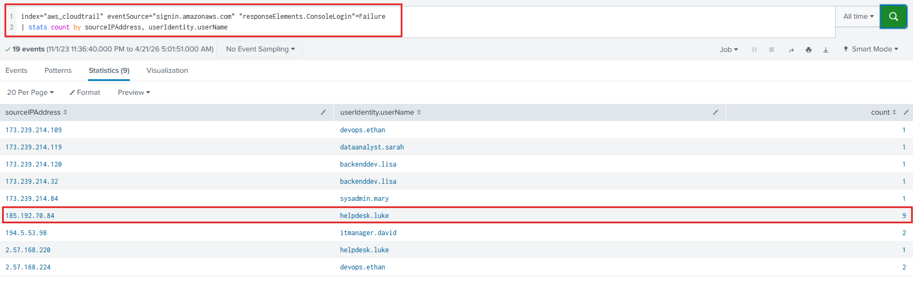
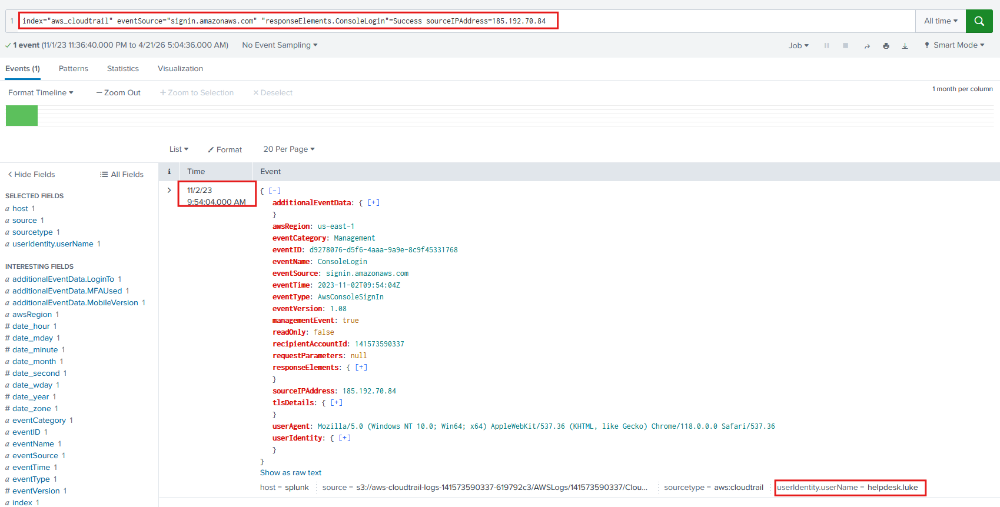
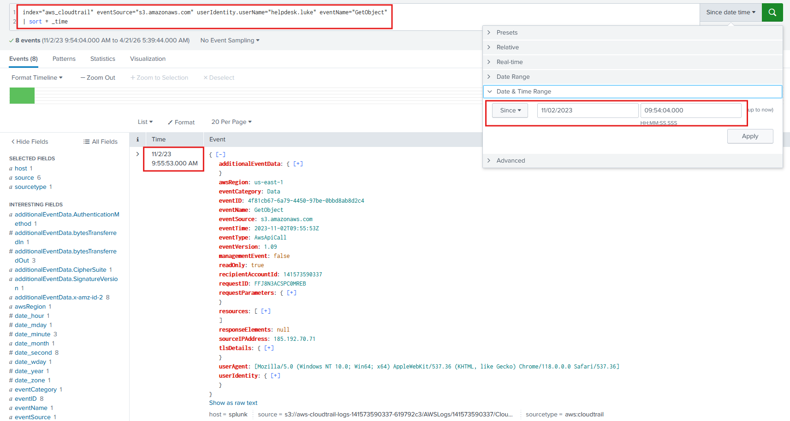
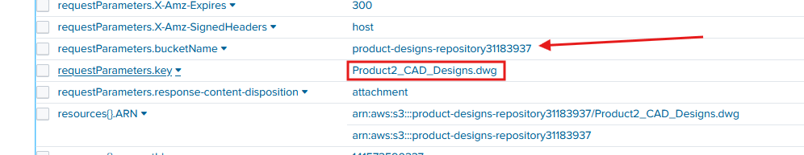
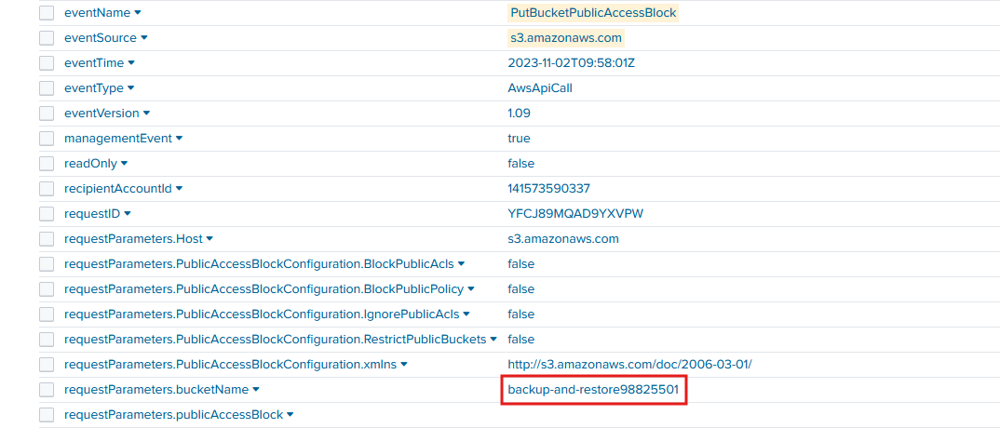
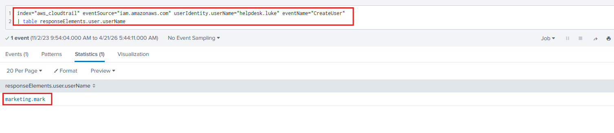
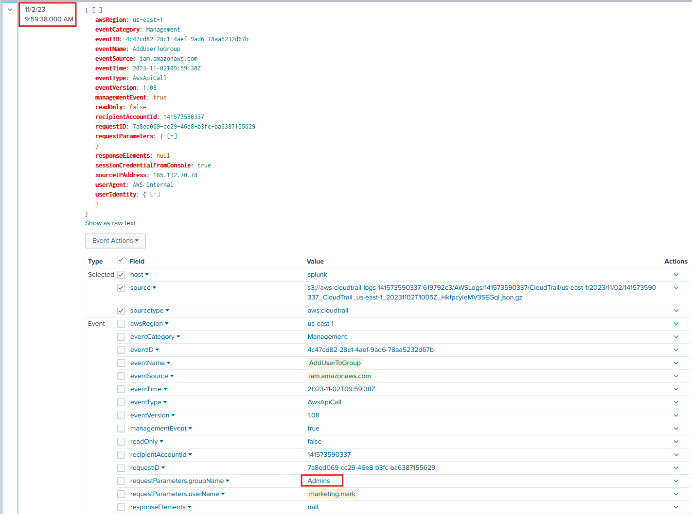

# Lab Overview
---
**Lab:** [AWSRaid Lab](https://cyberdefenders.org/blueteam-ctf-challenges/awsraid/)  
**Platform:** CyberDefenders  
**Category:** Cloud Forensics  
**Difficulty:** Easy  
**Tools:** Splunk  

# Summary
---
This lab investigates an unauthorized access incident in an AWS environment using Splunk to analyze CloudTrail logs. The attacker brute-forced the `helpdesk.luke` account from IP address `185.192.70.84` with 9 failed attempts before gaining a successful login and accessing the AWS console.

Post-compromise activity showed the attacker enumerated S3 buckets and accessed sensitive files including a CAD design file in the `product-designs-repository31183937` bucket. The attacker also modified the `backup-and-restore98825501` bucket configuration to allow public access. To maintain persistence, the attacker created a new user account `marketing.mark` and added it to the `Admins` group, demonstrating a complete attack chain from initial access through privilege escalation.

# Scenario
---
Your organization utilizes AWS to host critical data and applications. An incident has been reported that involves unauthorized access to data and potential exfiltration. The security team has detected unusual activities and needs to investigate the incident to determine the scope of the attack.  

# Analysis
---
## Knowing which user account was compromised is essential for understanding the attacker's initial entry point into the environment. What is the username of the compromised user?

To begin this investigation, we will analyze the layout of the `aws:cloudtrail` sourcetype. Using the query below, we can get an overview of the fields available.  
```sql
sourcetype="aws:cloudtrail"
```

The main fields to focus query searches are:
- eventName
- eventSource
- requestParameters
- responseElements
- sourceIPAddress
- userIdentity

Next, search through the `signin.amazonaws.com` event source and look for failed logon attempts with `"responseElements.ConsoleLogin"=Failure`. The query below will group the results by source IP address and the username of the account.  
```sql
index="aws_cloudtrail" eventSource="signin.amazonaws.com" "responseElements.ConsoleLogin"=Failure
| stats count by sourceIPAddress, userIdentity.userName
```
  
In the screenshot above, the output shows that the user account `helpdesk.luke` has an unusually high amount of 9 failed logons coming from the IP address `185.192.70.84`.  

To check if this user account had a successful logon, modify the query to searched for `"responseElements.ConsoleLogin"=Success` with the IP address `185.192.70.84`. This will search for any successful login events from `185.192.70.84`.  
  
In the screenshot above, 1 event at 11/2/23 9:54:04 AM shows a successful login for the user account `helpdesk.luke`.  

## We must investigate the events following the initial compromise to understand the attacker's motives. What is the timestamp for the first access to an S3 object by the attacker?

We will now change the eventSource to `s3.amazonaws.com` to get events relating to S3. We know that the compromised user account is `helpdesk.luke` so the query below will find all events for `GetObject` from the compromised user account and sort the time from earliest to latest. We also need to change the search time period to search starting from when the compromised user account logged in. This will help identify any actions made by `helpdesk.luke` will likely be malicious.  
```sql
index="aws_cloudtrail" eventSource="s3.amazonaws.com" userIdentity.userName="helpdesk.luke" eventName="GetObject"
| sort + _time
```
  
The results show that the first `GetObject` event activity from the user account `helpdesk.luke` occurred at `2023-11-02 09:55`.  

## Among the S3 buckets accessed by the attacker, one contains a DWG file. What is the name of this bucket?

Using the previous query, remove the `GetObject` search and add `DWG` to search for any events containing `DWG`.  
```sql
index="aws_cloudtrail" eventSource="s3.amazonaws.com" userIdentity.userName="helpdesk.luke" DWG
| sort + _time
```
  
This query returned one event at 11/2/23 9:56:07 AM with the bucket name `product-designs-repository31183937` that contains the DWG file named `Product2_CAD_Designs.dwg`.  

## We've identified changes to a bucket's configuration that allowed public access, a significant security concern. What is the name of this particular S3 bucket?

Using the previous query, modify it to now search for any events pertaining to `PutBucket`. The name of this event suggest that it likely modifies or creates (others include `DeleteBucket` and `GetBucket`).  
```sql
index="aws_cloudtrail" eventSource="s3.amazonaws.com" userIdentity.userName="helpdesk.luke" eventName="PutBucket*"
| sort + _time
```
  
This search query returned one event at 11/2/23 9:58:01 AM with the bucket name `backup-and-restore98825501`.  

## Creating a new user account is a common tactic attackers use to establish persistence in a compromised environment. What is the username of the account created by the attacker?

To identity user account creation, we need to look at the `iam.amazonaws.com` event source. This event source logs any activity relating to identity management. The query below will search for any `CreateUser` events made by `helpdesk.luke` then output just the username of the response.  
```sql
index="aws_cloudtrail" eventSource="iam.amazonaws.com" userIdentity.userName="helpdesk.luke" eventName="CreateUser" 
| table responseElements.user.userName
```
  
In the screenshot above, the query returned 1 event at 11/2/23 9:59:33 AM and the username of the account created by the attacker is `marketing.mark`.  

## Following account creation, the attacker added the account to a specific group. What is the name of the group to which the account was added?

Modify the previous query to now search for `AddUserToGroup` events. This will search for events where the user `helpdesk.luke` added a user to the account, in this case `marketing.mark`.  
```sql
index="aws_cloudtrail" eventSource="iam.amazonaws.com" userIdentity.userName="helpdesk.luke" requestParameters.userName="marketing.mark" eventName="AddUserToGroup"
```
  
This search query returned one event at 11/2/23 9:59:38 AM showing the user `helpdesk.luke` adding the newly created user `marketing.mark` to the group `Admins`.  

# Additional Resources
---
- [https://gist.github.com/pkazi/8b5a1374771f6efa5d55b92d8835718c](https://gist.github.com/pkazi/8b5a1374771f6efa5d55b92d8835718c)
- [How To Use CloudTrail Data for Security Operations & Threat Hunting](https://www.splunk.com/en_us/blog/security/cloudtrail-data-security-operations.html)
