# Lab Overview
---
**Lab:** [AzureHunt Lab](https://cyberdefenders.org/blueteam-ctf-challenges/azurehunt/)  
**Platform:** CyberDefenders  
**Category:** Cloud Forensics  
**Difficulty:** Easy  
**Tools:** ELK  

# Summary
---
This lab investigates an unauthorized access incident in a Microsoft Azure cloud environment using ELK (Elastic Stack) to analyze sign-in and activity logs. The attacker originated from Germany and initially compromised the user account `alice`, then accessed a PowerShell script `service-config.ps1` stored in the `cactusstorage2023` blob storage.

The attacker subsequently compromised a second account `it.admin1@cybercactus.onmicrosoft.com`, started the virtual machine `DEV01VM`, and exported the database `CUSTOMERDATADB`. To establish persistence, the attacker created a new user named `IT Support` and assigned the `Owner` role to the account, granting broad access to the Azure environment. The new account's first successful login was recorded the following day.

# Scenario
---
A finance company's Azure environment has flagged multiple failed login attempts from an unfamiliar geographic location, followed by a successful authentication. Shortly after, logs indicate access to sensitive Blob Storage files and a virtual machine start action. Investigate authentication logs, storage access patterns, and VM activity to determine the scope of the compromise.

# Analysis
---
## As a US-based company, the security team has observed significant suspicious activity from an unusual country. What is the name of the country from which the attack originated?

To begin this investigation, let's search around the fields for fields related to geography. If you search the field bar, a field named `source.geo.country_name` will pop up and this is likely the field we need.  

Navigate to `Visualize Library > Create` to create a visualization of the geographic origin as this will help us get a better overall picture. Set the horizontal axis to `source.geo.country_name.keyword` and the vertical axis to number of records.  
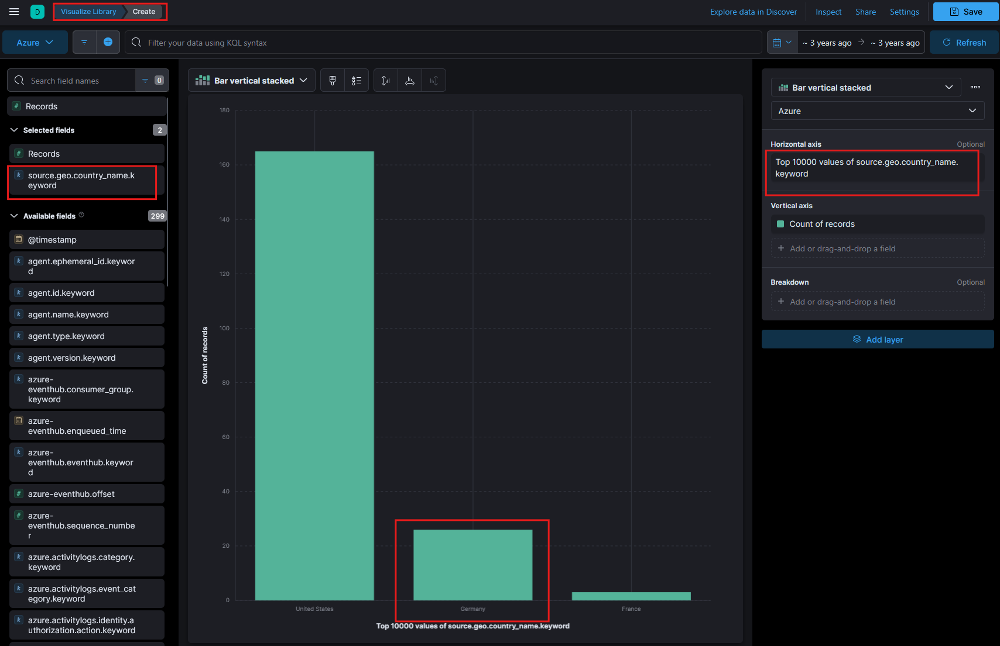  
For a US-based company, we should expect a large amountof traffic originating from the United States. However, we will notice that there is a significant spike in activity coming from `Germany`. It is likely that suspicious activities are originating from `Germany`.  

## To establish an accurate incident timeline, what is the timestamp of the initial activity originating from the country?

We can find the first activity coming from Germany by using KQL (Kibana Query Language) and searching for `source.geo.country_name.keyword : "Germany"`. Then click on `@timestamp` and sort from `Old-New`.  
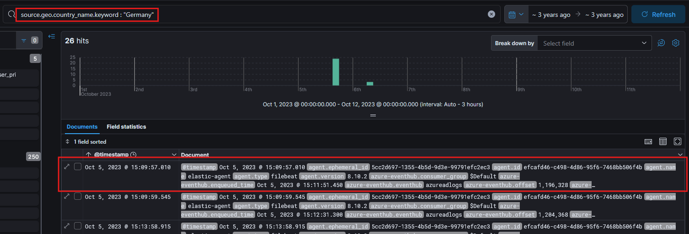  
In the screenshot above, the first activity that came from Germany occurerd on `2023-10-05 15:09:57`.  
## To assess the scope of compromise, we must determine the attacker's entry point. What is the display name of the compromised user account?

Now that we know activity from Germany began on `2023-10-05 15:09:57`, we will set the time search to begin on this date and time.  
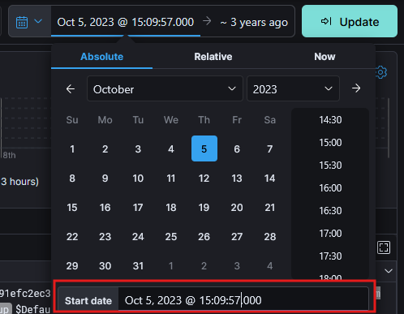  

Next, modify the KQL search query to search for "Sign-in activity" events.  
```sql
source.geo.country_name.keyword : "Germany" AND event.action : "Sign-in activity"
```
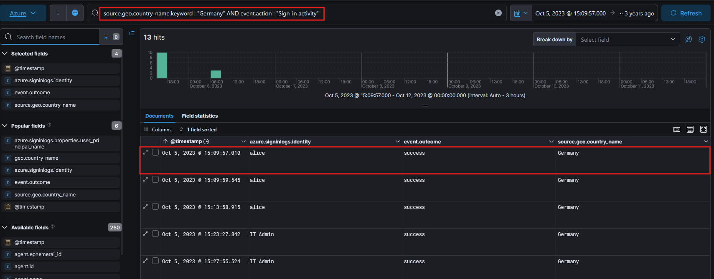  
In the screenshot above, the first sign-in activity is for the identity `alice` at the timestamp `2023-10-05 15:09:57`.  

## To gain insights into the attacker's tactics and enumeration strategy, what is the name of the script file the attacker accessed within blob storage?

Modify the search query to search for activities realted to reading data from blob storages. The query below will get logs that are categorized under the `StorageRead` operation, and the `GetBlob` operation indicates that data was retrieved from blob storage.  
```sql
azure.eventhub.category.keyword : "StorageRead" AND azure.eventhub.operationName.keyword : "GetBlob"
```
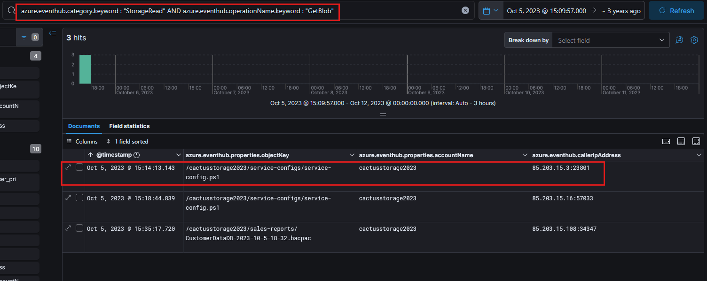  
In the screenshot above, the search result shows an event at `2023-10-05 15:14:13` that included an objectKey value appearing to be a PowerShell script file named `service-config.ps1`, located in the blob storage named `cactusstorage2023`. This timing aligns with the timline of the malicious activity following the compromise of the user account `alice`. In addition, the caller IP address `85.203.15.3` originates from Germany so this is likely the script that the attacker accessed.  

## For a detailed analysis of the attacker's actions, what is the name of the storage account housing the script file?

As we previously identified, the storage account housing the script file is `cactusstorage2023`.  
  

## Tracing the attacker's movements across our infrastructure, what is the User Principal Name (UPN) of the second user account the attacker compromised?

We will reuse the previous query that searches for "Sign-in activity" from Germany. This time, we will add the field `azure.signinlogs.properties.user_principal_name` to our output instead.  
```sql
source.geo.country_name.keyword : "Germany" AND event.action : "Sign-in activity"
```
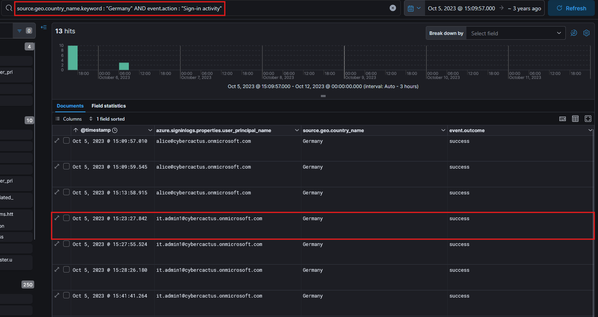  
In the screenshot above, we can see the user `it.admin1@cybercactus.onmicrosoft.com` was the second user compromised after `alice`.  

## Analyzing the attacker's impact on our environment, what is the name of the Virtual Machine (VM) the attacker started?

Run the search query below to find event actions related to starting virtual machines.  
```sql
event.action.keyword : "MICROSOFT.COMPUTE/VIRTUALMACHINES/START/ACTION" 
```
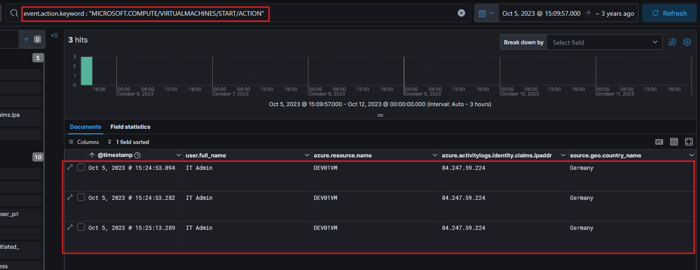  
The result show the user `IT Admin` starting the virtual machine named `DEV01VM` on 2023-10-05 at 15:24:53. We previously identified that the user `IT Admin` was the second account compromised by the attacker and the timing of this virtual machine action aligns with the previous malicious activity.  

## To assess the potential data exposure, what is the name of the database exported?

Modify the query from the previous question to now search for `MICROSOFT.SQL/SERVERS/DATABASES/EXPORT/ACTION`.  
```sql
event.action.keyword : "MICROSOFT.SQL/SERVERS/DATABASES/EXPORT/ACTION" 
```
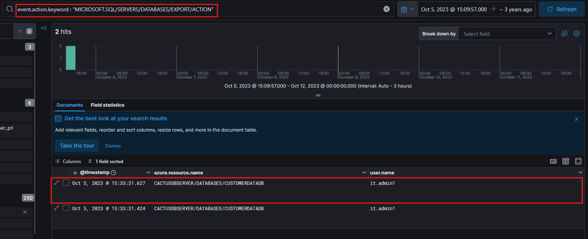  
This query returned 2 events occuring on 2023-10-05 at 15:33:31. The database name is identified as `CUSTOMERDATADB` and the originating user account is `IT Admin`.  

## In your pursuit of uncovering persistence techniques, what is the display name associated with the user account you have discovered?

To investigate if the attacker established persistence by adding a new user account, modify the previous query to search for "Add user" actions.  
```sql
event.action.keyword : "Add user" 
```
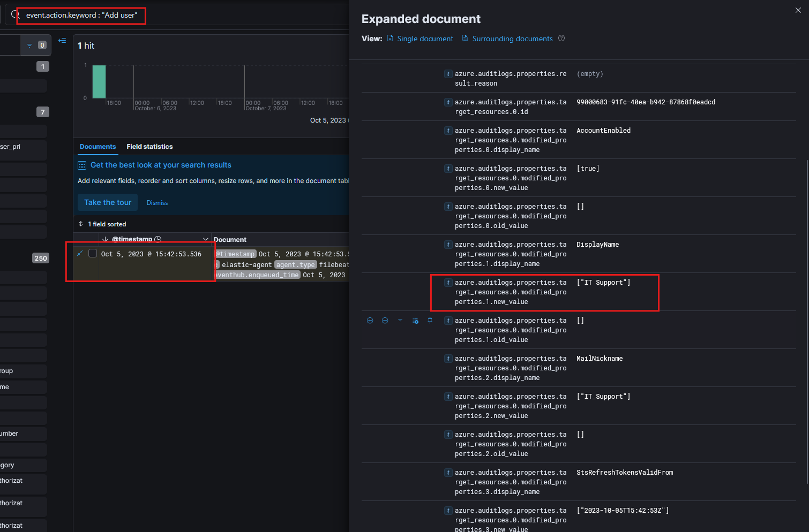  
This query returned 1 event on 2023-10-05 at 15:42:53. Further examining the details of this event revealed that a new user named `IT Support` was added. Given that this event occurred around the same time as the previous malicious activities and the event shows the user `IT Admin`  responsible for this action, we can conclude that the attacker created the user `IT Support` to establish persistence.  

## The attacker utilized a compromised account to assign a new role. What role was granted?

Run the query below to display logs where logs were assigned or modified. We will also modify the search time range to start on 2023-10-05 at 15:42:53 to identify role assignments likely made by the attacker after creating the user `IT Support`.  
```sql
event.action: "MICROSOFT.AUTHORIZATION/ROLEASSIGNMENTS/WRITE"
``` 
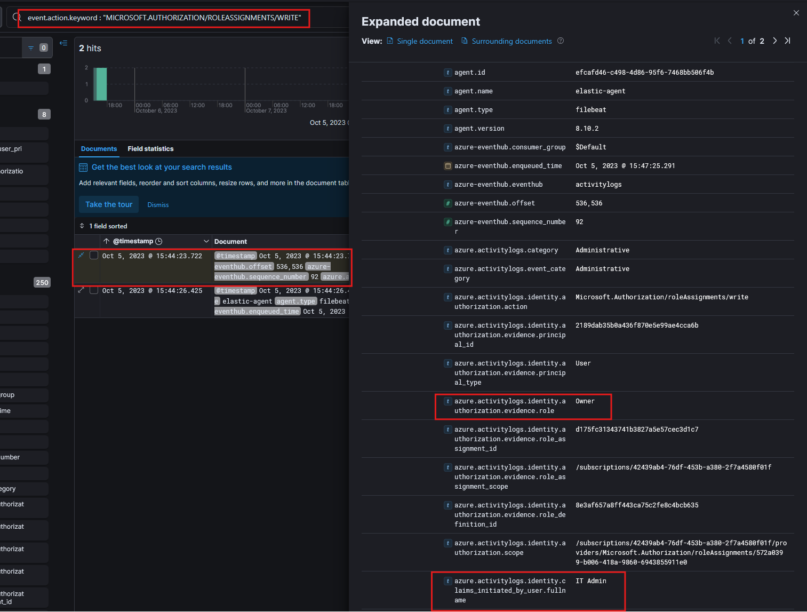  
In the screenshot above, we can see the event on 2023-10-05 at 15:47:25 shows the user `IT Admin` initiated this event and assigned the role `Owner`.  

## For a comprehensive timeline and understanding of the breach progression, What is the timestamp of the first successful login recorded for this user account?

To identify the first successful login for the user `IT Support`, run the query below to filter for successful sign-in activity for this user.  
```sql
source.geo.country_name.keyword : "Germany" AND event.action : "Sign-in activity" AND event.outcome.keyword : "success" AND azure.signinlogs.identity.keyword : "IT Support" 
``` 
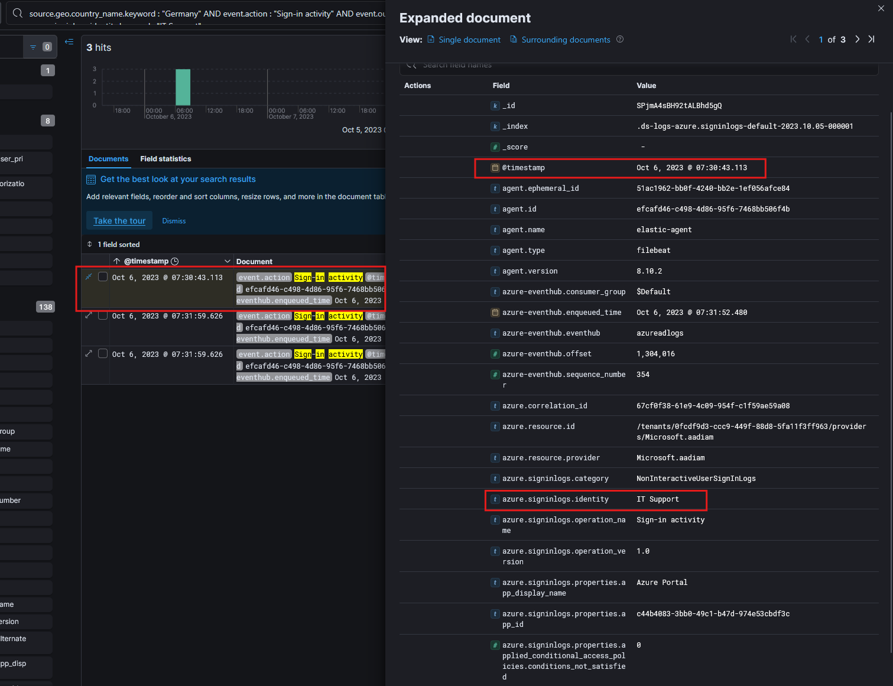  
The results show 3 events with the first successful login for `IT Support` logged at `2023-10-06 07:30:43`.  