# Lab Overview
---
**Lab:** [IMDSv1 Lab](https://cyberdefenders.org/blueteam-ctf-challenges/imdsv1/)  
**Platform:** CyberDefenders  
**Category:** Cloud Forensics  
**Difficulty:** Medium  
**Tools:** Wireshark, jq  

# Summary
---
This lab investigates a Server-Side Request Forgery (SSRF) attack against an AWS EC2 instance hosting the "Visa Checker" web application using PCAP and CloudTrail log analysis. The attacker exploited the IMDSv1 endpoint at `169.254.169.254` through the SSRF vulnerability to steal IAM role credentials for the `EC2-S3-Visa` role.

Using the stolen credentials, the attacker used the AWS CLI to perform a `GetCallerIdentity` check, enumerated S3 buckets, and proceeded to download approximately 5.4 GB of tourist data from the `tourists-visa-info` bucket. The attacker then deleted the bucket's contents and attempted to terminate the EC2 instance, though this was denied due to insufficient permissions. A new IAM user named `H3ll` was also attempted but failed. The attacker routed all activity through Tor exit nodes to obscure their identity, leaving multiple IP addresses in the CloudTrail logs.

# Scenario
---
On October 15, 2024, a security breach occurred involving a web application named "`Visa Checker`," which was hosted on an `AWS EC2 instance`. The attacker exploited a `Server-Side Request Forgery (SSRF)` vulnerability within the application, enabling them to steal `IAM` role credentials. With these compromised credentials, the attacker gained unauthorized access to sensitive information stored in `Amazon S3 bucket`. This S3 bucket contained data on approximately 20 million tourists.

The attacker leveraged the stolen credentials to perform various unauthorized actions within the AWS environment, including data exfiltration. To evade detection, the attacker routed their traffic through multiple `Tor` exit nodes, using anonymized IP addresses to obscure their true location, making it difficult to trace the source of the attack.

You have been given a `PCAP file` and `CloudWatch Logs` from the incident for analysis. The goal is to identify the attacker's actions, determine the compromised resources, and assess the overall scope and impact of the breach.

# Analysis
---
## The attacker tested the SSRF vulnerability by accessing an external website. What URL was used to conduct this test?

At 2024-10-15 10:15:35, frame number 914 reveals the attacker testing SSRF vulnerability by injecting the URL `http://www.google.com` into the request.  
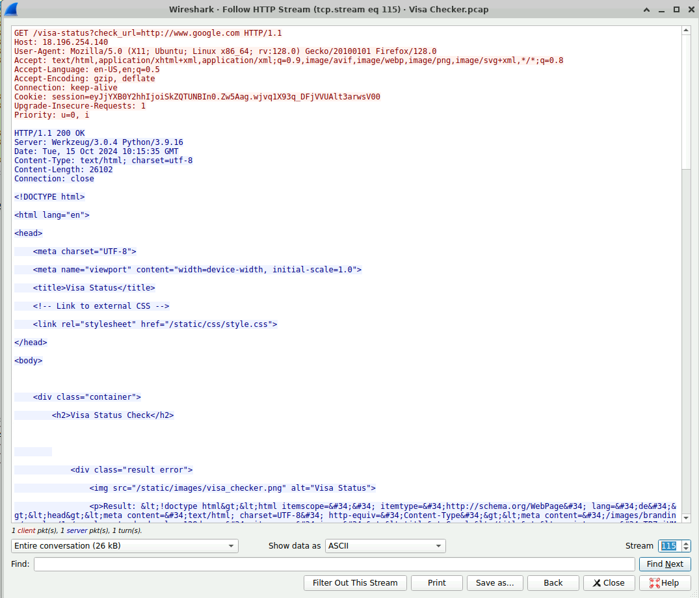  

The following frame 923 shows the response to this request. We can see that the server responded  with the homepage of Google as indicated by the Host field. This indicates that the Visa Check web app is vulnerable to SSRF.  
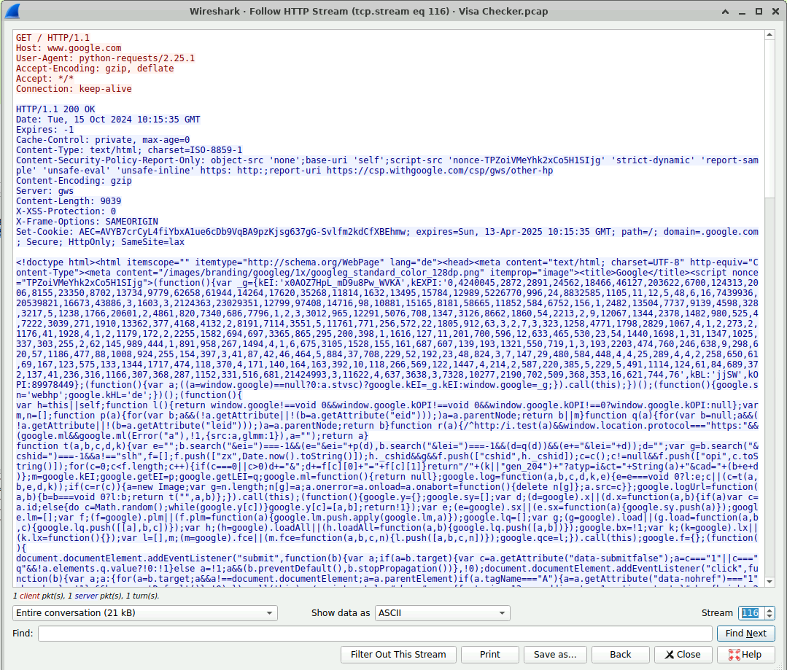  

## The attacker exploited the vulnerable website to send requests, ultimately obtaining the IAM role credentials. What is the exact URI used in the request made by the webserver to acquire these credentials?

Further examination into the network traffic after frame number 923 reveals the attacker exploiting the SSRF vulnerability by injecting the URL `http://169.254.169.254/latest/meta-data/` to attempt to enumerate the full metadata tree.  
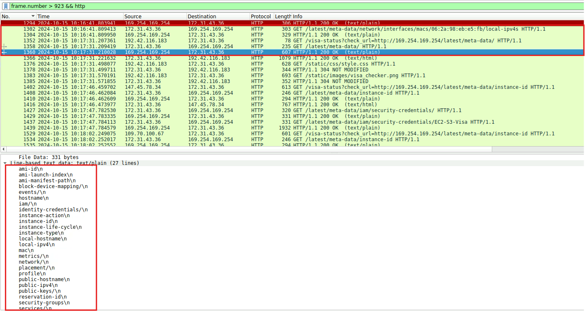  

Scrolling down further to frame 1784 reveals the attacker requesting the URL `http://169.254.169.254/latest/meta-data/iam/security-credentials/EC2-S3-Visa` to obtain the IAM role credentials.  
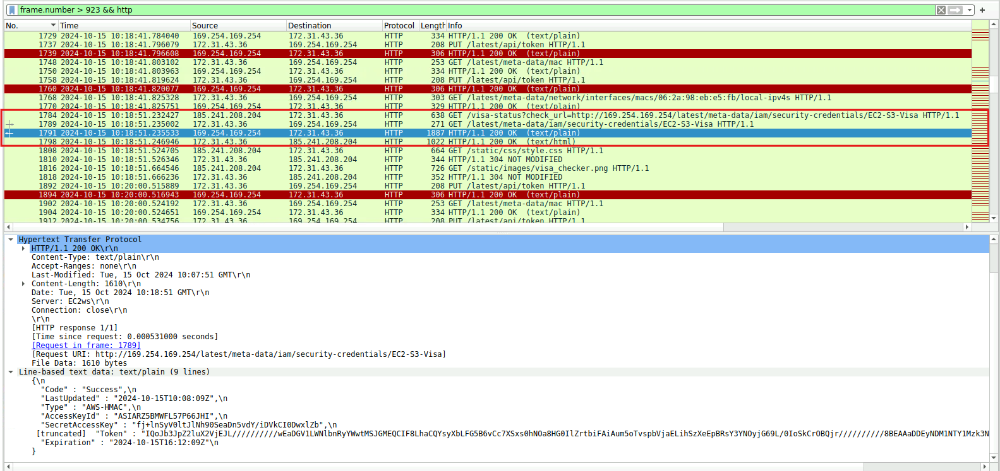  

The follow frame number 1791 at 2024-10-15 10:18:51 shows the server sucessfully responded to the request with the credentials.  

## The attacker executed an AWS CLI command, similar to whoami in traditional systems, to retrieve information about the IAM user or role associated with the operation. When exactly did he execute that command?

The `whoami` equivalent command in AWS is the `aws sts get-caller-identity` command. To search for this command in CloudTrail logs, we can run the CLI command below.
```bash
for file in *.json; do 
  echo "Processing $file"
  jq '.events[] | .message | fromjson | select(.eventName == "GetCallerIdentity") | 
  {eventTime: .eventTime, eventName: .eventName, userIdentity: .userIdentity, sourceIPAddress: .sourceIPAddress}' "$file"
done
```
This command will:
1. Initiate a loop that iterates over all JSON files in the current directory
2. Display the name of the file currently being processed
3. Extracts all objects inside the `events` array, retrieves the `message` field and parse it as a JSON object
4. Selects events where `eventName` is `GetCallerIdentity`
5. Extract and display `eventTime`, `eventName`, `userIdentity`, and `sourceIPAddress`

In the screenshot below, the command found traces of the `GetCallerIdentity` command execution in the `124355653975_CloudTrail_eu-central-1_3-logs.json` file.  
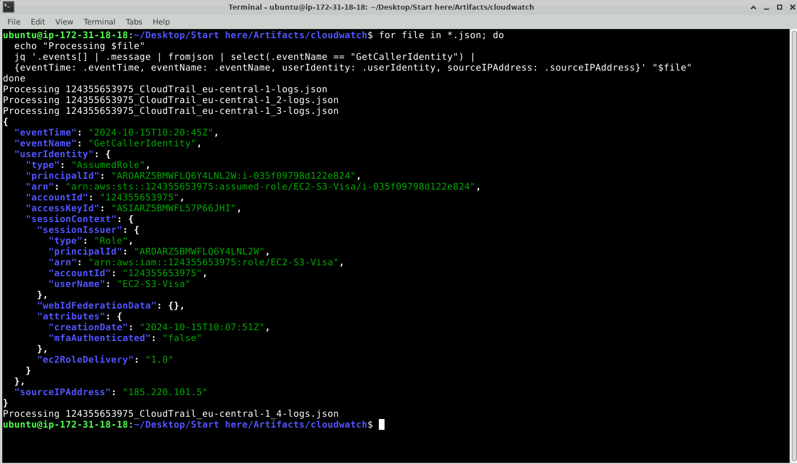  

From the extracted data, the `GetCallerIdentity` was executed at `2024-10-15 10:20:45` originating from the IP address `185.220.101.5`. Based on this evidence, it confirms that the attacker verified their IAM role access using the stolen AWS credentials.  

## During the investigation of the network traffic, we observed that the attacker attempted to retrieve the instance ID and subsequently tried to terminate or shut down the instance. What was the error code returned?

In the PCAP file, at 2024-10-15 10:17:46, frame number 1402 reveals the attacker attempting to obtain the instance ID through IMDS.  
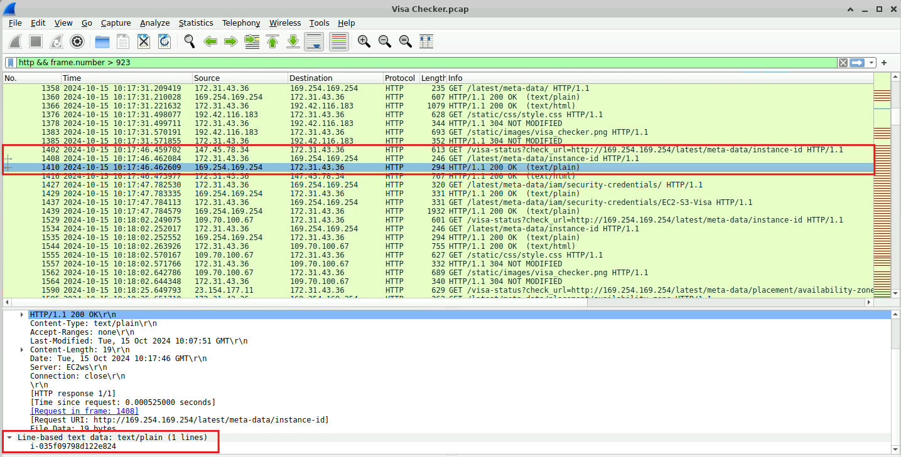  

Frame number 1410 responded to this request with the instance ID of `i-035f09798d122e824`.  

Now that we know the instance ID the attacker retrieved, we'll search through the CloudTrail logs for `TerminateInstances` or `StopInstances` API calls.  
```bash
for file in *.json; do 
  echo "Processing $file"
  jq '.events[] | .message | fromjson | select(.eventName | IN("TerminateInstances", "StopInstances"))' "$file"
done
```

In the screenshot below, one event at 2024-10-15 10:07:51 reveals an attempt to terminate the instance `i-035f09798d122e824` was found in the `124355653975_CloudTrail_eu-central-1_3-logs.json` file.  
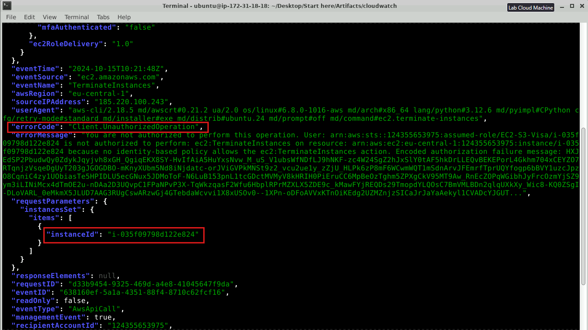  

The extracted data confirms instance ID that we previously identified in the network traffic and the error code from this operation is `Client.UnauthorizedOperation`. Based on this, the attacker attempted to stop the instance `i-035f09798d122e824`, but their operation was denied to due insufficient authorization likely from lack of permissions.  

## The attacker made an attempt to create a new user but lacked the necessary permissions. What was the username the attacker tried to create?

We can search for the `CreateUser` API to check for traces of user creation by the attacker in the logs.  
```bash
for file in *.json; do 
  echo "Processing $file"
  jq '.events[] | .message | fromjson | select(.eventName == "CreateUser")' "$file"
done
```

In the screenshot below, one event at 2024-10-15 10:23:57 shows a `CreateUser` operation logged in the `124355653975_CloudTrail_eu-central-1_4-logs.json` file.  
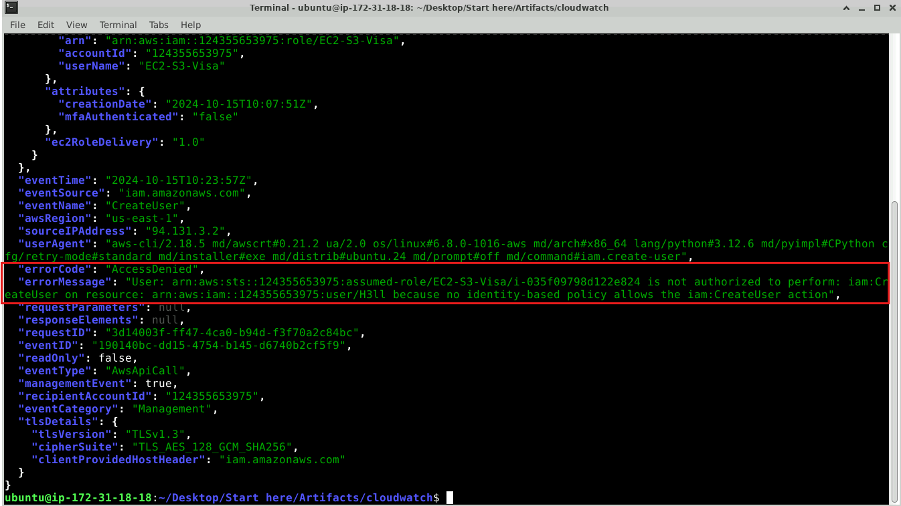  

The extracted data reveals the attacker attempted to create a user named `H3ll`, however, the error code returned `AccessDenied` which likely indicates that the attacker lacked permissions to create new users.  

## Which version of the AWS CLI did the attacker use?

Based on previous log examination, the `userAgent` field reveals the AWS CLI version of `aws-cli/2.18.5`.  

## After listing the available S3 buckets, the attacker proceeded to list the contents of one of them, Which bucket did the attacker list its contents?

The command below will search for any `ListObjects` operation in the log files.  
```bash
for file in *.json; do 
  echo "Processing $file"
  jq '.events[] | .message | fromjson | select(.eventName == "ListObjects")' "$file"
done
```

The command found multiple `ListObjects` events were logged across all log files. Since we know the attack occurred around `10:20`, we'll search the logs for `ListObjects` operations that occurred around this time.   
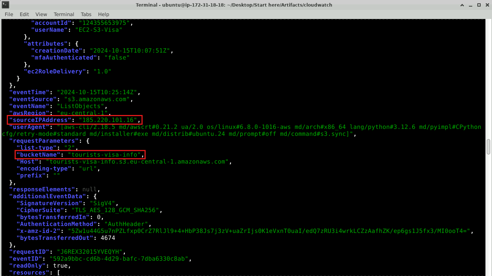  

In the screenshot above, a `ListObjects` event in `124355653975_CloudTrail_eu-central-1_2-logs.json` file was logged at `2024-10-15 10:07:51` where it attempted to list contents from the bucket named `tourists-visa-info`. This event originates from the IP address `185.220.101.16` which aligns with our previous findings that this is coming from the attacker.  

## The attacker subsequently began downloading data from the bucket. What was the total amount of data stolen, measured in bytes?

We know that the target bucket name is `tourists-visa-info` so we can search for `GetObject` API operations from this specific bucket. The `GetObject` operation is used to download an object from a specified S3 bucket.  
```bash
for file in *.json; do 
  echo "Processing $file"
  jq '.events[] | .message | fromjson | select(.eventName == "GetObject" and .requestParameters.bucketName == "tourists-visa-info") | .additionalEventData.bytesTransferredOut' "$file";
done | awk '{sum += $1} END {print "Total bytes stolen: ", sum}'
```
The `awk '{sum += $1} END {print "Total bytes stolen: ", sum}'` reads the output from `jq` and sums up all bytes transferred.  

In the screenshot below, the total bytes stolen is `5449252456`.  
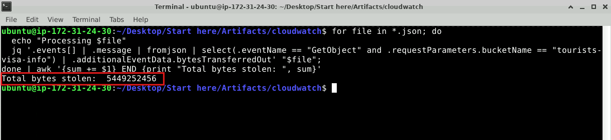  

## After stealing the data, the attacker began deleting the contents of the bucket. What IP address was used during these deletion activities?

We can search for the API call `DeleteObject` to find events that attempted to delete the contents of the `tourists-visa-info` bucket.  
```bash
for file in *.json; do 
  echo "Processing $file"
  jq '.events[] | .message | fromjson | select(.eventName == "DeleteObject" and .requestParameters.bucketName == "tourists-visa-info") | {time: .eventTime, eventName: .eventName, sourceIP: .sourceIPAddress, bucketName: .requestParameters.bucketName}' "$file";
done 
```

In the screenshot below, multiple `DeleteObject` events were found in the `124355653975_CloudTrail_eu-central-1_4-logs.json` file.  
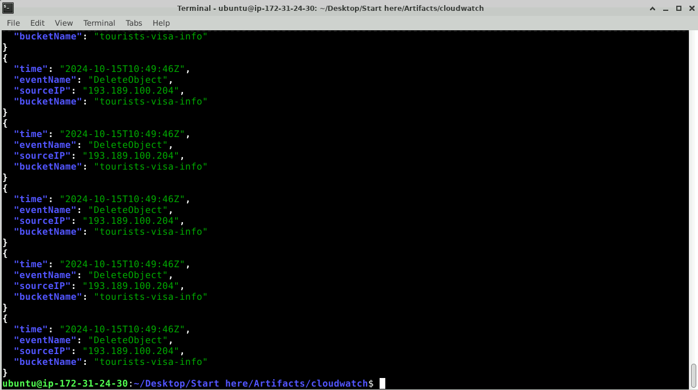  

The extracted data show that only one IP address `193.189.100.204` executed the `DeleteObject` API in order to delete the contents of the `tourists-visa-info` bucket.  

## The attacker executed a deletion operation on the bucket, removing all of its contents. Every request in AWS is linked to a unique identifier for tracking purposes. What was the request ID associated with the bucket's deletion event?

The `DeleteBucket` API is used to delete specific buckets through the AWS CLI. We can search for this API and the `tourists-visa-info` bucket to find logs that show attempts of deleting this bucket.  
```bash
for file in *.json; do 
  echo "Processing $file"
  jq '.events[] | .message | fromjson | select(.eventName == "DeleteBucket" and .requestParameters.bucketName == "tourists-visa-info") | {time: .eventTime, eventName: .eventName, sourceIP: .sourceIPAddress, bucketName: .requestParameters.bucketName, requestId: .requestID}' "$file";
done 
```

In the screenshot below, one event in the `124355653975_CloudTrail_eu-central-1_4-logs.json` file at `2024-10-15 10:50:05` shows the IP address `185.220.100.241` attempting to delete the `tourists-visa-info` bucket.  
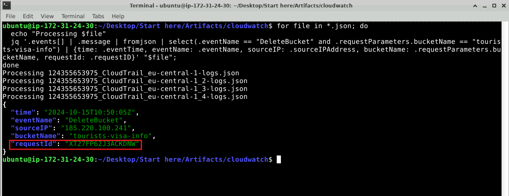  

The extracted request ID is identified as `XT27FP62J3ACKDNW`.  