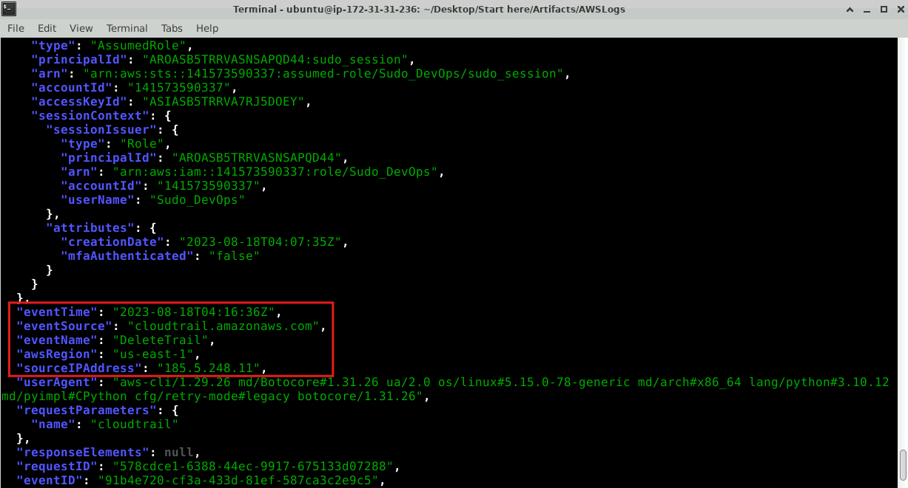
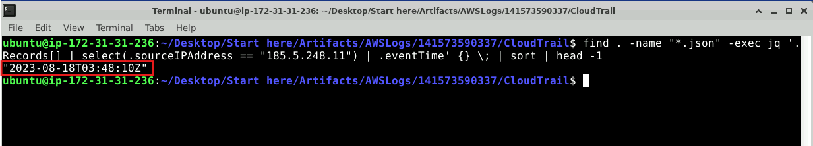
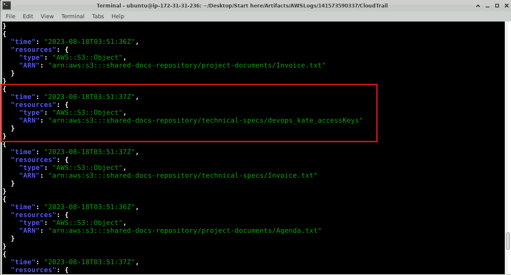
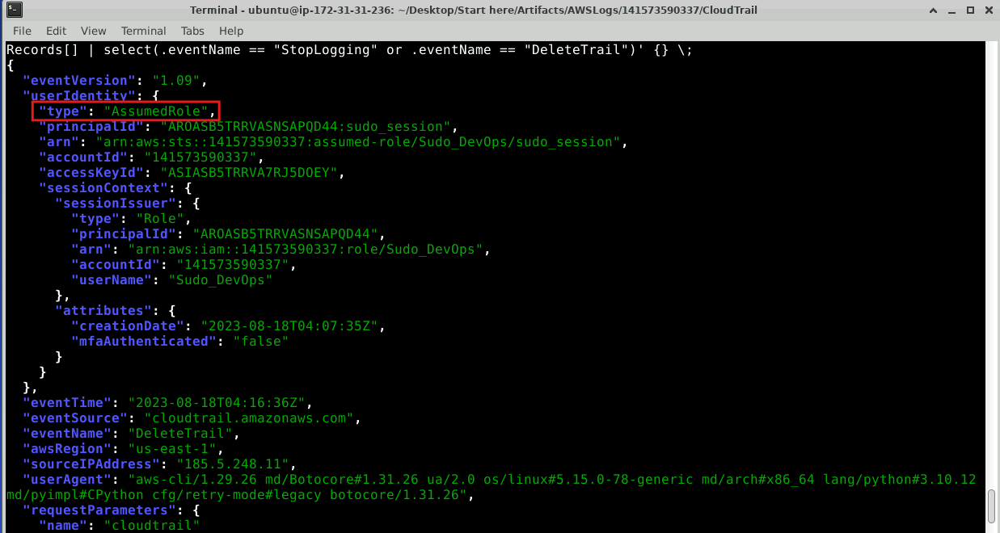
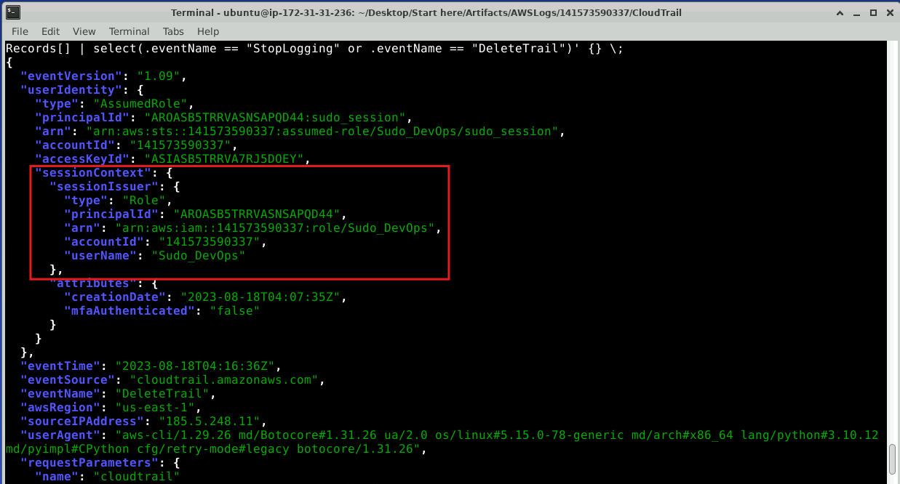
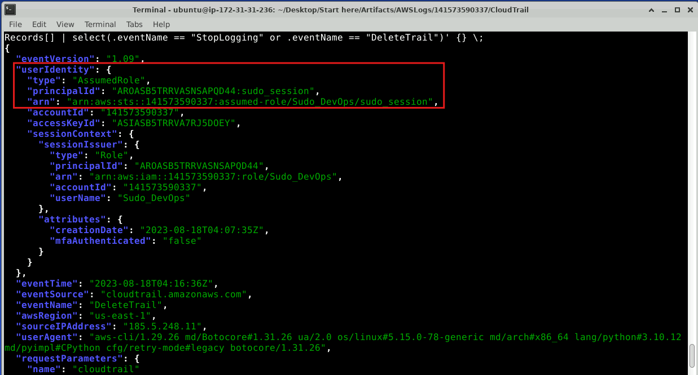
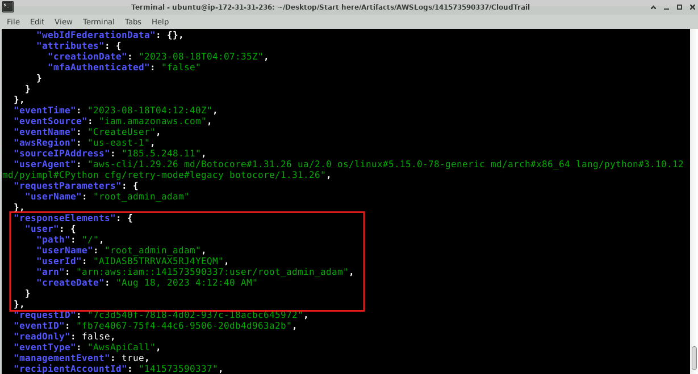
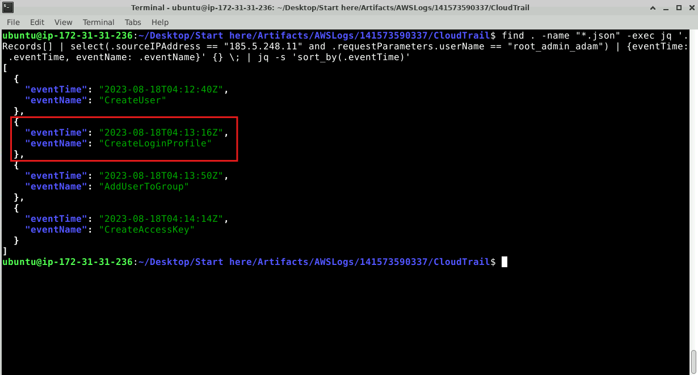
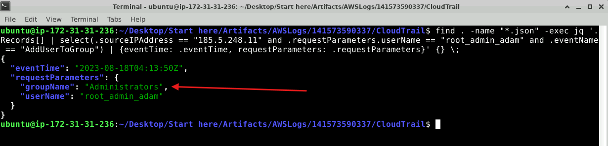

# Lab Overview
---
**Lab:** [S3CredentialsHunt Lab](https://cyberdefenders.org/blueteam-ctf-challenges/s3credentialshunt/)  
**Platform:** CyberDefenders  
**Category:** Cloud Forensics  
**Difficulty:** Medium  
**Tools:** jq  

# Summary
---
This lab investigates a compromised AWS access key and subsequent unauthorized activity using CloudTrail log analysis with `jq`. The attacker at IP address `185.5.248.11` first accessed an S3 file named `devops_kate_accessKeys` containing credentials, then used the stolen keys to assume the elevated `Sudo_DevOps` IAM role via a session named `sudo_session`.

With escalated privileges, the attacker created a backdoor user account named `root_admin_adam`, added it to the `Administrators` group, and created a login profile to enable console access. To cover their tracks, the attacker deleted the CloudTrail trail at `2023-08-18 04:16:36`, disabling logging and attempting to prevent further detection of their activities.

# Scenario
---
A prominent U.S.-based organization recently received an official notification from AWS alerting them to a potential security breach: one of their AWS access keys appears to have been compromised. Coincidentally, a subsequent internal security alert indicated that CloudTrail logging had been unexpectedly disabled. As a cybersecurity specialist, your task is to thoroughly investigate this series of events, and figure out the timeline of these events.

# Analysis
---
## To properly track the activities done by the attacker in the environment, you will need to determine the source of the attack. What is the attacker's IP address?

The artifacts given are multiple compressed log files across many different geographic regions. To efficiently analyze these logs, we can run the command below to find all compressed files in `.gz` format and decompress them.  
```bash
find . -name "*.gz" -exec gunzip {} \;
```
- The `{}` acts as a placeholder for the file being processed and the `\;` marks the end of the `exec` command.  

Once decompressed, we can begin our analysis into the logs. The first activity we'll check for is any attempts to clear logs or delete CloudTrail logs. These activities are suspicious because they typically are involved in malicious behavior from an attacker attempting to avoid detection.  
```bash
find . -name "*.json" -exec jq '.Records[] | select(.eventName == "StopLogging" or .eventName == "DeleteTrail")' {} \;
```
This command searches for the `StopLogging` or `DeleteTrail` API calls.  

In the screenshot below, the command returned one event at `2023-08-18 04:16:36` where the source IP address `185.5.248.11` attempted to delete CloudTrail logs via the `DeleteTrail` API.  
  

Based on this evidence, this activity is highly suspicious and warrants further investigation into activites from this source IP address.  

## A timeline for the incident will help identify the gaps in your investigation. When did the attacker interact with the server for the first time?

To identify the timestamp of the first time the attacker interacted with the server, we'll search through all of the logs for the source IP address `185.5.248.11` then output only the `eventTime` field.  
```bash
find . -name "*.json" -exec jq '.Records[] | select(.sourceIPAddress == "185.5.248.11") | .eventTime' {} \; | sort | head -1
```
Then, we'll `sort` it in ascending order (oldest to newest) and extract only the first result using `head -1`.  

In the screenshot below, the first time the attacker interacted with the server is at `2023-08-18 03:48:10`.  
  

## To ensure the environment is safe after the recent breach, identifying the attacker's entry point is essential. What is the exact file path from which the attacker retrieved the compromised user access key?

The `GetObject` API can be used to retreive contents of an S3 bucket. The command below will search for this API coming from source IP address `185.5.248.11`.  
```bash
find . -name "*.json" -exec jq '.Records[] | select(.sourceIPAddress == "185.5.248.11" and .eventName == "GetObject") | {time: .eventTime, resources: .resources[0]}' {} \;
```

In the screenshot below, at time `2023-08-18 03:51:37`, a `GetObject` was called to obtain contents from the file `shared-docs-repository/technical-specs/devops_kate_accessKeys` from the `shared-docs-respository` bucket.  
  

Based on the name of this file, it likely contains access key information for a user named `kate`.  

## In a cloud environment, determining the user context can help assess the potential extent of damage based on the permissions and resources accessible to that user. What is the 'Type' of the user who disabled CloudTrail?

We can use our previous command that searches for attempts to clear logs or delete CloudTrail logs. In the screenshot below, the type of the user is `AssumedRole`.  
  

## From the previous question, you determined the attacker's access type; now, you need to figure out what resources the attacker has access to. What is the name of the role the attacker takes advantage of to escalate his privilege in the environment?

In the same output as the previous, under the `sessionContext.sessionIssuer.arn`, we see the role that was used to delete CloudTrail logs is `Sudo_DevOps`.  
  

This role has elevated privileges as it was successful in executing the `DeleteTrail` API. Based on this, the role `Sudo_DevOps` was taken advantage of by the attacker.  

## In AWS, to enhance security, users are granted temporary access to specific resources when they assume a role. This action results in the creation of a session, characterized by a unique name and credentials. To trace the attacker's TTPs, can you identify the name of the session they initiated?

In the same output as the previous, the `principalId` and `arn` includes the session name.  
  

The session initiated is named `sudo_session`.  

## To effectively mitigate risks, it's crucial to determine whether the attacker attempted to establish persistence for ongoing access. Can you identify the name of the user the attacker created to maintain a foothold on the machine?

To find logs related to user creation, we can search for the API `CreateUser` originating from the source IP address `185.5.248.11`.  
```bash
find . -name "*.json" -exec jq '.Records[] | select(.sourceIPAddress == "185.5.248.11" and .eventName == "CreateUser")' {} \;
```

The command resulted in one event occurring at `2023-08-18 04:12:40`.   
  

In the screenshot above, a user named `root_admin_adam` was created by the attacker. This user account is likely created for the attacker to maintain persistence in the system.  

## The attacker leveraged several techniques to access the account they created. What is the event name associated with their initial method?

Now that we know the user `root_admin_adam` was created by the attacker, we can search for this user and activities performed involving this user.  
```bash
find . -name "*.json" -exec jq '.Records[] | select(.sourceIPAddress == "185.5.248.11" and .requestParameters.userName == "root_admin_adam") | {eventTime: .eventTime, eventName: .eventName}' {} \; | jq -s 'sort_by(.eventTime)'
```
- The `jq -s 'sort_by(.eventTime)'` will sort event times by oldest to newest.  

After the attacker created the user, the next action performed is `CreateLoginProfile` for the `root_admin_adam` user.  
  

This event is associated with the attacker's initial method of accessing the `root_admin_adam` account by creating a login profile for the account which enables console access with a username and password.  

## What is the name of the group the attacker added the newly created user to?

We'll narrow in on the third event `AddUserToGroup` by running the command below to identify the group name that the user `root_admin_adam` was added to.  
```bash
find . -name "*.json" -exec jq '.Records[] | select(.sourceIPAddress == "185.5.248.11" and .requestParameters.userName == "root_admin_adam" and .eventName == "AddUserToGroup") | {eventTime: .eventTime, requestParameters: .requestParameters}' {} \;
```

In the screenshot below, the user was added to the group `Administrators`.  
  

## Sophisticated threat actors often attempt to conceal their TTPs. Can you provide the exact time CloudTrail logging was disabled?

We previously identified that at time `2023-08-18 04:16:36`, the attacker deleted CloudTrail logs.  