# Lab Overview
---
**Lab:** [DanaBot Lab](https://cyberdefenders.org/blueteam-ctf-challenges/danabot/)  
**Platform:** CyberDefenders  
**Category:** Network Forensics  
**Difficulty:** Easy  
**Tools:** Wireshark, VirusTotal  

# Summary
---
This lab investigates network traffic from a PCAP file to identify the suspicious activity involving stolen sensitive company information. Using Wireshark to analyze the PCAP file, it was identified that a connection was established to a malicious website `portfolio.serveirc.com`, which forced the infected machine to download a malicious JavaScript file.  

It was determined that the domain resolved to the IP address `62.173.143.148` confirming communication with known malicious infrastructure associated with the DanaBot malware. The JavaScript file `allegato_708.js` was delivered through an HTTP response disguised as normal web traffic.  

Deobfuscating the script revealed it leveraged `WScript.exe` for execution which then downloaded a second payload `resources.dll` and executed using `rundll32.exe.` Overall, the activity aligns with DanaBot infection patterns.  

# Scenario
---
The SOC team has detected suspicious activity in the network traffic, revealing that a machine has been compromised. Sensitive company information has been stolen. Your task is to use Network Capture (PCAP) files and Threat Intelligence to investigate the incident and determine how the breach occurred.  

# Background
---
[Danabot](https://any.run/malware-trends/danabot/) is a banking trojan initially designed to extract sensitive financial data but later evolved to be an infostealer and host other malicious campaigns. Typically, Danabot will establish a connection with a C2 server to download an executable file with a DLL file. Next, it begins stealing information from the infected OS through various means like screenshots, recording a list of files on the machine, etc.  

# Analysis
---
## Which IP address was used by the attacker during the initial access?

Based on the scenario, we know some sort of data exfiltration activity was performed. To begin this network investigation, what I like to do is first check the `Statistics > Protocol Hierarchy` to see if there are any excess use of protocols or any protocols that seem interesting to me.  
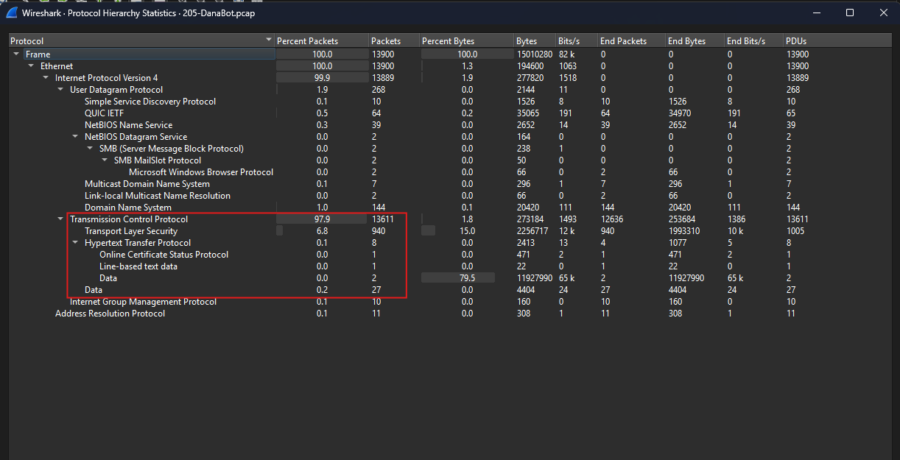  
What we will see is that there are large amounts of TLS traffic along with some HTTP traffic. HTTP is a commonly used protocol by attackers to steal data since it lacks encryption. The fact that we know sensitive company information was stolen, the presence of HTTP traffic warrants closer analysis for potential data exfiltration activity.  

One of the first things I noticed in the network traffic is a DNS query for an interesting domain name.  
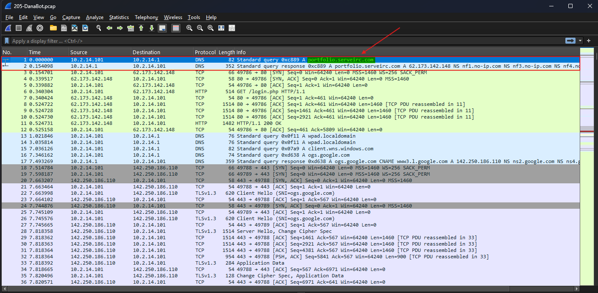  

Now, I wanted to check whether this is a legitimate domain name or if it is malicious. Using VirusTotal, I submitted the domain name `portfolio.serveirc.com` to run an analysis on it.  
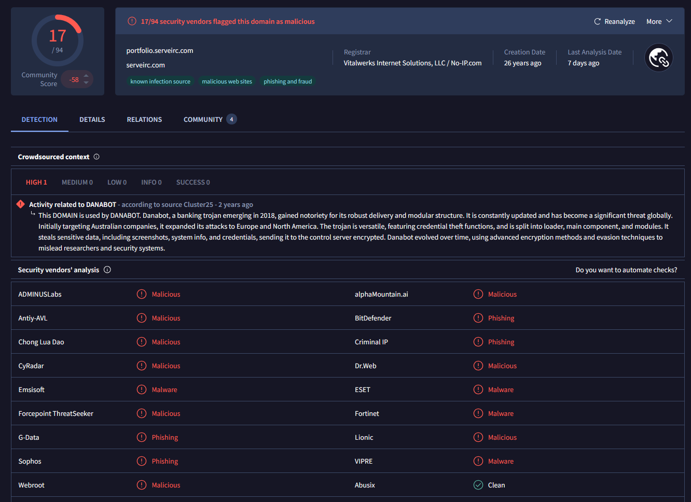  
Based on the screenshot, this domain is clearly malicious and it looks like its activity is linked to `DANABOT`.  

The next thing I wanted to check was to see what IP addresses have been known to be linked to this domain name. Navigating to the Relations tab, I identified the IP address `62.173.143.148`.  
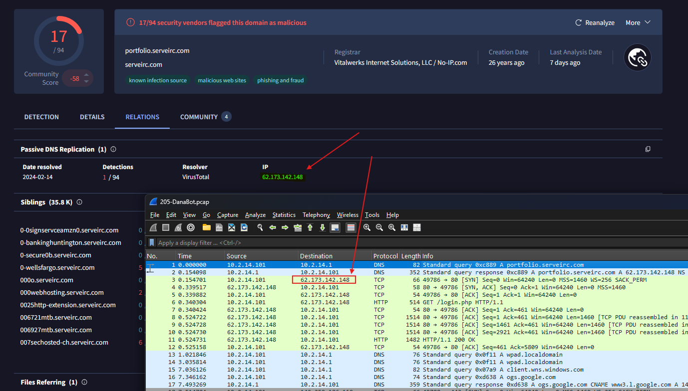  
Taking a look at the network traffic again, I see there is presence of this IP address. From my observation, I can see the client `10.2.14.101` is initiating a connection to domain name `portfolio.serveirc.com` which was resolved by DNS to IP address `62.173.143.148`, and sent an HTTP GET request for `/login.php` (likely the login page for the website).  

This confirms that the IP address `62.173.143.148` was used by the attacker for initial access.  

## What is the name of the malicious file used for initial access?

Now that we know that the connection to `portfolio.serveirc.com` was successful, let's check traffic to see what kind of interactions did the client have with the website. I applied the display filter `http` to filter for only HTTP traffic to reduce the amount of traffic to analyze.  
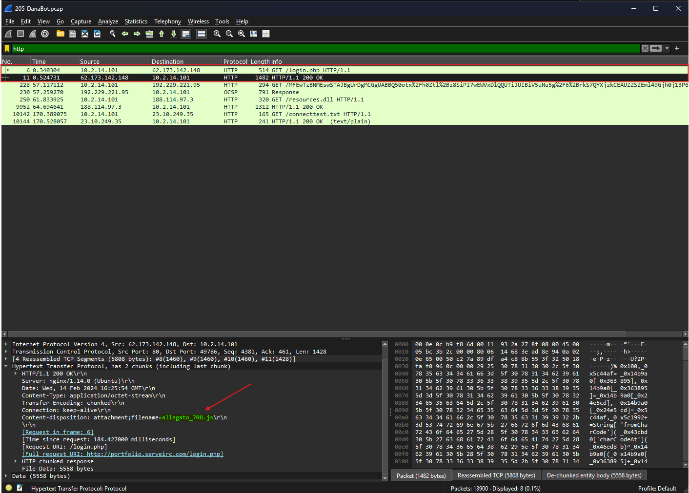  
From the screenshot above, I can see that packet `11` returned the HTTP status code 200 (meaning success), and it was a response to packet `6` which was the HTTP GET request for `/login.php`. Further inspection into packet 11 revealed that the Content-disposition type is attachment with an interesting JavaScript file  `allegato_708.js`. What we can conclude from these two packets is that the client requested the webpage `/login.php`, however instead of loading a normal text/html page, it forced the client to downloaded a JavaScript file.  

From this observation, this is abnormal and we can conclude that the malicious file used by the attacker is `allegato_708.js`.  

## What is the SHA-256 hash of the malicious file used for initial access?

To obtain the SHA256 hash of the malicious file `login.php`, we need to export it through Wireshark by going to `File > Export Objects > HTTP` and selecting packet `11`.  
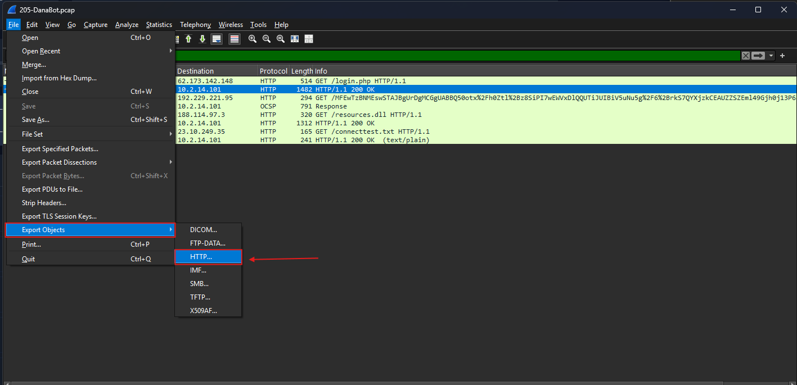  
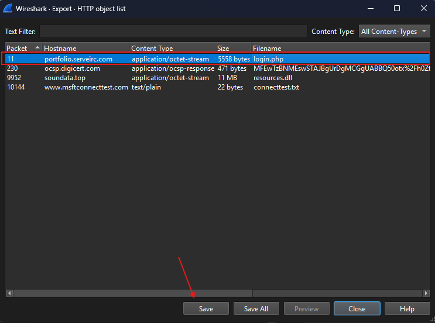  

Next, I utilize the `sha256sum` command in Linux to generate the SHA256 hash of `login.php`.  
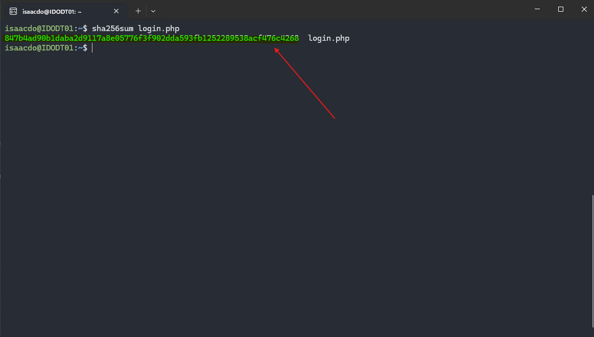  

## Which process was used to execute the malicious file?

The next step I took was to further investigate `login.php`. Upon catting out `login.php`, it appears that the attacker obfuscated the file to hide the malicious intent behind the code. This is likely a JavaScript file.  
> I could've ran the command `file login.php` to reveal its file type to confirm.
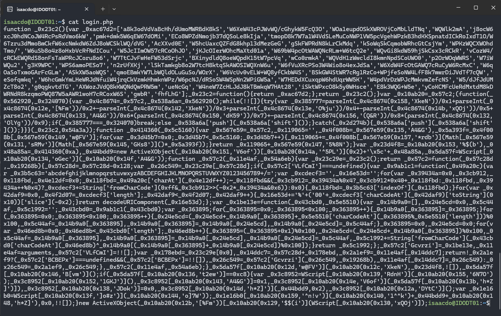  

Running this code through a JavaScript deobfuscator tool revealed its functionality.  
 
From the screenshot above, the process that was used to execute the malicious file is `WScript.exe`.  

## What is the file extension of the second malicious file utilized by the attacker?

Within the same code, it appears the the script utilized the WScript.CreateObject to create an HTTP object to download the `resources.dll` file and execute it via `rundll32.exe`.  
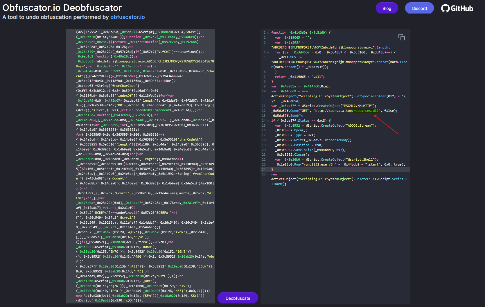  

Going back to Wireshark, I can see the next sequence in the HTTP traffic involved an HTTP GET request for `/resources.dll` at packet `250`. Packet `9952` returned an HTTP status code 200 as a reply to packet `250`'s request indicating that the request was successful.  
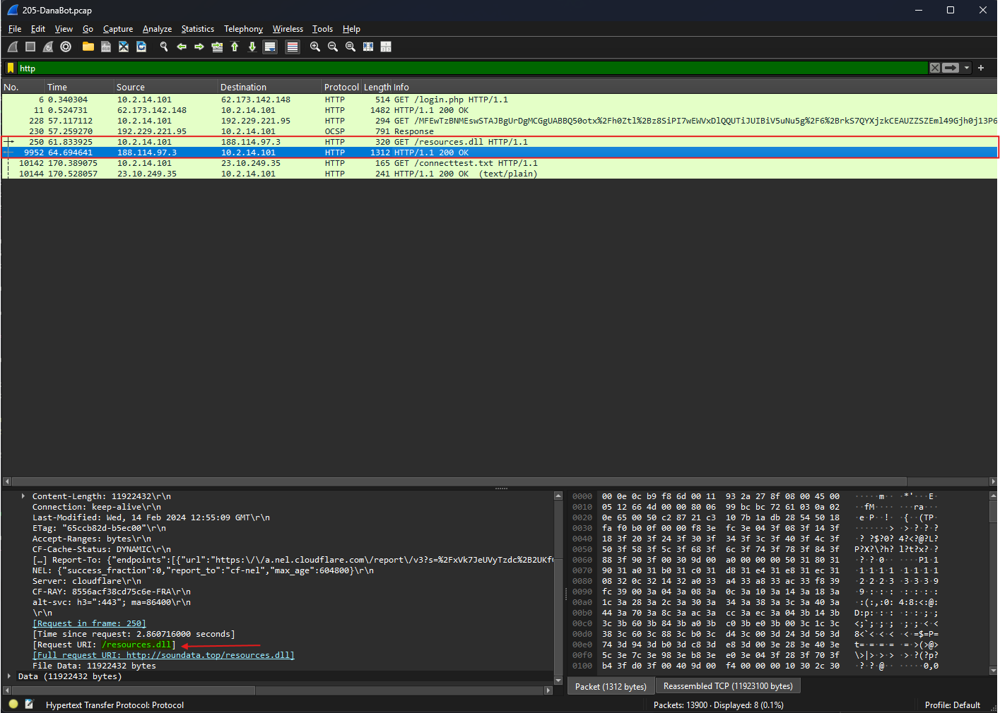  

## What is the MD5 hash of the second malicious file?

To obtain the MD5 hash of `resources.dll`, again we need to export it through Wireshark by going to `File > Export Objects > HTTP` and selecting packet `9952`.  
  
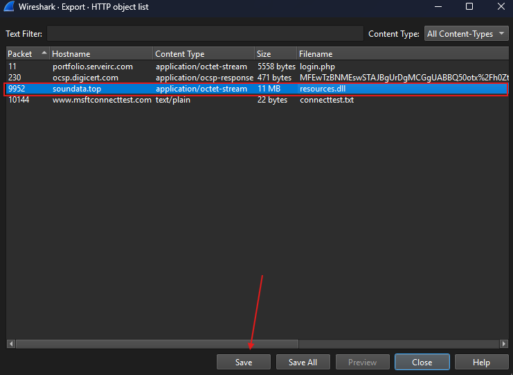  

Running the `md5sum` command generated the MD5 hash value for the `resources.dll` file.  
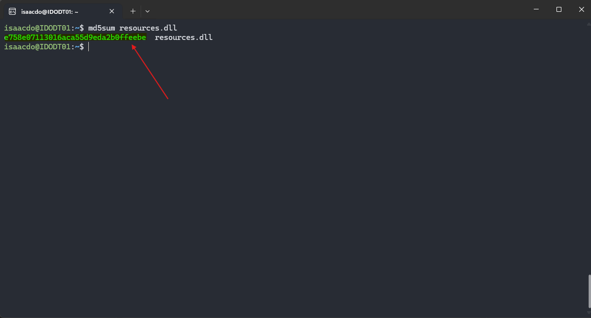  

# Additional Resources
---
- [Danabot Malware Analysis, Overview by ANY.RUN](https://any.run/malware-trends/danabot/)