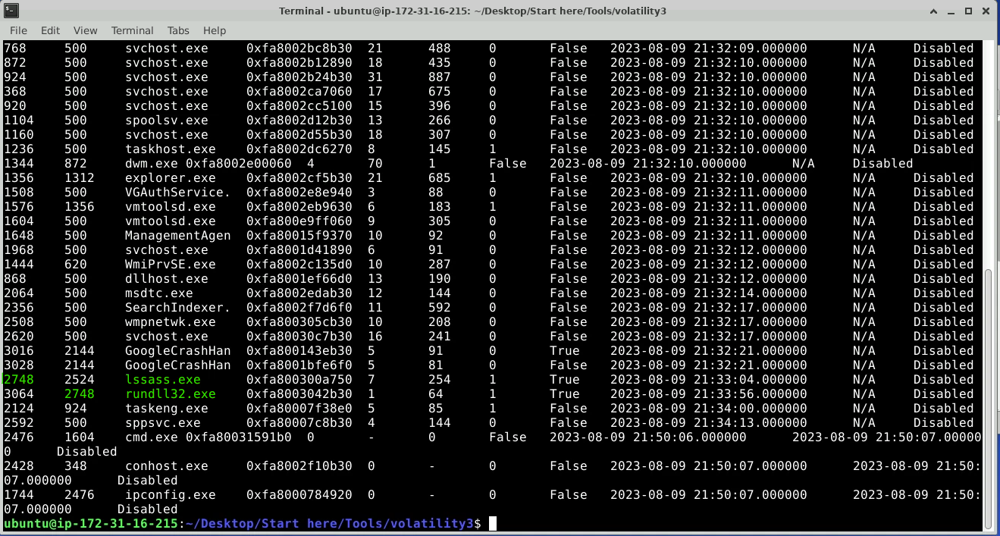
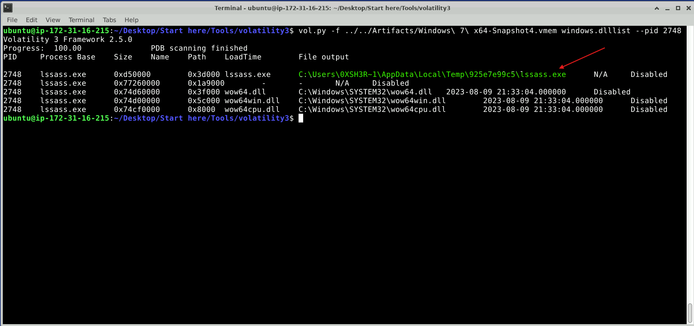
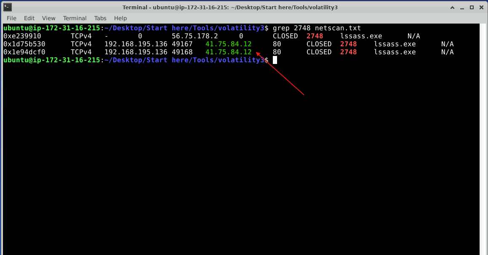
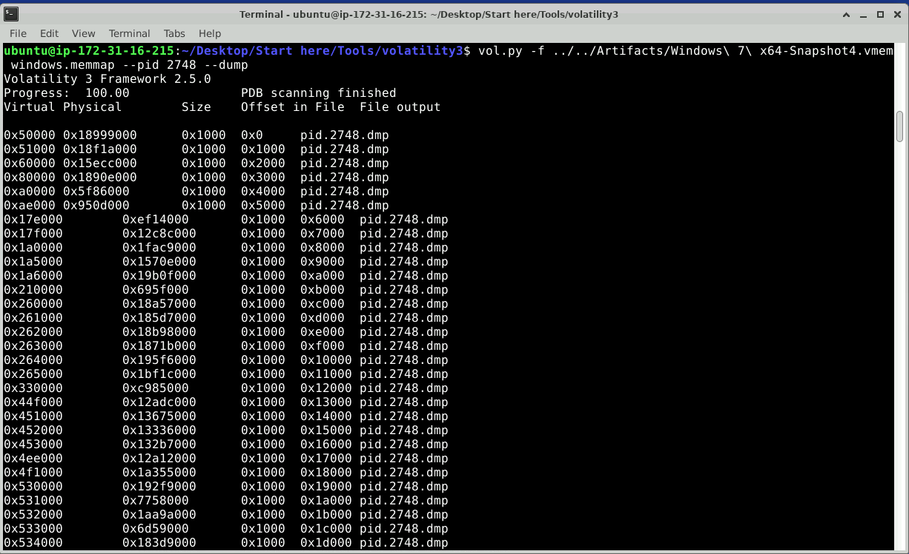
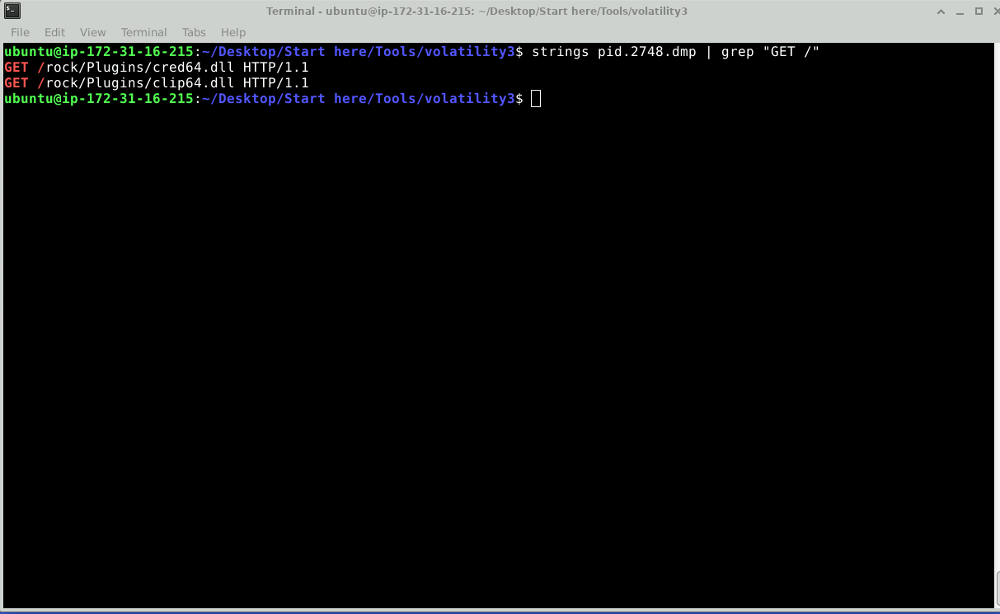
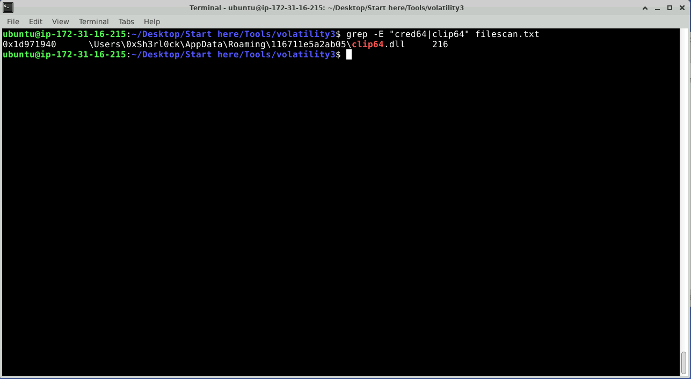
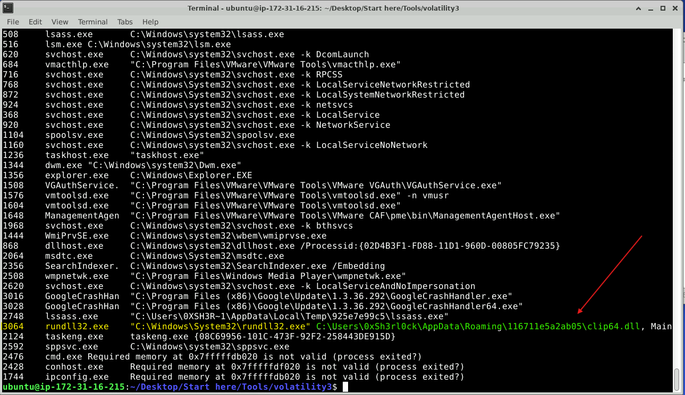
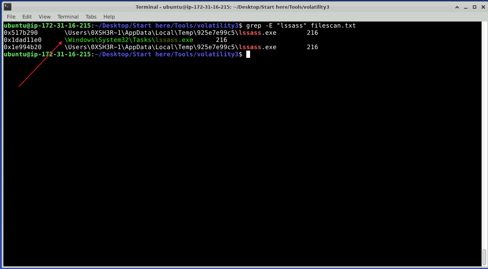

# Lab Overview
---
**Lab:** [Amadey - APT-C-36 Lab](https://cyberdefenders.org/blueteam-ctf-challenges/amadey-apt-c-36/)  
**Platform:** CyberDefenders  
**Category:** Endpoint Forensics  
**Difficulty:** Easy  
**Tools:** Volatility3, grep, strings  

# Summary
---
This lab involves utilizing Volatility3, a memory forensics tool, to investigate a detected malware on a Windows workstation. By analyzing the memory dump, key artifacts were identified that link the malware infection to the Amadey Trojan Stealer.

Process analysis uncovered a suspicious parent process masquerading as a legitimate system binary, which initiated the malicious behavior. Further inspection revealed its file locaiton and confirm abnormal execution patterns. Network analysis identified communications with a Command and Control (C2) server over HTTP, indicating potential data exfiltration.

Analysis into the process memory revealed additional payloads, including DLL modules used for credential theft and clipboard data collection. File system artifacts confirmed the file paths of these components and its execution using the utility `rundll32.exe`. Persistence mechanisms was also identified through scheduled tasks.

# Scenario
---
An after-hours alert from the Endpoint Detection and Response (EDR) system flags suspicious activity on a Windows workstation. The flagged malware aligns with the Amadey Trojan Stealer. Your job is to analyze the presented memory dump and create a detailed report for actions taken by the malware.

# Background
---
The [Amadey Trojan Stealer](https://www.splunk.com/en_us/blog/security/amadey-threat-analysis-and-detections.html) is a form of Malware as a Service (MaaS) that acts as an infostealer. The malware's capabilities include: privilege escalation, UAC bypassing, keystroke logging, screen capture, and downloading additional malware. It typically downloads two DLLs, `clip64.dll` and `cred64.dll`, to the victim's machine and utilizes the Windows `rundll32.exe` utility to execute these components to collect information. 

The Amadey malware communicates with a Command and Control (C2) server to exfiltrate system information, browser credentials, and other sensitive data. Amadey will also use persistence mechanisms like modifying the `Run` and `RunOnce` registry keys or adding itself to the scheduled tasks to keep itself in the victim's machine for further data exfiltration. 

# Analysis
---
## In the memory dump analysis, determining the root of the malicious activity is essential for comprehending the extent of the intrusion. What is the name of the parent process that triggered this malicious behavior?

To begin this investigation, we know that the Amadey malware utilizes the Windows operating system's `rundll32.exe` utility to execute its plugins `clip64.dll` and `cred64.dll`.  

We will use Volatility3 with the plugin `windows.pslist` to dump a list of processes on the system.  
```bash
vol.py -f ../../Artifacts/Windows\ 7\ x64-Snapshot4.vmem windows.pslist
```
  
From the screenshot, we can observe the process `rundll32.exe` with a PID of `3064` which we know is used by Amadey. It's PPID (Parent PID) is `2748` and the process with a PID of `2748` is `lssass.exe` so we can conclude that this is the parent process that triggered the malicious behavior.  

## Once the rogue process is identified, its exact location on the device can reveal more about its nature and source. Where is this process housed on the workstation?

To find the location of the process `lssass.exe`, we can dump the DLL list for the PID `2748` to reveal the process's path. Run Volatility3 with the plugin `windows.dlllist` and include the option `--pid 2748`.  
```bash
vol.py -f ../../Artifacts/Windows\ 7\ x64-Snapshot4.vmem windows.dlllist --pid 2748
```
  

## Persistent external communications suggest the malware's attempts to reach out C2C server. Can you identify the Command and Control (C2C) server IP that the process interacts with?

Running Volatility3 with the plugin `windows.netscan` and redirecting the output to a text file `netscan.txt`, we can investigate network activity on the system.  
```bash
vol.py -f ../../Artifacts/Windows\ 7\ x64-Snapshot4.vmem windows.netscan > netscan.txt
```

Once Volatility3 finishes, utilize the `grep` command to filter for PID `2748` which belongs to the suspicious process `lssass.exe`.  
```bash
grep 2748 netscan.txt
```
  
From the screenshot, the process `lssass.exe` appears to have two closed TCP connections to IP address `41.75.84.12` over port `80` (HTTP traffic). The suspicious process `lssass.exe` sending traffic to an external IP address highly indicates that this is C2 communications. In addition, the fact that port 80 is used likely indicates that the malware attempted to disguise suspicious traffic as normal web communication.  

Based on this information, the IP address `41.75.84.12` is likely the Command and Control (C2) server that the malware is interacting with.  

## Following the malware link with the C2C, the malware is likely fetching additional tools or modules. How many distinct files is it trying to bring onto the compromised workstation?

Given that the malware used HTTP traffic and established connections to an external IP address, we can analyze memory dumps to further investigate network activity and URLs.  

Run Volatility3 with the plugin `windows.memmap` and option `--pid 2748` to dump the memory for the suspicious process with PID 2748.   
```bash
vol.py -f ../../Artifacts/Windows\ 7\ x64-Snapshot4.vmem windows.memmap --pid 2748 --dump
```
  
This command generates a memory dump file, `pid.2748.dmp`, which we can use to parse for artifacts.

Once the dump is created, we can use the `strings` utility to extract readable text from the memory file since the memory dump provides raw data from the process's memory space.  
This command with search for HTTP GET requests in the memory dump.  
```bash
strings pid.2748.dmp | grep "GET /"
```
  
From the output, we can observe two files `cred64.dll` and `clip64.dll` that were fetched by the process with PID `2748`. These two DLLs are known plugins that the Amadey malware uses to steal sensitive information.

## Identifying the storage points of these additional components is critical for containment and cleanup. What is the full path of the file downloaded and used by the malware in its malicious activity?

Utilize the Volatility3 plugin `windows.filescan` to scan memory for file objects and list their metadata including their file paths. Run the command below and redirect the output to a text file `filescan.txt.`  
```bash
vol.py -f ../../Artifacts/Windows\ 7\ x64-Snapshot4.vmem windows.filescan > filescan.txt
```

Once the output file is created, filter for both DLLs names `cred64` and `clip64`.
```bash
grep -E "cred64|clip64" filescan.txt
```
  
From the screenshot, we find the full path of the downloaded file `clip64.dll`. Something to note is that the file is located inside the folder `11671le5a2ab05` which likely indicates the malware is attempting to evade detection by using a randomly generated folder name.  

To confirm this file is used by the malware, we can use the `windows.cmdline` plugin which will dump all of the commands executed by the system. What we are looking for is the name of the file the malware executed.  
```bash
vol.py -f ../../Artifacts/Windows\ 7\ x64-Snapshot4.vmem windows.cmdline
```
  
From the screenshot, we can confirm that the malware executed the file `clip64.dll` using the `rundll32.exe` utility.  
## Once retrieved, the malware aims to activate its additional components. Which child process is initiated by the malware to execute these files?

Using the same `windows.cmdline` plugin, the malware used `rundll32.exe` to execute the `clip64.dll` file.  
```bash
vol.py -f ../../Artifacts/Windows\ 7\ x64-Snapshot4.vmem windows.cmdline
```
  

## Understanding the full range of Amadey's persistence mechanisms can help in an effective mitigation. Apart from the locations already spotlighted, where else might the malware be ensuring its consistent presence?

One method that the Amadey malware uses for persistence is adding itself to scheduled tasks. To investigate any additional persistence mechanisms, use the `windows.filescan` plugin to investigate any file artifacts associated with the process.  

We have already previously ran the file scan and redirected the output to `filescan.txt` so we can go ahead and filter for the process name `lssass`.  
```bash
grep -E "lssass" filescan.txt
```
  
Based on the results, we see a second path under `\Windows\System32\Tasks` which is indicative that the process is likely registering itself as a scheduled task to allow it to automatically start upon system reboot or at scheduled times.  

# Additional Resources
---
- [Amadey Infostealer Malware Analysis, Overview by ANY.RUN](https://any.run/malware-trends/amadey/)
- [Amadey Threat Analysis and Detections](https://www.splunk.com/en_us/blog/security/amadey-threat-analysis-and-detections.html)