# Lab Overview
---
**Lab:** [Insider Lab](https://cyberdefenders.org/blueteam-ctf-challenges/insider/)  
**Platform:** CyberDefenders  
**Category:** Endpoint Forensics  
**Difficulty:** Easy  
**Tools:** FTK Imager, LogViewer2  

# Summary
---
This lab involves a disk forensics investigation of a Linux system to analyze insider threat activity performed by an employee using the tool FTK Imager.  

Analysis revealed that the system was running on Kali Linux and showed evidence of malicious intent including the download of a widely used credential dumping tool Mimikatz. Examination into the `.bash_history` file provided insight on user activities including file creation, tool execution, and navigation across directories. Further investigation uncovered evidence that the machine was used to support offensive activity including files linked to an attack simulation tool that is used to attack another machine. Authentication logs revealed multiple privilege escalation attempts using the `su` command.  

# Scenario
---
After Karen started working for 'TAAUSAI,' she began doing illegal activities inside the company. 'TAAUSAI' hired you as a soc analyst to kick off an investigation on this case.  

You acquired a disk image and found that Karen uses Linux OS on her machine. Analyze the disk image of Karen's computer and answer the provided questions.  

# Analysis
---
## Which Linux distribution is being used on this machine?

To begin this investigation, I first checked the `syslog` file under `/var/log` directory. I checked this specific directory because it typically contains logs about system activities and installation details.  
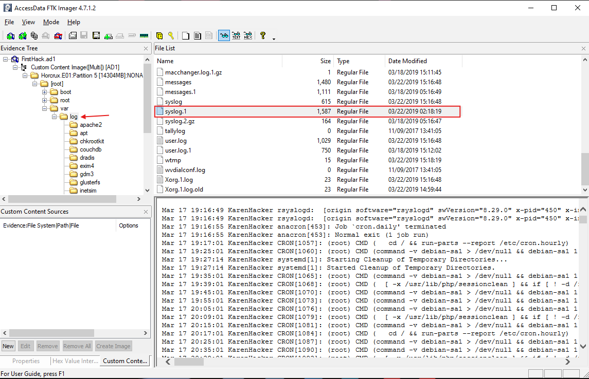  
For better log analysis, I exported the `syslog.1` file onto my forensic workstation's desktop. I exported this specific log file instead of `syslog` because it's date modified is earlier than the `syslog` file which could mean that this was the first log file that the system writes to.  

Using the LogViewer2 utility, I filtered for the term `linux version` and was able to identify the operating system is using the `Kali Linux` distribution with the kernel version of `4.13.0-kali1-amd64`.  
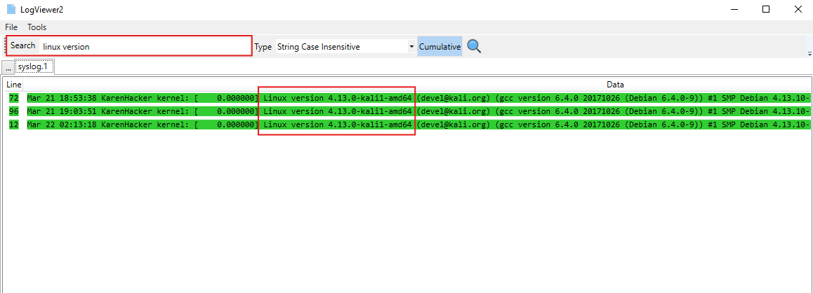  

## What is the MD5 hash of the Apache access.log file?

To find the Apache `access.log` file, under the `/var/log` directory I navigated to the apache2 directory. What's nice about FTK Imager is that it provides the MD5 hash value of the file in the Properties view if you select the file.  
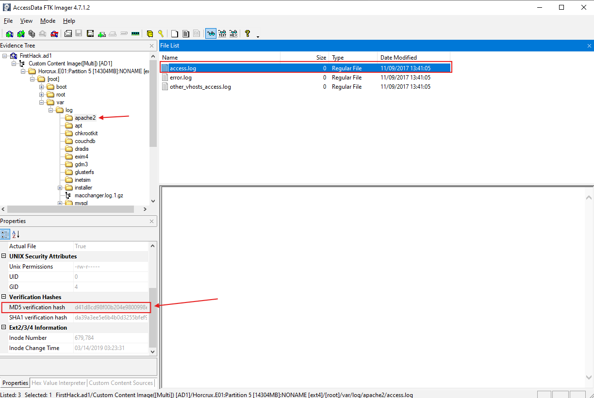  
This MD5 hash uniquely identifies this `access.log` file at the time it was analyzed and if any modifications were made then it would result in a completely different hash which helps to detect alterations.

From the screenshot, one thing I did notice is that all 3 log files in the `/apache2/` directory have a size of 0 bytes. This likely means Apache was not used since nothing was written to these log files.  

## It is suspected that a credential dumping tool was downloaded. What is the name of the downloaded file?

Credential dumping is an attack that extracts login credentials like usernames and passwords from a compromised machine. Further examination of the disk image in FTK Imager revealed a file named `mimikatz_trunk.zip` under the `/root/Downloads/` directory which is commonly used to store downloaded files.  
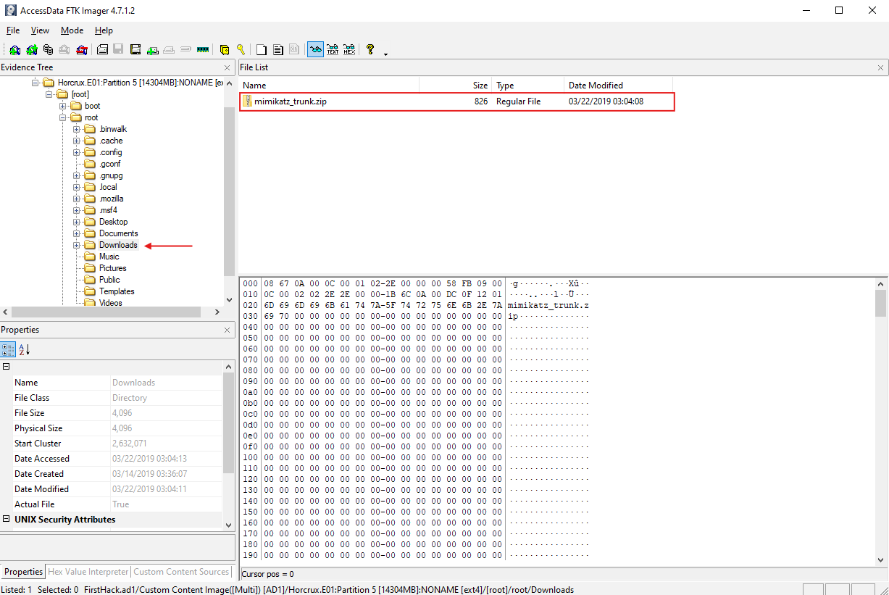  
From its name, Mimikatz is a widely used exploitation tool that extracts plaintext passwords, hashes, PINs, and Kerberos tickets from system memory. It can also perform pass-the-hash attacks, manipulate authentication tokens, and export certificates.  

We can conclude that `mimikatz_trunk.zip` is the credential dumping tool that was downloaded onto the compromised machine.  

## A super-secret file was created. What is the absolute path to this file?

To analyze user activity, a useful file to investigate is the `.bash_history` file. This file logs all command executions in the terminal.  
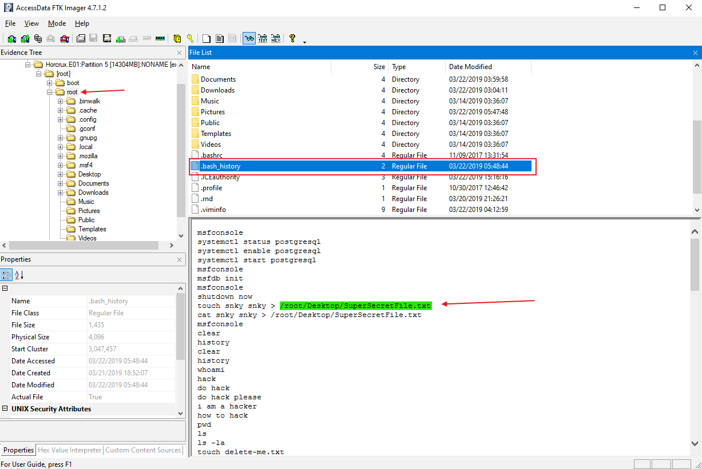  
I navigated to the `/root/` directory to discover the `.bash_history` file and upon examining the log, I observed an interesting command `touch snk snk > /root/Desktop/SuperSecretFile.txt`. This command creates a file named `SuperSecretFile.txt` in the `/root/Desktop/` directory using the touch command. It also redirects (the > symbol) the contents of the snky file and writes it to the newly created SuperSecretFile.txt.  

## What program used the file didyouthinkwedmakeiteasy.jpg during its execution?

Further analysis into the `.bash_history` file revealed that the attacker utilized the `binwalk` program with the `didyouthinkwedmakeiteasy.jpg` file.  
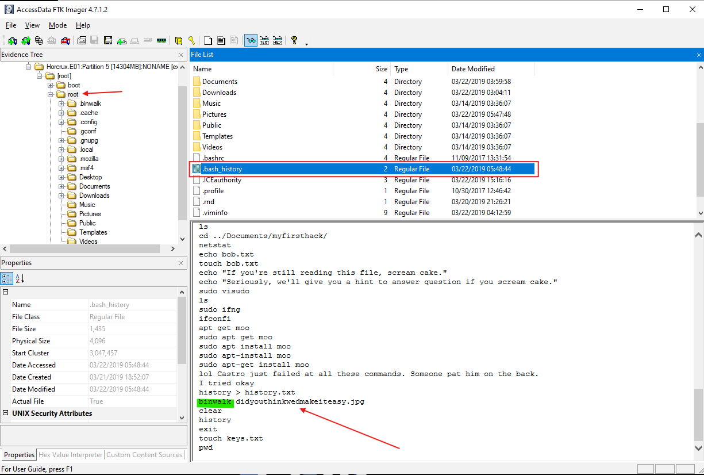  

## What is the third goal from the checklist Karen created?

Navigating to the `/root/Desktop/` directory, I found the Checklist that Karen created. The contents inside of the file revealed a list of goals created by Karen where the third goal listed is `Profit`.  
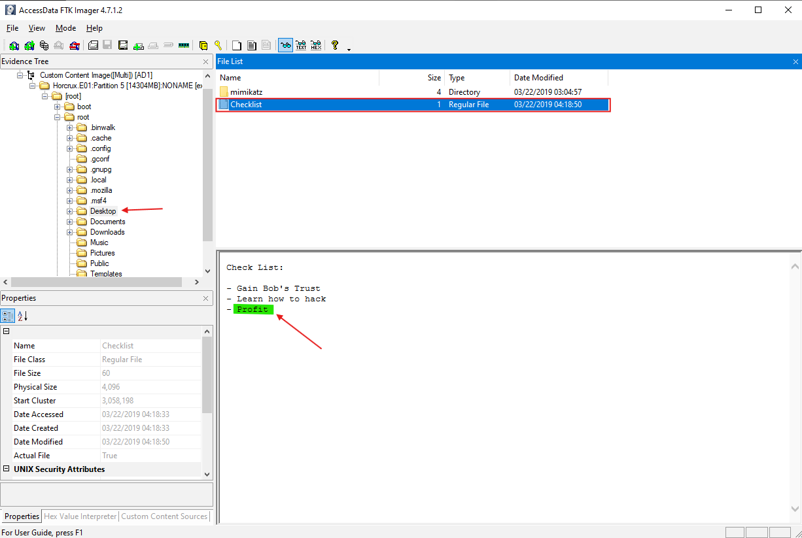  

## How many times was Apache run?

As I identified early in the investigation while obtaining the MD5 hash of the access.log file, the 3 log files in the `/apache2/ directory` have 0 bytes in size which indicates that Apache did not run.  
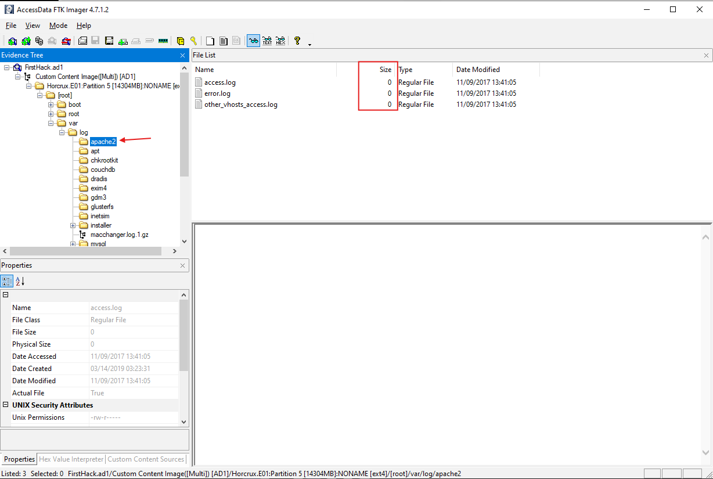  

## This machine was used to launch an attack on another. Which file contains the evidence for this?

While digging through the `/root/` directory, I discovered a file named `irZLAohL.jpg`. Upon examining this .jpeg file, it revealed a Windows terminal showing the execution of a program named `flightsim` located in the `C:\Users\Bob\AppData\Local\Temp directory`. From the .jpeg file, it appears that the program `flightsim` is a tool that generates malicious network traffic and it allows security teams to evaluate the effectiveness of their security monitoring systems.  
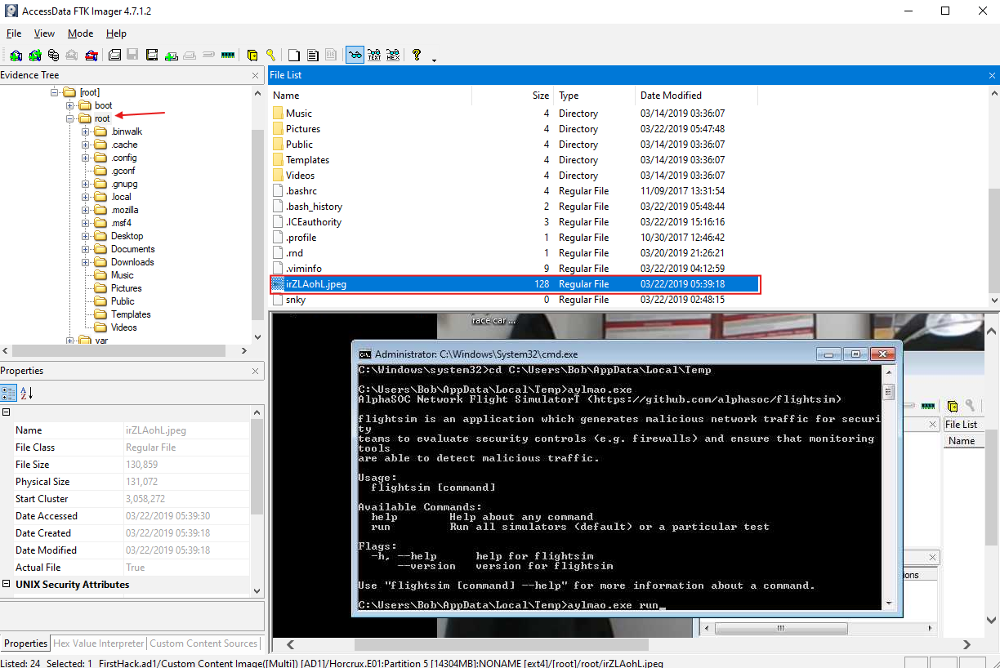  
Based on the presence of the flightsim.exe tool and the suspicious `irZLAohL.jpg` file, it is likely that this machine was used to execute attacks on other machines.  

## It is believed that Karen was taunting a fellow computer expert through a bash script within the Documents directory. Who was the expert that Karen was taunting?

I analyzed the `/root/Documents/myfirsthack/` directory and found an interesting file named `firstscript_fixed`. Upon examining this script, the very last line `echo "Heck yeah! I can write bash too Young"` stands out as a taunt.  
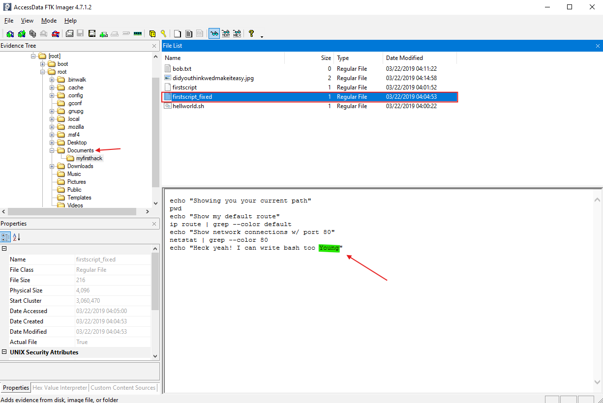  
It appears that Karen is taunting an individual named `Young`, trying to boast about their Bash scripting skills.

## A user executed the su command to gain root access multiple times at 11:26. Who was the user?

A helpful log file that captures authentication activity is the `auth.log` file in the `/var/log/` directory. I analyzed this file because typically when trying to gain root access using the `su` command, you will need to authenticate by providing a root password. Upon successful authentication, you will be root.  
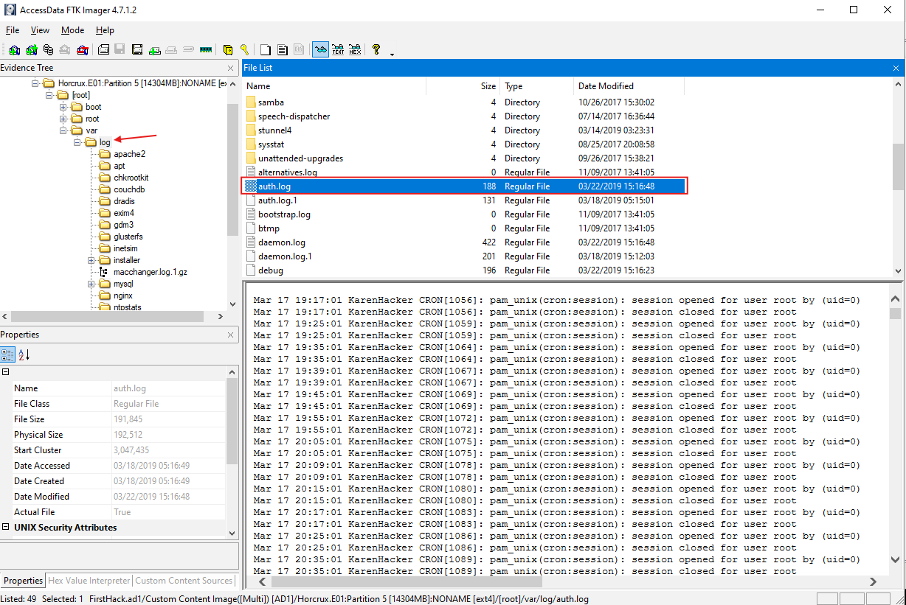  

I exported the auth.log file and opened it in the LogViewer2 utility. In the search bar, I filtered for `11:26` to show me all activities that occurred at the time `11:26`.  
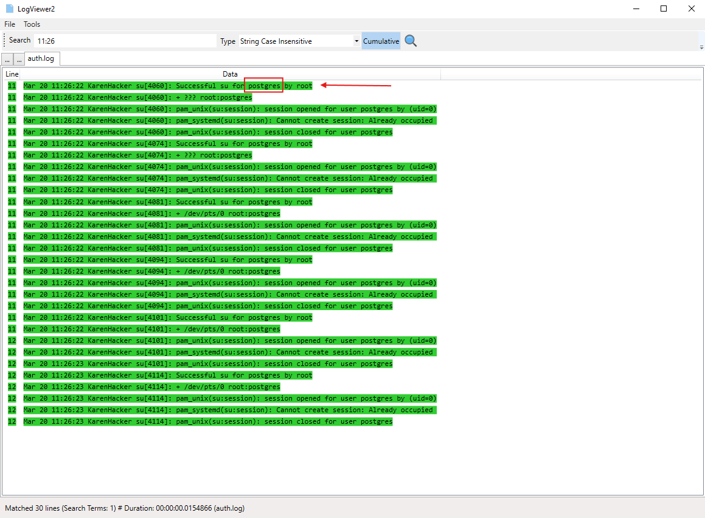  
Based on the result, I observe that the log captured repeated entries at `11:26:22` of the account KarenHacker successfully executing the `su` command to switch to the `postgres` account using root privileges. The log also captured a sequence of sessions being opened and closed by the `postgres` account, indicating that the user KarenHacker may have been interacting with the database services since the account `postgres` is typically associated with PostgreSQL.  

## Based on the bash history, what is the current working directory?

Examining the `.bash_history` file in the `/root/` directory, I can follow the sequence of `cd` commands to track the current working directory that the user is in.  
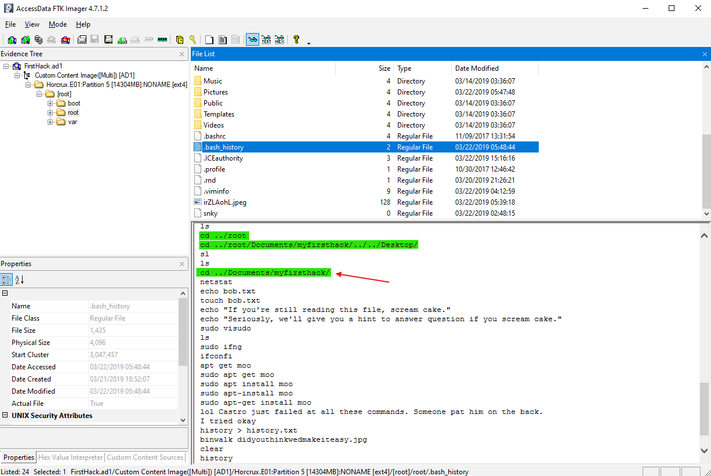  
First, the user accessed the /root/ directory using `cd ../root` command, then they accessed the `/Desktop/` directory using `cd ../root/Documents/myfirsthack/../../Desktop/` command. Lastly, they backed out of the `/Desktop/` directory and navigated to the `/Documents/myfirsthack/` directory using `cd ../Documents/myfirsthack/` command which is now their current working directory.  