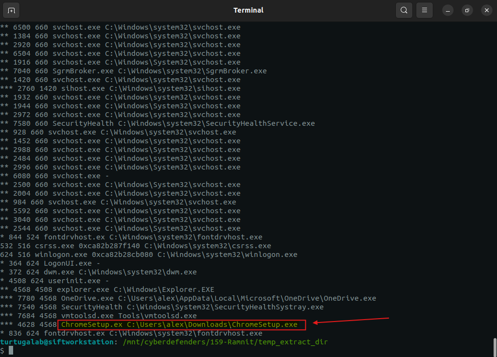
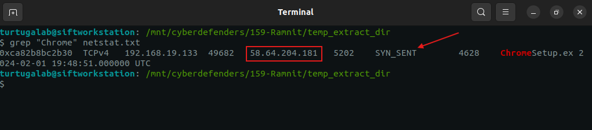
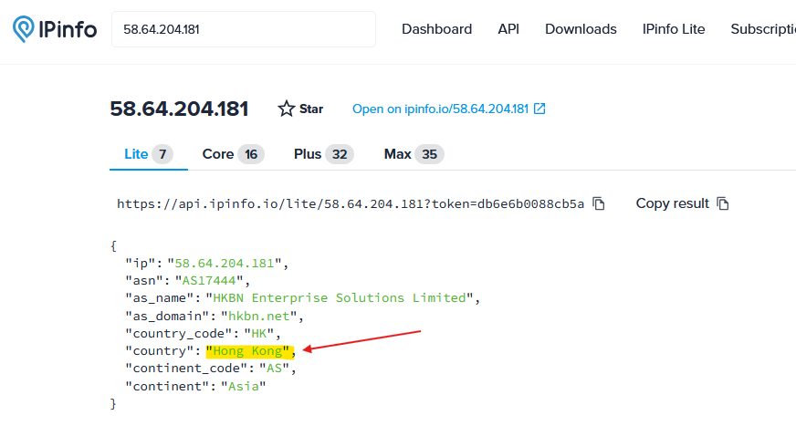
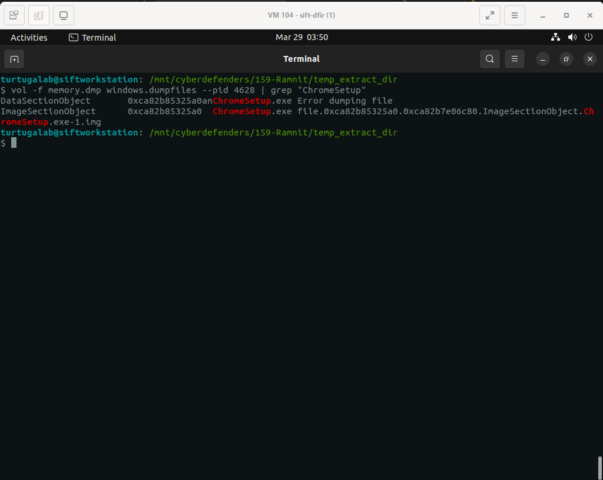
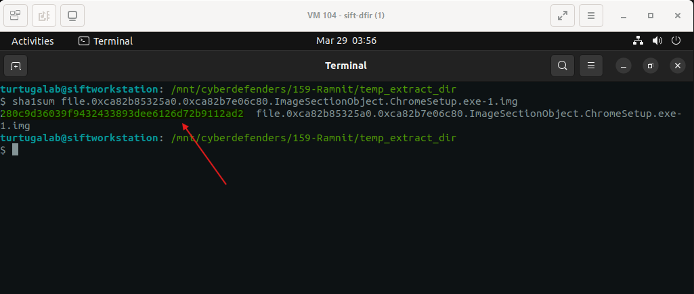
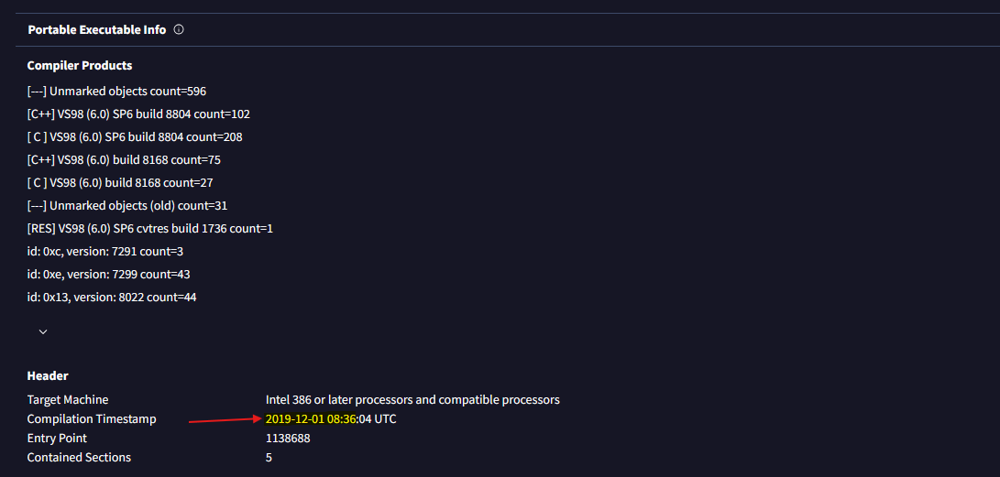
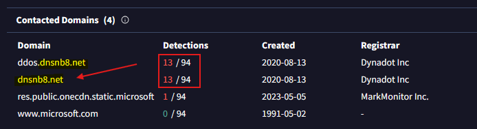

# Lab Overview
---
**Lab:** [Ramnit Lab](https://cyberdefenders.org/blueteam-ctf-challenges/ramnit/)  
**Platform:** CyberDefenders  
**Category:** Endpoint Forensics  
**Difficulty:** Easy  
**Tools:** Volatility3, VirusTotal, ipinfo  

# Summary
---
This lab involves memory forensics analysis of a compromised Windows machine to identify malware activity. Using Volatility3, process enumeration revealed a suspicious executable `ChromeSetup.exe` running from the user's Downloads directory.  

Further analysis of network activity showed that the malicious process attempted to establish a connection to the external IP address `58.64.204.181`, which was geolocated to Hong Kong suggesting command-and-control (C2) communication. Threat intelligence analysis revealed the malware's compilation time and associated malicious domain, identified as `dnsnb8[.]net`.  

The findings indicate a staged malware infection involving a trojan executable, attempted outbound communication to suspicious infrastructure, and identifiable indicators of compromise (IOCs).  

# Scenario
---
Our intrusion detection system has alerted us to suspicious behavior on a workstation, pointing to a likely malware intrusion. A memory dump of this system has been taken for analysis. Your task is to analyze this dump, trace the malware’s actions, and report key findings.

# Analysis
---
## What is the name of the process responsible for the suspicious activity?

To begin this investigation, I utilized the `pstree` plugin from Volatility3 to analyze the list of processes captured in the memory dump. Running the command below, I redirected the output to the file `pstree.txt` for better log analysis.  
```bash
vol -f memory.dmp windows.pstree > pstree.txt
```

Running the command below cleaned up the log outputted to the screen to show only columns 1-4 and the last column which is the path to the process.  
```bash
awk '{print $1, $2, $3, $4, $NF}' pstree.txt
```
  
Based on my examination, the majority of processes in this memory dump pertains to Windows operations and originating from `C:\Windows\System32`, except for the process `ChromeSetup.exe` which originates from the user's Download directory. Although the name mimics a legitimate Chrome installer, It is likely that this process is a trojan installer that is responsible for the suspicious activity.  

## What is the exact path of the executable for the malicious process?

In the same output, the exact path to the `ChromeSetup.exe` executable is identified as `C:\Users\alex\Downloads\ChromeSetup.exe`. 
  
The Downloads directory is typically the default location to store files downloaded by the end users. Since this was the only process in the process tree to have a Path to the Downloads folder, this process requires further examination to determine its true intent.  

## Identifying network connections is crucial for understanding the malware's communication strategy. What IP address did the malware attempt to connect to?

To identify any IP addresses, I used the `netstat` plugin running the command below.  
```bash
vol -f memory.dmp windows.netstat > netstat.txt
```

Then I searched in the output text file specifically for the `ChromeSetup.exe` process.
```bash
grep "Chrome" netstat.txt
```
  
From the result, I observed that the `ChromeSetup.exe` process attempted to initiate a TCP connection to IP address `58.64.204.181`. The process had only just sent the SYN message as part of the TCP three-way handshake so it had not yet fully established the connection.  

## To determine the specific geographical origin of the attack, Which city is associated with the IP address the malware communicated with?

Using IPinfo, further analysis of the IP address `58.64.204.181` revealed that it resolves to the domain `hkbn[.]net` located in `Hong Kong` in Asia.  
  
This is highly suspicious because this IP address is not associated with official Google infrastructure which typically uses a domain like `google.com`. This discrepancy raises suspicion that the IP address may be hosting malicious content or serving as a command-and-control (C2) server.

## Hashes serve as unique identifiers for files, assisting in the detection of similar threats across different machines. What is the SHA1 hash of the malware executable?

To obtain the SHA1 hash of the malware executable, I dumped the file by running the command below.  
```bash
vol -f memory.dmp windows.dumpfiles --pid 4628 | grep "ChromeSetup"
```
  

After dumping the file, I utilized the `sha1sum` command to generate the SHA1 hash of the malware executable.  
  

## Examining the malware's development timeline can provide insights into its deployment. What is the compilation timestamp for the malware?

I uploaded the SHA1 hash value to VirusTotal to do a threat intelligence analysis. In the Details tab, under Portable Executable Info, I identified the compilation timestamp for the malware.  
  


## Identifying the domains associated with this malware is crucial for blocking future malicious communications and detecting any ongoing interactions with those domains within our network. Can you provide the domain connected to the malware?

In the Relations tab, under Contacted Domains, I identified the domain `dnsnb8[.]net` to be associated to the malware due to its high detection rate.  
  