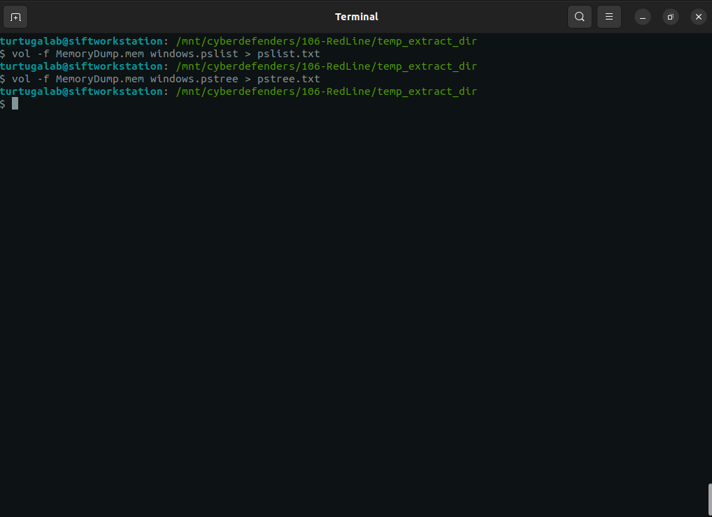
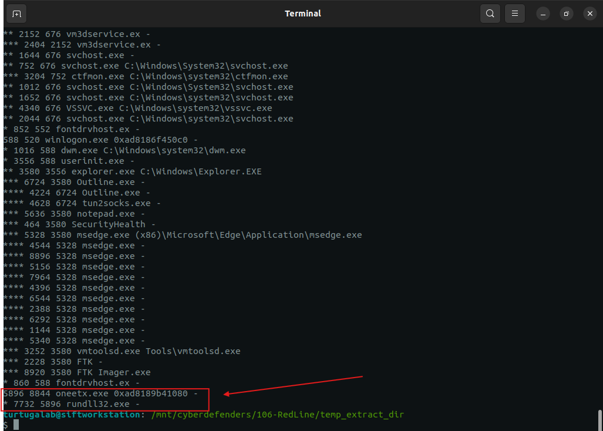
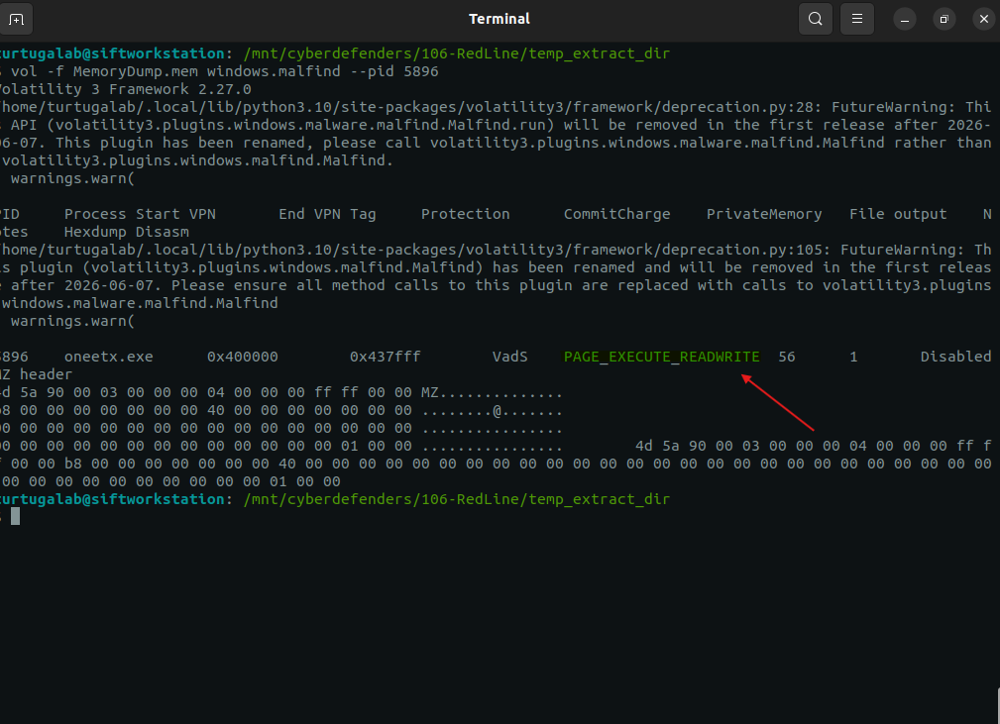
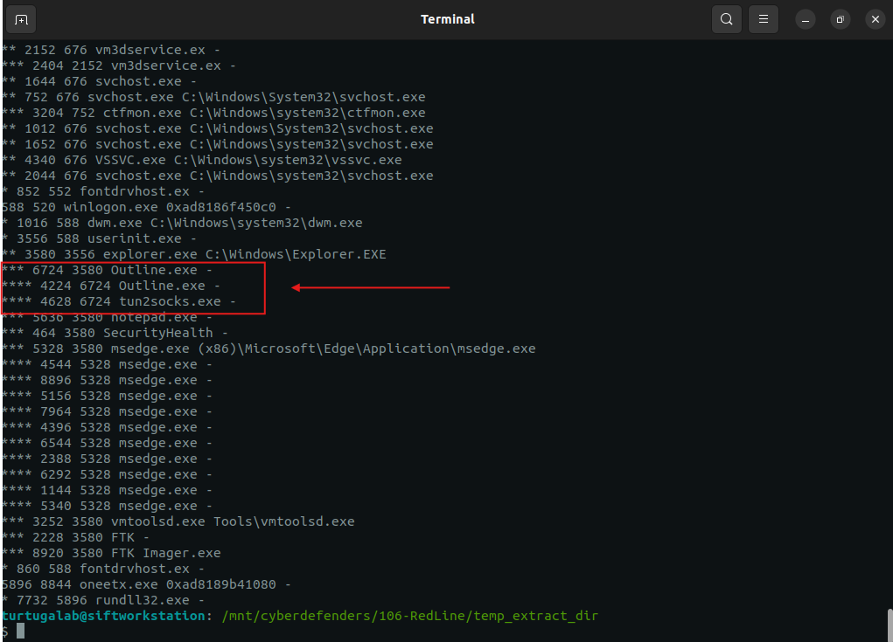
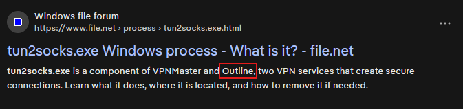
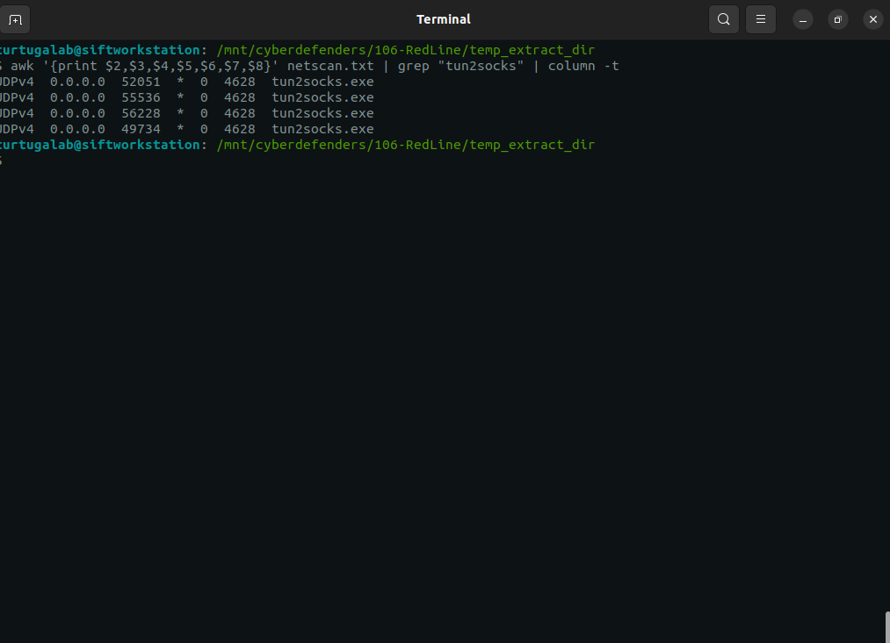
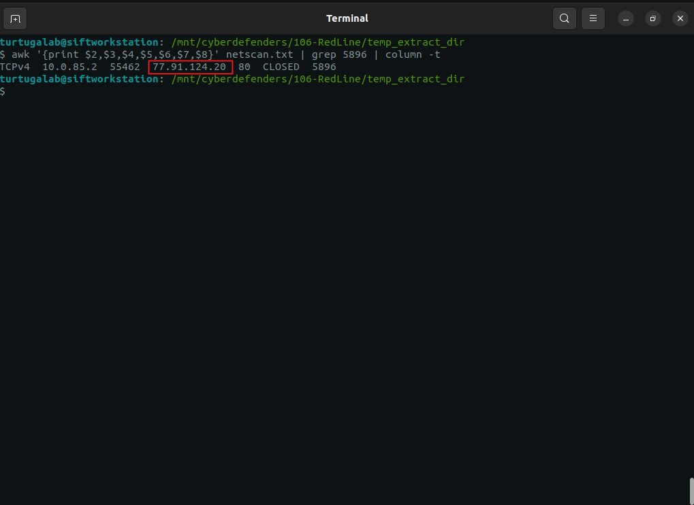
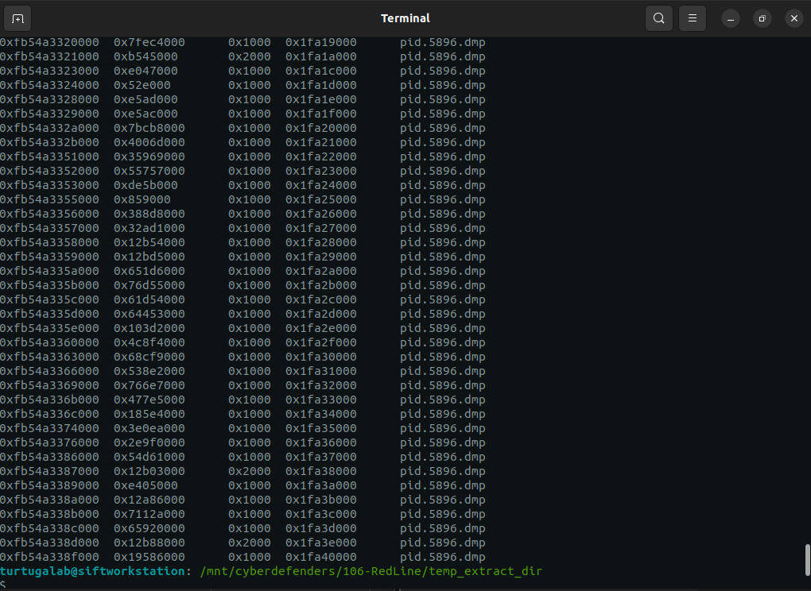
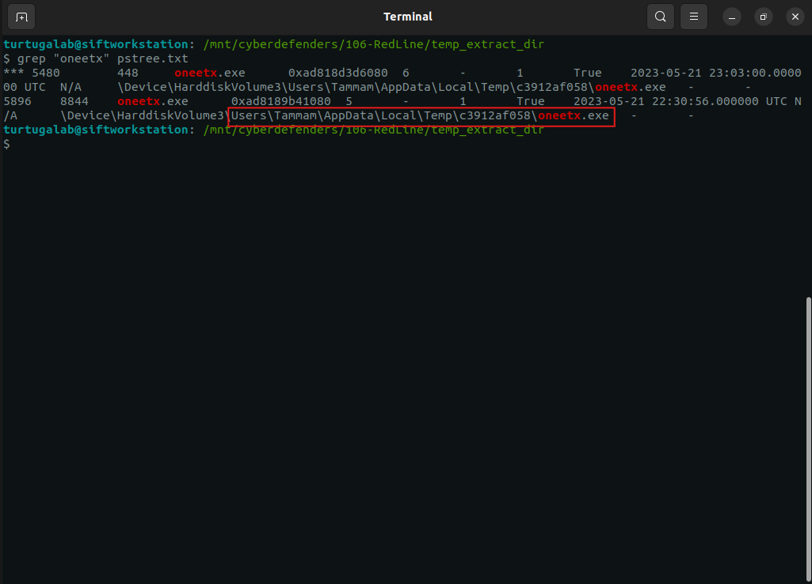

# Lab Overview
---
**Lab:** [Redline Lab](https://cyberdefenders.org/blueteam-ctf-challenges/redline/)  
**Platform:** CyberDefenders  
**Category:** Endpoint Forensics  
**Difficulty:** Easy  
**Tools:** Volatility3, strings, awk  

# Summary
---
This lab focuses on memory forensics analysis using Volatility3 to investigate a compromised system and trace the attacker's activity. Through process analysis, the suspicious process `oneetx.exe` was identified as the sources of malicious behavior after spawning `rundll32.exe`, a commonly used utility for executing malicious payloads.

Further investigation revealed that the malware operated within memory regions with the flag `PAGE_EXECUTE_READWRITE`, indicating potential code inaction and in-memory execution techniques. Network analysis uncovered outbound communications to external IP address `77[.]91[.]124[.]28` and identified a malicious URL used by the attacker indicating command and control activity.  

Additionally, the presence of VPN related process, `Outline.exe` and `tun2socks.exe`, indicated that the attacker used proxy-based tunneling to bypass network monitoring controls.  
# Scenario
---
As a member of the Security Blue team, your assignment is to analyze a memory dump using Redline and Volatility tools. Your goal is to trace the steps taken by the attacker on the compromised machine and determine how they managed to bypass the Network Intrusion Detection System (NIDS). Your investigation will identify the specific malware family employed in the attack and its characteristics. Additionally, your task is to identify and mitigate any traces or footprints left by the attacker.

# Analysis
---
## What is the name of the suspicious process?

To identify the suspicious process, I use both the `pslist` and `pstree` plugins from Volatility3. By analyzing the out of these plugins, I can determine the suspicious process that was captured in the memory dump. I ran the commands below to redirect the output of both `pslist` and `pstree` to a text file to so I can easily filter what I am looking for.  
```bash
vol -f MemoryDump.mem windows.pslist > pslist.txt
vol -f MemoryDump.mem windows.pstree > pstree.txt
```
  

Initially, I had analyzed the pslist.txt, however I was unable to find a process that was suspicious.  

Next, I utilized the `awk` tool to print columns 1-4 and the last column of `pstree.txt` to reduce the noise from unneeded columns making it easier to analyze.  
```bash
awk '{print $1, $2, $3, $4, $NF}' pstree.txt
```
  
From the screenshot above, I noticed that the process `oneetx.exe` spawned the child process `rundll32.exe`. Typically, the `rundll32.exe` executable is used to execute DLL files and it is commonly used by malware to execute their payloads.  

Based on this observation, the process `oneetx.exe` is the suspicious process and warrants further investigation.  

## What is the child process name of the suspicious process?

As I previously identified, the process `oneetx.exe` spawned `rundll32.exe`, which is the child process to `oneetx.exe`. This is verified by looking at the PID of `oneetx.exe` (5896) and the PPID (Parent PID) of `rundll32.exe` (5896).  
  

## What is the memory protection applied to the suspicious process memory region?

To identify the memory protection applied to the suspicious program, I ran the command below using the `malfind` plugin to dump suspicious memory spaces of the process `oneetx.exe`.  
```bash
vol -f MemoryDump.mem windows.malfind --pid 5896
```
  
From the screenshot above, I identified that the memory protection applied is `PAGE_EXECUTE_READWRITE`, meaning the memory region of the process `oneetx.exe` can be read, written to, and executed. This is powerful because it enables code injection or execution from writable memory.  

## What is the name of the process responsible for the VPN connection?

Utilizing the `awk` tool and `pstree.txt` again, I analyze the text file for any processes that might indicate possible VPN functionality.  
```bash
awk '{print $1,$2,$3,$4,$NF}' pstree.txt
```
  
From the screenshot above, I noticed a child process named `tun2socks.exe`. This peaked my interested and based on my research, this process is a tool that redirects network traffic through a SOCKS5 proxy and is commonly used in VPN services.  

Further inspection of the process tree reveals that the parent process of `tun2socks.exe` is `outline.exe`, which is the process that orchestrated the VPN connection as `tun2socks.exe` is not an independent process.  

  
Internet research confirms that `Outline.exe` is a VPN software and is responsible for initiating and managing the VPN connection including launching the tool `tun2socks.exe`.  

For further confirmation, I used the `netscan` plugin to analyze network activity. Upon running the command below, I observe that there are connections established by the `tun2socks.exe` tool.  
```bash
awk '{print $2,$3,$4,$5,$6,$7,$8}' netscan.txt | grep "tun2socks" | column -t
```
  

## What is the attacker's IP address?

Utilizing the `netscan` plugin, I ran the command below specifically filtering for the suspicious process's PID to identify any connections to an external IP address.  
```bash
awk '{print $2,$3,$4,$5,$6,$7,$8}' netscan.txt | grep 5896 | column -t
```
  
Based on my results, I identified that the suspicious process had established a connection to the external IP address `77[.]91[.]124[.]28`, likely the attacker's server.  

## What is the full URL of the PHP file that the attacker visited?

To identify URLs that the attacker may have visited, I used the `memmap` plugin with the `--dump` flag to extract the memory regions associated with the suspicious process. This allows for analysis of the process's virtual address space where artifacts like visited URLs or injected content may be located.  
```bash
vol -f MemoryDump.dmp -o out windows.memmap --pid 5896 --dump
```
  

Once the memory was dumped, using the `strings` utility to convert the raw memory data into human-readable text, I then used REGEX to filter for anything related to the `.php` file extension.  
```bash
strings out/pid.5896.dmp | grep -iE "\.php$"
```
  
From this analysis, I identified `hxxp[://]77[.]91[.]124[.]20[/]store[/]games[/]index[.]php` as the full URL of the PHP file that the attacker visited.  

## What is the full path of the malicious executable?

Analysis into the process tree revealed the full path for the `oneetx.exe` executable.  
```bash
grep "oneetx" pstree.txt
```
  