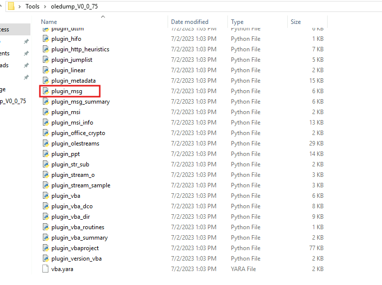
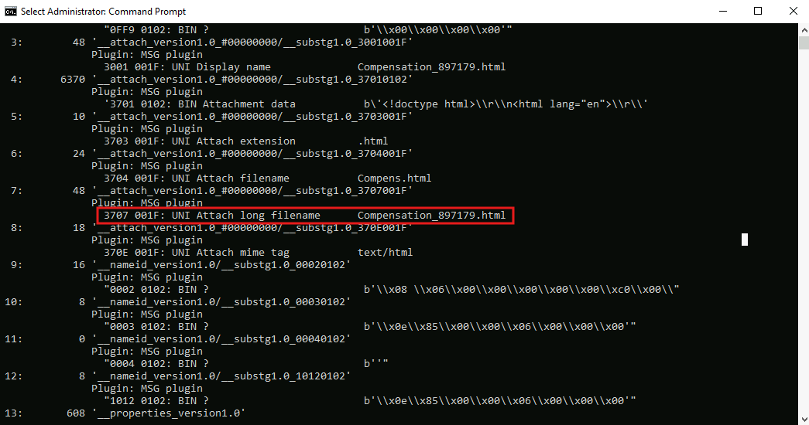
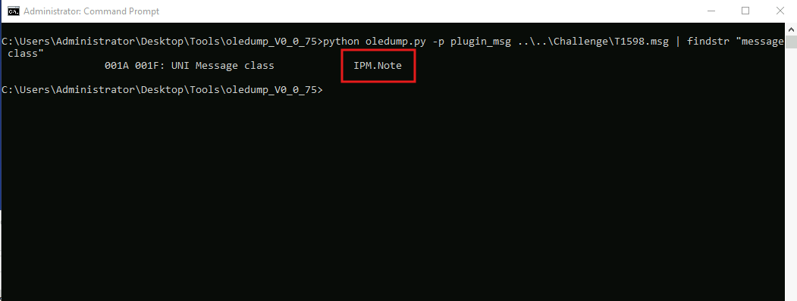
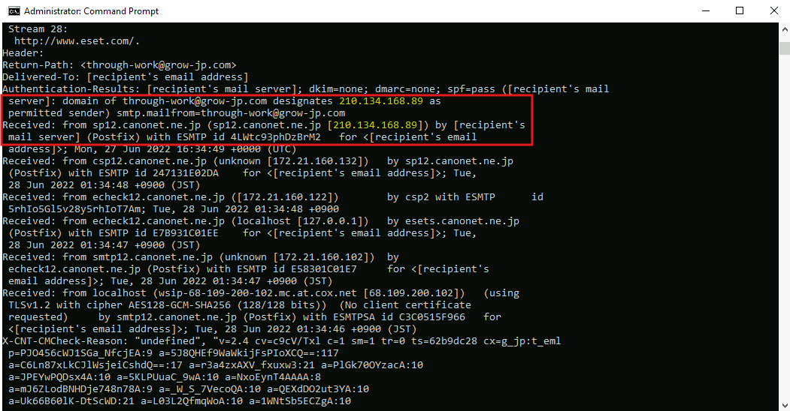
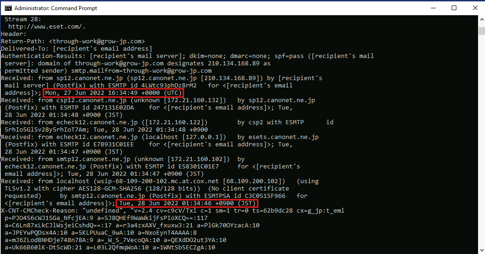
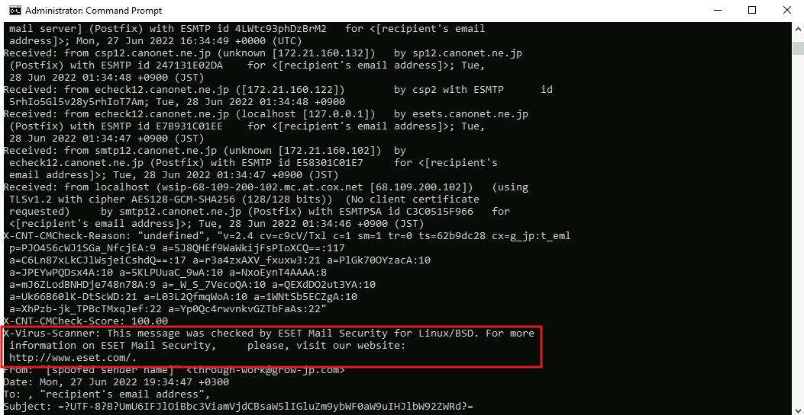
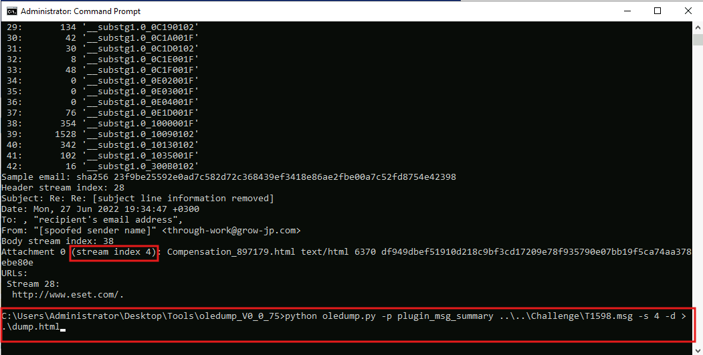
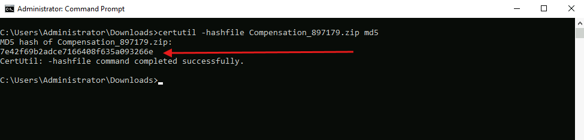
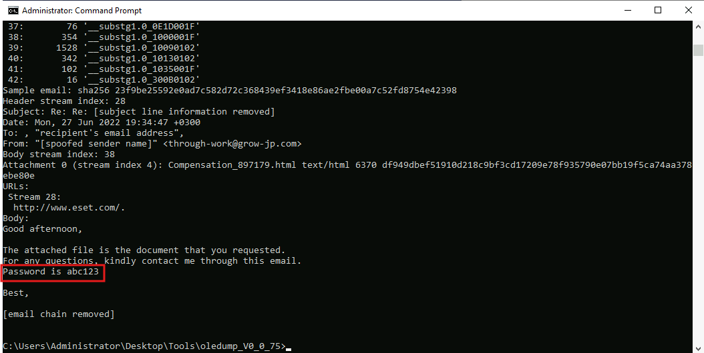
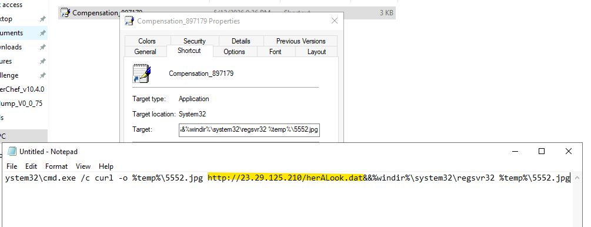

# Lab Overview
---
**Lab:** [T1598.002 - Dragonfly Lab](https://cyberdefenders.org/blueteam-ctf-challenges/t1598002-dragonfly/)  
**Platform:** CyberDefenders  
**Category:** Endpoint Forensics  
**Difficulty:** Easy  
**Tools:** oledump  

# Summary
---
Write a summary of the CTF challenge.

# Scenario
---
Adversaries may send spearphishing messages with malicious attachments to elicit sensitive information that can be used during targeting. Spearphishing is an attempt to trick targets into divulging information, frequently credentials or other actionable information. Spearphishing for information frequently involves social engineering techniques, such as posing as a source with a reason to collect information (e.g., [Establish Accounts](https://attack.mitre.org/techniques/T1585) or [Compromise Accounts](https://attack.mitre.org/techniques/T1586)) and/or sending multiple, seemingly urgent messages.

All forms of spearphishing are electronically delivered social engineering targeted at a specific individual, company, or industry. In this scenario, adversaries attach a file to the spearphishing email, usually relying upon the recipient populating information and returning the file.[[1]](https://nakedsecurity.sophos.com/2020/10/02/serious-security-phishing-without-links-when-phishers-bring-along-their-own-web-pages/)[[2]](https://github.com/ryhanson/phishery) The text of the spearphishing email usually tries to give a plausible reason why the file should be filled in, such as a request for information from a business associate. Adversaries may also use information from previous reconnaissance efforts (ex: [Search Open Websites/Domains](https://attack.mitre.org/techniques/T1593) or [Search Victim-Owned Websites](https://attack.mitre.org/techniques/T1594)) to craft persuasive and believable lures.


# Analysis
---
## What plugin is included in the oledump directory that scans streams in MSG files?

Upon searching through the `oledump` directory, it includes a plugin named `plugin_msg` which the name suggests it likely scan streams in MSG files.  
  

## What are the 8-digit hexadecimal codes related to the "Attach long filename" stream?

Run the command below to scan the `MSG` artifact using `oledump` and the plugin `plugin_msg`.  
```bash
python oledump.py -p plugin_msg ..\..\Challenge\T1598.msg
```

The output shows the hexadecimal code `0x3707001F` belongs to the attached long filename.  
  

## During the analysis of the streams. What is the message class?

Using the previous command, append the command `findstr "message class"` with a pipe to search for the string `message class`.  
```bash
python oledump.py -p plugin_msg ..\..\Challenge\T1598.msg | findstr "message class"
```

The message class is `IPM.Note`.  
  

## To understand spearphishing, it's important to find the sender's source. What is the sender's IP address?

To identify the sender's IP address, we need a detailed view of the email header. The command below uses the plugin `plugin_msg_summary` with the options `-pluginoptions -H` which prints the full header of the email.  
```bash
python oledump.py -p plugin_msg_summary -pluginoptions -H ..\..\Challenge\T1598.msg
```

In the Authentication-Results field, the domain `through-work@grow-jp.com` permitted the IP address `210.134.168.89` as a permitted sender. Based on this, this IP address is the sender's IP address.  
  

## What was the total delay (in seconds) between the sender and the email receiver?

To calculate the total delay between the sender and email receiver, we need to get the difference between the first and last Received header time. The last Received header time is in UTC which converted to JTC becomes `01:34:49`.  

Subtract `01:34:49` from `01:34:46` gives us a total delay of `3` seconds.  
  

## What is the company that developed the antispam software used by the target?

In the email header, the X-Virus-Scanner header field reveals that the company `ESET Mail Security` developed the antispam software.  
  

## Dumping the malicious HTML file and opening it will download a zip file. What is the zip file's MD5 hash?

First, run the command below to get a short summary of the email header. Take note of the stream number for the HTML attachment.  
```bash
python oledump.py -p plugin_msg_summary ..\..\Challenge\T1598.msg
```

Next, run the command below to specify stream 4 using `-s 4` and dump the HTML attachment using `-d > .\dump.html`.  
```bash
>python oledump.py -p plugin_msg_summary ..\..\Challenge\T1598.msg -s 4 -d > .\dump.html
```
  

Visit the HTML page to download the `.zip` file. Once downloaded, use the `certutil` tool to calculate the MD5 hash value of the zip file. The MD5 hash is `7e42f69b2adce7166408f635a093266e`.  
  

## What full URL is used by the malicious shortcut embedded in the zip file?

Use the command below to inspect the body of the email message to obtain the password to the zip file.  
```bash
python oledump.py -p plugin_msg_summary.py --pluginoptions -b ..\..\Challenge\T1598.msg
```
  

Check the properties of the shortcut link and inspect the Target field. The URL embedded in the zip file is `http://23.29.125.210/herALook.dat`.  
  