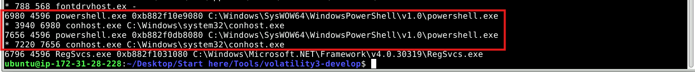
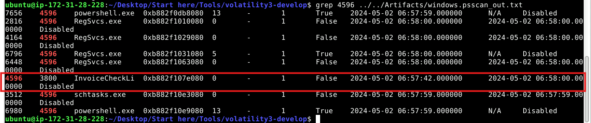
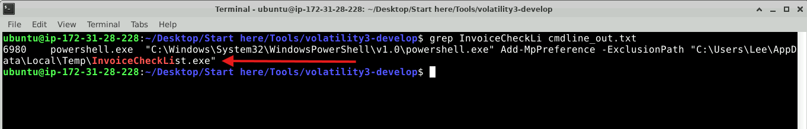
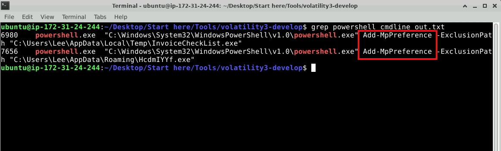
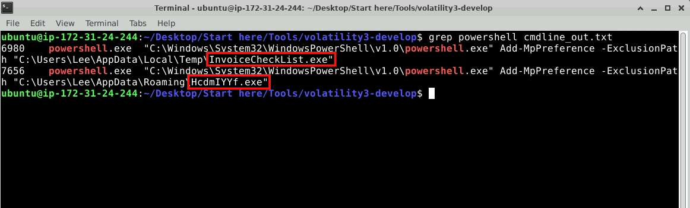
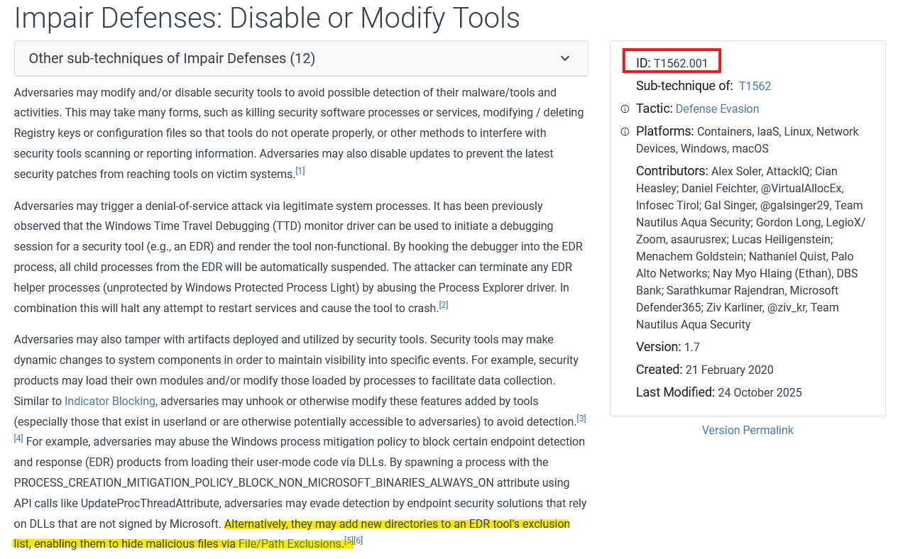
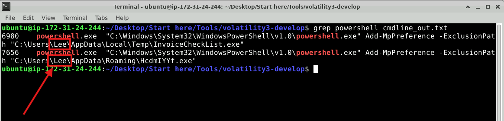

# Lab Overview
---
**Lab:** [Volatility Traces Lab](https://cyberdefenders.org/blueteam-ctf-challenges/volatility-traces/)  
**Platform:** CyberDefenders  
**Category:** Endpoint Forensics  
**Difficulty:** Easy  
**Tools:** Volatility3  

# Summary
---
This lab involves memory forensics analysis of a compromised Windows system using Volatility3 to investigate suspicious PowerShell activity. Process analysis revealed that the malicious executable `InvoiceCheckList.exe` spawned two PowerShell processes and additional child processes including `schtasks.exe` for persistence and `RegSvcs.exe` for stealthy process execution.

The PowerShell processes used the `Add-MpPreference` cmdlet to add exclusions to Microsoft Defender, preventing it from scanning the malicious executables `InvoiceCheckList.exe` and `HcdmIYYf.exe`. This defense evasion technique was mapped to the appropriate MITRE ATT&CK sub-technique. The compromised user account was identified as `Lee`, under whose directory the malicious files were located.

# Scenario
---
On May 2, 2024, a multinational corporation identified suspicious PowerShell processes on critical systems, indicating a potential malware infiltration. This activity poses a threat to sensitive data and operational integrity.

You have been provided with a memory dump (`memory.dmp`) from the affected system. Your task is to analyze the dump to trace the malware's actions, uncover its evasion techniques, and understand its persistence mechanisms.

# Analysis
---
## Identifying the parent process reveals the source and potential additional malicious activity. What is the name of the suspicious process that spawned two malicious PowerShell processes?

To begin this investigation, I used the windows.pstree plugin from Volatility to list the processes captured in a tree structure.  
```bash
vol -f ../../Artifacts/memory.dmp windows.pstree > pstree_out.txt
```

Next, I used `awk` to output columns 1-4 and the last column to the screen.  
```bash
awk '{print $1, $2, $3, $4, $NF}' pstree_out.txt
```
  
In the screenshot above, I identified two PowerShell processes. Both of these PowerShell processes have a PPID of `4596`.

Search through the given `windows.psscan_out.txt` file for the PID 4596, I discovered it belonged to the process `InvoiceCheckLi`.  
  

To get the full name of the process, I ran the command below to dump out all command line executions.  
```bash
vol -f ../../Artifacts/memory.dmp windows.cmdline > cmdline_out.txt
```

Upon searching for `InvoiceCheckLi` in `cmdline_out.txt` revealed that the full process name is `InvoiceCheckList.exe`.  

## By determining which executable is utilized by the malware to ensure its persistence, we can strategize for the eradication phase. Which executable is responsible for the malware's persistence?

From the previous screenshot of `windows.psscan_out.txt`, there are some other child processes spawned from the same `InvoiceCheckList.exe` process. One of the process observed is named `schtasks.exe` which is typically used for scheduling tasks to autorun on login.  
  

This evidence shows that the attacker likely used the `schtasks.exe` executable to maintain the malware's persistence.   
## Understanding child processes reveals potential malicious behavior in incidents. Aside from the PowerShell processes, what other active suspicious process, originating from the same parent process, is identified?

Using the same screenshot as the previous, the other child process spawned from the same `InvoiceCheckList.exe` process is named `RegSvcs.exe`.  
  

## Analyzing malicious process parameters uncovers intentions like defense evasion for hidden, stealthy malware. What PowerShell cmdlet used by the malware for defense evasion?

Searching `cmdline_out.txt` specifically for powershell revealed that the `powershell.exe` executable used the parameter `Add-MpPreference` along with `-ExclusionPath`. This command affects the Window's builtin antivirus software Microsoft Defender and tells it to not scan the given paths.  
  

This evidence shows that the attacker is likely attempting defense evasion by excluding a path from Microsoft Defender.  
## Recognizing detection-evasive executables is crucial for monitoring their harmful and malicious system activities. Which two applications were excluded by the malware from the previously altered application's settings?

From the previous output, the executables `InvoiceCheckList.exe` and `HcdmIYYf.exe` were excluded from Microsoft Defender.  
  

## What is the specific MITRE sub-technique ID associated with PowerShell commands that aim to disable or modify antivirus settings to evade detection during incident analysis?

  

## Determining the user account offers valuable information about its privileges, whether it is domain-based or local, and its potential involvement in malicious activities. Which user account is linked to the malicious processes?

Using `cmdline_out.txt`, the malicious files are located under the User `Lee`'s directory.  
  