# Lab Overview
---
**Lab:** [Spooler - APT28 Lab](https://cyberdefenders.org/blueteam-ctf-challenges/spooler-apt28/)  
**Platform:** CyberDefenders  
**Category:** Endpoint Forensics  
**Difficulty:** Hard  
**Tools:** Registry Explorer, Timeline Explorer, DB Browser for SQLite, MFTECmd, PECmd, MITRE ATT&CK, Event Log Explorer, VirusTotal  

# Summary
---
This lab investigates a compromised Windows workstation previously assigned to a government employee named Yanis using Registry Explorer, Timeline Explorer, MFTECmd, PECmd, DB Browser for SQLite, and Event Log Explorer. The attacker lured the user into downloading a malicious archive from a compromised HR website (`hr.welfare.gov`) containing a malicious LNK file, `Printing_Guideline.lnk`. Executing the LNK file triggered `mshta.exe` to fetch and cache a remote HTA script (`STAGING[1].HTA`), which then used `certutil.exe` as a LOLBin to download the malicious DLL payload `wininet.dll` and dropped `edge.exe` (a renamed `calc.exe`) to the temp directory. The payload leveraged DLL sideloading (T1574.001) through the renamed calculator binary.

To maintain persistence, the attacker registered the `EdgeUpdate` Run key pointing to `edge.exe` and added a malicious Print Spooler monitor entry pointing to a remote DLL at `\\google.gov\debug\spooler.dll` (T1547.010), though the spooler DLL failed to load 3 times due to the network path being unavailable. Two days later, the attacker returned and ran `winPEASx64.exe` to enumerate privilege escalation paths, then exploited the `AlwaysInstallElevated` misconfiguration — enabled in both HKCU and HKLM — by executing a malicious MSI file to install a payload as SYSTEM.

# Scenario
---
The SOC team was notified by the IT department regarding a potentially compromised workstation recently reassigned to a new government employee named Keela. Upon receiving the workstation, Keela reported unusually slow performance and suspected the system had not been properly cleaned before being handed over. The IT team initiated a routine cleanup but identified indicators of suspicious activity suggesting that the machine, and possibly the department’s website may have been previously compromised.

As a forensics investigator, you have been provided with a disk image of Keela’s workstation. Your task is to perform a comprehensive investigation to uncover any signs of malicious activity, reconstruct the timeline of events, and assess the scope and impact of the potential compromise.


# Initial Access
---
## What is the full name of the previous user of this machine, before it was assigned to Keela?

To identify previous users before Keela, we can navigate to the Users folder to see all user profiles that exists in the collected artifact.  
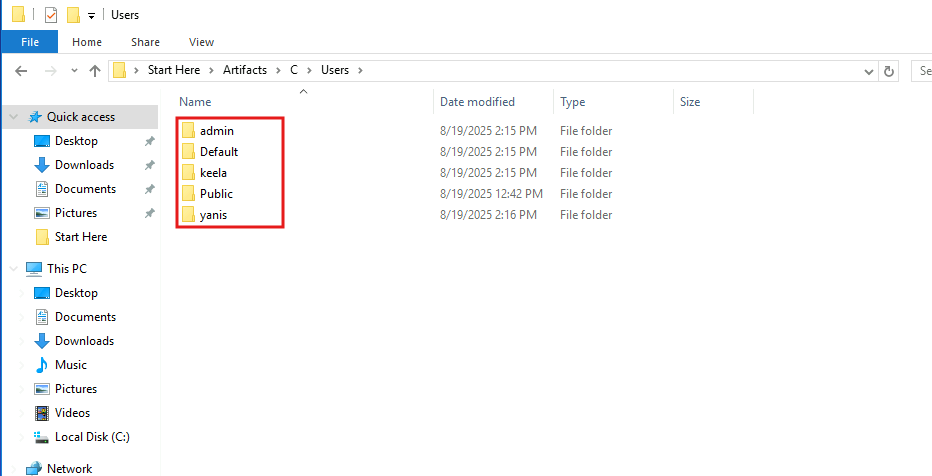  
The five user profiles are `admin`, `Default`, `keela`, `Public`, and `yanis`. The `Default` and `Public` profiles are native to Windows and the admin is the local administrator so it is likely that `yanis` was the previous user before Keela.  

To obtain the full name of the `yanis` user, we need to inspect the SAM registry hive. This hive stores user account, login, and group information. The SAM hive is located at `C:\Windows\System32\config\SAM`.  

In Registry Explorer, we can navigate to `SAM\Domains\Account\Users` to examine all local accounts on the system. Looking at the `yanis` account, we can identify a couple of key information like the account's last login time at 2025-08-13 15:50:03 and its full name `Yanisara Denthongkul`.  
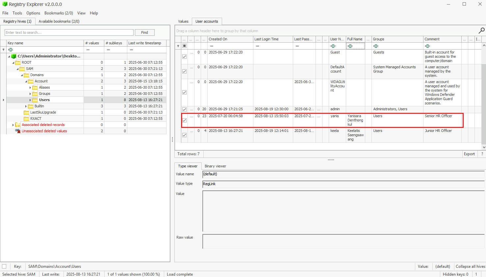  

## The previous user downloaded an archive from a compromised internal website that led to the initial infection. When was this archive successfully downloaded?

To trace browser download activity, we can examine the user `yanis`'s browser history. Depending on what browser is installed on the user, we can find the Browsers in the base directory `C:\Users\yanis\AppData\Local\`.  

The user `yanis` had Google Chrome installed so we will examine their Chrome history file located in `C:\Users\yanis\AppData\Local\Google\Chrome\User Data\Default\`. Open the `History` file in DB Browser for SQLite and examine the `downloads_url_chains` table which logs the last URL the browser had to fetch to complete the download.
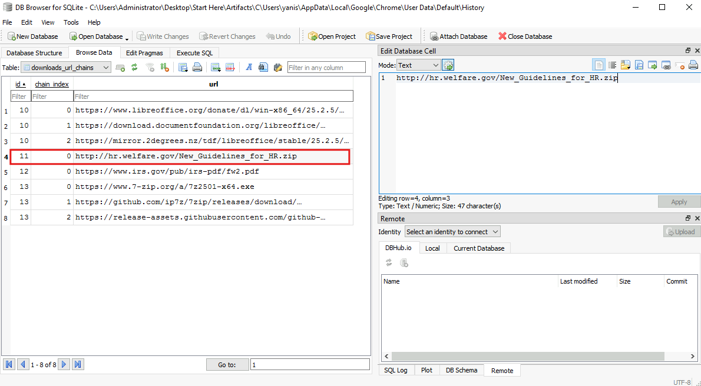  

Upon reviewing the entries in this table, the entry `http://hr.welfare.gov/New_Guidelines_for_HR.zip` shows a zip file downloaded from the domain `hr.welfare.gov`. Given that we know the department's HR website was compromised. this archive file downloaded from `hr.welfare.gov` is highly suspicious.  

To determine the exact timestamp of when this archive was downloaded, we'll examine the `downloads` table and convert the `end_time` value. We can use the tool Dcode to convert this raw value to Chromium Time.  
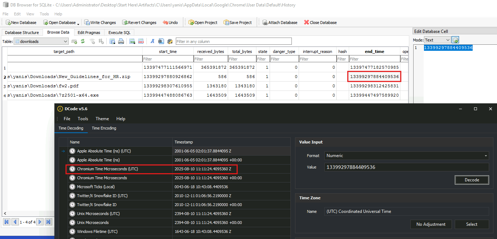  

Decoding this value in Dcode gives us the timestamp `2025-08-10 11:11:24` UTC. This timestamp is now the starting point of our investigation timeline.  

# Execution
---
## What is the name of the file executed by the user that initiated the infection chain on this machine?

Typically, we can look at the MFT or UsnJournal to identify files that were extracted from the archive, but, the user deleted those files and enough time has elasped for the records to be purged from both the MFT and UsnJournal.  

Instead, we can examine the NTUSER.DAT registry hive for the `yanis` user located in `C:\Users\yanis\NTUSER.DAT` to determine which files in the archive the user executed. The NTUSER.DAT hive contains UserAssist key which tracks programs launched through Windows Explorer.  

In Registry Explorer, navgiate to the UserAssist key, sort the "Last Executed", and examine the programs that executed around the timeframe after the archive was downloaded.  
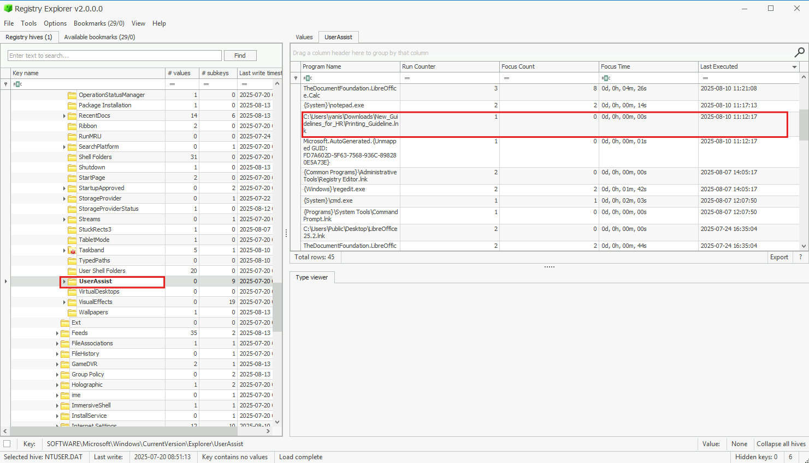  

In the screenshot above, an entry shows the file `Printing_Guideline.lnk` was executed from the path `C:\Users\yanis\Downloads\NewGuidelines_for_HR\Printing_Guideline.lnk` at 2025-08-10 11:12:17. This confirms that the file `Printing_Guideline.lnk` initiated the infection.  

## Upon executing the file, an HTA script was executed remotely. What is the name of the temporary copy of this script created on this machine?

To determine what occurred immediately after the user executed the malicious LNK file, we'll examine the Prefetch files. The command below uses PECmd to parse all Prefetch files and output the results as CSV files.  
```bash
PECmd -d "C:\Users\Administrator\Desktop\Start Here\Artifacts\C\Windows\prefetch" --csv "C:\Users\Administrator\Desktop"
```

Open the file with `_timeline` in the name in Timeline Explorer to examine the execution sequence following the archive's download. At 2025-08-10 11:12:18, one second after the LNK file was executed, the executable `MSHTA.EXE` was launched.  
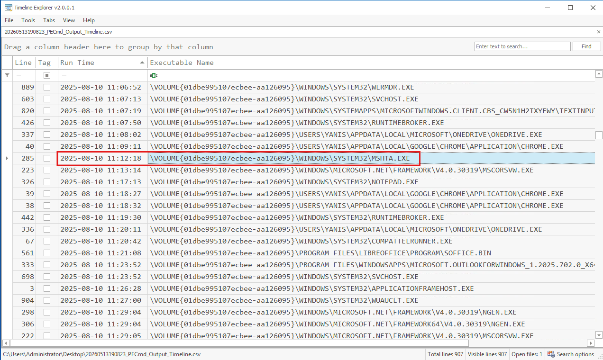  

MSHTA is a legitimate Windows utility that is used to execute HTA (HTML Application) files. Attackers frequently abuse `MSHTA.exe` to execute malicious scripts since it's a signed Microsoft binary that can run scripts from both local and remote locations. This effectively makes it a LOLBAS technique.  

Now, we'll switch over to the file without the `_timeline` in the name to get a more detailed view. Under the "Source Filename" column, filter for `MSHTA` then expand the "Files Loaded" field to see all files that MSHTA.exe referenced during execution.    
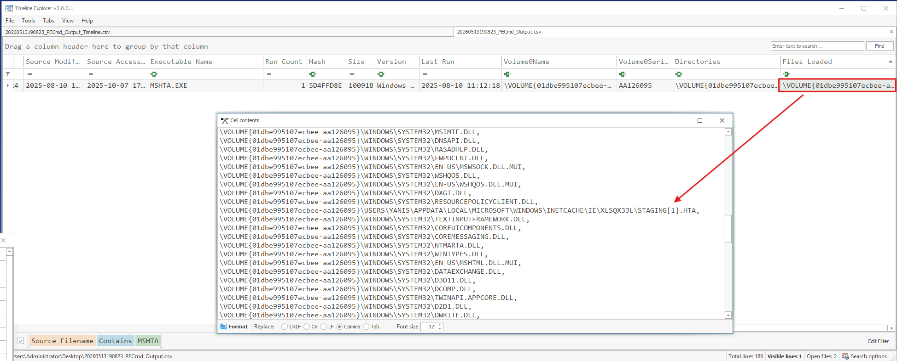  

In the list of files, we see a locally cached copy of the remotely executed HTA script at `\USERS\YANIS\APPDATA\LOCAL\MICROSOFT\WINDOWS\INETCACHE\IE\XLSQX3JL\STAGING[1].HTA`. This script is located in the `INetCache` directory, which is where Internet Explorer and mshta.exe cache files downloaded from remote URLs. THe temporary copy of the HTA script is identified as `STAGING[1].HTA`.  

## Two files were created in the temporary directory of the compromised user. What are their names? (Provide in alphabetical order)

To identify the files dropped by the HTA script, we'll parse and examine the MFT, which records every file and directory on the volume. The command below parses both the `$MFT` and `$Extend$J` (UsnJournal).  
```bash
MFTECmd -f "C:\Users\Administrator\Desktop\Start Here\Artifacts\C\$Extend\$J" -m "C:\Users\Administrator\Desktop\Start Here\Artifacts\C\$MFT" --csv "C:\Users\Administrator\Desktop\"
```

Open the MFT output CSV in Timeline Explorer then filter the "Parent Path" column for `\yanis\AppData\Local\Temp` to isolate files created in the user's temp directory. Upon examining the output, two files, `wininet.dll` and `edge.exe`, were created at 2025-08-10 11:12:21, just 3 seconds after mshta.exe launched.  
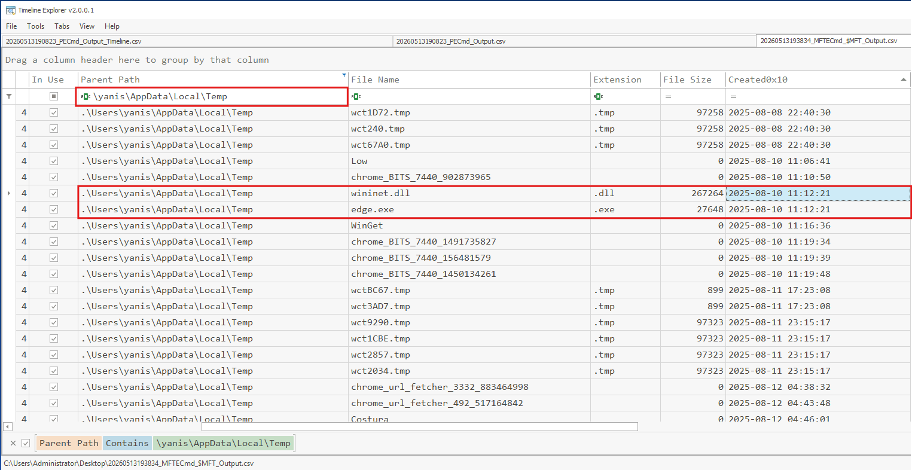  

We can cross-reference these files with the Prefetch data. Examining the files loaded by `mshta.exe` reveals the file `\USERS\YANIS\APPDATA\LOCAL\TEMP\EDGE.EXE` in the list. This confirms that the HTA script also executed `edge.exe` after dropping it.  

## What is the original filename of first file identified in previous question?

The file `edge.exe` likely isn't exactly Edge dropped by the attacker. To investigate what this file actually is, we can further examine the MFT output. If we filter for the same file size of 27648 bytes, we'll notice something interesting. The file `calc.exe` located at `Windows\System32` and `Windows\WinSxS` has the same file size, and if we take a look a the "Last Modified" timestamp, we'll notice that the `edge.exe` last modified time `2019-12-07 09:09:47` matches exactly to `calc.exe`.  
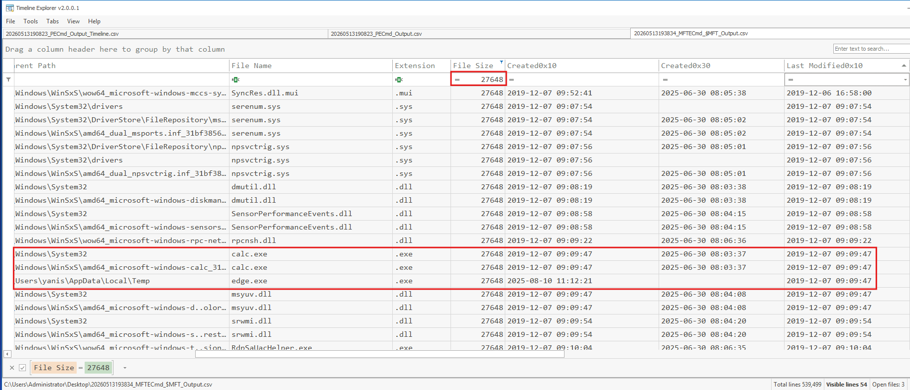  

Based on this evidence, it is likely that `edge.exe` is simply a rename of the `calc.exe` file. To confirm this, we'll obtain the SHA1 hash of `edge.exe` from the Amcache hive. This hive located at `C:\Windows\AppCompat\Programs\Amcache.hve` records information about executed programs including file paths, SHA1 hashes, and timestamps.  

The command below parses the Amcache using AmcacheParser and outputs it to a CSV file.  
```bash
AmcacheParser -f "C:\Users\Administrator\Desktop\Start Here\Artifacts\C\Windows\AppCompat\Programs\Amcache.hve" --csv "C:\Users\Administrator\Desktop"
```

Opening the `Amcache_UNassociatedFileEntries.csv` file in Timeline Explorer and filtering for `\temp\edge.exe` under the "Full Path" column, we can obtain the SHA1 hash for `edge.exe`.  
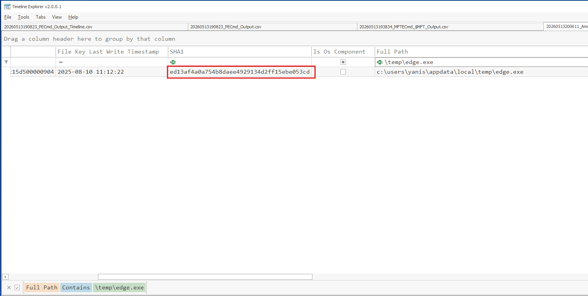  

Scanning this hash value in VirusTotal confirms that the original filename is precisely `calc.exe`.  
  
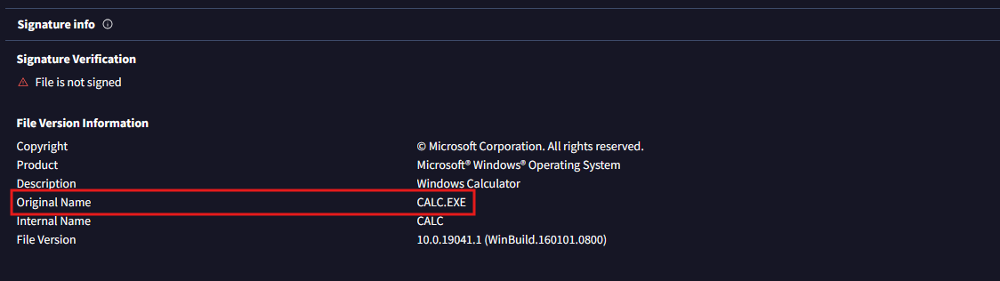  

## What is the MITRE ATT&CK technique that corresponds to the method the malicious payload used to load itself?

Using the website [HijackLibs](https://hijacklibs.net/), we can check the file `wininet.dll` to see if it is vulnerable to DLL hijacking. Searching for `wininet.dll` confirms that it can be sideloaded by the Windows Calculator app.  
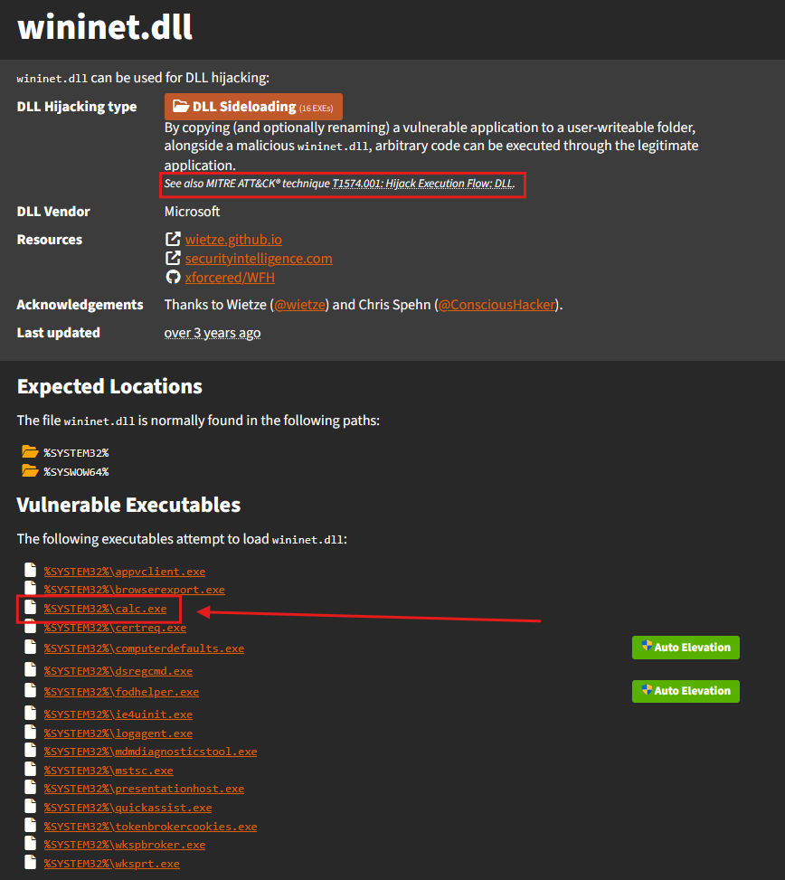  

From [MITRE ATT&CK](https://attack.mitre.org/techniques/T1574/001/), technique ID T1574.001 explains DLL hijacking.  
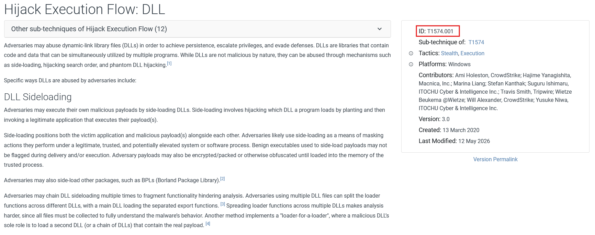  

## Which LOLBin was used to download malicious payload?

We'll further analyze the Amcache to determine how the malicious DLL payload was downloaded to the machine. Sorting by the "File Key Last Writeup Timestamp" reveals that at 2025-08-10 11:12:19, `mshta.exe` was recorded, then at 2025-08-10 11:12:21, `certutil.exe` was recorded, and finally at 2025-08-10 11:12:22, `edge.exe` was recorded. Based on this sequence, it highly suggests that `certutil.exe` was utilzed to download the malicious DLL payload from the attacker's C2 server before `edge.exe` was executed.  
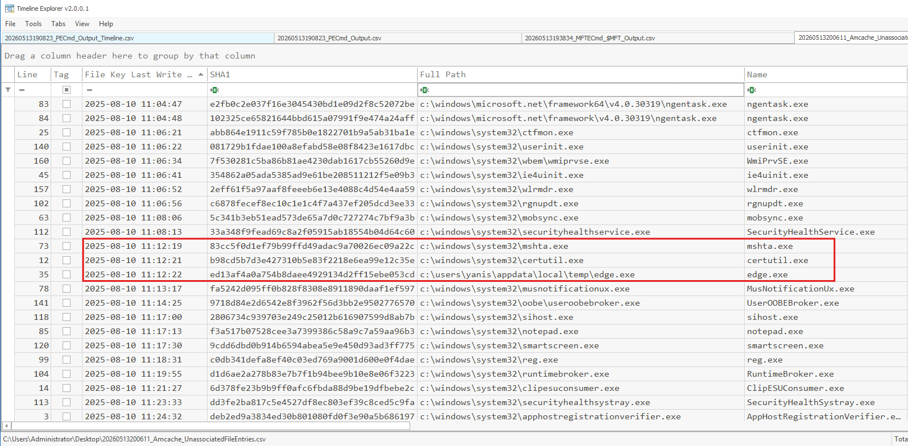  

From [LOLBAS](https://lolbas-project.github.io/lolbas/Binaries/Certutil/), `certutil.exe` can be exploited by using the `-urlcache` option to download files from remote URLs.  
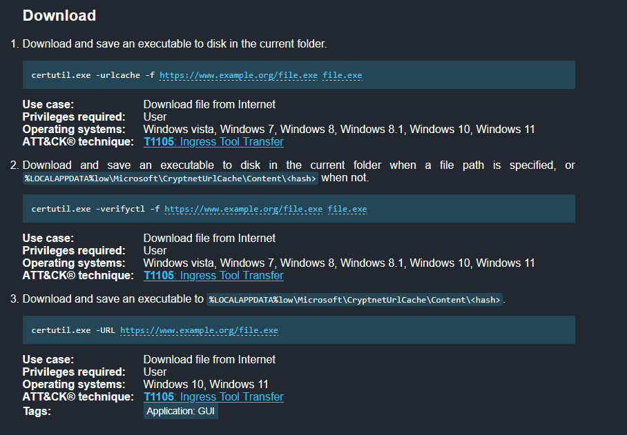  

When `certutil.exe` is used to download files, it also creates a cached copy in the `CryptnetUrlCache` directory. If we filter for the `wininet.dll` file size (267264) in the MFT output, we can see that at 2025-08-10 11:12:20, a file was created under `CryptnetUrlCache` directory, just 1 second before `wininet.dll`'s creation in the temp directory. 
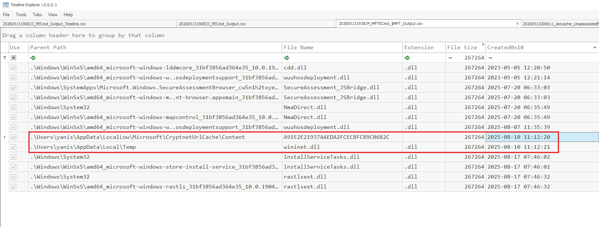  

This confirms that `certutil.exe` was the LOLBin used.  

# Persistence
---
## A persistence mechanism was created to execute the malicious payload at every system startup. What is the name assigned to this persistence entry?

To check for persistence, we can first examine the `Run` registry key in the NTUSER.DAT hive. This key contains a list of software set to run each time the user logs in. Navigate to `SOFTWARE\Microsoft\Windows\CurrentVersion\Run` to examine this key.  
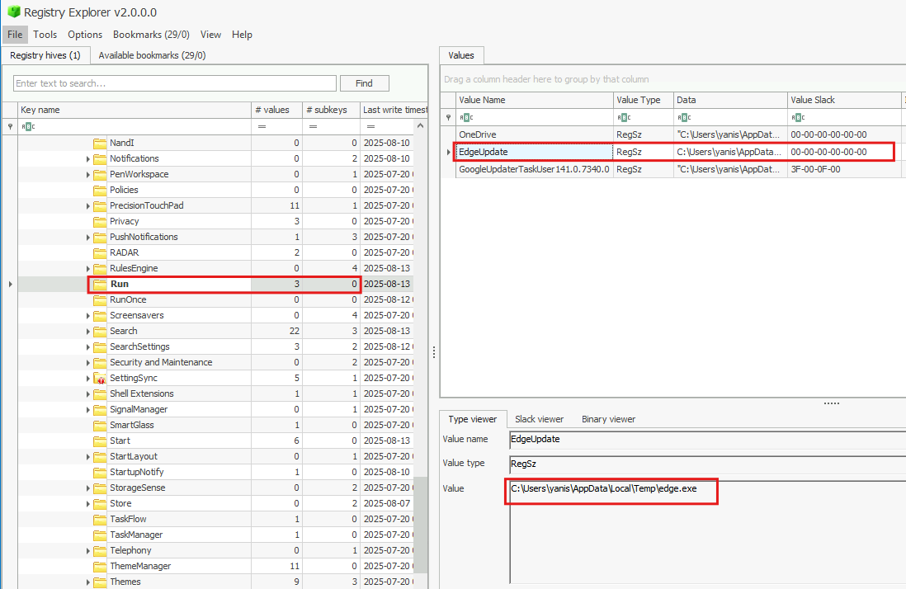  

Upon reviewing the entries in the `Run` key, a suspicious value named `EdgeUpdate` has a data value of `C:\Users\yanis\AppData\Local\Temp\edge.exe`. This suggest that the `EdgeUpdate` is the attacker's persistence mechanism.  
## Another Boot or Logon Autostart persistence was configured to execute a DLL payload remotely through the Print Spooler service. What is the MITRE ATT&CK Technique ID associated with this persistence mechanism?

[MITRE ATT&CK](https://attack.mitre.org/techniques/T1547/010/) technique ID `T1547.010` details detecting suspicious registry modifications under `HKLM\SYSTEM\CurrentControlSet\Control\Print\Monitors\*\Driver`.  
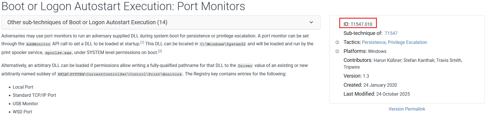  

Based on the information from MITRE ATT&CK, we can check this registry key in the SYSTEM hive. Standard port monitors include Appmon, Local Port, Microsoft Shared Fax Monitor, Standard TCP/IP Port, USB Monitor, and WSD Port. 

What we'll notice is that there is a suspicious "Printer" entry with the "Driver" value set to `\\google.gov\debug\spooler.dll`. This URL is suspicious as it masquerades as a legitimate government domain.  
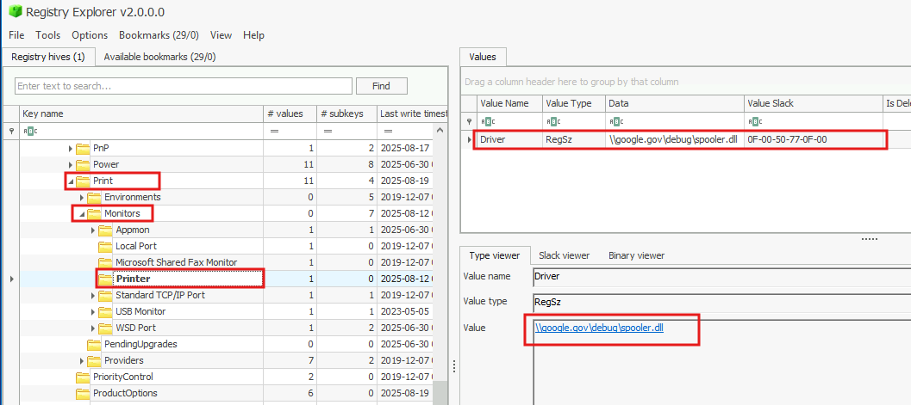  
## What is the full path of the malicious DLL configured to be loaded through the Print Spooler service?

As we previously identified, the full path is `\\google.gov\debug\spooler.dll`.  

## According to the event logs, how many failed attempts to load the persistence DLL were recorded due to the network path not being found?

To determine if the `spooler.dll` was successfully loaded, we can check the PrintService Admin event log, which records operational events related to the Print Spooler service. Upon opening the log file, there are a total of four recorded events. `3` of the four events show the error `The print spooler failed to load a plug-in module \\google.gov\debug\spooler.dll, error code 0x35.`.  
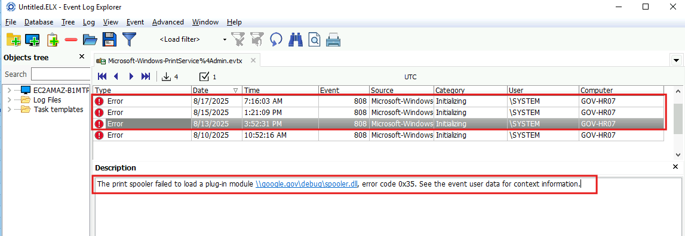  

According to [Microsoft](https://learn.microsoft.com/en-us/windows/win32/debug/system-error-codes--0-499-), error code `0x35` indicates that the network path was not found.  
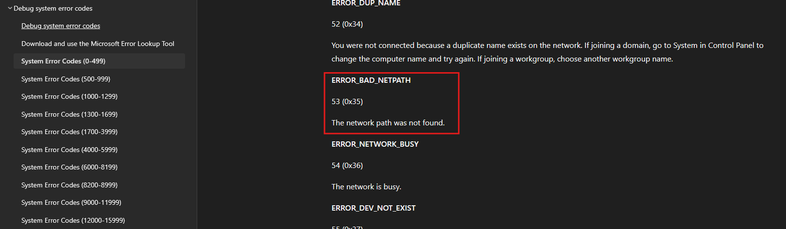  

# Privilege Escalation
---
## A few days later, the attacker dropped and executed an executable to enumerate possible privilege escalation paths on the machine. What is the filename of this executable?

The Shimcache, also called the Application Compatibility Cache (AppCompatCache), is used to keep track of all applications launched on the machine and it is stored in the SYSTEM hive. We'll check the Shimcache located under `HKLM\SYSTEM\CurrentControlSet\Control\Session Manager\AppCompatCache\AppCompatCache`.  

Upon examining this registry key, a suspicious file named `winPEASx64.exe` located in `C:\Users\yanis\AppData\Local\Temp\` was launched at 2025-08-12 04:44:30, 2 days later.   
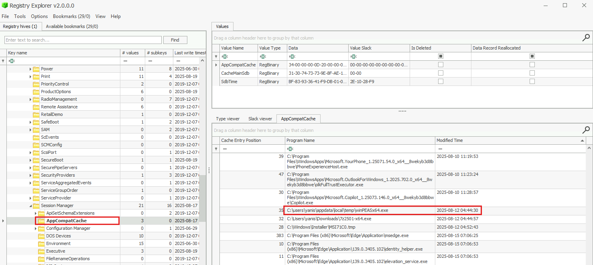  

From [Github](https://github.com/peass-ng/PEASS-ng), winPEAS is a tool that searches for possible local privilege escalation paths that can be exploited. Based on this information, the filename of the tool is `winPEASx64.exe`.  

## The attacker executed a privilege escalation technique by leveraging a Windows Installer file. What is the full path of this installer file?

To identify the Windows Installer file the attacker leveraged, we'll examine the Windows Application event logs, which records events related to software installation activities. In Event Log Explorer, set the "Source" to `MsiInstaller` to find Windows Installer service events.  
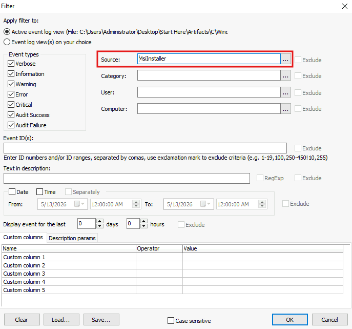  

Examining around the timeframe of winPEAS execution, at 2025-08-12 04:52:43, a suspicious Windows Installer file at `C:\Users\yanis\AppData\Local\Temp\ekYyxTyqUJQj.msi` was logged. Based on the randomly generated file name and its location in the `Temp` directory, this is a strong indicator that this installer is malicious.  
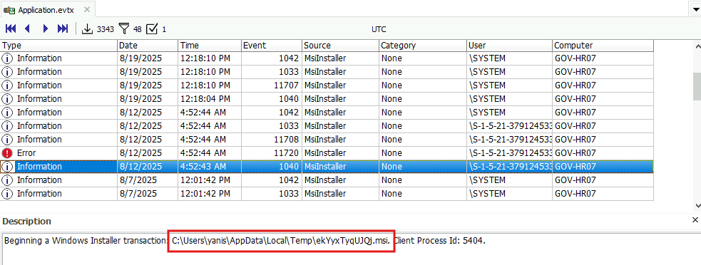  

## The attacker successfully gained higher privileges by installing software as SYSTEM. Which registry key needed to be enabled for both the user and the software?

From [Microsoft](https://learn.microsoft.com/en-us/windows/win32/msi/alwaysinstallelevated), the `AlwaysInstallElevated` policy is what allows any user to install Windows Installer packages with elevated (SYSTEM) privileges. The `AlwaysInstallElevated` registry value must be set to `1` (enabled) in both of the following locations:
- `HKEY_CURRENT_USER\Software\Policies\Microsoft\Windows\Installer`
- `HKEY_LOCAL_MACHINE\Software\Policies\Microsoft\Windows\Installer`

To verify this configuration on the compromised system, we can first check the SOFTWARE hive for the machine-wide settings. In the screenshot below, we can observe that the `AlwaysInstallElevated` value is set to `1` which enables machine-level policy.  
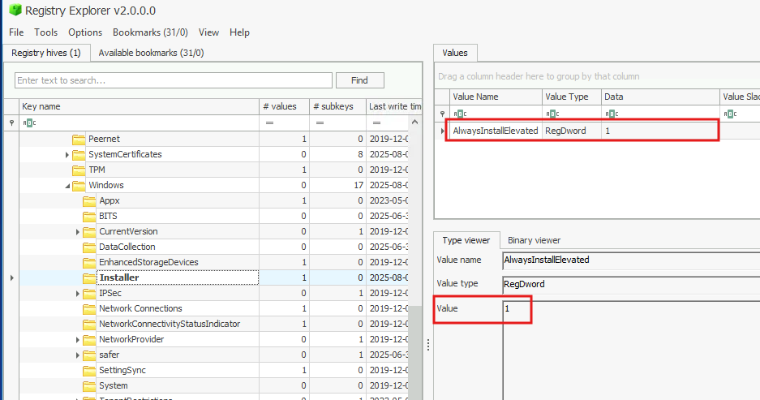  

To check user-level configuration, we'll check the `yanis` user's NTUSER.DAT hive. In the screenshot below, we can observe that the `AlwaysInstallElevated` value is set to `1` which enables user-level policy.  
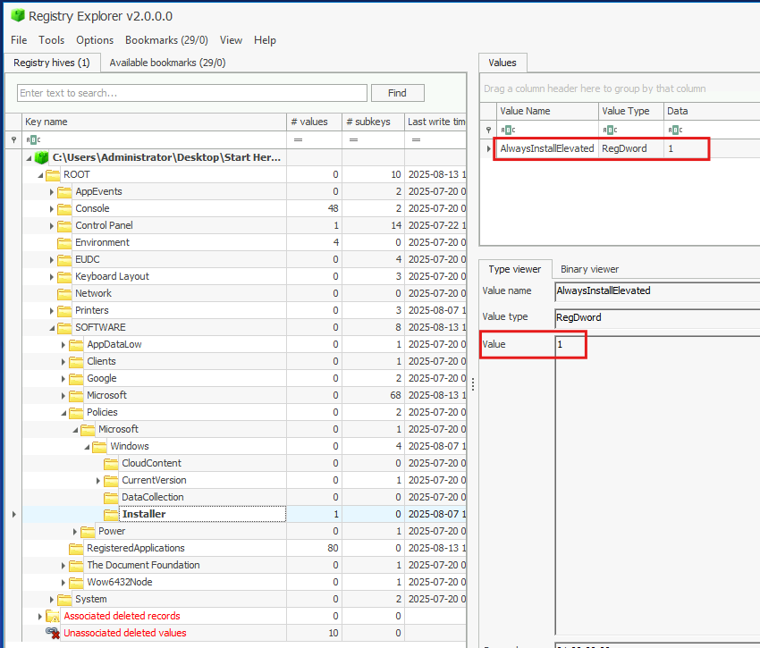  

Since these two registry locations are set to `1`, the registry key `AlwaysInstallElevated` was enabled on the compromised system, allowing the attacker to install with escalated privileges even though they only had access to a standard user account.  