# Lab Overview
---
**Lab:** [AndroidBreach Lab](https://cyberdefenders.org/blueteam-ctf-challenges/androidbreach/)  
**Platform:** CyberDefenders  
**Category:** Endpoint Forensics  
**Difficulty:** Medium  
**Tools:** ALEAPP, jadx, CyberChef, DB Browser for SQLite  

# Summary
---
This lab investigates a mobile device compromise caused by a malicious APK downloaded from an untrusted source. Analysis of the Android dump revealed that the user installed a trojanized application identified as `Discord_nitro_Mod.apk` which was obtained from a suspiciouc URL. This APK file contained a hidden keylogger package.  

Using the jadx tool to decompile the APK file showed that the malware captured sensitive user input, stored stolen data locally, and exfiltrated it via email using the `mailtrap.io` service over port 465. The attacker leveraged this functionality to collect credentials, including ones stored in the employee's notes app, and trasmit them to the attacker's email address.  

Further investigation into this malware indicated that it also encrypted images stored on the device using AES encryption. In addition evidence from the deivce showed that sensitive information like account credentials and credit card data was compromised.  

# Scenario
---
At BrightWave Company, a data breach occurred due to an employee's lack of security awareness, compromising his credentials. The attacker used these credentials to gain unauthorized access to the system and exfiltrate sensitive data. During the investigation, the employee revealed two critical points: first, he stores all his credentials in the notes app on his phone, and second, he frequently downloads APK files from untrusted sources. Your task is to analyze the provided Android dump, identify the malware downloaded, and determine its exact functionality.  

# Analysis
---
## What suspicious link was used to download the malicious APK from your initial investigation?

Given that we know the employee often downloads APK files from untrusted sources, we need to identify any URLs that seem suspicious. In ALEAPP, using the Chrome - Downloads report, I identified the URL `https://ufile.io/57rdyncx` to be the suspicious link. Based on the report, the Danger Type indicates that the downloaded file from this URL is dangerous, however, the employee bypassed this warning and validated it.  
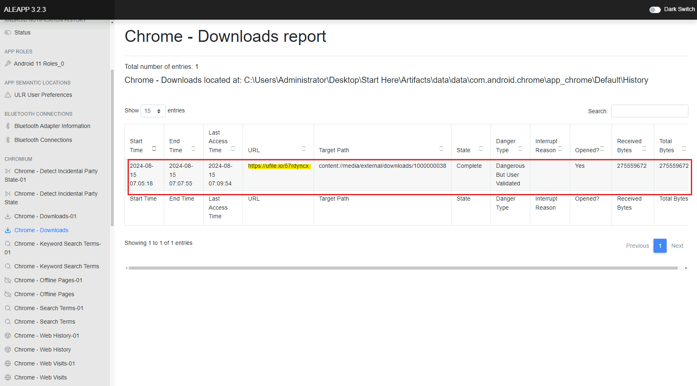  

## What is the name of the downloaded APK?

I investigated the Android dump files and found the downloaded APK `Discord_nitro_Mod.apk` located in the `data > media > 0 > Download` directory.   
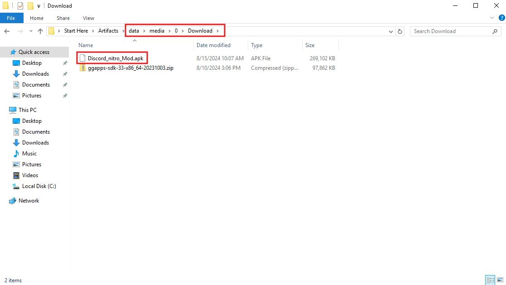  

## What is the malicious package name found in the APK?

To investigate into the malicious APK, I used jadx, a tool that reverse engineers APK files, to look into the `Discord_nitro_Mod.apk` file.  
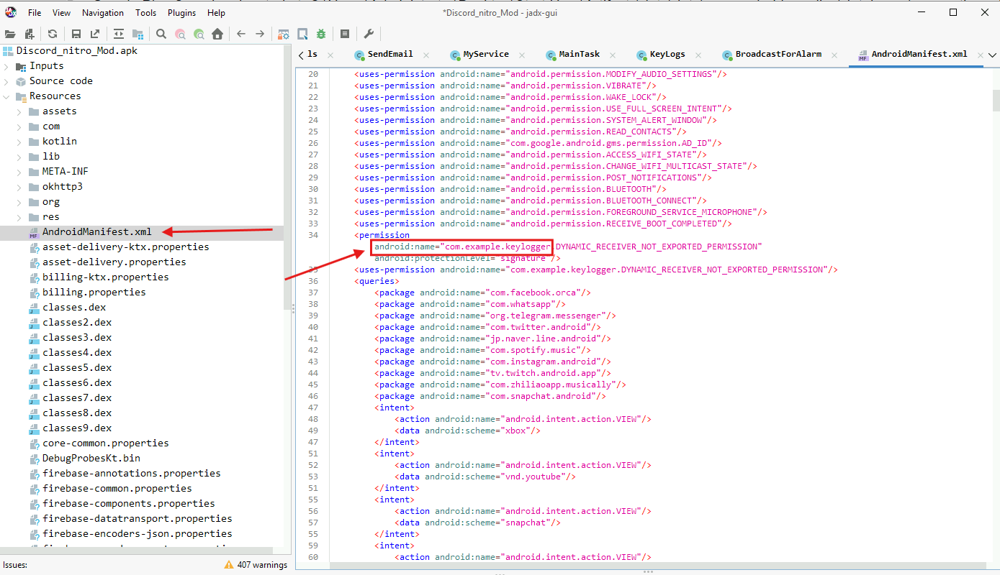  
From my analysis, I discovered a malicious package that is linked to a keylogger called `com.example.keylogger` in the AndroidManifest.xml file. The AndroidManifest.xml is located under the Resources folder in the APK file.  

## Which port was used to exfiltrate the data?

I further investigated the malicious package which is found in `Source code > com > example.keylogger` and discovered multiple malicious scripts in this package.  
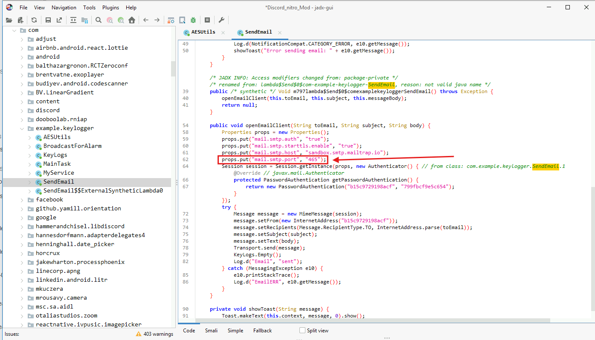  
From the screenshot above, in the SendEmail script, the `openEmailClient()` function is used to initialize the email client with basic configurations like the host and port to be used to send emails. In this function, I identified that the port `465` is used to set up the email client, which is used to exfiltrate data.  

## What is the service platform name the attacker utilized to receive the data being exfiltrated?

In the same `openEmailClient()` function, I identified it sets up the service platform `mailtrap.io`  to receive data being exfiltrated.  
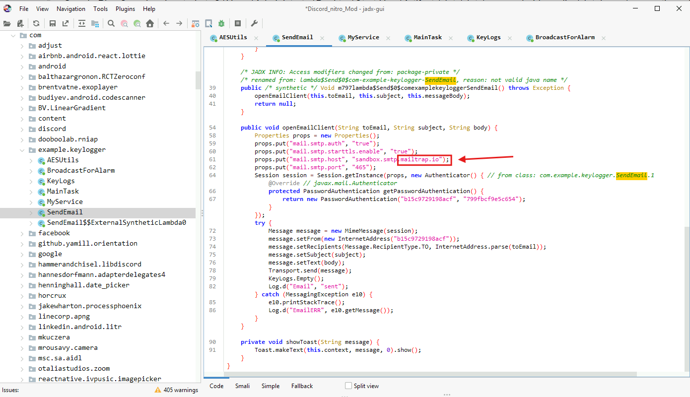  

## What email was used by the attacker when exfiltrating data?

To identify what email was used by the attacker, I digged through the other scripts and discovered the email `APThreat@gmail.com` in the BroadcastForAlarm script. This script appears to trigger a function that sends an email to `APThreat@gmail.com` with all keys logged on the compromised Android device.  
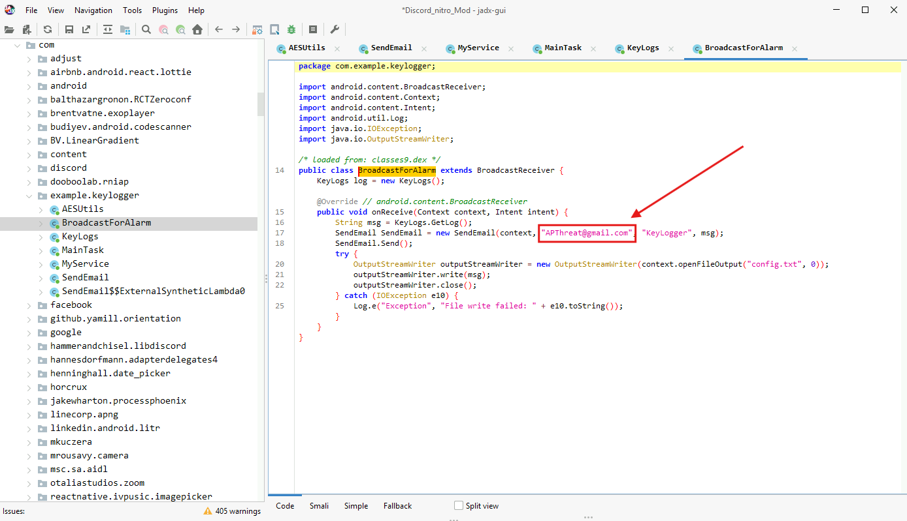  

## The attacker has saved a file containing leaked company credentials before attempting to exfiltrate it. Based on the data, can you retrieve the credentials found in the leak?

Based on the information provided about the employee, we know that they save all of their credentials in the notes app. The Recent Activity report in ALEAPP confirms this by showing that the employee recently accessed the notes app on 2024-08-15 at 15:26:50 and I can see a snapshot image that shows a note titled `Account Credentials`.  
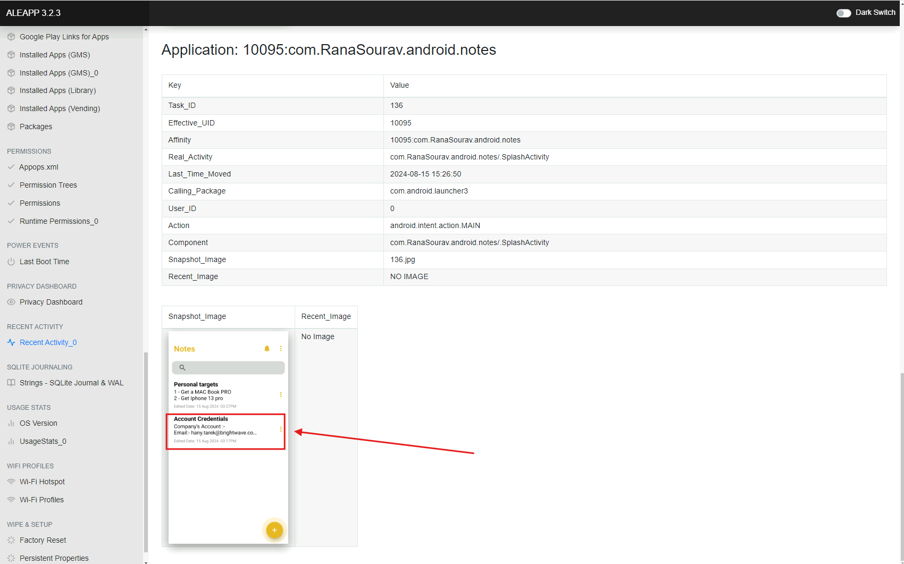  

I further investigated the Android dump files and discoverd the `notes_database.db` which contains a database of all notes on the Android device. I wanted to identify what credentials the employee has saved in the notes app then identify if the attackers had exfiltrated these credentials.  
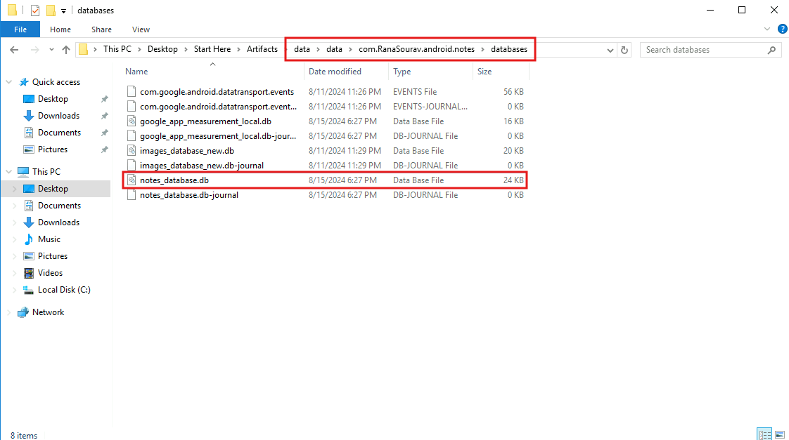  

Using DB Browser for SQLite, the `note_table` returned 3 rows and the row we are interested in is the Account Credentials note. Upon reading the `NOTE_BODY` of this note revealed all of the credentials the employee saved in this note.  
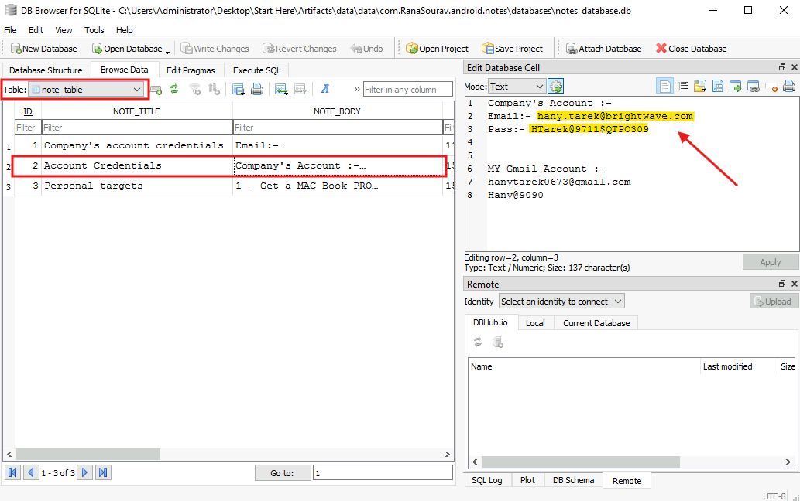  

Back in jadx and in the BroadcastForAlarm script, it appears that the script attempts to write the captured key logs to a text file called `config.txt`.  
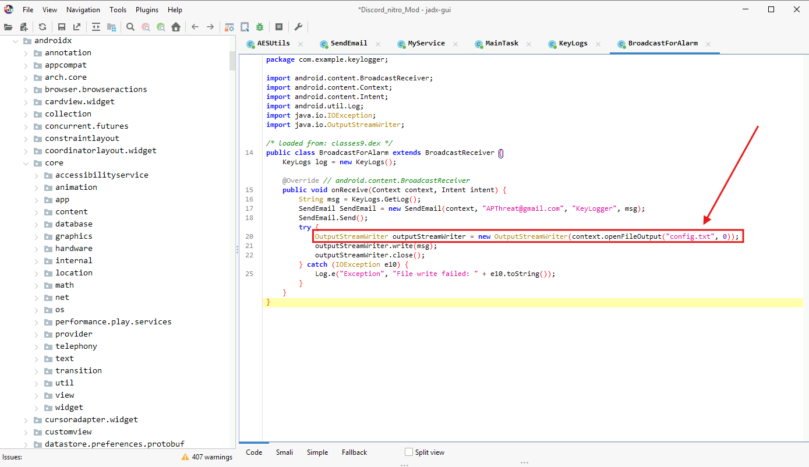  

Doing a search of the file `config.txt` in the Android dump revealed that it is located in the `data > data > com.discord > files` directory. The screenshot below shows the contents of the `config.txt` file after opening it, and we can confirm that the attacker had successfully captured the credentials stored by the employee.  
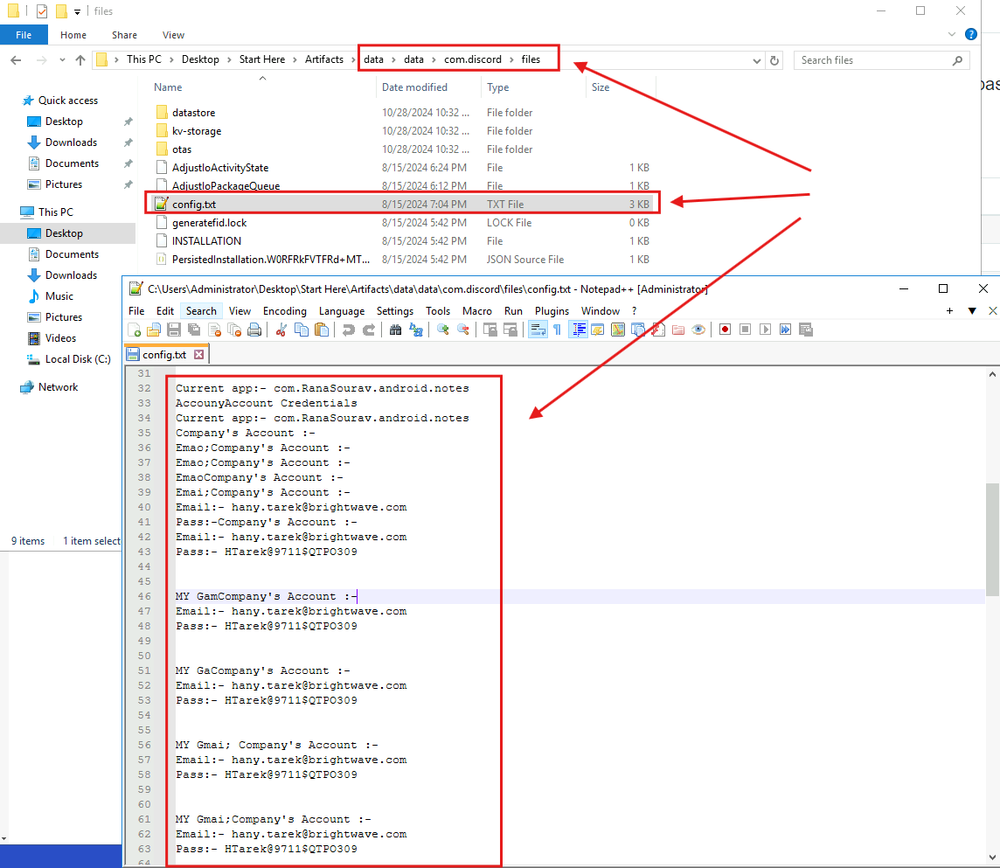  

## The malware altered images stored on the Android phone by encrypting them. What is the encryption key used by the malware to encrypt these images?

I further investigated into the keylogger package in APK file and found an encryption function in the MainTask script. The script appears to be using AES encryption with the base64-encoded key `OWJZJHdRNyFjVHo0NJVUWA==` to encrypt the images.  
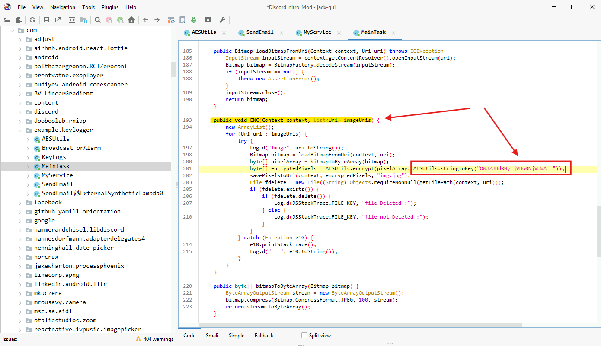  

Running this base64-encoded key through CyberChef and using the "From Base64" recipe decoded the key and revealed its human-readable form.  
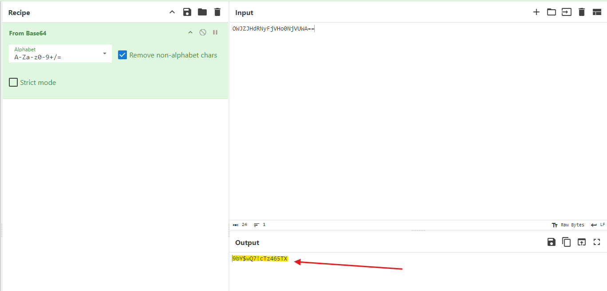  

## The employee stored sensitive data in their phone's gallery, including credit card information. What is the CVC of the credit card stored?

In the `data > media > 0 > Pictures > .aux` directory, I discovered a `.jpg` file which when opened revealed the CVC of a credit card.  
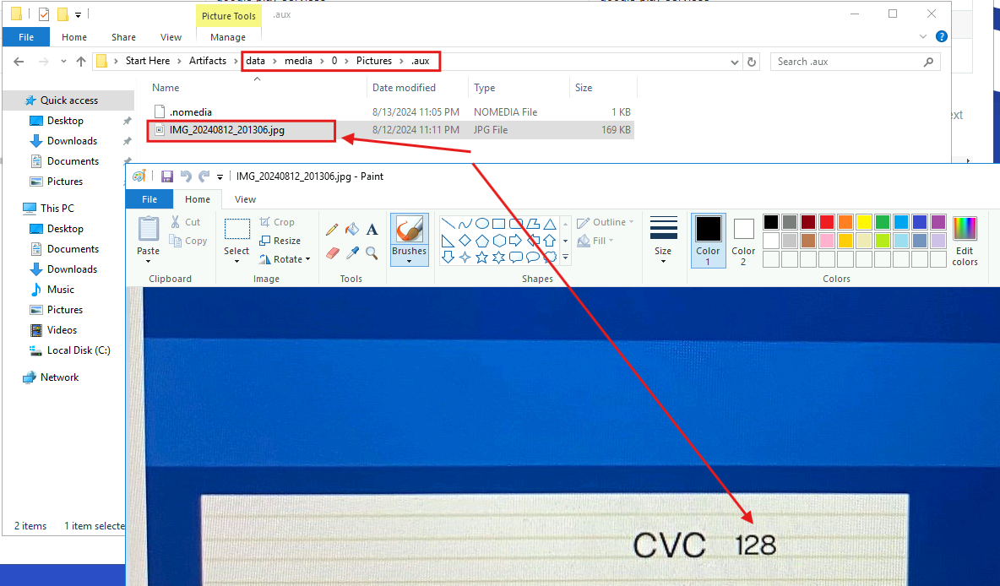  