# Lab Overview
---
**Lab:** [Andromeda Bot - UNC4210 Lab](https://cyberdefenders.org/blueteam-ctf-challenges/andromeda-bot-unc4210/)  
**Platform:** CyberDefenders  
**Category:** Endpoint Forensics  
**Difficulty:** Medium  
**Tools:** MemProcFS, EvtxECmd, Timeline Explorer, VirusTotal, ANY.RUN  

# Summary
---
Write a summary of the CTF challenge.

# Scenario
---
As a member of the DFIR team at SecuTech, you're tasked with investigating a security breach affecting multiple endpoints across the organization. Alerts from different systems suggest the breach may have spread via removable devices. You’ve been provided with a memory image from one of the compromised machines. Your objective is to analyze the memory for signs of malware propagation, trace the infection’s source, and identify suspicious activity to assess the full extent of the breach and inform the response strategy.

# Analysis
---
## Tracking the serial number of the USB device is essential for identifying potentially unauthorized devices used in the incident, helping to trace their origin and narrow down your investigation. What is the serial number of the inserted USB device?

To begin this investigation, we need to first mount the memory image using MemProcFS. Execution of the command below mounts the memory image to the "M" drive.  
```bash
.\memprocfs.exe -device ..\..\..\Artifacts\memory.dmp -forensic 3
```
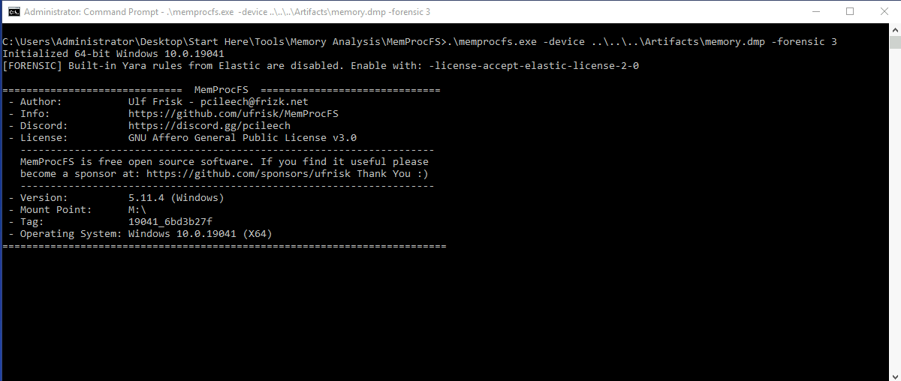  

Once mounted, we can examine the contents of the memory image. If we navigate to `M:\py\reg\usb`, MemProcFS presents USB related registry artifacts extracted from memory.   
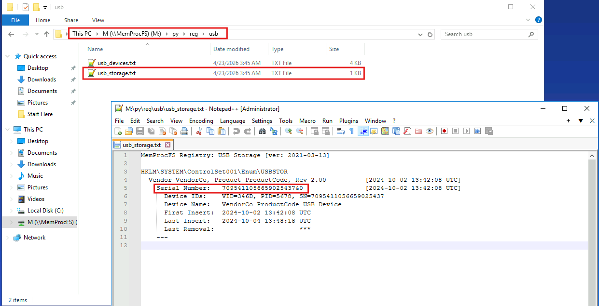  
Further examination of the `usb_storage.txt` file revealed details regarding the USB device that was inserted into the machine including the serial number `7095411056659025437&0`. It also lists where this information was extracted from, specifically `HKLM\SYSTEM\ControlSet001\Enum\USBSTOR`.  

## Tracking USB device activity is essential for building an incident timeline, providing a starting point for your analysis. When was the last recorded time the USB was inserted into the system?

In the same file, we see the last inserted timestamp is at `2024-10-04 13:48:18` UTC.  
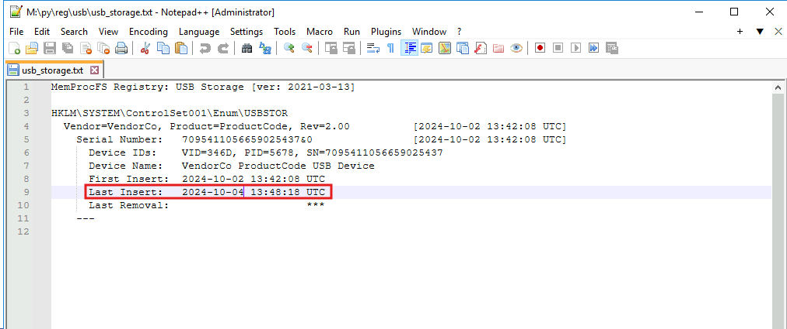  

## Identifying the full path of the executable provides crucial evidence for tracing the attack's origin and understanding how the malware was deployed. What is the full path of the executable that was run after the PowerShell commands disabled Windows Defender protections?

Navigate to `M:\misc\eventlog` to find Windows event log `evtx` files. Copy the `/eventlog` directory onto the C drive and we'll use the `findstr` tool to search for PowerShell, Sysmon, and Security logs.  
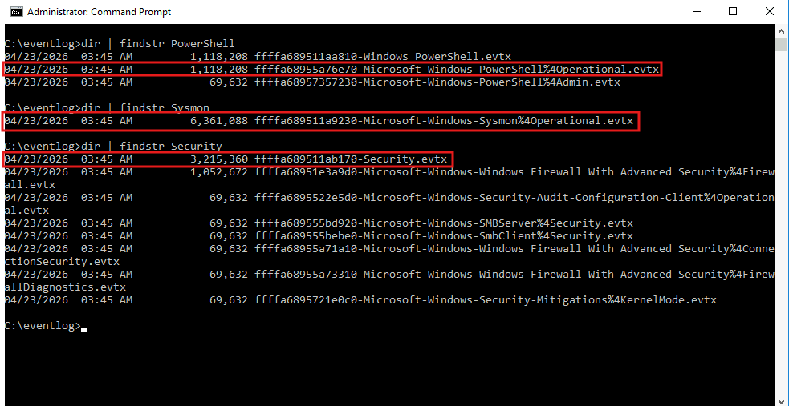  

To analyze the events in these logs, use Eric Zimmerman's `EvtxECmd` tool to extract and parse the `evtx` files to a csv file. Then, we can load up the csv files into Timeline Explorer for further analysis.  
```bash
Evtxecmd -f "EVTX_FILE_NAME" --csv "C:\Users\Administrator" --csvf "FILE_NAME.csv" 
```
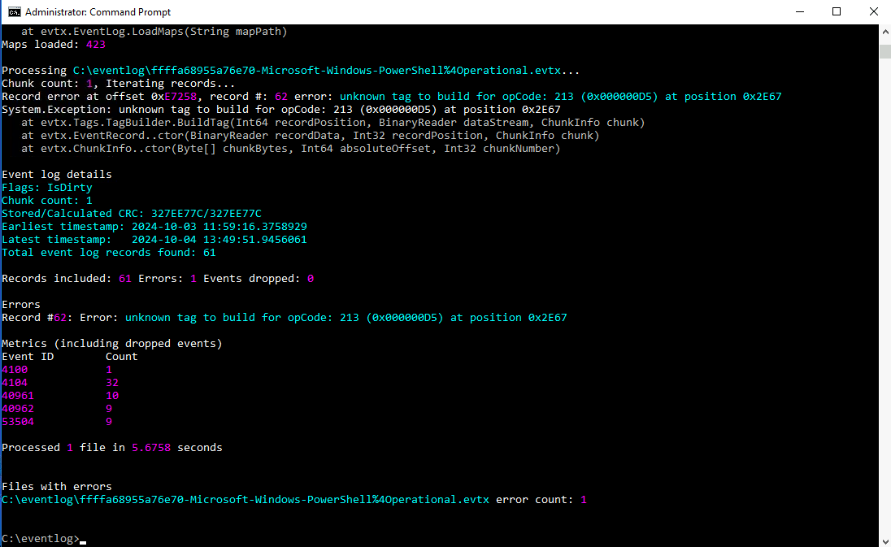  

Loading the Sysmon logs into Timeline Explorer reveals that there were no sysmon logs captured so we will disregard Sysmon logs. Next, we'll load Security logs into Timeline explorer. Group the logs by Event Id and apply the filter `Payload Data1 Contains powershell.exe` to narrow down our search.  
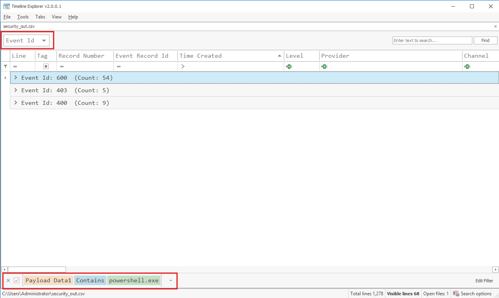  
In the screenshot above, the filter narrowed down to 3 event Ids: 600, 403, and 400. What we are looking for is the PowerShell commands that disabled Windows Defender protection and what time did the commands execute.  

Expanding Event Id 600, which indicates that PowerShell was loaded, we see that at the timestamp `2024-10-04 13:49:49`, PowerShell had executed a command to disable Windows Defender using the cmdlet `Set-MpPreference`.  
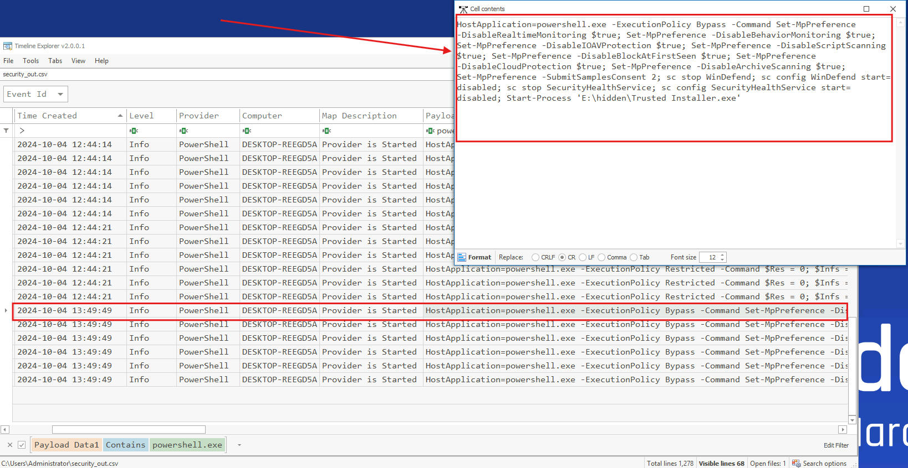  
In the same payload, we also see that after disabling Windows Defender protection, PowerShell attempted to start the process `E:\hidden\Trusted Installer.exe` using the `Start-Process` cmdlet. This combination of commands is highly suspicious and is likely malicious.  

## Identifying the bot malware’s C&C infrastructure is key for detecting IOCs. According to threat intelligence reports, what URL does the bot use to download its C&C file?

I had some trouble finding out the malware's C&C infrastructure. What I found is that I needed to use the `evtxecmd` tool and parse the entire eventlogs folder into a single csv file. By doing this, we can search through the entire logs instead of going through each `evtx` file.  
```bash
evtxecmd -d "eventlog" --csv "c:\users\administrator\evtx_out"
```

Open the csv file in Timeline Explorer then search for `Trusted Installer.exe`.  
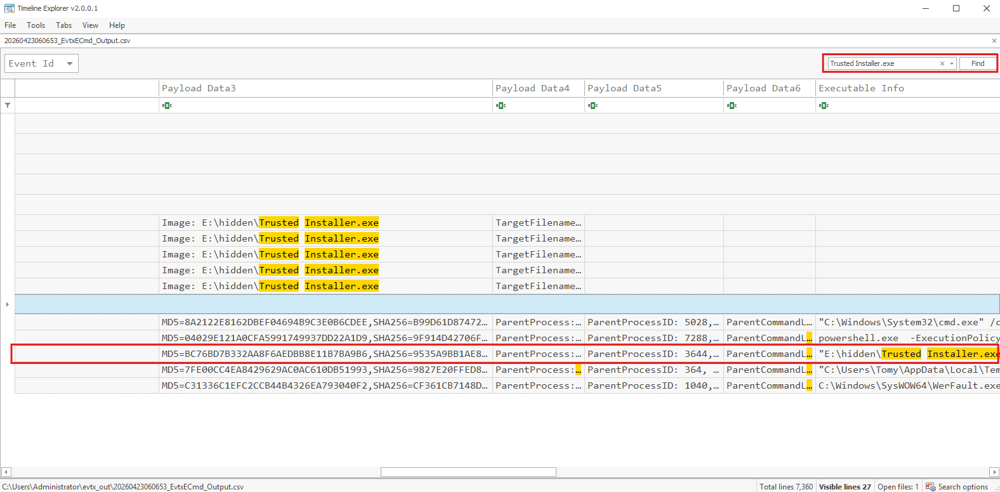  
In the screenshot above, event ID 1 (process creation) revealed the MD5 hash value for the `Trusted Installer.exe` executable file.  

Now, we will use this MD5 hash `BC76BD7B332AA8F6AEDBB8E11B7BA9B6` and analyze it through VirusTotal.  
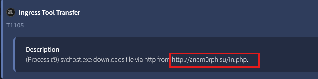  
Analysis of the MITRE ATT&CK matrix under the Behavior tab revealed that this malware uses technique T1105 as part of the Command and Control tactic to download files from the URL `http://anam0rph.su/in.php`. This is likely the attacker's C2 server.  

## Understanding the IOCs for files dropped by malware is essential for gaining insights into the various stages of the malware and its execution flow. What is the MD5 hash of the dropped .exe file?

In the same timeline view, we also see a suspicious executable file named `Sahofivizu.exe` located in the `Temp` directory of the user Tomy.  
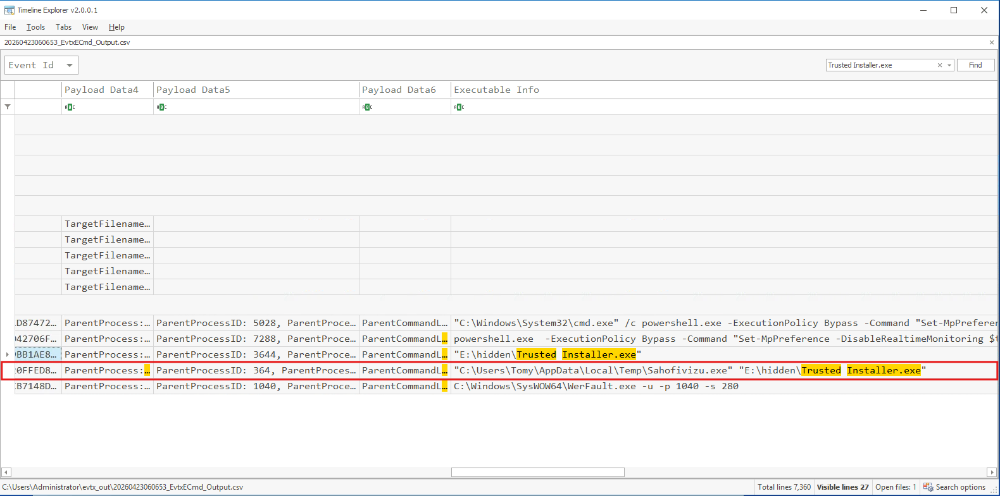  

In VirusTotal, we'll check if this file has any association to the malicious `Trusted Installer.exe` file. Under the Relations tab, we see the same file `Sahofivizu.exe` that has a detection rate of 41/72.  
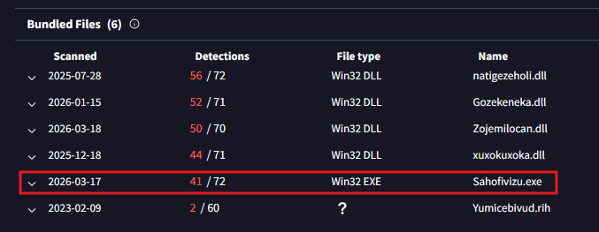  
Based on this evidence, it is likely that the the executable `Trusted Installer.exe` dropped the file `Sahofivizu.exe` onto the system.  

Click on the `Sahofivizu.exe` file to run an analysis on it then navigate to the Details tab to obtain its MD5 hash value `7fe00cc4ea8429629ac0ac610db51993`.  
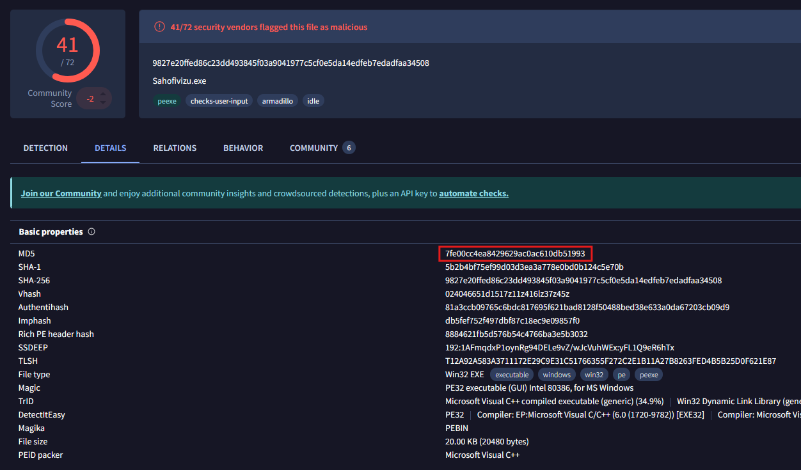  
## Having the full file paths allows for a more complete cleanup, ensuring that all malicious components are identified and removed from the impacted locations. What is the full path of the first DLL dropped by the malware sample?

In Timeline Explorer, we can observe event ID 11 (file creation) for the `Trusted Installer.exe` file and we'll see that it created multiple DLL files and dropped them in the `Temp` directory.  
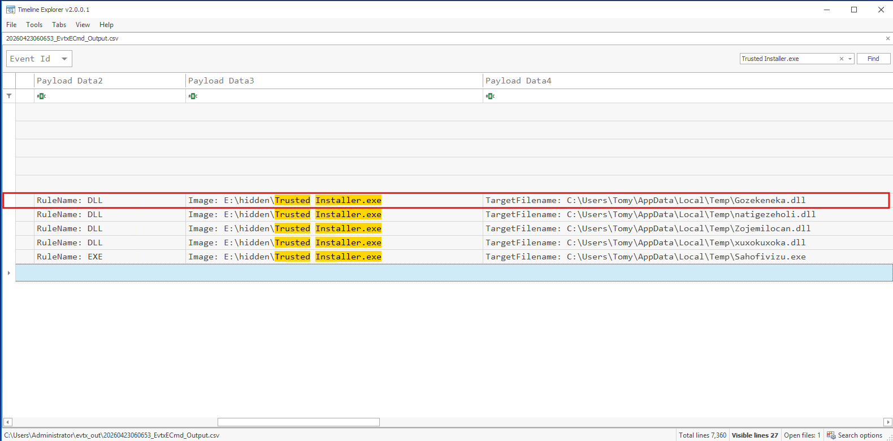  
In the screenshot above, the first DLL dropped by the malware is `C:\Users\Tomy\AppData\Local\Temp\Gozekeneka.dll`.  
## Connecting malware to APT groups is crucial for uncovering an attack's broader strategy, motivations, and long-term goals. Based on IOCs and threat intelligence reports, which APT group reactivated this malware for use in its campaigns?

From this [ANY.RUN](https://any.run/report/9535a9bb1ae8f620d7cbd7d9f5c20336b0fd2c78d1a7d892d76e4652dd8b2be7/c4d7a4f0-2e9a-44ab-b604-7d6f61430977) report, this malware is classified as the Andromeda malware.  
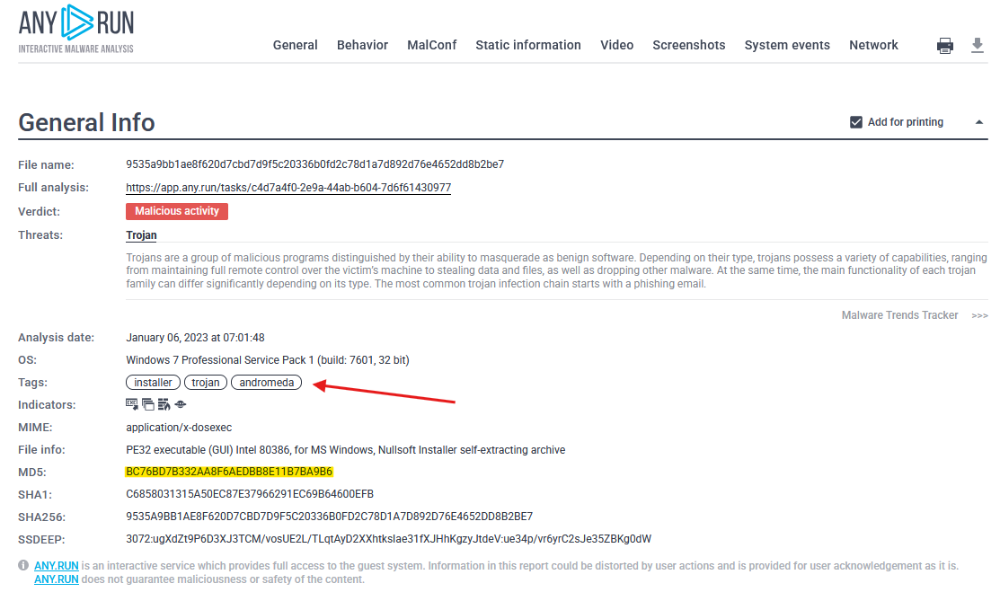  

Further research into the Andromeda malware reveals this [MITRE](https://attack.mitre.org/campaigns/C0026/) campaign report that details the campaign C0026 led by the `Turla` APT group.  
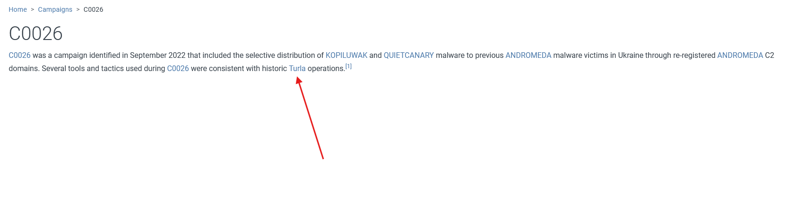  