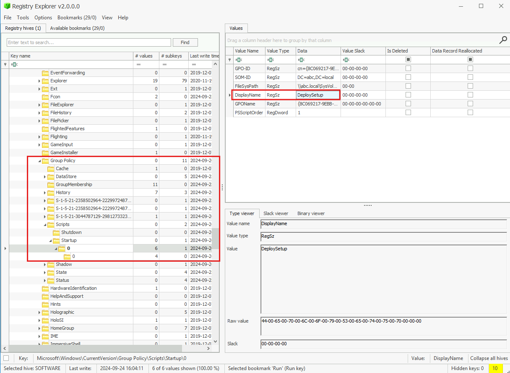
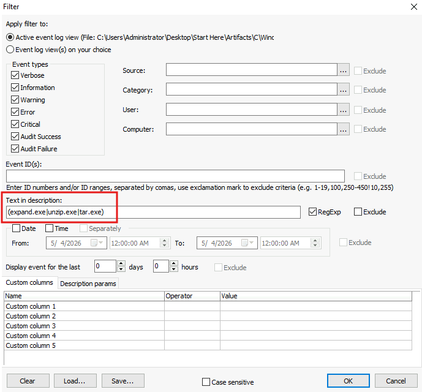
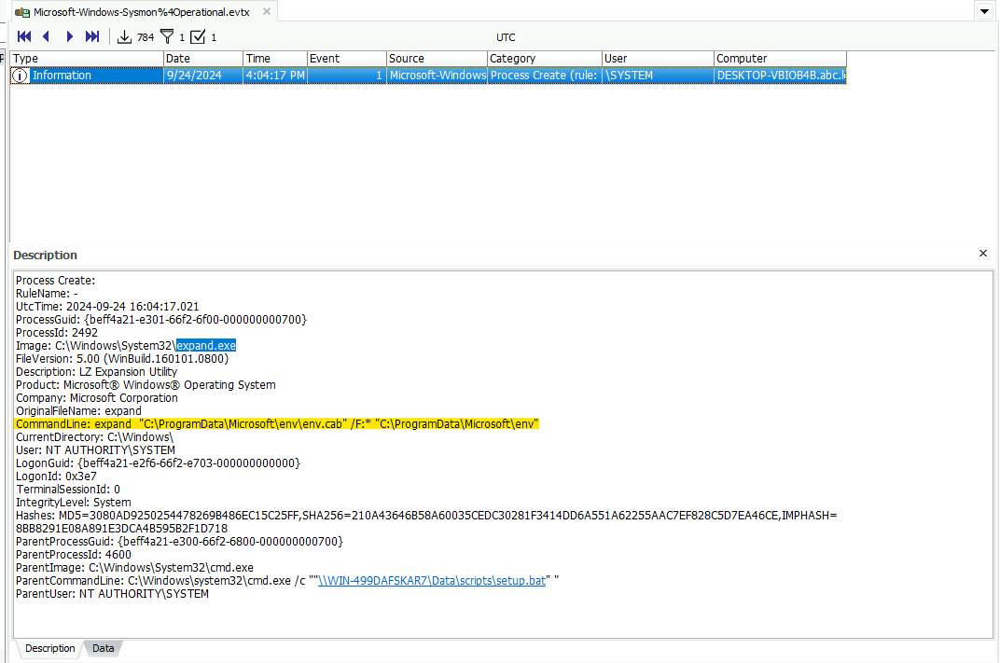
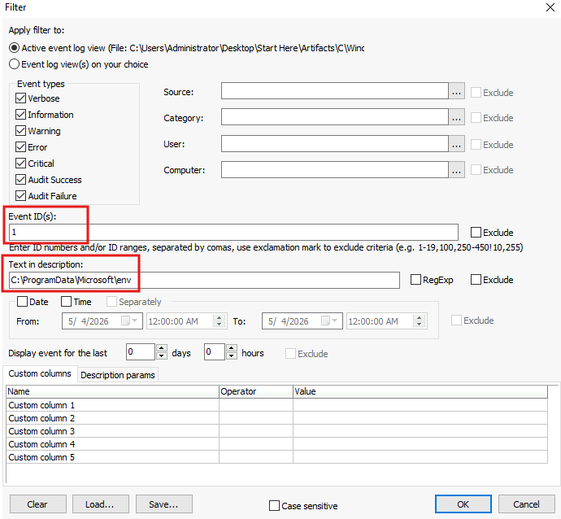
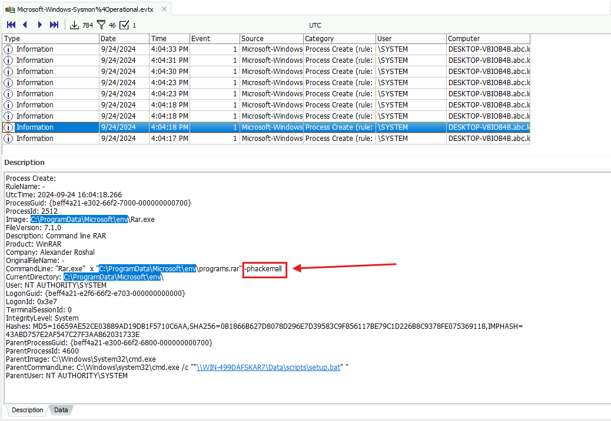
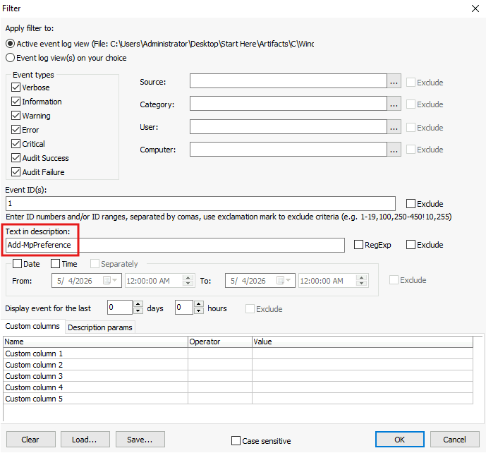
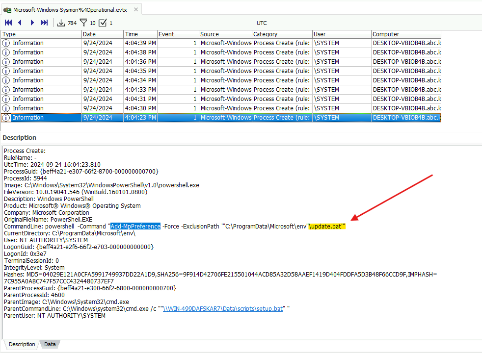
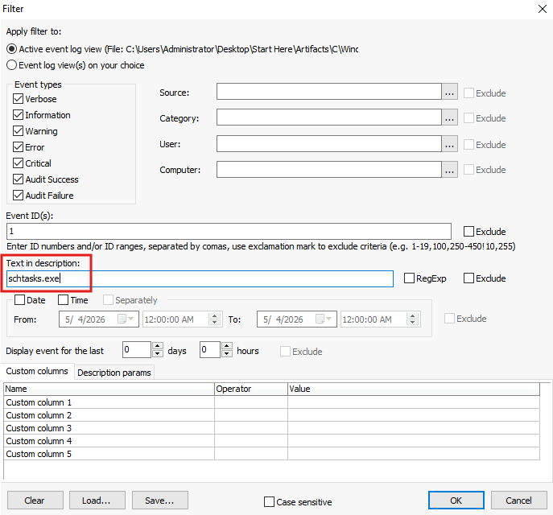
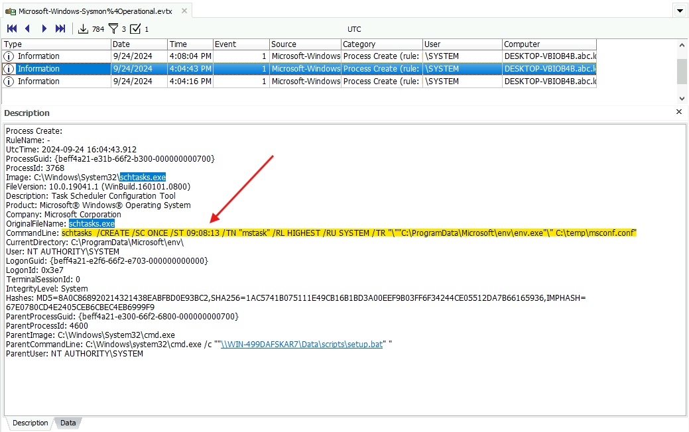
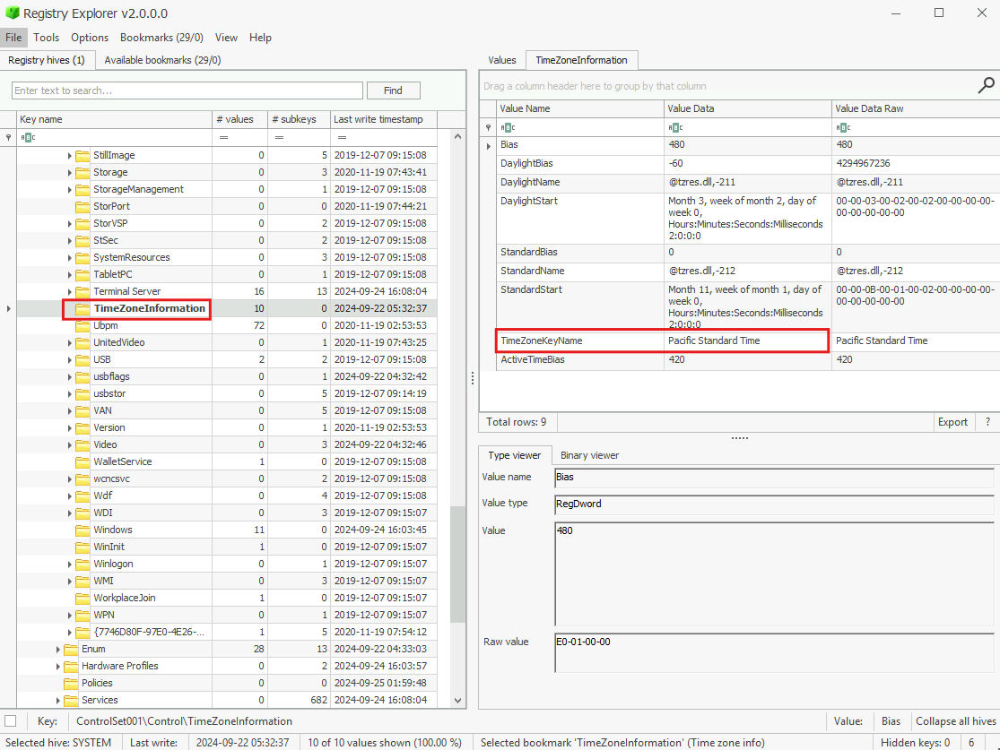

# Lab Overview
---
**Lab:** [MeteorHit - Indra Lab](https://cyberdefenders.org/blueteam-ctf-challenges/meteorhit-indra/)  
**Platform:** CyberDefenders  
**Category:** Endpoint Forensics  
**Difficulty:** Medium  
**Tools:** Registry Explorer, Event Log Explorer  

# Summary
---
This lab investigates the Indra wiper malware attack against a critical network infrastructure using KAPE triage artifacts including Windows registry hives and Sysmon event logs. The attacker leveraged Group Policy to execute a malicious batch script via the `DeploySetup` GPO, which expanded a password-protected archive `env.cab` containing staged malware components.

The malware added exclusions to Windows Defender for the executables `update.bat` and others to prevent antivirus detection before execution. A scheduled task named `mstask` was created with a 210-second delay to allow the malware time to prepare before executing. The wiper malware performed destructive actions including deleting the Windows Boot Manager, disjoining the computer from the domain via `wmic`, and locking the screen. USN journal analysis was used to trace file deletion activity on the NTFS volume.

# Scenario
---
A critical network infrastructure has encountered significant operational disruptions, leading to system outages and compromised machines. Public message boards displayed politically charged messages, and several systems were wiped, causing widespread service failures. Initial investigations reveal that attackers compromised the Active Directory (AD) system and deployed wiper malware across multiple machines.

Fortunately, during the attack, an alert employee noticed suspicious activity and immediately powered down several key systems, preventing the malware from completing its wipe across the entire network. However, the damage has already been done, and your team has been tasked with investigating the extent of the compromise.

You have been provided with forensic artifacts collected via KAPE SANS Triage from one of the affected machines to determine how the attackers gained access, the scope of the malware's deployment, and what critical systems or data were impacted before the shutdown.

# Analysis
---
## The attack began with using a Group Policy Object (GPO) to execute a malicious batch file. What is the name of the malicious GPO responsible for initiating the attack by running a script?

Initially, I had searched through event logs like Windows Group Policy Operational, Security, and System evtx, however, I was unable to find logs regarding this specific Group Policy Object.  

I pivoted to search through the Windows registry, specifically the SOFTWARE hive. Under `Microsoft\Windows\CurrentVersion\Group Policy\Scripts\Startup\0`, I identified the Group Policy Object named `DeploySetup` that executes the script `\\WIN-499DAFSKAR7\Data\scripts\setup.bat`.  
  

## During the investigation, a specific file containing critical components necessary for the later stages of the attack was found on the system. This file, expanded using a built-in tool, played a crucial role in staging the malware. What is the name of the file, and where was it located on the system? Please provide the full file path.

Windows has built-in tools like `expand.exe`, `unzip.exe`, and `tar.exe` that can be used to expand compressed files. To identify if the attacker expanded any files,  I pivot to searching through the Sysmon logs that contains any of the built-in tools in the description.  
  
  
The filter returned one event at 2024-09-24 16:04:17 showing the tool `expand.exe` was utilized to expand the file `env.cab` to the destination location at `C:\ProgramData\Microsoft\env`. This directory path is not a standard Windows directory and it is likely masquerading to appear legitimate.  

Based on this evidence, the file `C:\ProgramData\Microsoft\env\env.cab` is likely the staged malware that is being unpacked by the attacker.  

## The attacker employed password-protected archives to conceal malicious files, making it important to uncover the password used for extraction. Identifying this password is key to accessing the contents and analyzing the attack further. What is the password used to extract the malicious files?

Now that I know the location of the malware, I will search for activity, specifically Sysmon event ID 1, that occurred in this directory.  
  
  

The event that occurred at 2024-09-24 16:04:18 shows usage of the `rar.exe` (WinRAR) tool that attempts to extract the file `C:\ProgramData\Microsoft\env\programs.rar` using the password `hackermall`. The option `x` tells `rar.exe` to extract the given file, and the option `-p` supplies the password to the archive.  

## Several commands were executed to add exclusions to Windows Defender, preventing it from scanning specific files. This behavior is commonly used by attackers to ensure that malicious files are not detected by the system's built-in antivirus. Tracking these exclusion commands is crucial for identifying which files have been protected from antivirus scans. What is the name of the first file added to the Windows Defender exclusion list?

Continuing analysis of Sysmon event ID 1, now I'll refine the filter to find events that contains the keyword `Add-MpPreference`. This keyword is typically used along with PowerShell to make configuration changes to Windows Defender by changing its preferences.  
  

Since we know the malware activity occured around 2024-09-24 16:04:18, we'll search for events around that time.  
  

In the screenshot above, at 2024-09-24 16:04:23, the first file added to the Windows Defender exclusion list is identified as `update.bat`. The PowerShell command used the `-Force` option to force the changes and `-ExclusionPath` to add a file to Windows Defender exclusion list.   

## A scheduled task has been configured to execute a file after a set delay. Understanding this delay is important for investigating the timing of potential malicious activity. How many seconds after the task creation time is it scheduled to run? Note: Consider the system's time zone when answering questions related to time.

To check for scheduled task activity, I filtered for `schtasks.exe` which is a common tool used to create scheduled tasks.  
  

An event at 2024-09-24 16:04:43 shows a scheduled task `mstask` was created and set to start at time `09:08:13`.  
  

Now, I will check the timezone of the system being investigated to convert the scheduled task's time to UTC. The system's timezone information can be found in the registry at `SYSTEM\ControlSet001\Control\TimeZoneInformation`.  
  
In the screenshot above, the system's timezone is in Pacific Standard Time. Converting `9:08:13` PST to UTC gives the time `16:08:13` UTC.  

Since the scheduled task `mstask` was created at `16:04:43`, the difference between this time and `16:08:13` is 210 seconds which means that the task `mstask` is set to run 210 seconds after its creation.  

## After the malware execution, the wmic utility was used to unjoin the computer system from a domain or workgroup. Tracking this operation is essential for identifying system reconfigurations or unauthorized changes. What is the Process ID (PID) of the utility responsible for performing this action?

## The malware executed a command to delete the Windows Boot Manager, a critical component responsible for loading the operating system during startup. This action can render the system unbootable, leading to serious operational disruptions and making recovery more difficult. What command did the malware use to delete the Windows Boot Manager?

## The malware created a scheduled task to ensure persistence and maintain control over the compromised system. This task is configured to run with elevated privileges every time the system starts, ensuring the malware continues to execute. What is the name of the scheduled task created by the malware to maintain persistence?

## A malicious program was used to lock the screen, preventing users from accessing the system. Investigating this malware is important to identify its behavior and mitigate its impact. What is the name of this malware? (not the filename)

## The disk shows a pattern where malware overwrites data (potentially with zero-bytes) and then deletes it, a behavior commonly linked to Wiper malware activity. The USN (Update Sequence Number) is vital for tracking filesystem changes on an NTFS volume, enabling investigators to trace when files are created, modified, or deleted, even if they are no longer present. This is critical for building a timeline of file activity and detecting potential tampering. What is the USN associated with the deletion of the file msuser.reg?

