# Lab Overview
---
**Lab:** [XMRig Lab](https://cyberdefenders.org/blueteam-ctf-challenges/xmrig/)  
**Platform:** CyberDefenders
**Category:** Endpoint Forensics  
**Difficulty:** Medium  
**Tools:** losetup, mount, strings, Photorec, ANY.RUN  

# Summary
---
This lab involves forensic analysis of a compromised Linux server using a disk image to investigate unauthorized access and cryptominer deployment. By mounting the disk image and analyzing bash history files, the attacker's activity was reconstructed — they created a new privileged user `noah`, configured a cron job for persistent execution of the mining payload, and attempted to erase traces by deleting bash history and authentication logs.

The malicious file `backup.elf` was identified as XMRig, a Monero cryptocurrency miner, downloaded from the attacker's server. Deleted `auth.log` files were recovered using Photorec, which revealed a brute-force SSH attack from `192.168.19.147` and subsequent successful authentication. Further investigation showed the attacker exfiltrated the `passwd` file via `scp` and configured persistent sudo access without repeated authentication prompts by modifying the `/etc/sudoers` file.

# Scenario
---
During routine security audits at a startup, the SOC team detected unusual activity on Linux servers in the company’s infrastructure, including unexpected configuration changes and unfamiliar files in critical system directories. These anomalies suggest possible unauthorized access and raise concerns about the integrity of the server environment.  

You received a disk image from one of the affected servers for forensic analysis. Your objective is to determine if a compromise has occurred, identify any tactics or tools used by a potential attacker, assess the scope and impact of the incident, and recommend mitigation strategies to safeguard against future breaches.  

# Background
---
What is XMRig?

# Analysis
---
## Assigning high-level privileges to a new user is essential in the attack chain, as it enables the attacker to execute commands with administrative access, ensuring persistent control over the system. What command did the attacker use to grant elevated privileges to the newly created user?

Given the disk image file, we need to mount this disk image to perform forensic examination. First, attach the disk image to a loop device by running the command below:  
```bash
sudo losetup -fP disk_image.img
```

Validate loop device's creation by running the command below:  
```bash
lsblk
```
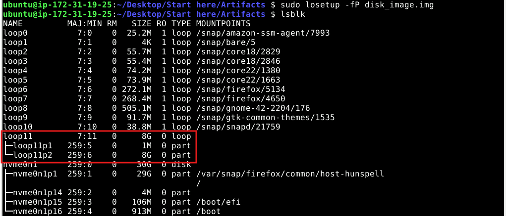  

Next, mount the filesystem by running the command below:  
```bash
sudo mount -o ro,noload /dev/loop11p2 /mnt/evidence_mount
```
- The `ro,noload` option sets the filesystem to read-only and prevent any journals from replaying in order to preserve file integrity.  
- The `/mnt/evidence_mount` directory must exist before mounting.  

Now that the filesystem is mounted, we can begin the investigation. First, let's take a look at what user directories are available on this disk image by running the command below:  
```bash
ls ./home
```

There are two user directories: `noah` and `ubuntu`. Let's further investigate the `ubuntu` directory and look at its `.bash_history`, which logs all commands previously executed by that user.  
```bash
cat ./home/ubuntu/.bash_history
```
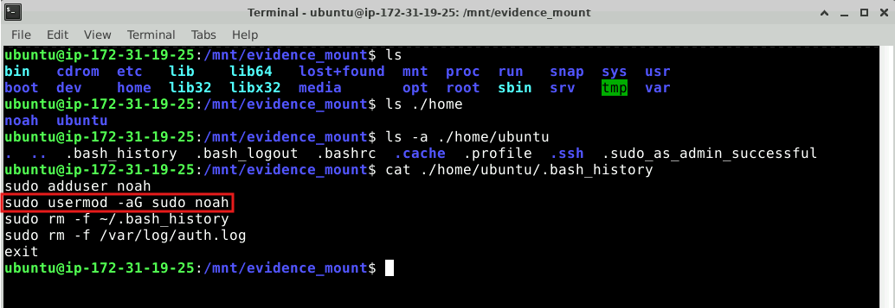  
In the screenshot above, the `.bash_history` shows the user `ubuntu` first added the user named `noah` by running the command `sudo adduser noah`, then granted elevated privileges to `noah` by running the command `sudo usermod -aG sudo noah`. In addition, they attempted to erase their traces by executing the commands `sudo rm -f ~/.bash_history` and `sudo rm -f /var/log/auth.log`.  

## Understanding the commands used by the attacker to cover their traces is essential for identifying attempts to hide malicious activity on the system. What is the second command the attacker used to erase evidence from the system?

As we previously identified in the user's `ubuntu` bash history, the attacker attempted to run the command `sudo rm -f /var/log/auth.log` to erase evidence pertaining to security authentications from the system.  

## Identifying the configuration added or modified by the attacker for persistence is essential for detecting and removing recurring malicious activities on the system. What configuration line did the attacker add to one of the key Linux system files for scheduled tasks to ensure the miner would run continuously?

First, we will check the system-wide configuration cron located in `/etc/crontab` and `/etc/cron.d/`. Upon examining both of these locations reveal no suspicious configurations.  

Let's now check the user-specific tables in `/var/spool/cron/crontabs/`. There is a single `root` file in this directory, and upon viewing the configuration file we see a suspicious configuration `0 * * * * /tmp/backup.elf >/dev/null 2>&1`.  
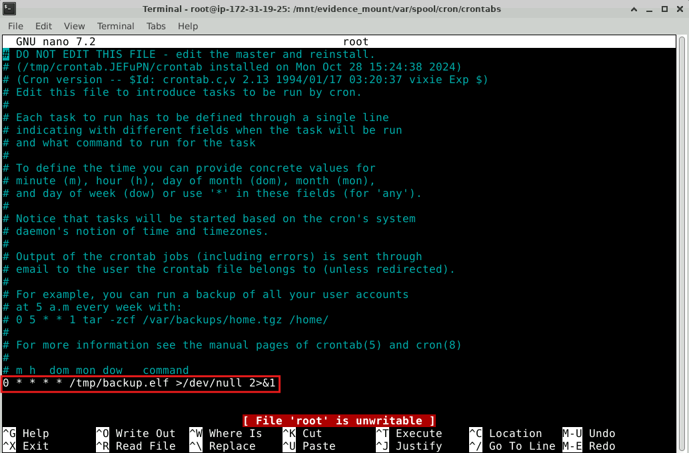  
This configuration essentially tells `/tmp/backup.elf` to run every hour (`0 * * * *`) and redirect both standard output `stdout` and standard error `stderr` to `/dev/null`. When `/tmp/backup.elf` runs, it silences any output or error messages the process might produce.  

## Identifying the hash of the malicious file is crucial for confirming its uniqueness and tracking its presence across systems. What is the MD5 hash of the file dropped by the attacker with mining capabilities?

Using the `md5sum` tool, we can obtain the MD5 hash of the file `/tmp/backup.elf`.  
```bash
md5sum ./tmp/backup.elf
```
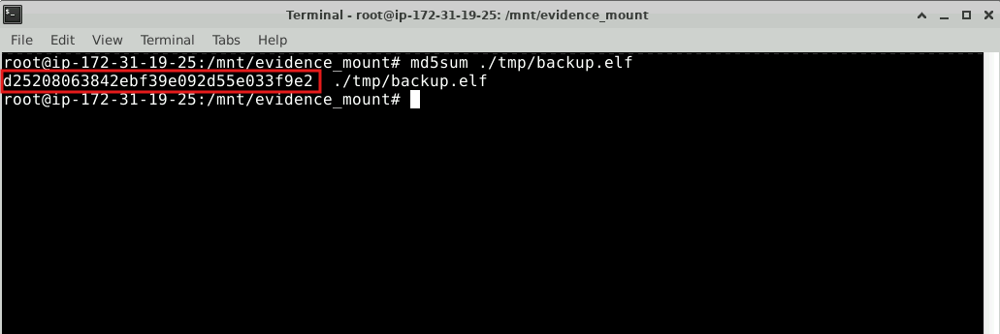  
The output shows the hash value `d25208063842ebf39e092d55e033f9e2` belongs to the `backup.elf` file.  

## Knowing the original name of a malicious file helps link it to known malware families and provides valuable insights into its behavior. According to threat intelligence reports, what is the original name of the miner?

Take the MD5 hash value of `backup.elf` and use Google dorking to find any information relating to this hash value.  
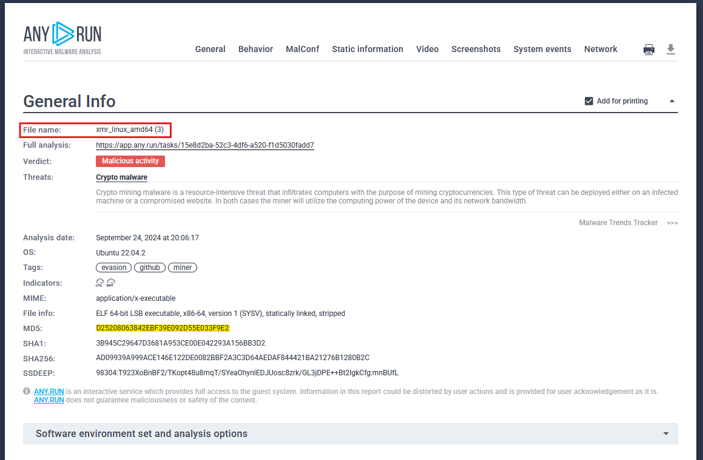  
Based on this [ANY.RUN](https://any.run/report/ad09939a999ace146e122de0082bbf2a3c3d64aedaf844421ba21276b1280b2c/15e8d2ba-52c3-4df6-a520-f1d5030fadd7) report, the original file name for this malicious file is identified as `xmr_linux_amd64 (3)`. This information is located in the "General Info" of the ANY.RUN text report. We also see that this malicious file is categorized as a `Crypto malware` suggesting that it is likely associated with `XMRig`, a popular Monero cryptocurrency mining software.  

## Understanding the attacker's actions is crucial for tracing how malicious files were introduced to the system. The attacker successfully executed a command to download and save the miner on the compromised Linux system. What was the exact file path on the attacker's server where the malicious miner was hosted?

Previously, we identified that the attacker executed the command `sudo rm -f ~/.bash_history` as an attempt to cover their traces. However, they missed clearing the `root` directory's bash history.  

Next, we'll investigate the `root` directory, specifically the `.bash_history` file.  
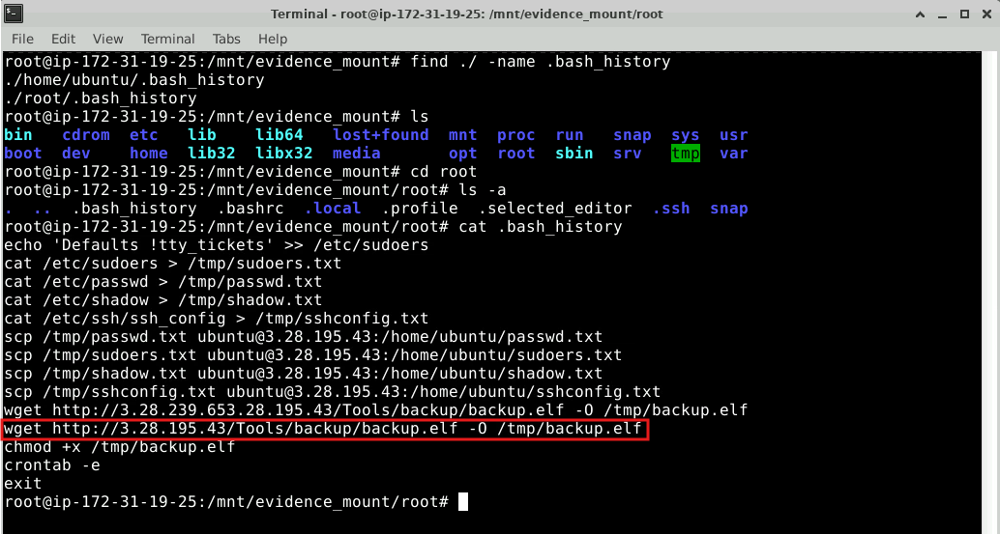  
Upon examining the `.bash_history` file for the root user revealed multiple suspicious command executed. One of the commands show the attacker executed `wget` to download the malware from their server at `http://3.28.195.43/Tools/backup/backup.elf` and saved it to `/tmp/backup.elf`.  

##  To understand which sensitive information was accessed and transferred from the compromised system, it’s essential to identify the files exfiltrated by the attacker. What is the full path on the attacker’s remote machine where the exfiltrated passwd file was saved?

Further analysis of the `.bash_history` file for the root user revealed that the attacker utilized the `scp` tool, commonly used for secure file transfers, to exfiltrate the `passwd` file.  
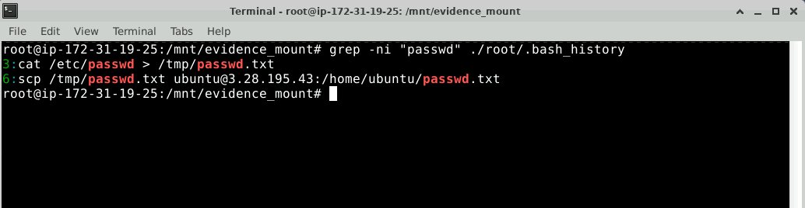  
In the screenshot above, the attacker first saved the `passwd` file on the system to `/tmp/passwd.txt`. Then, the attacker used `scp` to transfer the `/tmp/passwd.txt` file to their server at `ubuntu@3.28.195.43:/home/ubuntu/passwd.txt`.  

## Understanding how the attacker maintained elevated privileges without repeated permission prompts is essential for uncovering their methods of persistent access. What command did the attacker use to configure continuous privilege escalation without requiring repeated permission?

In the same `.bash_history` file, we see the first command executed `echo 'Defaults !tty_tickets' >> /etc/sudoers`, which disables TTY authentication tickets and appends it to the `/etc/sudoers` file.  
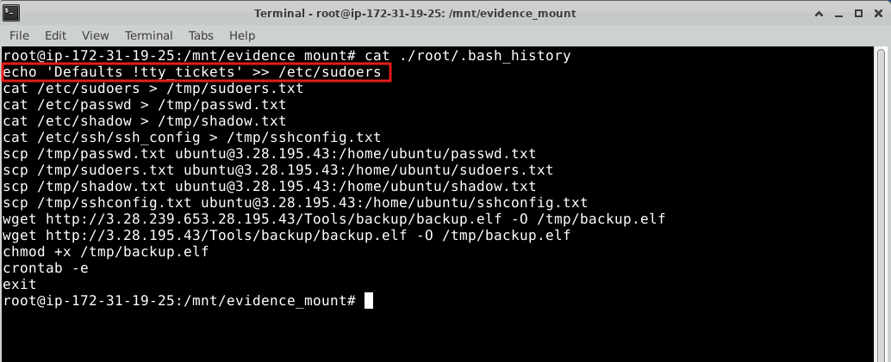  
This command allows authentication to be shared across terminals so the attacker will not need to repeat entering in the sudo password.  

## Identifying the source IP address used for lateral movement is essential for tracing the attacker's path and understanding the extent of the compromise. What is the IP address of the machine the attacker used to perform lateral movement to this Linux box?

To identify any IP addresses the attacker used, we need to examine the `auth.log` files, however, we previously saw that the attacker executed the command `sudo rm -f /var/log/auth.log`. We need to restore this file using the `Photorec` tool.  

First, run the command below to create a directory for our recovered data.  
```bash
sudo mkdir /home/ubuntu/recovered_data
```

Run the command `photorec disk_image.img`.  
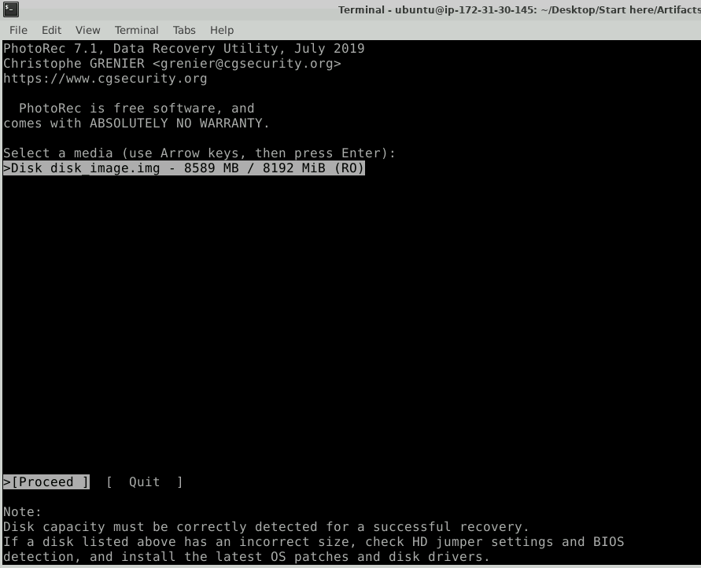  
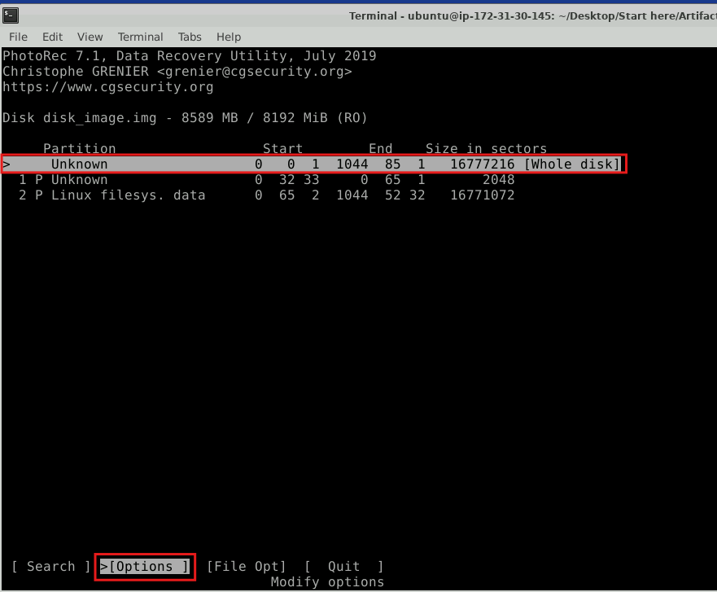  
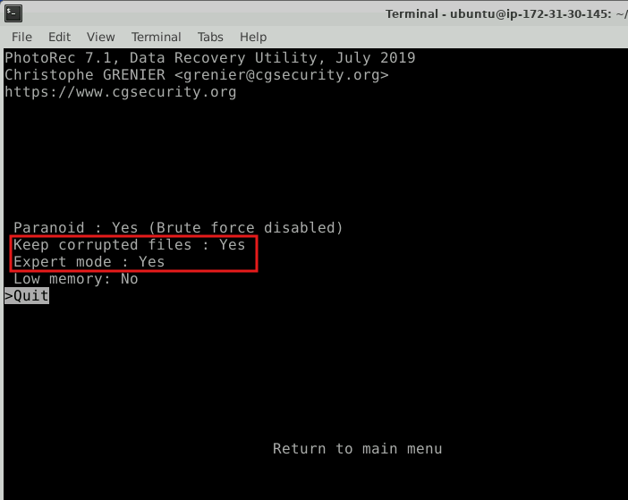  
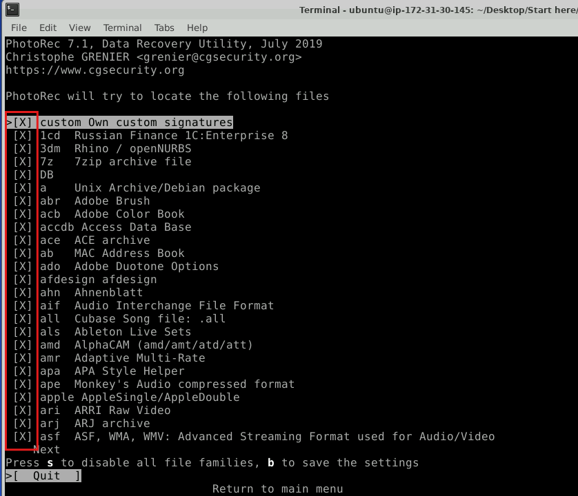  
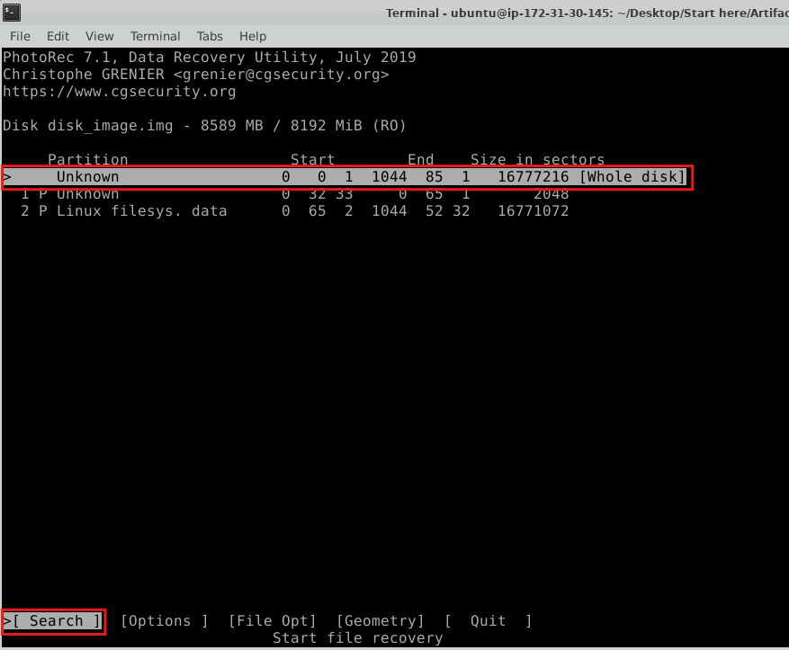  
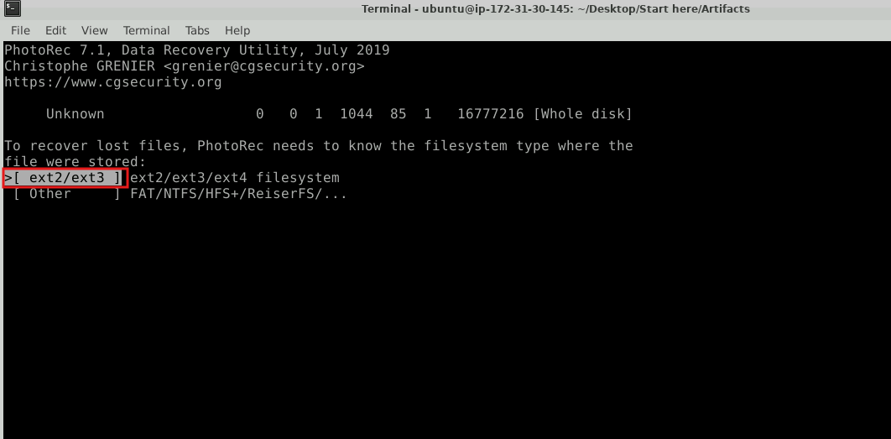  

Make sure to enter the new directory then hit the `C` key to confirm.  
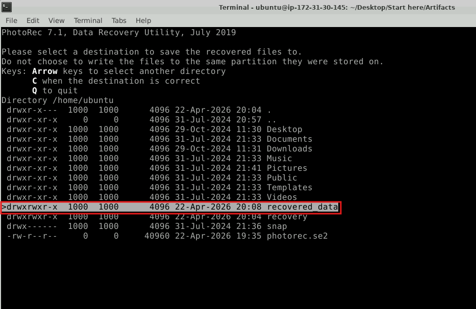  
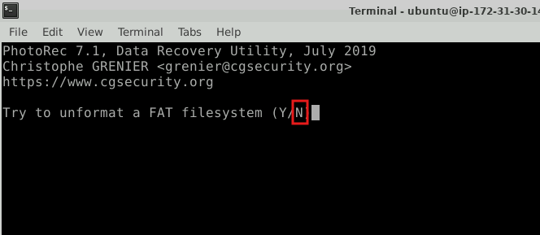  
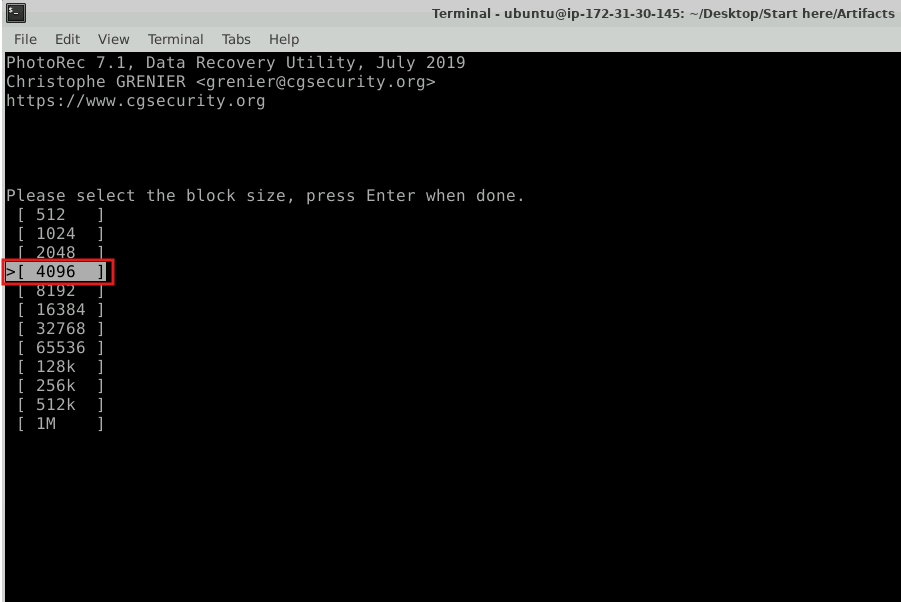  
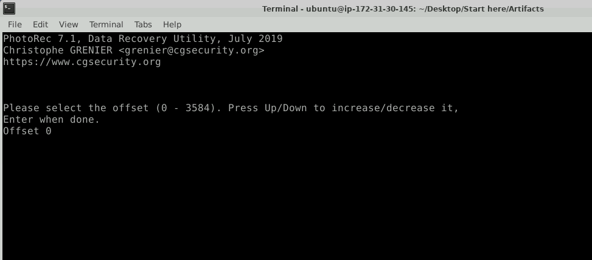  

Once the recovery is complete, let's search through the `recovered_data` directory and see what we can find. While in the `recovered_data` directory, run the command below to search for the `auth.log` file.  
```bash
grep -r "auth.log" .
```
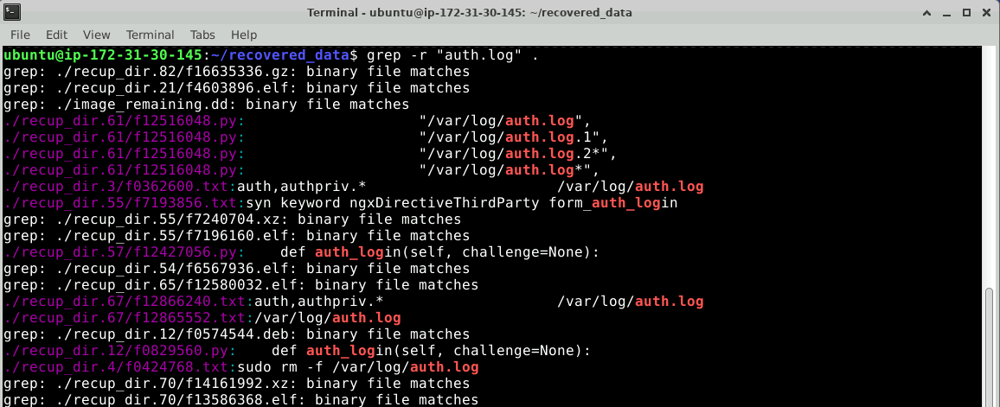  

There still seems to be a lot of files based on our search. Let's revise our search and instead search for "Failed password" to check for failed login activity.  
```bash
grep -r "Failed password" .
```
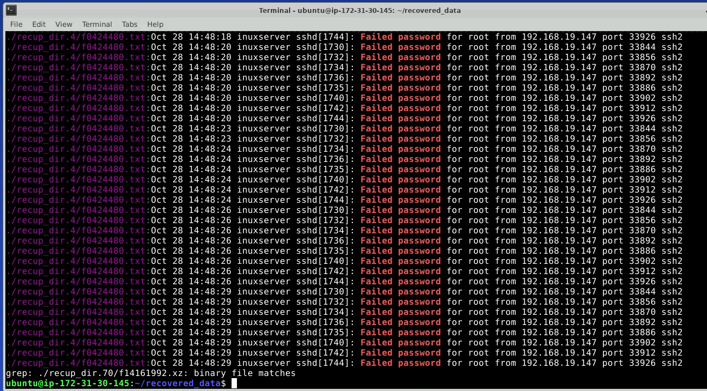  
This search result outputted multiple failed password attempts for the root user from IP address `192.168.19.147` within a very short timeframe. This highly indicates a brute-force attack.  

Let's now search to see if the IP address `192.168.19.147` was successful at logging into the root user account.  
```bash
grep -r "Accepted password" .
```
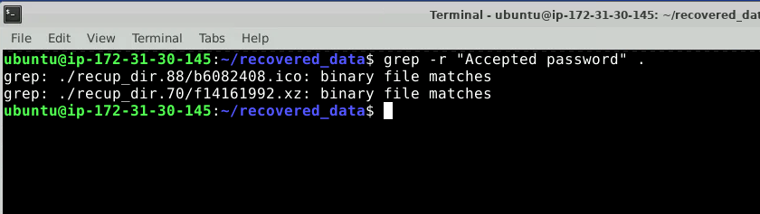  

Two files seem to have matched. Run the commands below to convert the files into human-readable format then search for the "Accepted password" string.  
```bash
strings ./recup_dir.88/b6082408.ico | grep "Accepted password"
strings ./recup_dir.70/f14161992.xz | grep "Accepted password"
```
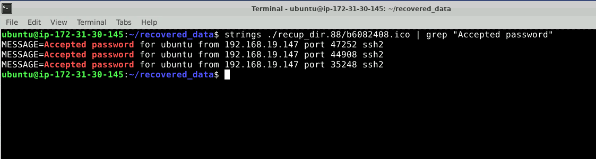  
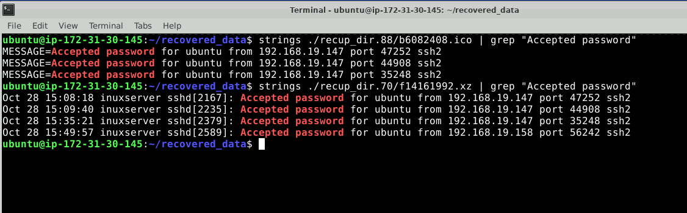  
Based on this result, we can conclude that the IP address `192.168.19.147` was successful in logging into the user account `ubuntu`.  

## Identifying the first username targeted by the attacker in their brute-force attempts offers insight into their initial access strategy and target selection, as the attacker attempted to access two different accounts. What was the first username the attacker targeted in these brute-force attempts?

As we previously identified, the `root` user account was targeted in the brute-force attack.  
## Determining the timestamp of the attacker’s final login is crucial for identifying when they last accessed the system to hide their activities and erase evidence. What is the timestamp of the last login session during which the attacker cleared traces on the compromised machine?

In the `./recup_dir.70/f14161992.xz` file, the timestamp of the last login session made by the attacker is on October 28 at `15:35:21` from IP address `192.168.19.147`.  
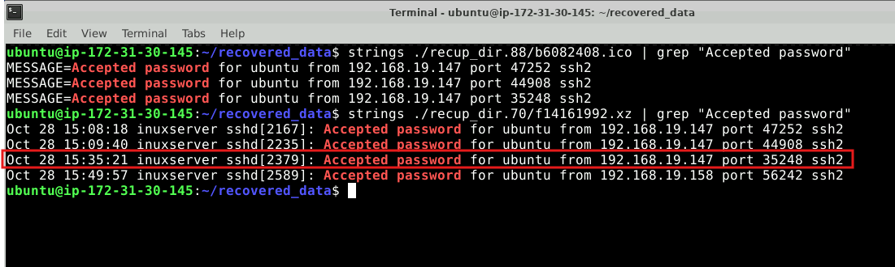  

## During the attacker’s SSH session, they used a command that mistakenly saved their activities to the hard drive rather than keeping them in memory where they’d be more difficult to analyze. Which bash command did they use that left this trace?

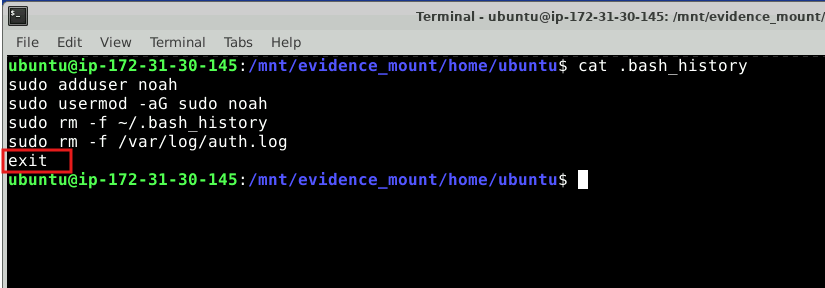  