# Challenge Overview
---
**Challenge:** [Lespion Lab](https://cyberdefenders.org/blueteam-ctf-challenges/lespion/)  
**Platform:** CyberDefenders  
**Category:** Threat Intel  
**Difficulty:** Easy  
**Tools:** Google Images search, CyberChef  

# Summary
---
This lab involved conducting an OSINT investigation to analyze a suspect’s online footprint and uncover sensitive information. Analysis of the individual’s GitHub repository revealed poor security practices, including an exposed API key and a Base64-encoded password that was easily decoded. Further enumeration identified a cryptocurrency mining tool and linked accounts across platforms such as Steam and Instagram. Reverse image searches on shared content exposed locations related to travel, family, and organizational presence. The exercise demonstrated how weak credential handling and public digital footprints can be leveraged to build a detailed intelligence profile and support potential attacks.  

# Scenario
---
You have been tasked by a client whose network was compromised and brought offline to investigate the incident and determine the attacker's identity.  

Incident responders and digital forensic investigators are currently on the scene and have conducted a preliminary investigation. Their findings show that the attack originated from a single user account, probably, an insider. Investigate the incident, find the insider, and uncover the attack actions.  

# Challenge
---
## File -> Github.txt: What API key did the insider add to his GitHub repositories?

Given the user's GitHub profile link, we can analyze their GitHub repositories. The GitHub profile belongs to the user `Emarseille99` and by navigating to their Repositories, there is one named `Project-Build--Custom-Login-Page` which seems interesting.  
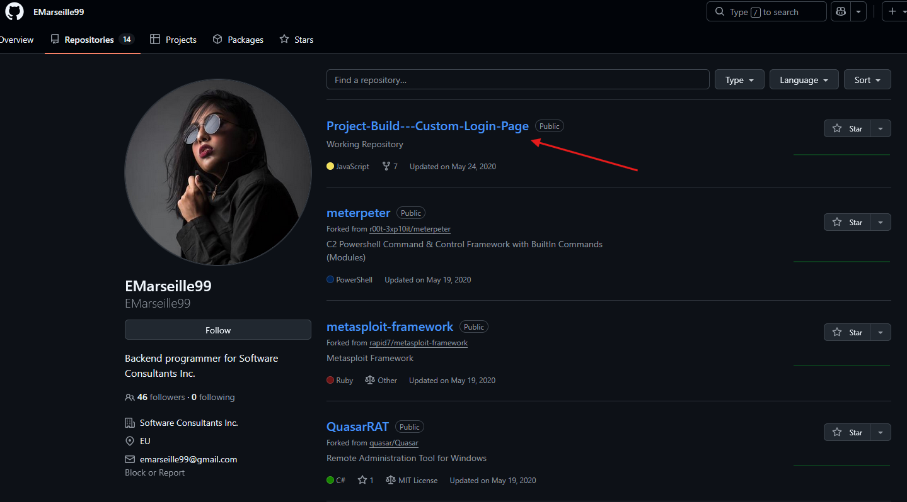  

Further examining the `Project-Build--Custom-Login-Page` repository, we can find an exposed API key in the Login Page.js file.  
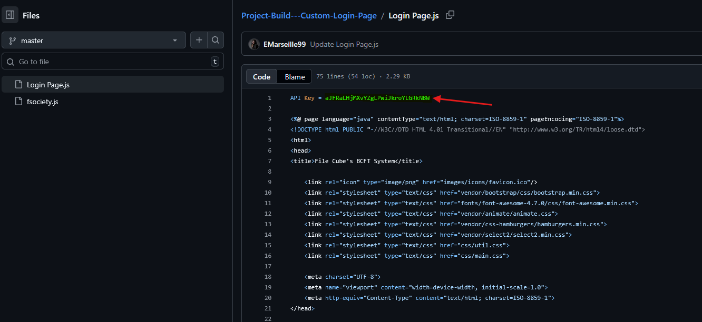  

## File -> Github.txt: What plaintext password did the insider add to his GitHub repositories?

In the same Login Page.js file, scrolling down will reveal a hardcoded password encoded in base64.  
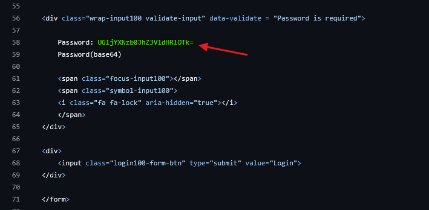  

Using CyberChef, we can use the From Base64 operator on the password to decode the password to plaintext.  
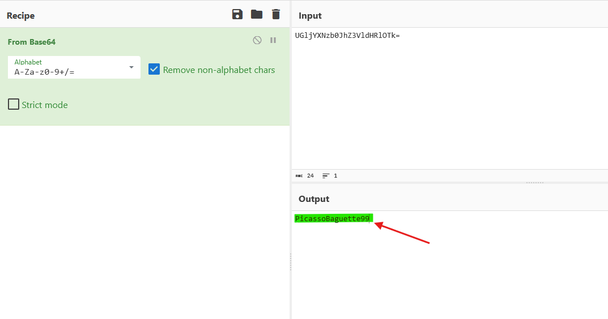  

## File -> Github.txt: What cryptocurrency mining tool did the insider use?

Further examining the user `EMarseille99`'s profile reveal a tool that appears to be a crypto mining tool in their popular repositories.  
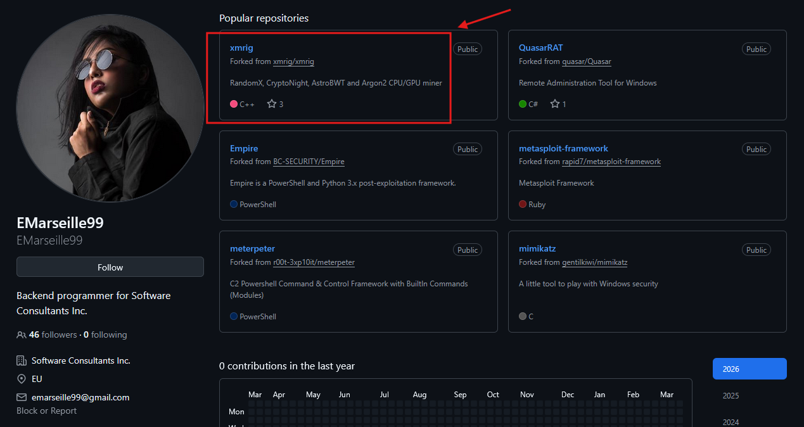  

## On which gaming website did the insider have an account?

Performing a Google search of the user's name reveal a Steam account.  
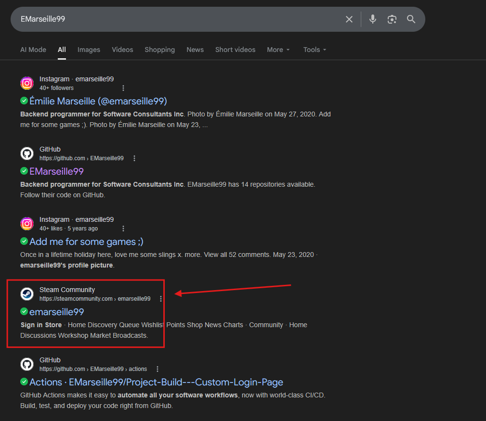  

## What is the link to the insider Instagram profile?

In the same Google search, the first link goes to the insider's Instagram profile.
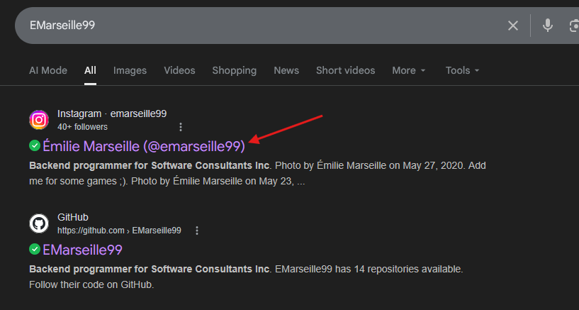  
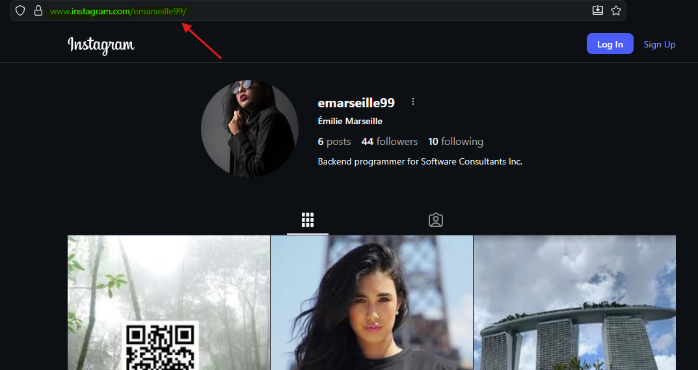

## Which country did the insider visit on her holiday?

On the insider's Instagram page, they posted some landscape pictures that we can use for clues. This particular picture and caption might reveal that this is where they visited on their holiday.  
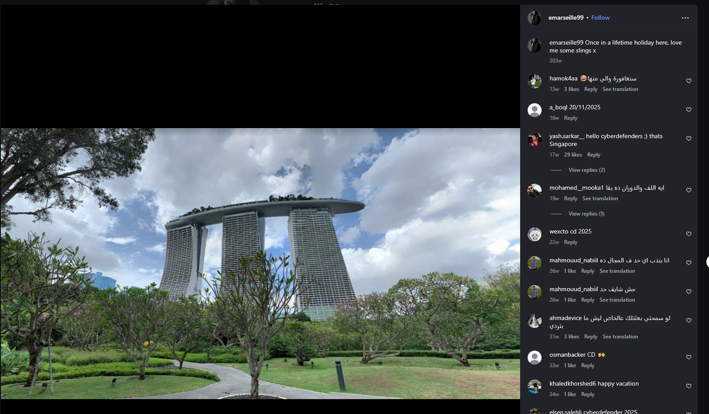  

Taking a screenshot of that image and doing a Google Images search revealed the location of where the insider went on their holiday.  
  

## Which city does the insider family live in?

Further examining the insider's Instagram page, they posted 2 photos about their family.  
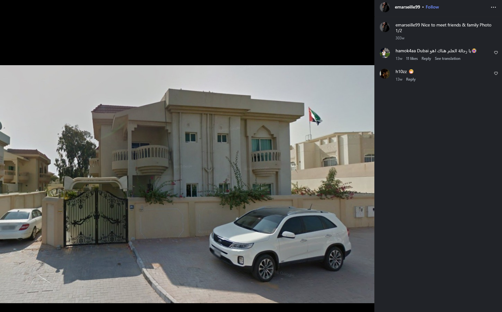  
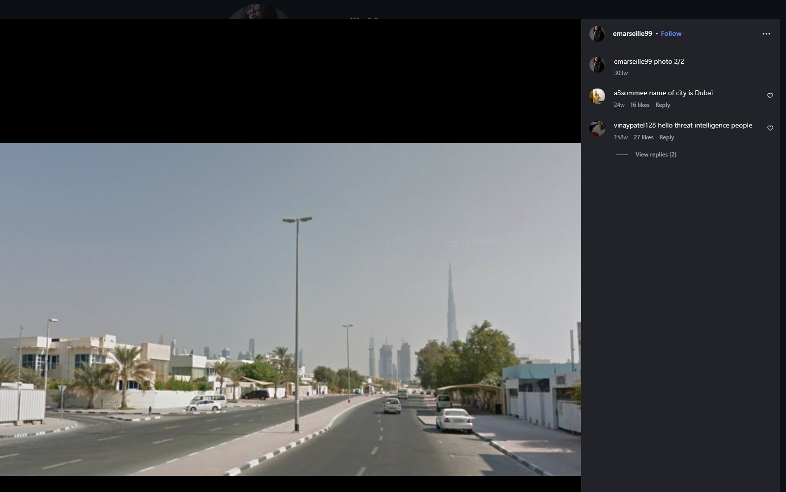  

Taking these photos doing a Google Images search revealed the city that their family lives in.  
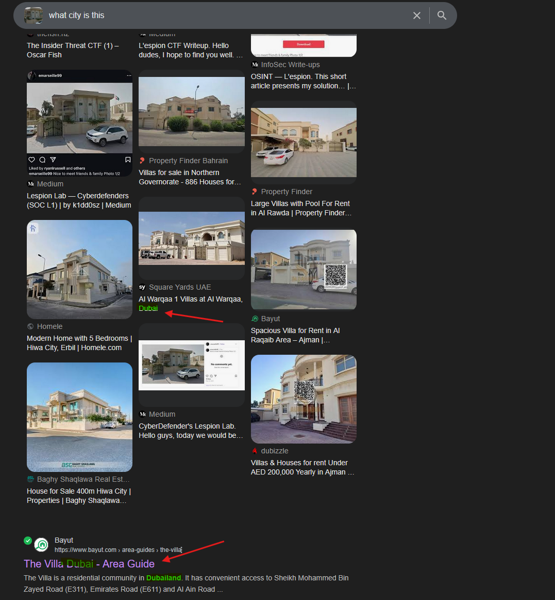  

## File -> office.jpg: You have been provided with a picture of the building in which the company has an office. Which city is the company located in?

Uploading office.jpg to Google Images revealed the city of the jpg image.  
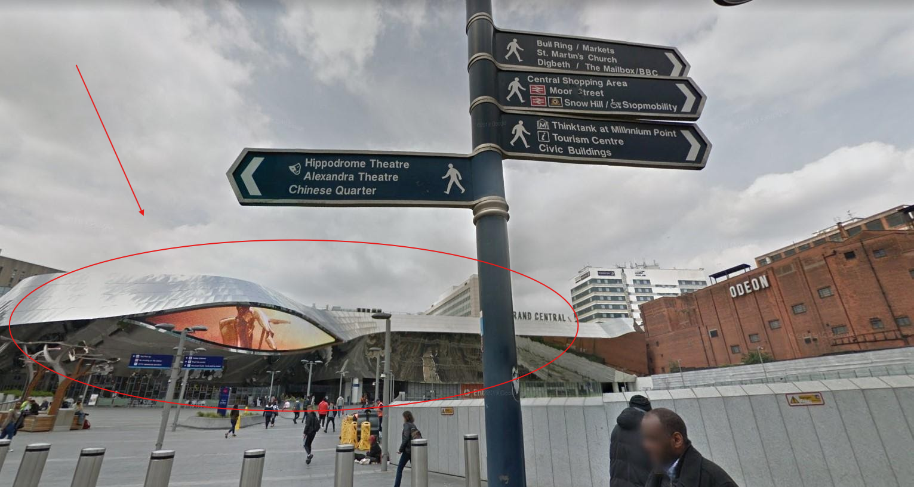  

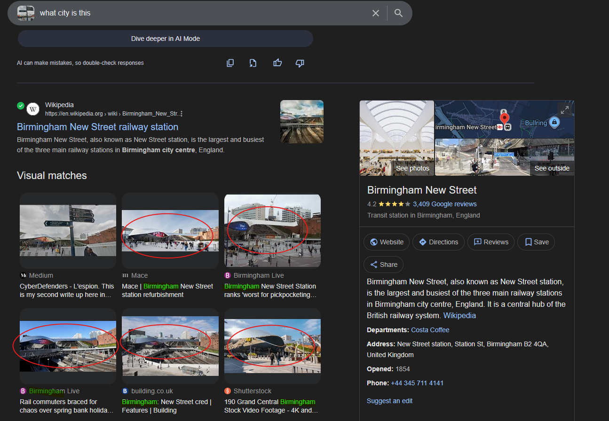  

## File -> Webcam.png: With the intel, you have provided, our ground surveillance unit is now overlooking the person of interest suspected address. They saw them leaving their apartment and followed them to the airport. Their plane took off and landed in another country. Our intelligence team spotted the target with this IP camera. Which state is this camera in?

Uploading Webcam.png to Google Images revealed the state of where the camera is in.  
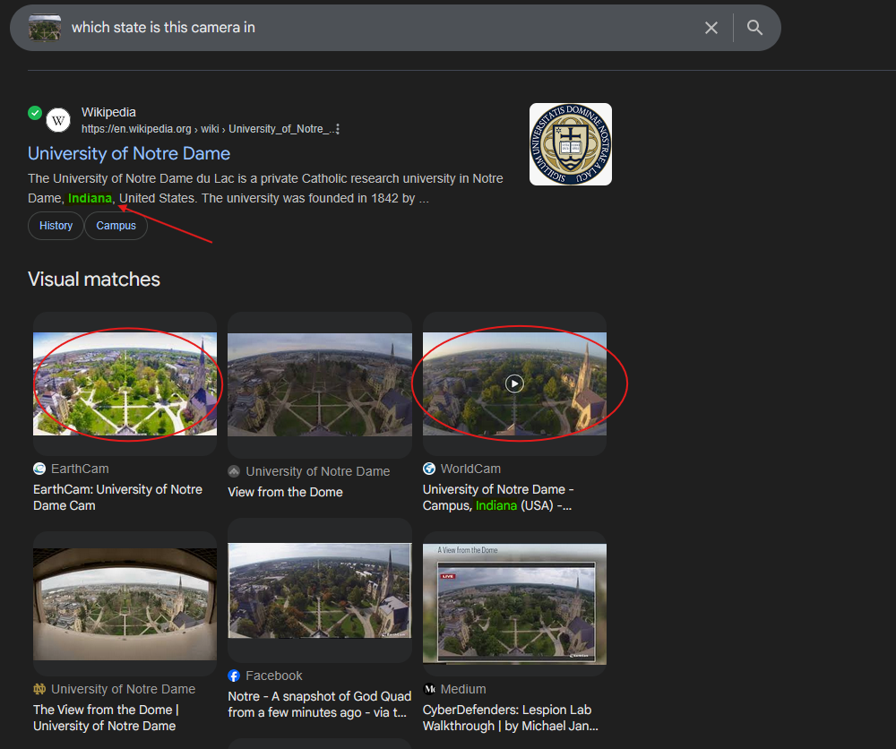  