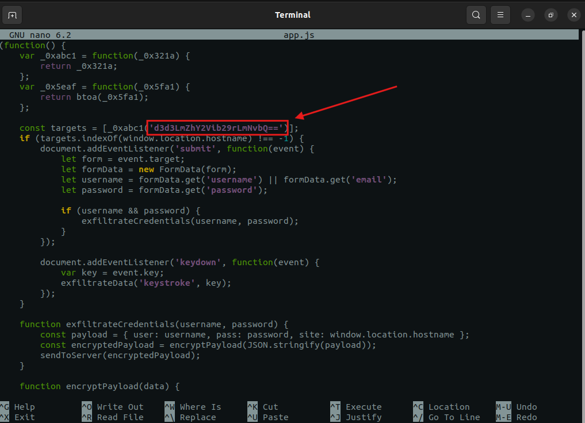
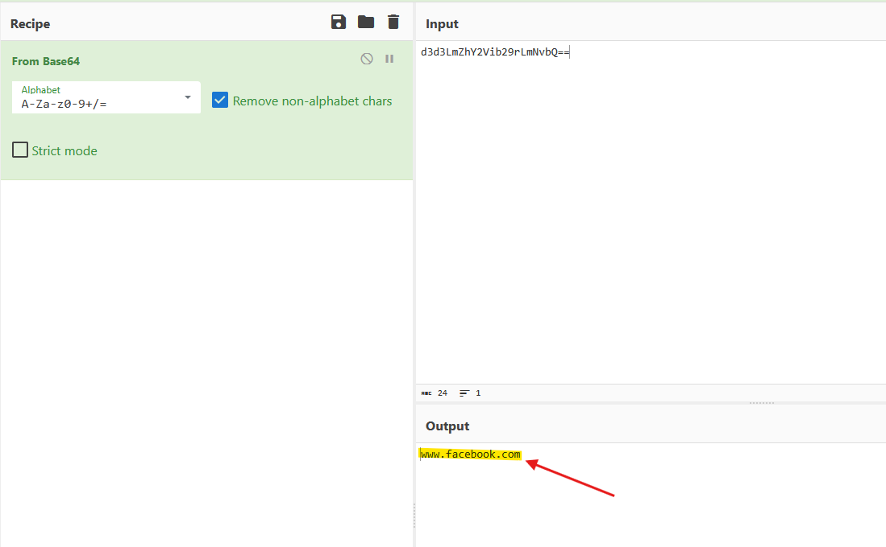
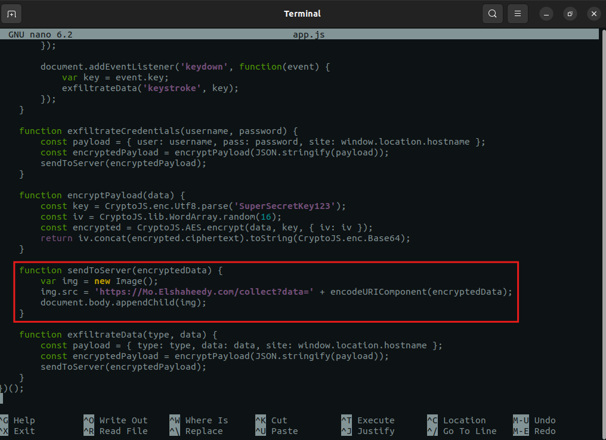
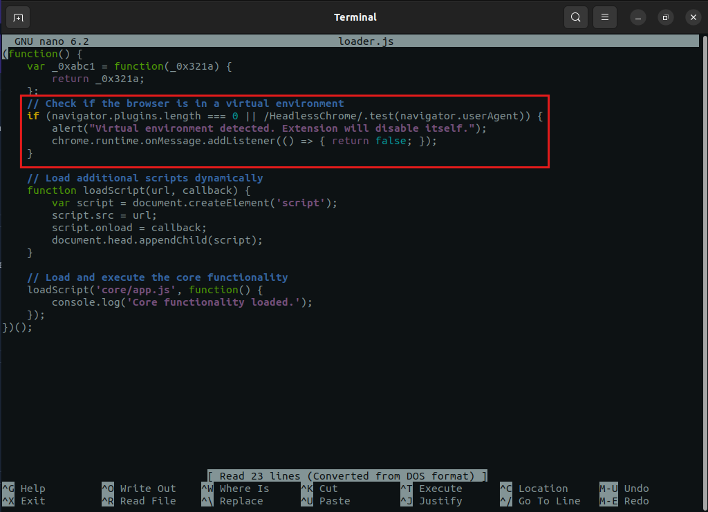
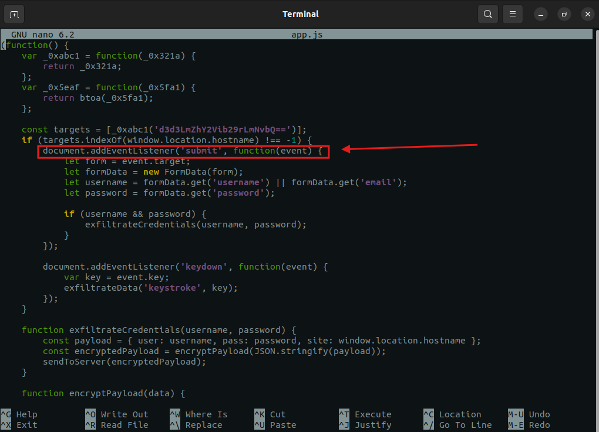
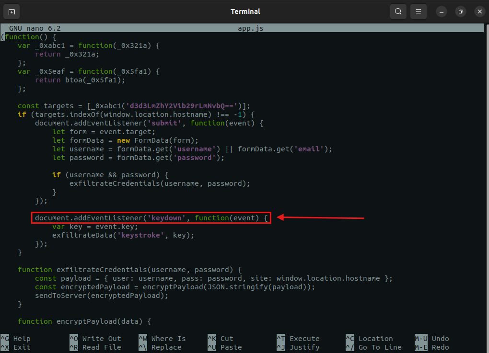
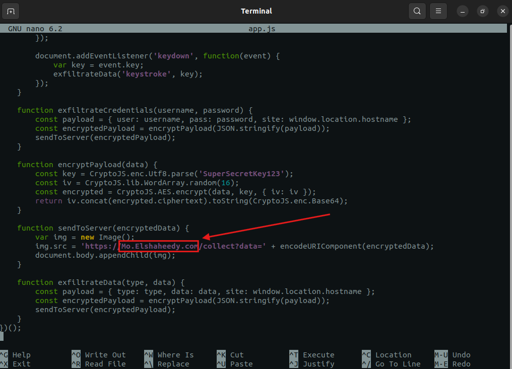
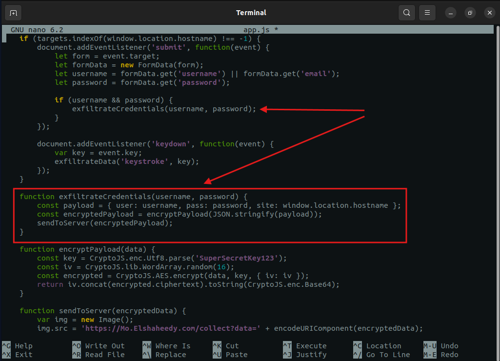
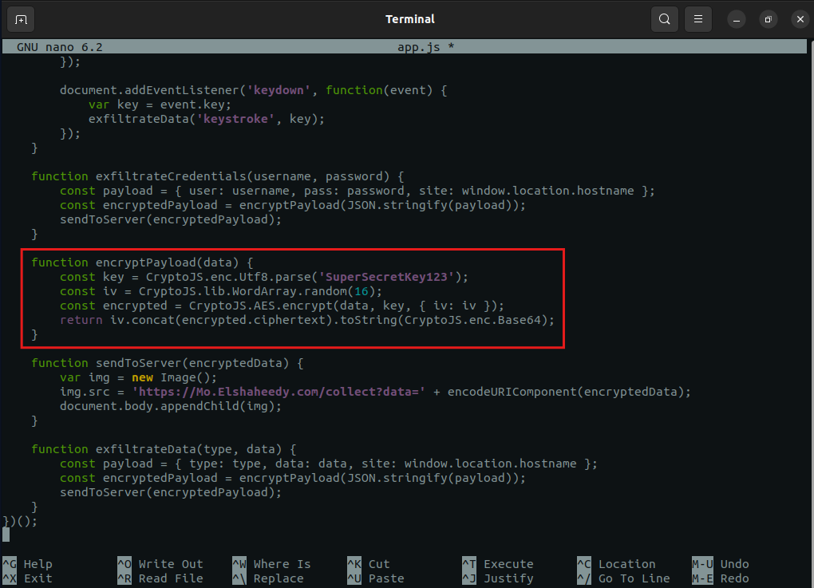
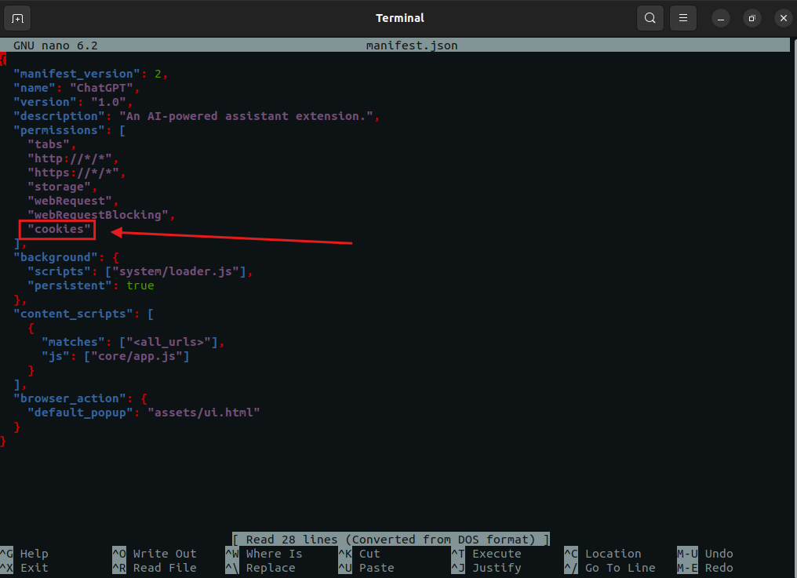

# Lab Overview
---
**Lab:** [FakeGPT Lab](https://cyberdefenders.org/blueteam-ctf-challenges/fakegpt/)  
**Platform:** CyberDefenders  
**Category:** Malware Analysis  
**Difficulty:** Easy  
**Tools:** CyberChef  

# Summary
---
This lab involves static analysis of a malicious browser extension disguised as a ChatGPT tool that was distributed to employees and used to compromise accounts and exfiltrate sensitive data. Analysis of the extension's source code revealed it used base64 encoding to obscure target URLs and specifically monitored Facebook to steal user credentials.

The extension captured user input by listening to form submission events and monitoring keystrokes via a JavaScript API. Stolen data was transmitted to an external domain using `img` HTML elements to avoid triggering security controls. The exfiltrated credentials were encrypted using a symmetric encryption algorithm before transmission. The extension also included anti-analysis logic, such as checking for the absence of browser plugins to detect sandboxed environments, and accessed browser storage to manipulate session and authentication data.

# Scenario
---
Your cybersecurity team has been alerted to suspicious activity on your organization's network. Several employees reported unusual behavior in their browsers after installing what they believed to be a helpful browser extension named "ChatGPT". However, strange things started happening: accounts were being compromised, and sensitive information appeared to be leaking.

Your task is to perform a thorough analysis of this extension identify its malicious components.

# Analysis
---
## Which encoding method does the browser extension use to obscure target URLs, making them more difficult to detect during analysis?

base64
  

## Which website does the extension monitor for data theft, targeting user accounts to steal sensitive information?

  

## Which type of HTML element is utilized by the extension to send stolen data?

img
  

## What is the first specific condition in the code that triggers the extension to deactivate itself?

`navigator.plugins.length === 0`

## Which event does the extension capture to track user input submitted through forms?

  

## Which API or method does the extension use to capture and monitor user keystrokes?

  

## What is the domain where the extension transmits the exfiltrated data?

  

## Which function in the code is used to exfiltrate user credentials, including the username and password?

  

## Which encryption algorithm is applied to secure the data before sending?

  

## What does the extension access to store or manipulate session-related data and authentication information?

  

