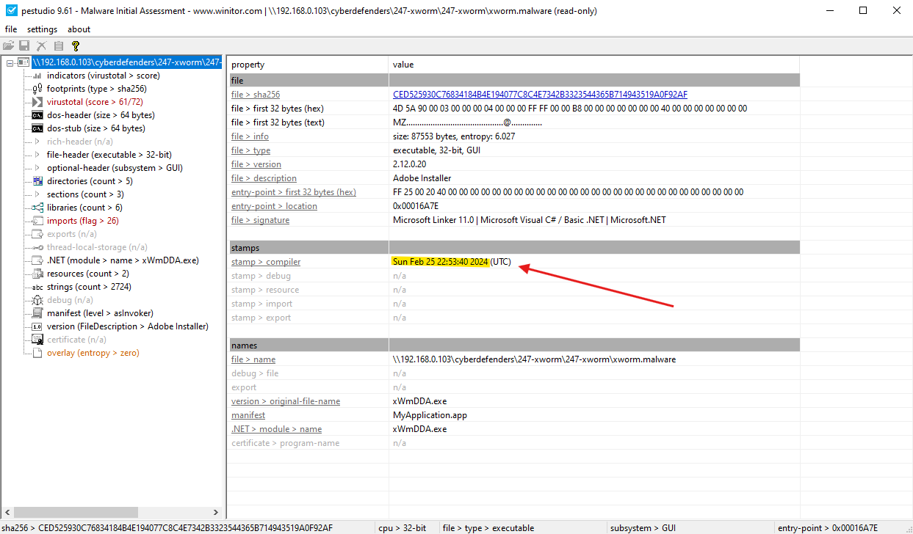
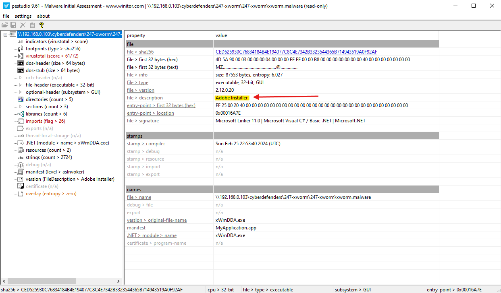

# Lab Overview
---
**Lab:** [XWorm Lab](https://cyberdefenders.org/blueteam-ctf-challenges/xworm/)  
**Platform:** CyberDefenders  
**Category:** Malware Analysis  
**Difficulty:** Medium  
**Tools:** VirusTotal,  PEStudio

# Summary
---
This lab involves static malware analysis of a suspicious executable downloaded from a phishing email using PEStudio and VirusTotal. The sample impersonates a legitimate company to appear trustworthy and performs multiple anti-analysis checks to detect sandbox and debugging environments.

Analysis revealed that the malware creates a scheduled task to achieve execution with elevated privileges and drops a copy of itself into the AppData directory for persistence. The malware uses a cryptographic algorithm with a hardcoded string as input to derive its encryption parameters, allowing it to encrypt or obfuscate its configuration data. The sample is identified as belonging to the XWorm malware family, a commodity remote access trojan capable of keylogging, screen capture, and command execution.

# Scenario
---
An employee accidentally downloaded a suspicious file from a phishing email. The file executed silently, triggering unusual system behavior. As a malware analyst, your task is to analyze the sample to uncover its behavior, persistence mechanisms, communication with Command and Control (C2) servers, and potential data exfiltration or system compromise.

# Analysis
---
## What is the compile timestamp (UTC) of the sample?

  

## Which legitimate company does the malware impersonate in an attempt to appear trustworthy?

  

## How many anti-analysis checks does the malware perform to detect/evade sandboxes and debugging environments?

## What is the name of the scheduled task created by the malware to achieve execution with elevated privileges?

## What is the filename of the malware binary that is dropped in the AppData directory?

## Which cryptographic algorithm does the malware use to encrypt or obfuscate its configuration data?

## To derive the parameters for its encryption algorithm (such as the key and initialization vector), the malware uses a hardcoded string as input. What is the value of this hardcoded string?

