# Lab Overview
---
**Lab:** [JetBrains Lab](https://cyberdefenders.org/blueteam-ctf-challenges/jetbrains/)  
**Platform:** CyberDefenders  
**Category:** Network Forensics  
**Difficulty:** Easy  
**Tools:** Wireshark  

# Summary
---
This lab investigates the exploitation of a critical vulnerability in a TeamCity web server using PCAP analysis. The attacker at IP address `23.158.56.196` exploited `CVE-2024-27198`, a critical authentication bypass vulnerability in TeamCity version `2023.11.3`, to gain unauthorized access to the server.

After gaining access, the attacker created a `SYSTEM_ADMIN` account and uploaded a web shell disguised as `NSt8bHTg.zip` to establish persistent remote command execution. Post-exploitation activity included running reconnaissance commands, tampering with system credentials in `/tmp/Creds.txt`, defacing a web page, and attempting a container escape using a Docker command to mount the host filesystem.

# Scenario
---
During a recent security incident, an attacker successfully exploited a vulnerability in our web server, allowing them to upload webshells and gain full control over the system. The attacker utilized the compromised web server as a launch point for further malicious activities, including data manipulation.  

As part of the investigation, You are provided with a packet capture (PCAP) of the network traffic during the attack to piece together the attack timeline and identify the methods used by the attacker. The goal is to determine the initial entry point, the attacker's tools and techniques, and the compromise's extent.  

# Analysis
---
## Identifying the attacker's IP address helps trace the source and stop further attacks. What is the attacker's IP address?

What we know is that our web server has been comrpomised and allowed the attacker to upload webshells to the server. To identify the attacker's initial access, I searched for HTTP traffic and looked for any traffic that pertains to uploading.  
```bash
http && http.request.full_uri matches "(?i)upload"
```
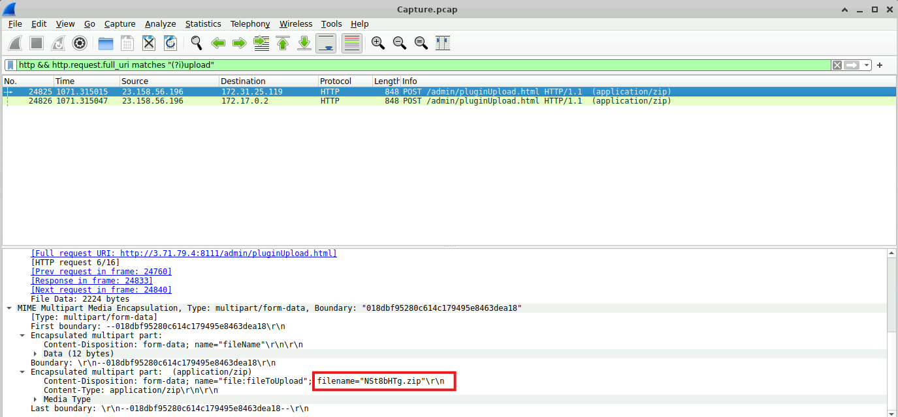  
In the output above, there are two POST requests coming from source IP address `23.158.56.196` to  destination IP addresses `172.31.25.119` and `172.17.0.2`. The requests include a filename with an odd looking name `NSt8bHTg.zip` which is highly suspicious.  

To further investigate IP address `23.158.56.196`, I refined the search to all POST requests coming from this IP address.
```bash
http.request.method=="POST" && ip.src=="23.158.56.196"
```
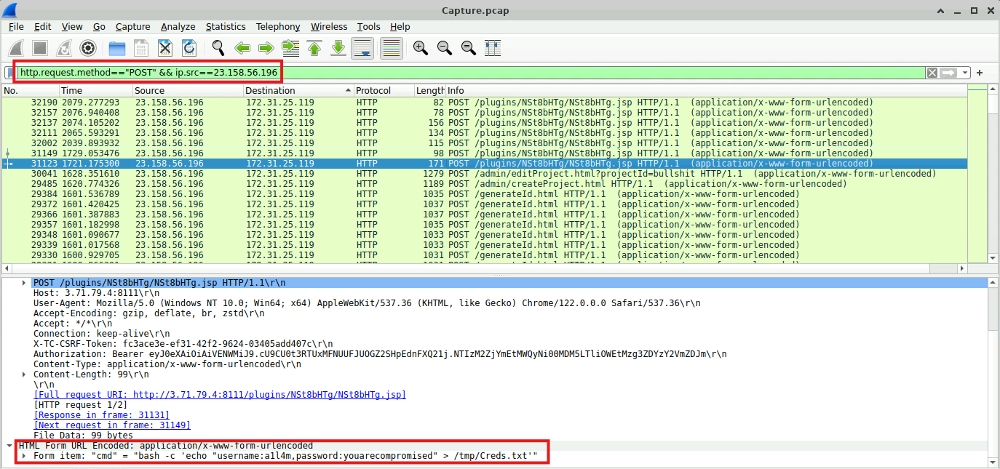  
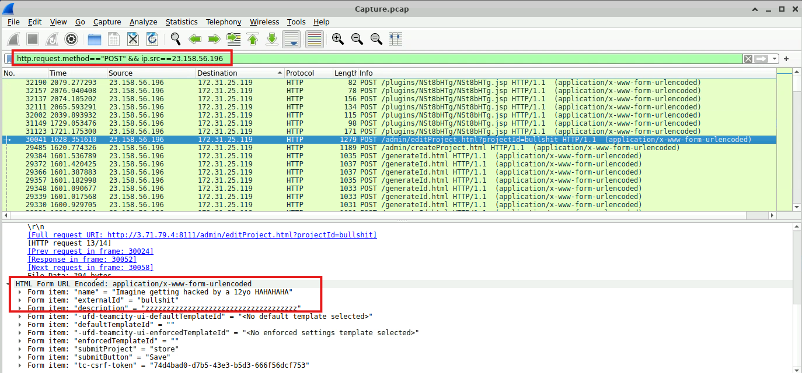  
In the screenshots above, the evidence show clear signs that the IP address `23.158.56.196` is malicious and has compromised the host `172.31.25.119`. The first 6 packets show a POST request to NSt8bHTg.jsp that show reconnaissance activity running commands like `whoami` and `ls`. Packet 311123 shows the attacker writing `username:all4m,password:youarecompromised` to the compromised file `/tmp/Creds.txt`. In addition, the next packet, packet 30041, revealed that the attacker modified a page's HTML and changed the `name` value to `Imagine getting hacked by a 12yo HAHAHAHA`.  

Based on this evidence, it is confirmed that the IP address `23.158.56.196` is malicious.  

## To identify potential vulnerability exploitation, what version of our web server service is running?

To identify the version of the web server, I re-ran this search and followed the HTTP Stream of the first packet.  
```bash
http && http.request.full_uri matches "(?i)upload"
```
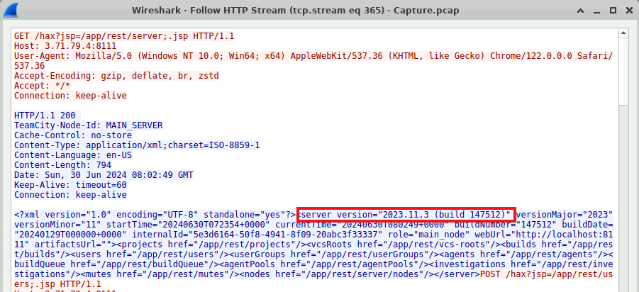  
In the captured stream, the HTTP response revealed the version of the compromised server as  `2023.11.3 build (147512)`.  

## After identifying the version of our web server service, what CVE number corresponds to the vulnerability the attacker exploited?

Running a Google search for "CVE 2023.11.3" revealed the vulnerability `CVE-2024-27198` had a critical severity score of 9.8.  
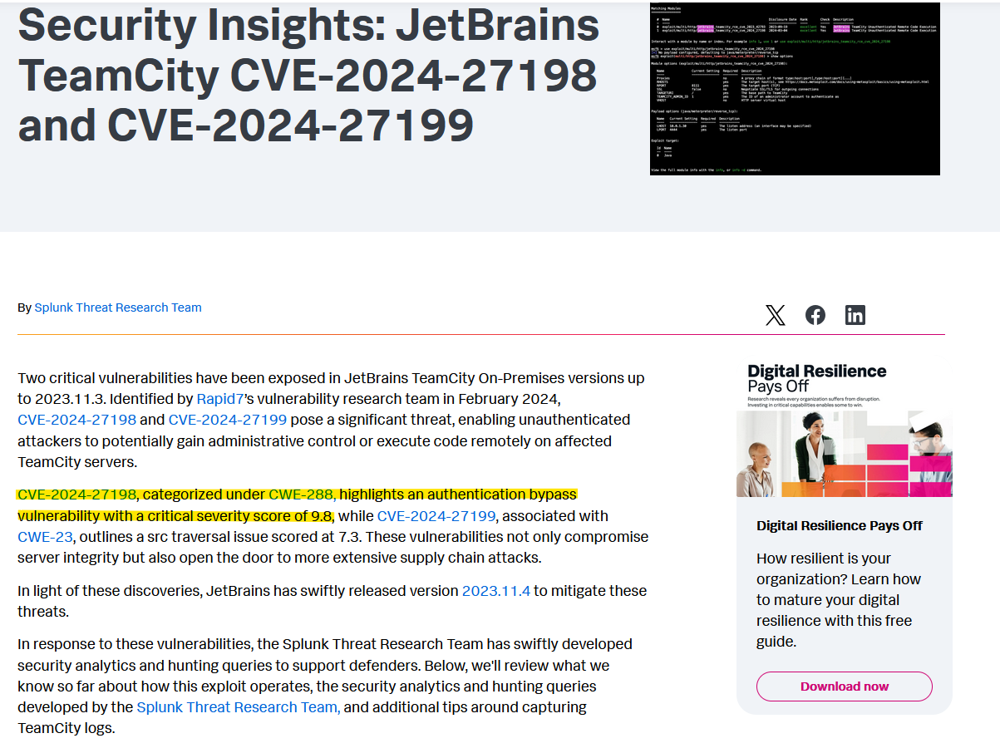  

## The attacker exploited the vulnerability to create a user account. What credentials did he set up?

Analysis of HTTP Stream 365 shows the attacker (`Host: 3.71.79.4:8111`) setting up the username `c91oyemw` and password `CL5vzdwLuK` with a `SYSTEM_ADMIN` role. 
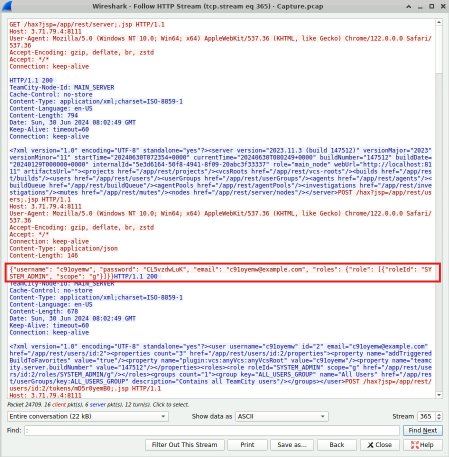  

## The attacker uploaded a webshell to ensure his access to the system. What is the name of the file that the attacker uploaded?

The file `NSt8bHTg.zip` was previously identified as the file that the attacker uploaded to the system.  
  

To confirm the files intent, analysis of HTTP Stream 365 revealed the intent of the file.  
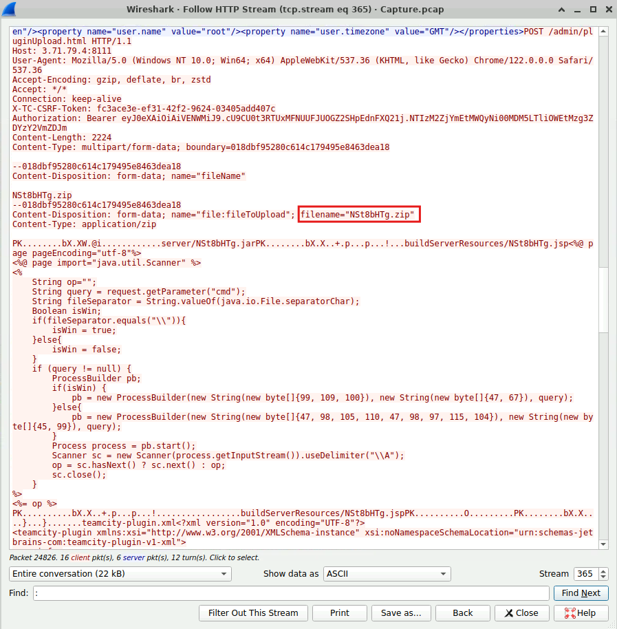  

In CyberChef using the "From Charcode" recipe decoded the bytes to `cmd` and `/bin/bash`.  
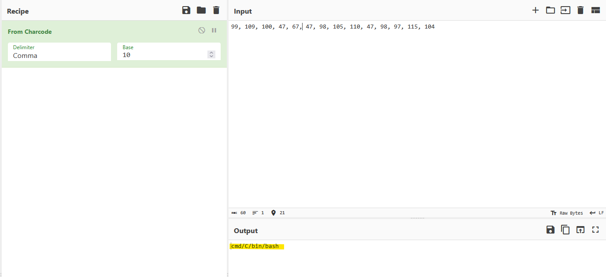  

Based on this evidence, this file is likely the webshell the attacker uploaded to the system.  
## When did the attacker execute their first command via the web shell?

Analysis of HTTP Stream 364 revealed the attacker executed their first command `ls` at `2026-06-30 08:03` UTC.  
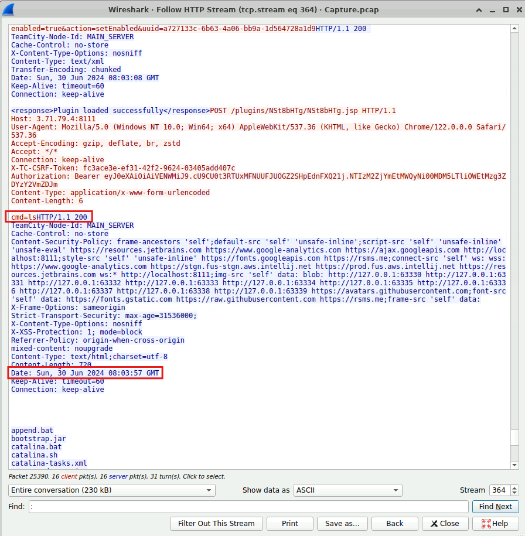  

## The attacker tampered with a text file that contained the credentials of the admin user of the webserver. What new username and password did the attacker write in the file?

Packet 31123 shows the attacker writing the username `a1l4m` and password `youarecompromised` to the `/tmp/Creds.txt` file.  
  

## What is the MITRE Technique ID for the attacker's action in the previous question (Q7) when tampering with the text file?

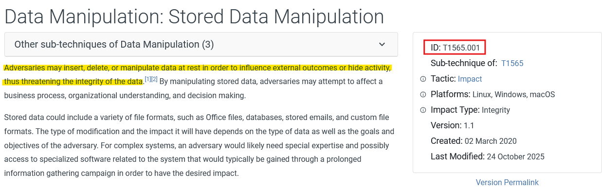  

## The attacker tried to escape from the container but he didn’t succeed, What is the command that he used for that?

To find commands the attacker used, I searched for all HTTP traffic commanding `cmd=`.  
```bash
http contains "cmd="
```
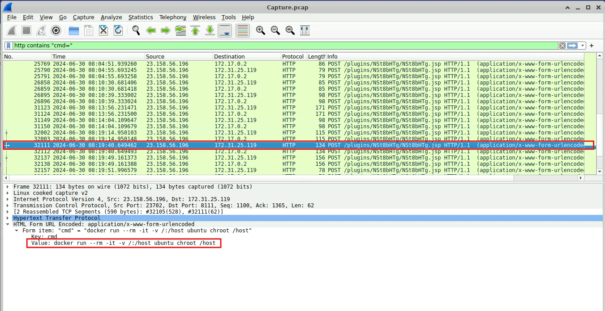  

In the screenshot above, the attacker attempted to run the command `docker run --rm -it -v /:/host ubuntu chroot /host`. This command essentially mounts the entire host filesystem into the container using the Ubuntu container image.  