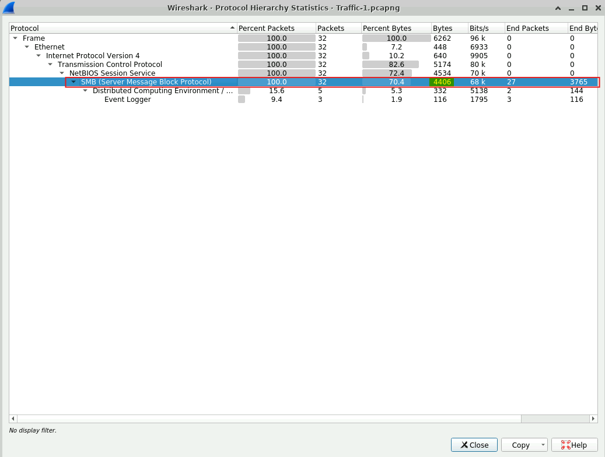
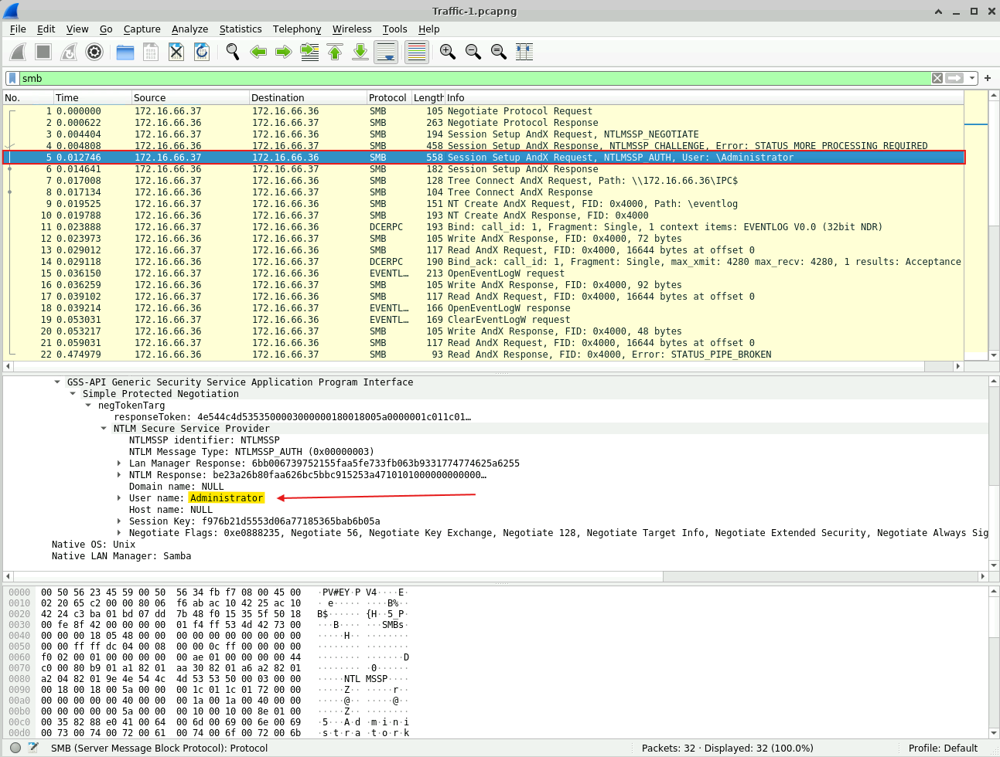
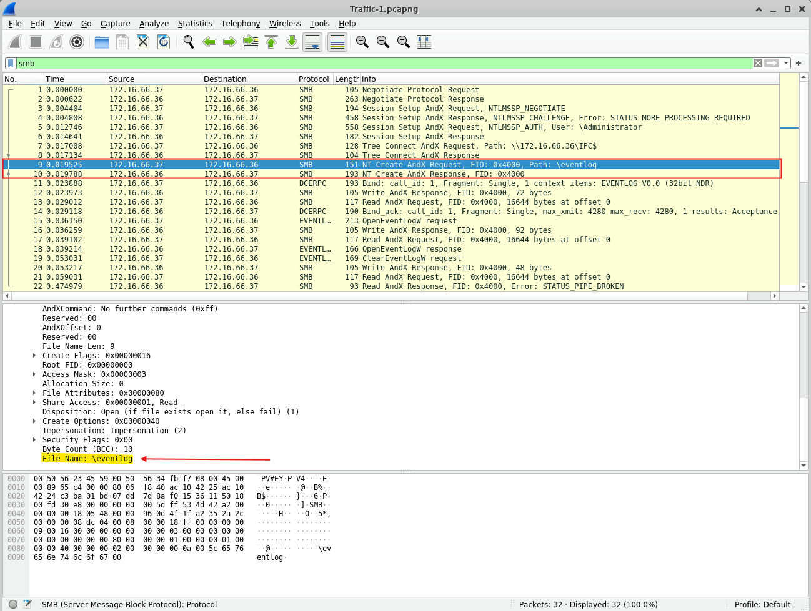
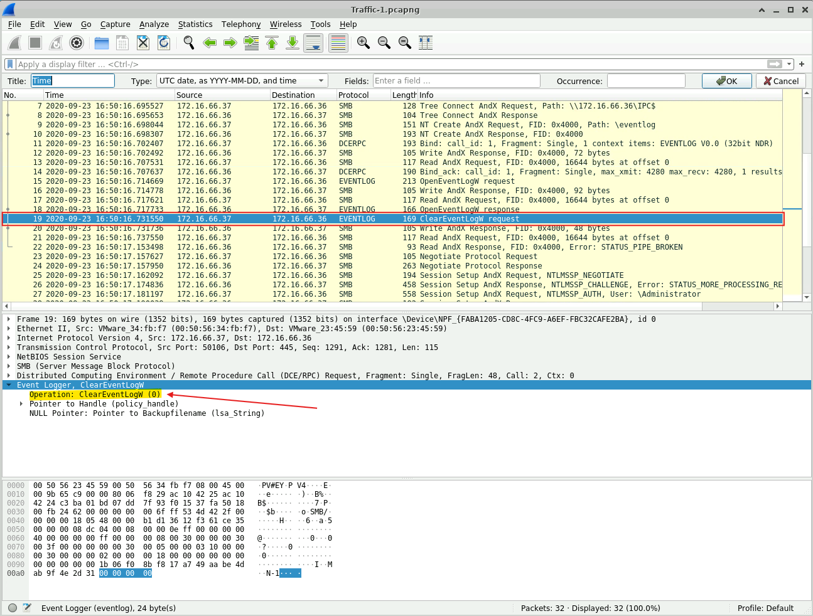
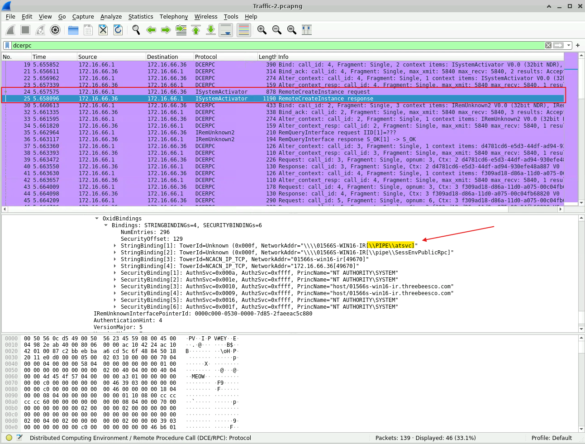
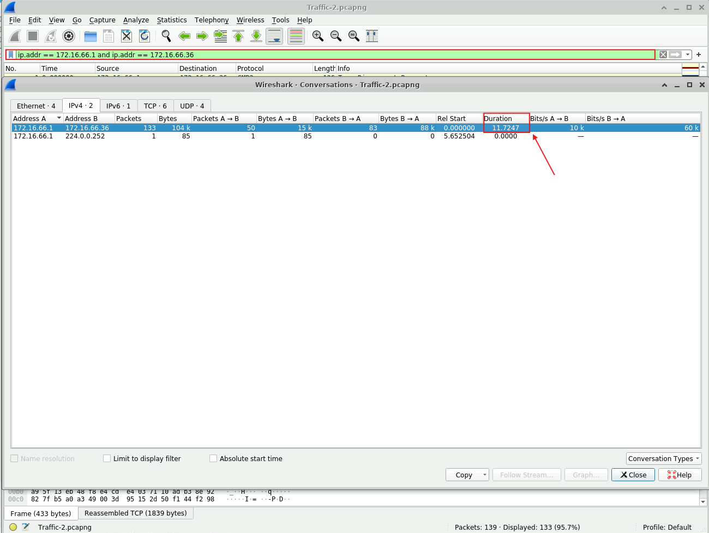
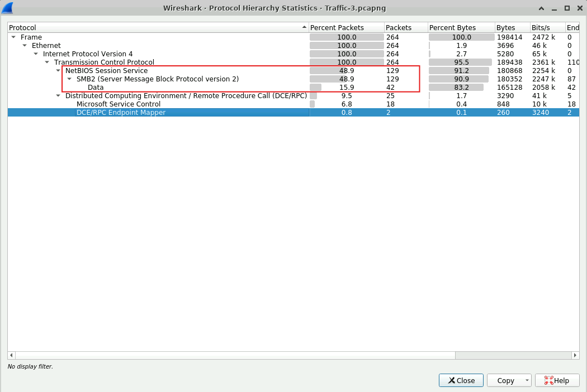
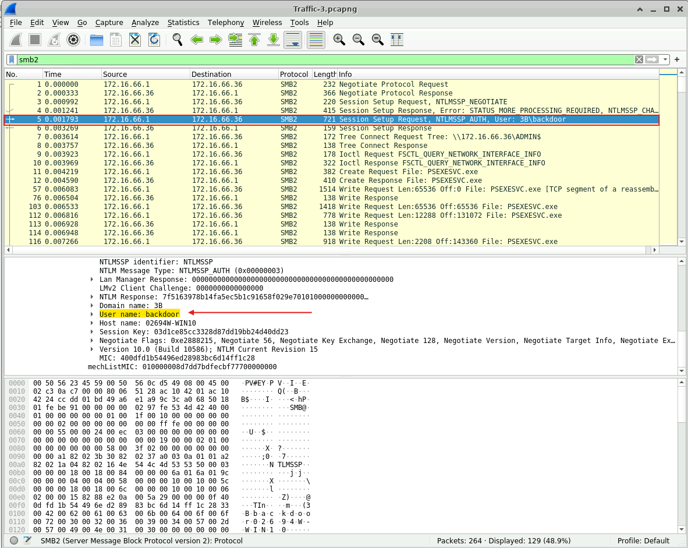
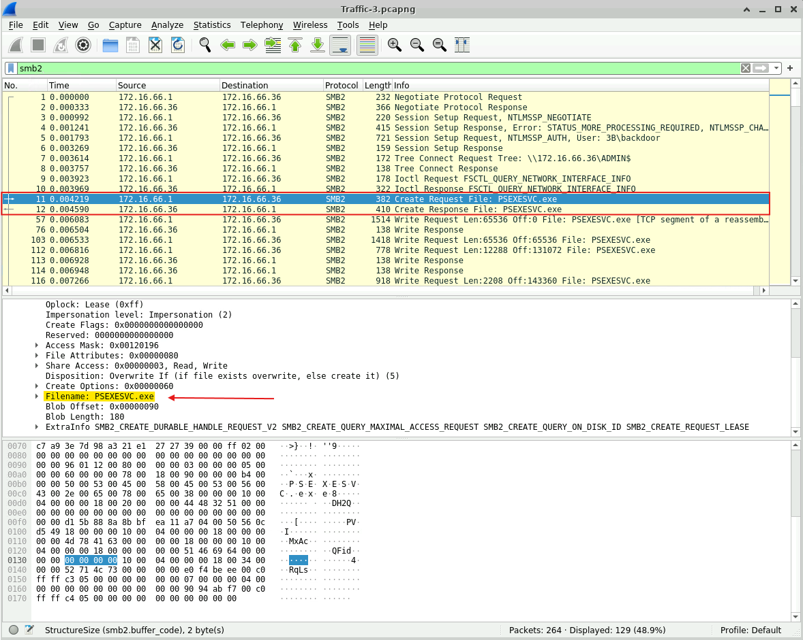

# Lab Overview
---
**Lab:** [PacketDetective Lab](https://cyberdefenders.org/blueteam-ctf-challenges/packetdetective/)  
**Platform:** CyberDefenders  
**Category:** Network Forensics  
**Difficulty:** Easy  
**Tools:** Wireshark  

# Summary
---
This lab analyzes multiple PCAP files to investigate suspicious SMB activity linked to a potential compromise of a privileged account and lateral movement within a network. Using Wireshark, the traffic revealed extensive SMB usage including NTLM authentication with the Administrator account, indicating possible credential compromise.  

Analysis revealed that the attacker accessed system files like the Event Logs and attempted to cover their tracks by clearing event logs. Additional network traffic revealed the use of RPC over named pipes which suggest the attacker is remotely executing tasks. It was also identified that a suspicious account was used to by the attacker to establish persistence in the system. Additionally, the presence of PSEXESVC.exe confirmed the use of PsExec for remote command execution and further lateral movement.  

# Scenario
---
In September 2020, your SOC detected suspicious activity from a user device, flagged by unusual SMB protocol usage. Initial analysis indicates a possible compromise of a privileged account and remote access tool usage by an attacker.

Your task is to examine network traffic in the provided PCAP files to identify key indicators of compromise (IOCs) and gain insights into the attacker’s methods, persistence tactics, and goals. Construct a timeline to better understand the progression of the attack by addressing the following questions.

# Analysis
---
## Traffic-1.pcapng

### The attacker’s activity showed extensive SMB protocol usage, indicating a potential pattern of significant data transfer or file access. What is the total number of bytes of the SMB protocol?

To determine the total number of bytes of the SMB protocol, I used the `Statistics > Protocol Hierachy` feature in Wireshark which provides a summary of all protocols detected in the network capture.  
  
From the screenshot above, Wireshark has detected the SMB protocol and its total  number of bytes.  

### Authentication through SMB was a critical step in gaining access to the targeted system. Identifying the username used for this authentication will help determine if a privileged account was compromised. Which username was utilized for authentication via SMB?

To determine what username was used for authentication, I set the display filter to `smb` to show only SMB traffic in the network capture.  
  
Based on result, I identified some NTLM authentication occurring in the network capture specifically at packet 3, 4, and 5. Further inspection of packet 5 revealed the username `Administrator` was used for authentication via SMB.  

### During the attack, the adversary accessed certain files. Identifying which files were accessed can reveal the attacker's intent. What is the name of the file that was opened by the attacker?

Following along in the sequence, packets 9 and 10 show the commands NT Create and Request and NT Create and Response which is typically used by the SMB protocol that allows a client to create a new file, open an existing file, etc.  
  
Inspection into packet 9 revealed that the file `eventlog` was accessed via SMB protocol.  

### Clearing event logs is a common tactic to hide malicious actions and evade detection. Pinpointing the timestamp of this action is essential for building a timeline of the attacker’s behavior. What is the timestamp of the attempt to clear the event log? (24-hour UTC format)

As we move along in the network traffic, I identified some interesting packets using the EVENTLOG protocol. At packet 19, a request with the event operation `ClearEventLogW` was sent which likely indicates that this packet captured the attacker's request to clear the event log.  
  
From the screenshot above, packet 19 occurred at the time `2020-09-23 16:50` UTC.  

## Traffic-2.pcapng

### The attacker used "named pipes" for communication, suggesting they may have utilized Remote Procedure Calls (RPC) for lateral movement across the network. RPC allows one program to request services from another remotely, which could grant the attacker unauthorized access or control. What is the name of the service that communicated using this named pipe?

To begin investigation into suspicious RPC traffic, I applied the `dcerpc` display filter to show only traffic for RPC protocol. Considering that RPC is a protocol used to allow programs to request services remotely, packets 24 and 25 are interesting in this case since they involve some remote instance creation.  
  
Further examining packet 25 into its ScmReplyInfo, it revealed that the attacker indeed utilized "named pipes" for communications as seen by the `\\PIPE\\`, and the service they communicated with is `atsvc`.

### Measuring the duration of suspicious communication can reveal how long the attacker maintained unauthorized access, providing insights into the scope and persistence of the attack. What was the duration of communication between the identified addresses 172.16.66.1 and 172.16.66.36?

To measure the duration of communication between IP address `172.16.66.1` and `172.16.66.36,` I applied the display filter `ip.addr == 172.16.66.1 and ip.addr == 172.16.66.36` to show only traffic between these two IP addresses.  
  
Using the `Statistics > Conversations` feature in Wireshark, under the IPv4 tab, it provided the duration time between these two IP addresses.  

## Traffic-3.pcapng

### The attacker used a non-standard username to set up requests, indicating an attempt to maintain covert access. Identifying this username is essential for understanding how persistence was established. Which username was used to set up these potentially suspicious requests?

In this packet capture, I first used the Statistics > Protocol Hierarchy feature in Wireshark to identify any unusual or interesting protocols.
  
From the screenshot above, Wireshark has identified that this PCAP file mostly captured SMB2 traffic. This is interesting and we should further analyze SMB2 traffic for suspicious activity.  

I applied the `smb2` display filter to show only SMB2 traffic and from the result, I can observe some NTLM authentication activity occurring.  
  
The packet that will be interesting to us is packet 5 and if we further analyze the packet details, we can find the username `backdoor` in the details. This is an unusual username and is likely used by the attacker maintain persistence in the system.  

### The attacker leveraged a specific executable file to execute processes remotely on the compromised system. Recognizing this file name can assist in pinpointing the tools used in the attack. What is the name of the executable file utilized to execute processes remotely?

Further analysis into the network traffic revealed a very important executable file, the `PSEXESVC.exe`. This executable is commonly used to allow remote command execution via the Command Prompt. As seen in the [PsExec Hunt Lab](writeups/cyberdefenders/network-forensics/easy/psexec-hunt-lab.md), attackers can use this executable to execute commands remotely and move laterally in the system.  
  
