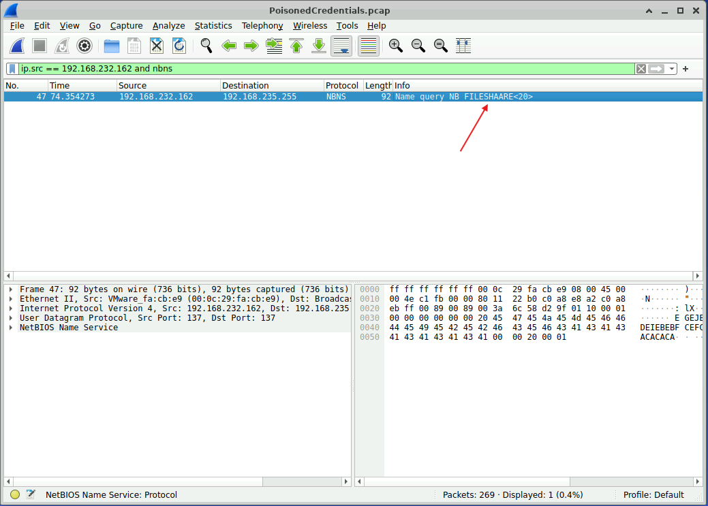
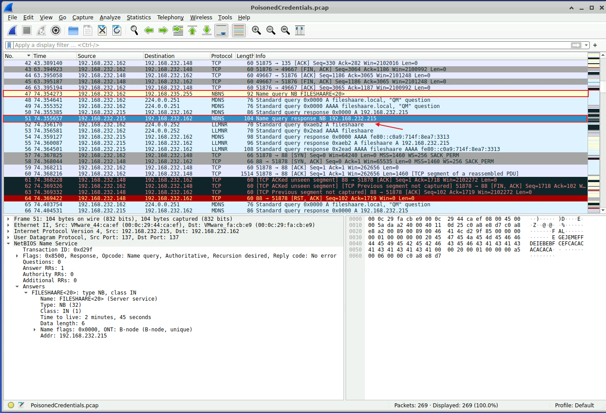
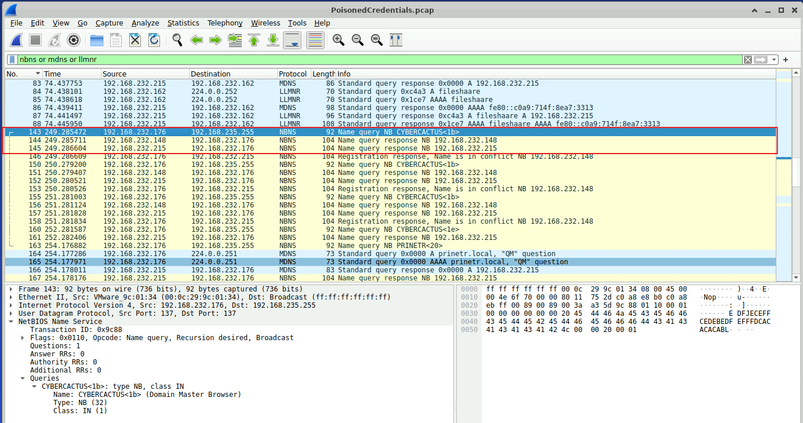
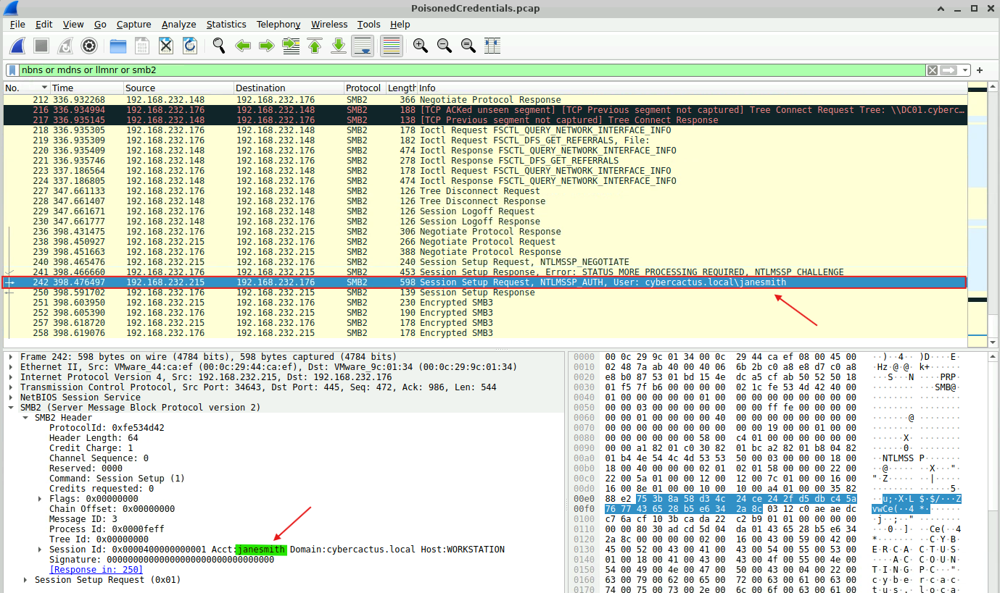
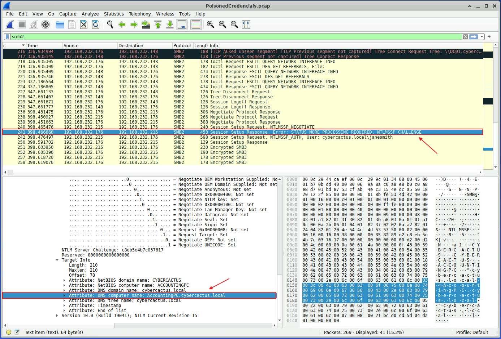

# Lab Overview
---
**Lab:** [PoisonedCredentials Lab](https://cyberdefenders.org/blueteam-ctf-challenges/poisonedcredentials/)  
**Platform:** CyberDefenders  
**Category:** Network Forensics  
**Difficulty:** Easy  
**Tools:** Wireshark  

# Summary
---
This lab involves using Wireshark to investigate suspicious network activity concerning LLMNR and NBT-NS poisoning attacks. By examining the network traffic, a mistyped query was identified and linked to a rogue machine that responded with spoofed replies. Further analysis showed multiple hosts receiving the poisoned responses. Inspection of the SMB traffic revealed that the attacker attempted to access a host and capture authentication data.

# Scenario
---
Your organization's security team has detected a surge in suspicious network activity. There are concerns that [LLMNR](../../../../resources/network/llmnr-and-nbtns-poisoning.md) (Link-Local Multicast Name Resolution) and [NBT-NS](../../../../resources/network/llmnr-and-nbtns-poisoning.md) (NetBIOS Name Service) poisoning attacks may be occurring within your network. These attacks are known for exploiting these protocols to intercept network traffic and potentially compromise user credentials. Your task is to investigate the network logs and examine captured network traffic.

# Background
---
 [LLMNR/NBT-NS](../../../../resources/network/llmnr-and-nbtns-poisoning.md) Poisoning is an attack where the attacker replies to LLMNR requests with their own IP address, effectively poisoning the service so that the victim communicates with the attacker's system. Some common abuse cases are mistyping the name of a legitimate host, misconfiguring the DNS server, WPAD protocol discovery, and Google Chrome searches.

See [MITRE](https://attack.mitre.org/techniques/T1557/001/) for more information regarding this technique.

# Analysis
---
## In the context of the incident described in the scenario, the attacker initiated their actions by taking advantage of benign network traffic from legitimate machines. Can you identify the specific mistyped query made by the machine with the IP address 192.168.232.162?

Using Wireshark to investigate the PCAP file, apply the filter `ip.src == 192.168.232.162 and nbns`. 
  
From the screenshot, we can observe an NBNS request packet sent from source `192.168.232.162` (IP in question) to destination `192.168.235.255` (broadcast). This packet shows a query with a mistyped name `FILESHAARE<20>`.  

## We are investigating a network security incident. To conduct a thorough investigation, We need to determine the IP address of the rogue machine. What is the IP address of the machine acting as the rogue entity?

To identify the rogue machine, we can observe the traffic starting from when the mistyped NBNS query first occurred at packet 47. 
  
From the screenshot, what we will notice is that packet 51 with source IP `192.168.232.215` responded to the request claiming that it resolved the mistyped query `FILESHAARE<20>`. This is likely indicating that `192.168.232.215` is attempting to impersonate the legitimate host by spoofing its identity.  

## As part of our investigation, identifying all affected machines is essential. What is the IP address of the second machine that received poisoned responses from the rogue machine?

We can narrow down our traffic by applying the display filter `nbns or mdns or llmnr` to show only queries and responses. Scrolling down in the traffic revealed that `192.168.232.176` is the next machine that sent a query requesting to resolve hostname `CYBERCACTUS<1b>`.  
  
From the previous analysis, we know that `192.168.232.215` is the rogue IP address. In the traffic, `192.168.232.215` replied back to `192.168.232.176` with its own IP address which confirms that `192.168.232.176` is the second machine that received the poisoned response.  

## We suspect that user accounts may have been compromised. To assess this, we must determine the username associated with the compromised account. What is the username of the account that the attacker compromised?

We can build onto the previous filter by adding `or smb2` to show Server Message Block (SMB) traffic. Analyzing the traffic shows that at packet 242, an `smb2` session is setup by the rogue machine `192.168.232.215`. Within the payload of this packet, the session setup requests for the account username `janesmith`.  
  

## As part of our investigation, we aim to understand the extent of the attacker's activities. What is the hostname of the machine that the attacker accessed via SMB?

Packet 241 includes an NTLMSSP (NT LAN Manager Security Support Provider) challenge message as part of the NTLM authentication process. Within the packet details, the `Target Info` field revealed the attribute `DNS computer name` of `AccountingPC.cybercactus.local`. This indicates that the hostname of the machine accessed via SMB is `AccountingPC` within the `cybercactus.local` domain.
  

# Additional Resources
---
-  [LLMNR & NBT-NS Poisoning and Credential Access - Cynet](https://www.cynet.com/attack-techniques-hands-on/llmnr-nbt-ns-poisoning-and-credential-access-using-responder)
- [MITRE: Adversary-in-the-Middle: LLMNR/NBT-NS Poisoning and SMB Relay](https://attack.mitre.org/techniques/T1557/001/)