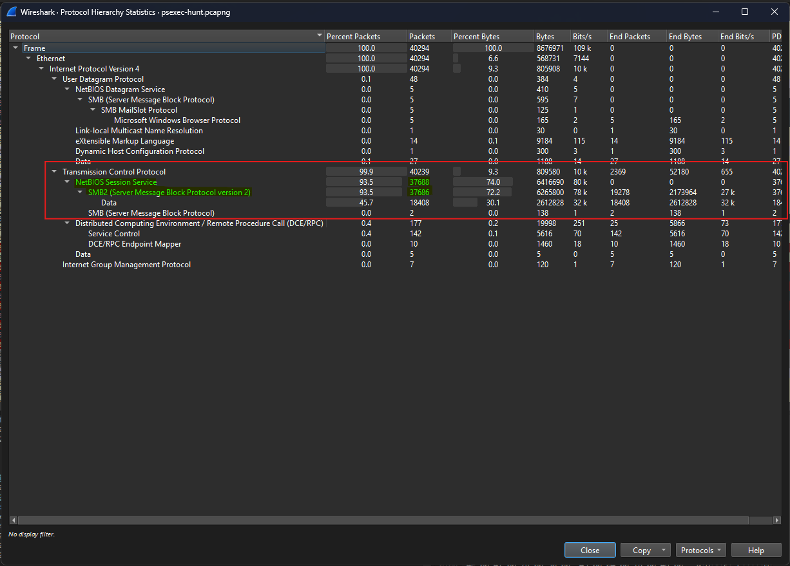
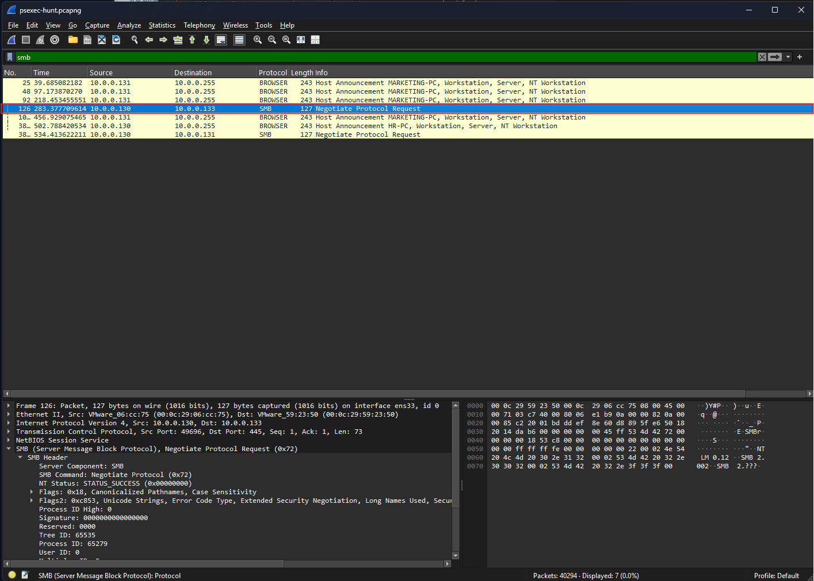
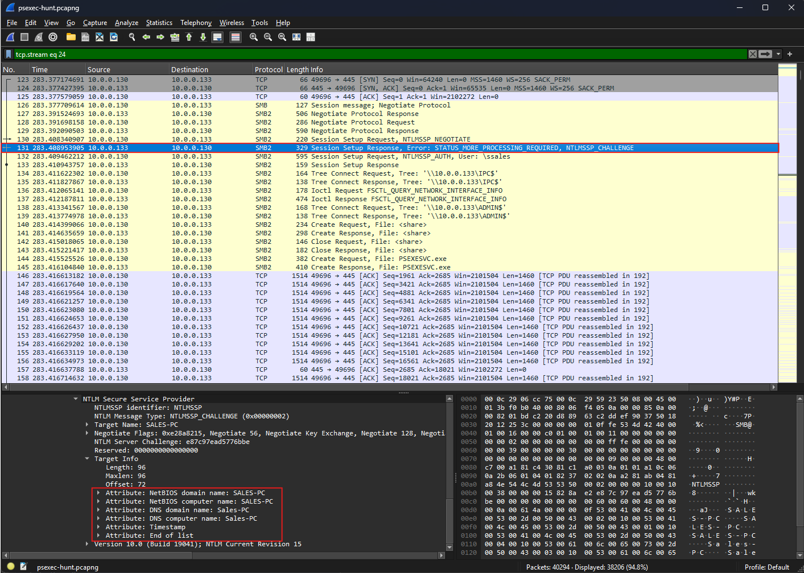
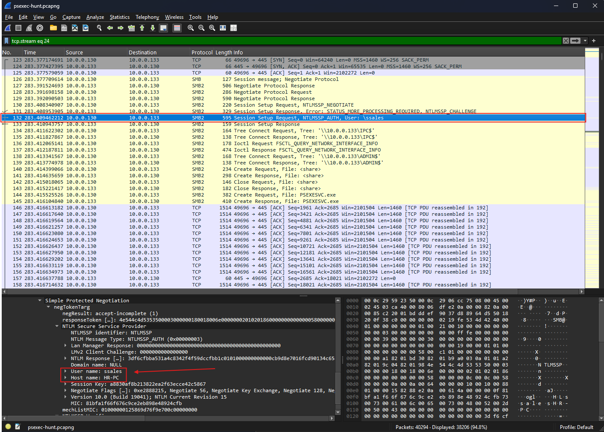
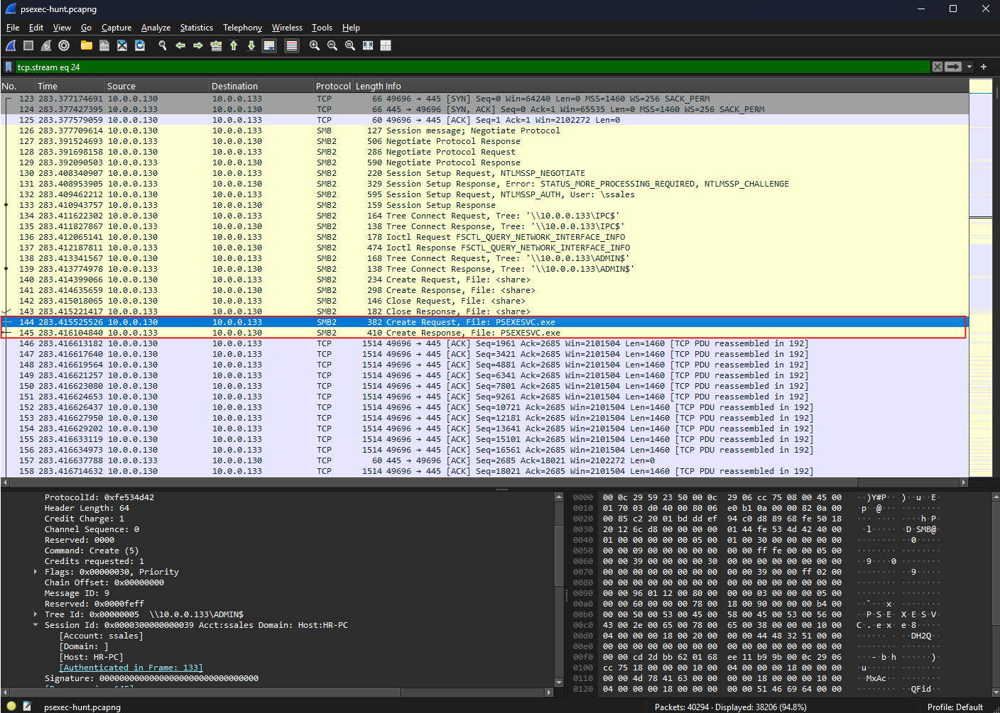
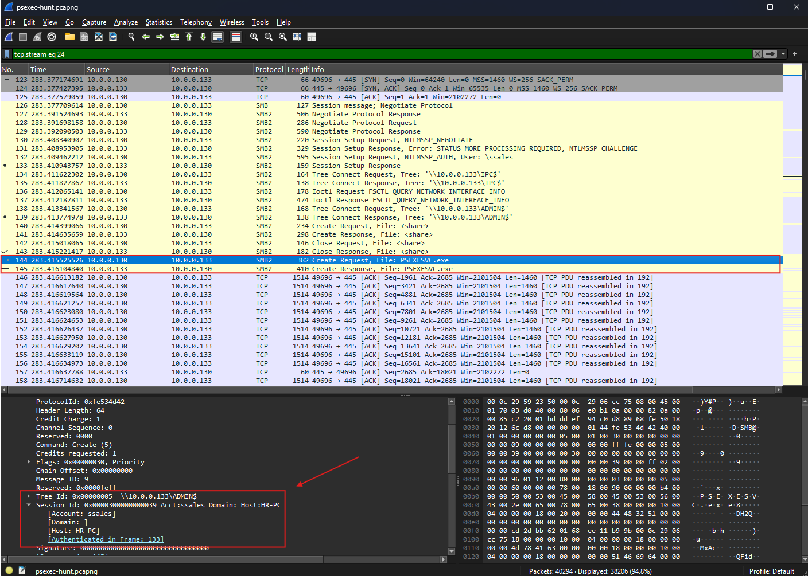
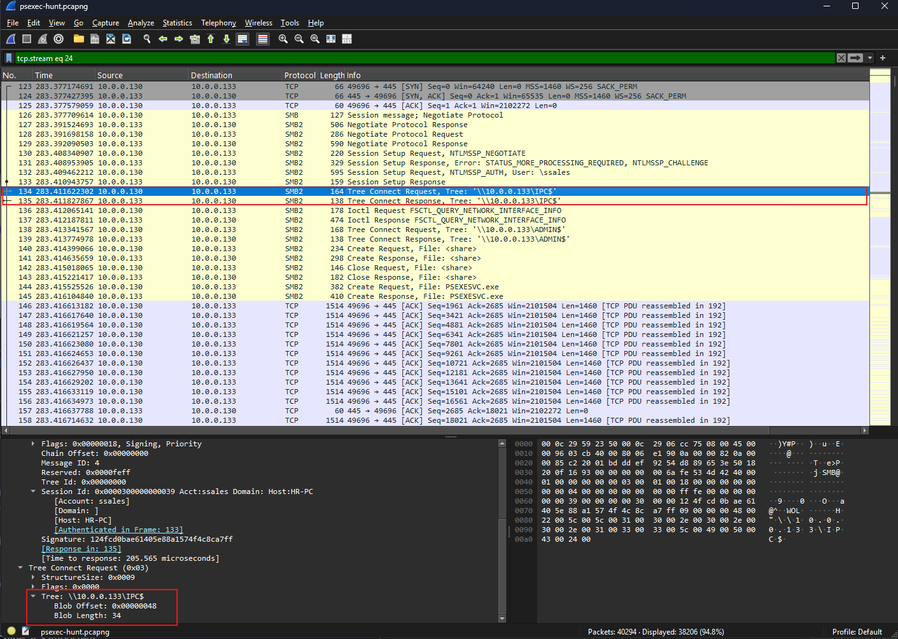
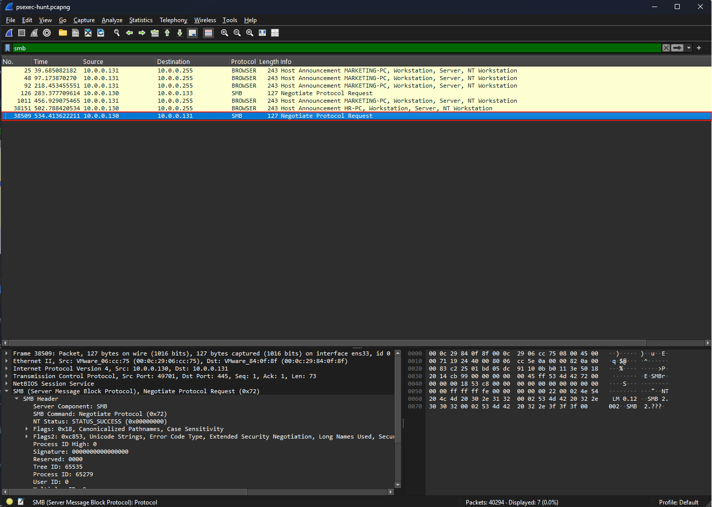
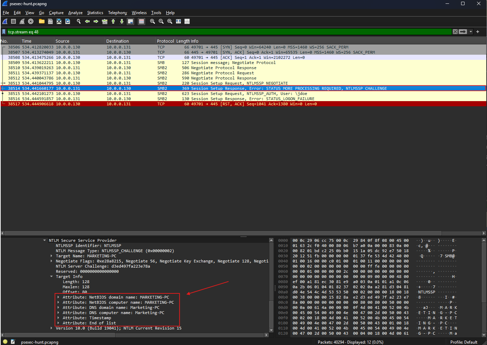

# Lab Overview
---
**Lab:** [PsExec Hunt Lab](https://cyberdefenders.org/blueteam-ctf-challenges/psexec-hunt/)  
**Platform:** CyberDefenders  
**Category:** Network Forensics  
**Difficulty:** Easy  
**Tools:** Wireshark  

# Summary
---
This lab investigates the use of PsExec, a remote administration utility, that was identified in the network of possible suspicious activity. Using Wireshark to analyze the network traffic, it was determined that an attacker initially compromised the host `HR-PC` and used the valid credentials `ssales` to move laterally across the network.  

Further analysis revealed that the attacker authenticated to machine `SALES-PC` via SMB protocol and established communication using the `IPC$` share. The attacker then transferred the `PSEXESVC.exe` service through the `ADMIN$` share on the target machine to enable remote command execution. This behavior shows common lateral movement technique that abuses legitimate administrative tools to evade detection.  

It was also determined that the attacker pivoted to additional machine identified as `MARKETING-PC`. This indicates that the attacker has successfully expanded their access within the environment.  

# Scenario
---
An alert from the Intrusion Detection System (IDS) flagged suspicious lateral movement activity involving PsExec. This indicates potential unauthorized access and movement across the network. As a SOC Analyst, your task is to investigate the provided PCAP file to trace the attacker’s activities. Identify their entry point, the machines targeted, the extent of the breach, and any critical indicators that reveal their tactics and objectives within the compromised environment.  

# Background
---
PsExec is a remote administration utility that allows remote execution through the Command Prompt. PsExec allows a user to manage processes remotely with SYSTEM-level privileges, and it can also redirect an application's console output to their local computer. PsExec creates a temporary service `PSEXESVC` on the target machine for remote command execution.  

PsExec first authenticates to the target machine through the SMB (Server Message Block) protocol then it connects to the `ADMIN$` administrative share. Once the connection has been established, the service will upload the `PSEXESVC.exe` binary to the target's `ADMIN$` administrative share. The `ADMIN$` share is a hidden administrative share that is mapped to the Windows system directory `C:\Windows` and is primarily used for administrative tasks like remote file transfers and execution. Finally, it will register `PSEXESVC.exe` as a Windows service and create named pipes for communication (full-duplex), enabling interactive command execution.  

Attackers typically first compromise an initial system and harvest credentials with local administrator privileges on target machines. Then, they exploit PsExec to execute commands remotely and/or move laterally.  
# Analysis
---
## To effectively trace the attacker's activities within our network, can you identify the IP address of the machine from which the attacker initially gained access?

We will use the networking utility `Wireshark` to perform our analysis. First, use the `Statistics > Protocol Hierarchy` to identify the protocols used in the PCAP file.  
  
From the screenshot, we can observe that the SMB protocol was highly used in the network traffic.  

We will now investigate SMB specific traffic in the PCAP file. Apply the display filter `smb` in Wireshark to filter for only traffic that utilized the SMB protocol.  
  
As we can observe from the results, packet number `126` shows a client with the source IP address `10.0.0.130` sending a Negotiate Protocol Request to IP address `10.0.0.133`. This indicates a request to establish communications between a client and a server over port `445` using the SMB protocol.  

We can conclude that the attacker has initially compromised the machine with the IP address `10.0.0.130` and then used the SMB negotiation to attempt to move laterally to other machines.  

## To fully understand the extent of the breach, can you determine the machine's hostname to which the attacker first pivoted?

To further investigate the SMB traffic, we can follow the TCP stream by right clicking on packet `126` and click `Follow > TCP Stream`. This will trace the SMB communication sequence in detail which will allow us to trace the attacker's movement and interactions with the target systems.  
  
In the screenshot, the SMB traffic revealed the use of [NTLM](https://www.crowdstrike.com/en-us/cybersecurity-101/identity-protection/windows-ntlm/) authentication to connect to the target machine. If we further examine the challenge message from the server at packet number `131`, it includes metadata about the target machine specifically the NetBIOS computer name. From this metadata, we can extract the target machine's host name identified as `SALES-PC`.  

## Knowing the username of the account the attacker used for authentication will give us insights into the extent of the breach. What is the username utilized by the attacker for authentication?

The next packet, number `132`, is the client's authentication message to the server (reply to packet `131`) as part of the NTLM authentication process.  
  
Further inspection of packet `132` revealed metadata that includes the username used for authentication. We can extract the username identified as `ssales` belonging to the host `HR-PC`.  

## After figuring out how the attacker moved within our network, we need to know what they did on the target machine. What's the name of the service executable the attacker set up on the target?

Following along in the TCP stream, we can observe an SMB `Create Request` for the file `PSEXESVC.exe`, which we know is a service component of PsExec used for remote administration.  
  

## We need to know how the attacker installed the service on the compromised machine to understand the attacker's lateral movement tactics. This can help identify other affected systems. Which network share was used by PsExec to install the service on the target machine?

In the same SMB `Create Request` for the file `PSEXESVC.exe`, the packet details include a Tree Id that points to `\\10.0.0.133\ADMIN$` and the account used for the operation `ssales`. This confirms that the `ADMIN$` share was used by the attacker to copy the PsExec service executable to the target machine.  
  

## We must identify the network share used to communicate between the two machines. Which network share did PsExec use for communication?

Looking at the SMB Tree Connect Requests earlier in the traffic, it shows the attacker used the `IPC$` share for communication. The `IPC$` (Inter-Process Communication) is a special administrative share on Windows that is commonly used in SMB connections for operations involving authentication, remote service management, or command execution.  
  
Packet `134` shows a Tree Connect Request to `\\10.0.0.130\IPC$` which confirms that the `IPC$` share was used by the attacker.  
## Now that we have a clearer picture of the attacker's activities on the compromised machine, it's important to identify any further lateral movement. What is the hostname of the second machine the attacker targeted to pivot within our network?

Early when applied the `smb` display filter, there was actually a second SMB negotiation requests to the IP address `10.0.0.131`. We will now analyze packet `38509` and follow its TCP stream.  
  

Following packet's `38509`'s SMB traffic, we can observe it also utilized the NTLM authentication.   
  
Upon inspecting packet `38514` which is the server's challenge message to the client `10.0.0.131`, we can see in the metadata that the attacker is now targeting a new machine with the host name `MARKETING-PC`.   

# Additional Resources
---
- [PsExec: What It Is and How to Use It](https://www.lifewire.com/psexec-4587631)
- [How Windows Command-line Utility PsExec Can Be Abused To Execute Malicious Code](https://cybersecuritynews.com/windows-command-line-utility-psexec/)
- [PsExecexe Abuse: The Legitimate Tool Turned Cyber Weapon and How to Stop It](https://undercodetesting.com/psexecexe-abuse-the-legitimate-tool-turned-cyber-weapon-and-how-to-stop-it/)
- [NTLM Explained](https://www.crowdstrike.com/en-us/cybersecurity-101/identity-protection/windows-ntlm/)