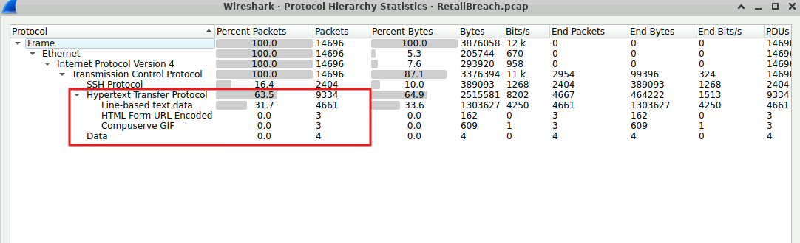
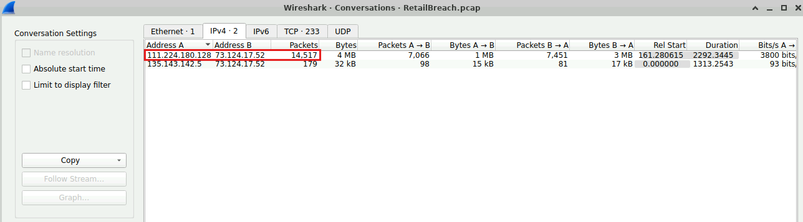
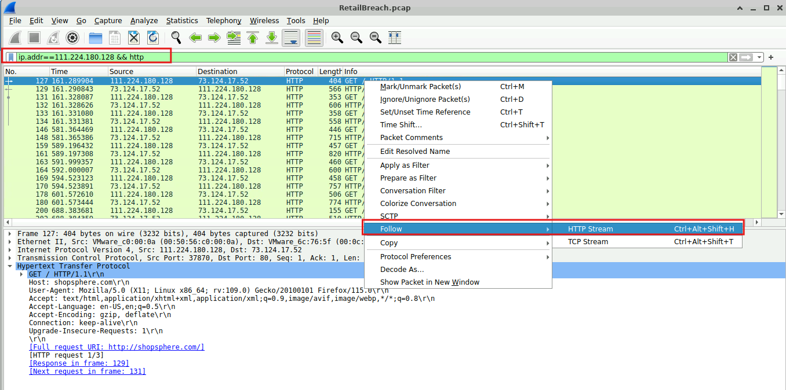
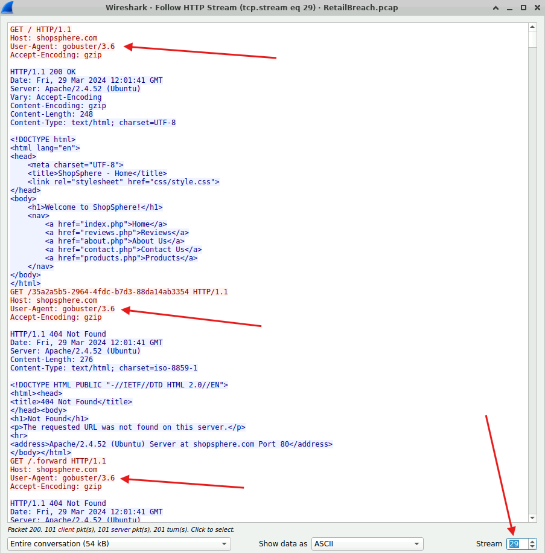
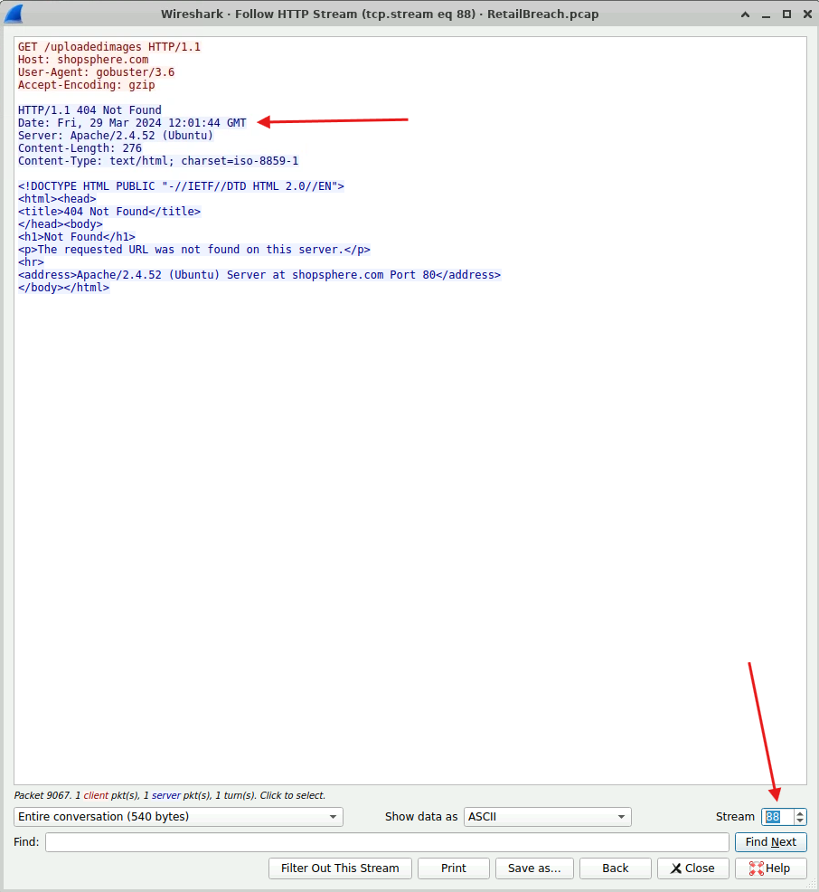
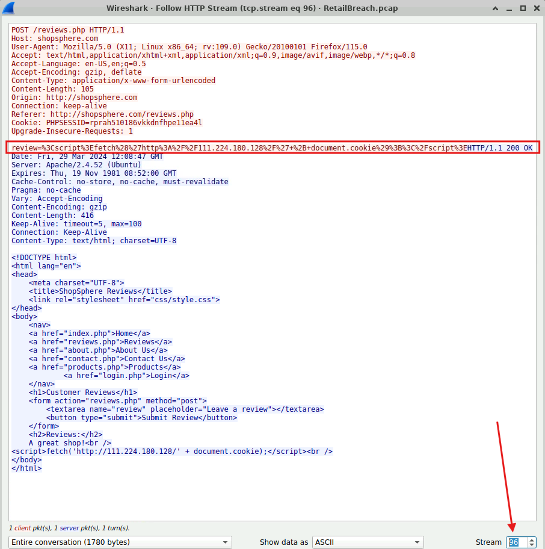
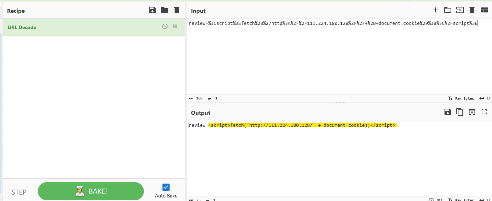
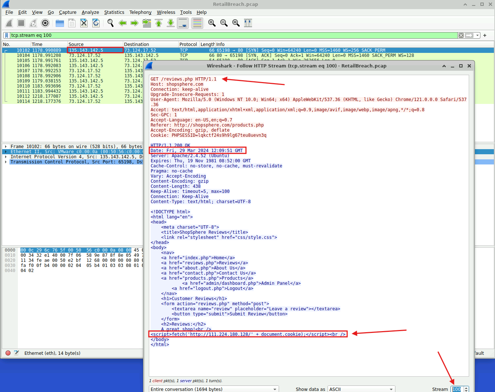
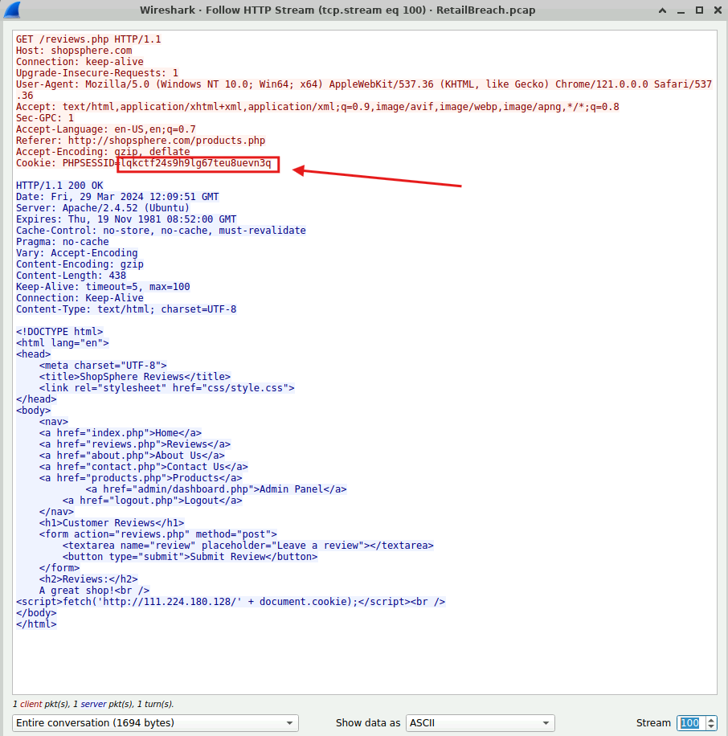
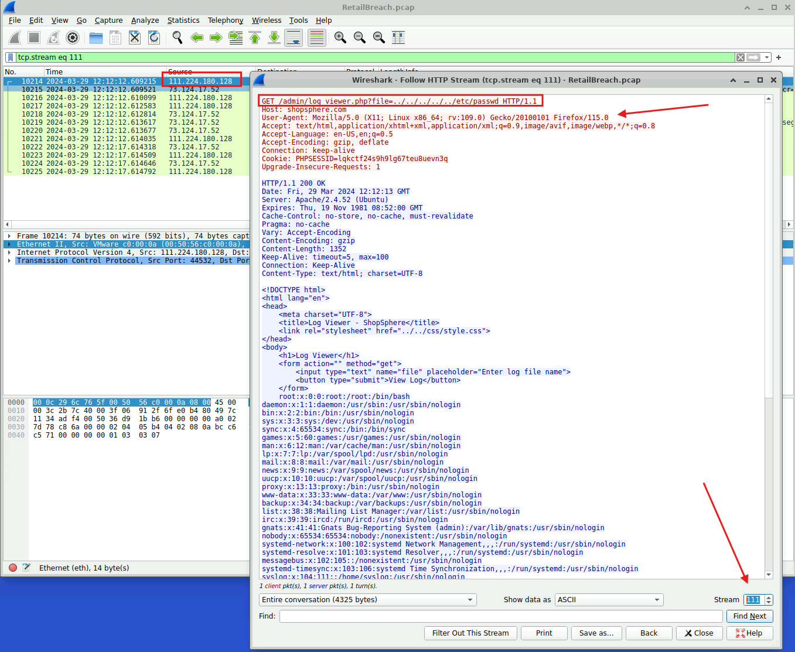

# Lab Overview
---
**Lab:** [RetailBreach Lab](https://cyberdefenders.org/blueteam-ctf-challenges/retailbreach/)  
**Platform:** CyberDefenders  
**Category:** Network Forensics  
**Difficulty:** Easy  
**Tools:** Wireshark  

# Summary
---
This lab investigates a multi-stage web application attack against the ShopSphere retail platform using PCAP analysis. The attacker at IP address `111.224.180.128` began with directory enumeration using `gobuster`, then exploited a stored Cross-Site Scripting (XSS) vulnerability on the `reviews.php` page by injecting a malicious script.

When an admin user visited the page containing the injected script, their session token was captured by the attacker. Using the stolen session token, the attacker gained unauthorized administrative access and proceeded to exploit a path traversal vulnerability in the `log_viewer.php` script to read sensitive system files such as `/etc/passwd`.

# Scenario
---
In recent days, ShopSphere, a prominent online retail platform, has experienced unusual administrative login activity during late-night hours. These logins coincide with an influx of customer complaints about unexplained account anomalies, raising concerns about a potential security breach. Initial observations suggest unauthorized access to administrative accounts, potentially indicating deeper system compromise.

Your mission is to investigate the captured network traffic to determine the nature and source of the breach. Identifying how the attackers infiltrated the system and pinpointing their methods will be critical to understanding the attack's scope and mitigating its impact.

# Analysis
---
## Identifying an attacker's IP address is crucial for mapping the attack's extent and planning an effective response. What is the attacker's IP address?

I first used the `Statistics > Protocol Hierarchy` feature in Wireshark to understand what kind of traffic was captured.  
  
In the screenshot above, this network capture is largely HTTP traffic.  

The next feature I used was the Statistics > Convesation feature to identify what IP addresses have been communicating with each other.  
  
In the screenshot above, there was a significant amount of conversation happening between `111.224.180.128` and `73.124.17.52` as indicated by the total amount of packets of `14,517`. This indicates that there could be something interesting between these two endpoints so we will investigate this conversation.  

I searched for all HTTP traffic that pertains to the IP `111.224.180.128`. To get a better understanding of what communication was occurring between these two endpoints, I followed its HTTP Stream.  
  

As I was analyzing each stream, at stream 29, I noticed the User-Agent had changed from `Mozilla/5.0 (X11; Linux x86_64; rv:109.0) Gecko/20100101 Firefox/115.0` to `gobuster/3.6`.  The use of the `gobuster` tool is an immediate red flag as it is typically used by attackers during the reconnaissance phase to enumerate and discover directories.  
  

The enumeration ended on stream 88 and lasted a total of 3 seconds.  
  

Based on this evidence, the IP address `111.224.180.128` is likely the malicious IP address while IP address `73.124.17.52` is the web server.  
## The attacker used a directory brute-forcing tool to discover hidden paths. Which tool did the attacker use to perform the brute-forcing?

As we previously identified, the attacker utilized the `gobuster` tool to enumerate and discover directories.  
  

## Cross-Site Scripting (XSS) allows attackers to inject malicious scripts into web pages viewed by users. Can you specify the XSS payload that the attacker used to compromise the integrity of the web application?

Further analysis into the HTTP Stream revealed that at stream 96, the attacker is on the `review.php` page and attempted to submit a suspicious command in the review text area.  
  

Using the URL Decode recipe in CyberChef revealed the script that the attacker injected into the web page.  
  

## Pinpointing the exact moment an admin user encounters the injected malicious script is crucial for understanding the timeline of a security breach. Can you provide the UTC timestamp when the admin user first visited the page containing the injected malicious script?

At HTTP Stream 100, the source IP address has changed to `135.143.142.5` which indicates that this is no longer the attacker accessing the `/reviews.php`  page but likely an admin user. Another indicator is that the User-Agent has changed from FireFox to Chrome.  

In the screenshot below, the admin user first visited the `/reviews.php` page at `2024-03-29 12:09:50 UTC`.  
  

## The theft of a session token through XSS is a serious security breach that allows unauthorized access. Can you provide the session token that the attacker acquired and used for this unauthorized access?

In the same stream as the previous, the admin token that was captured by the attacker is `lqkctf24s9h9lg67teu8uevn3q`.  
  
## Identifying which scripts have been exploited is crucial for mitigating vulnerabilities in a web application. What is the name of the script that was exploited by the attacker?

At stream 111, the User-Agent belongs with FireFox and the source IP address is now the attacker's. This stream shows the attacker performing a path traversal of the `log_viewer.php` script to find the `/etc/passwd` file.  
  

## Exploiting vulnerabilities to access sensitive system files is a common tactic used by attackers. Can you identify the specific payload the attacker used to access a sensitive system file?

The payload is `../../../../../etc/passwd`.  
  