# Lab Overview
---
**Lab:** [Web Investigation Lab](https://cyberdefenders.org/blueteam-ctf-challenges/web-investigation/)  
**Platform:** CyberDefenders  
**Category:** Network Forensics  
**Difficulty:** Easy  
**Tools:** Wireshark, CyberChef  

# Summary
---
This lab investigates a web application attack against BookWorld through analysis of network traffic captured in a PCAP file. The analysis revealed that an external attacker identified as `111[.]224[.]250[.]131` exploited a SQL injection vulnerability in the `search.php` endpoint to enumerate databases and extract sensitive customer data from the `bookworld_db.customers` table.

Further activity showed that the attacker discovered hidden administrative functionality under the `/admin/` directory and successfully gained access by brute-forcing credentials. With administrative access, the attacker uploaded a malicious PHP script identified as `NVri2vhp.php`.  

# Scenario
---
You are a cybersecurity analyst working in the Security Operations Center (SOC) of BookWorld, an expansive online bookstore renowned for its vast selection of literature. BookWorld prides itself on providing a seamless and secure shopping experience for book enthusiasts around the globe. Recently, you've been tasked with reinforcing the company's cybersecurity posture, monitoring network traffic, and ensuring that the digital environment remains safe from threats.

Late one evening, an automated alert is triggered by an unusual spike in database queries and server resource usage, indicating potential malicious activity. This anomaly raises concerns about the integrity of BookWorld's customer data and internal systems, prompting an immediate and thorough investigation.

As the lead analyst in this case, you are required to analyze the network traffic to uncover the nature of the suspicious activity. Your objectives include identifying the attack vector, assessing the scope of any potential data breach, and determining if the attacker gained further access to BookWorld's internal systems.

# Analysis
---
## By knowing the attacker's IP, we can analyze all logs and actions related to that IP and determine the extent of the attack, the duration of the attack, and the techniques used. Can you provide the attacker's IP?

To identify the attacker's IP address, I first used the `Statistics > IPv4 Statistics > All Addresses` feature in Wireshark to get an overview of what IP addresses are in this network capture.  
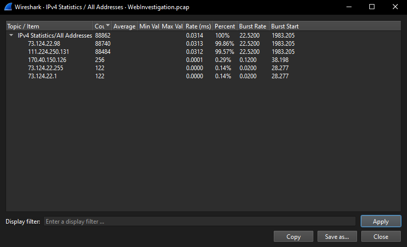  
From the screenshot above, the two IP addresses, `73[.]124[.]22[.]98` and `111[.]224[.]250[.]131`, have a very high count in this network capture. These two addresses could be interesting so we will keep these in mind.  

Next, I used the Statistics > Protocol Hierarchy feature to get an idea of what kind of traffic was captured. This helps me filter out the noise by focusing only on interesting traffic.  
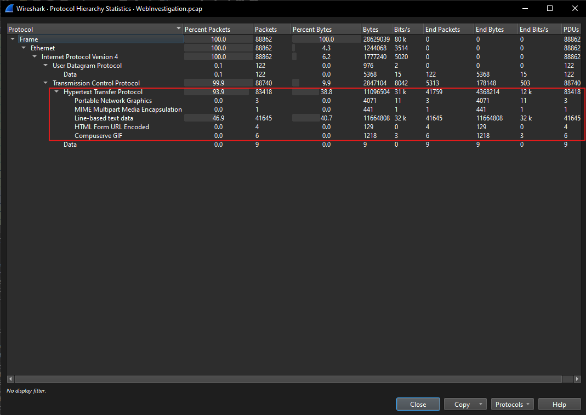  
Based on the screenshot above, I observe that this PCAP file mostly captured HTTP traffic and I immediately think that there could be some sort of SQL injection based on what we know about about BookWorld's suspicious database activity.  

I applied the `http` display filter to isolate HTTP traffic. The results show that IP address `111[.]224[.]250[.]131` is consistently making HTTP GET requests to `73[.]124[.]22[.]98`.  
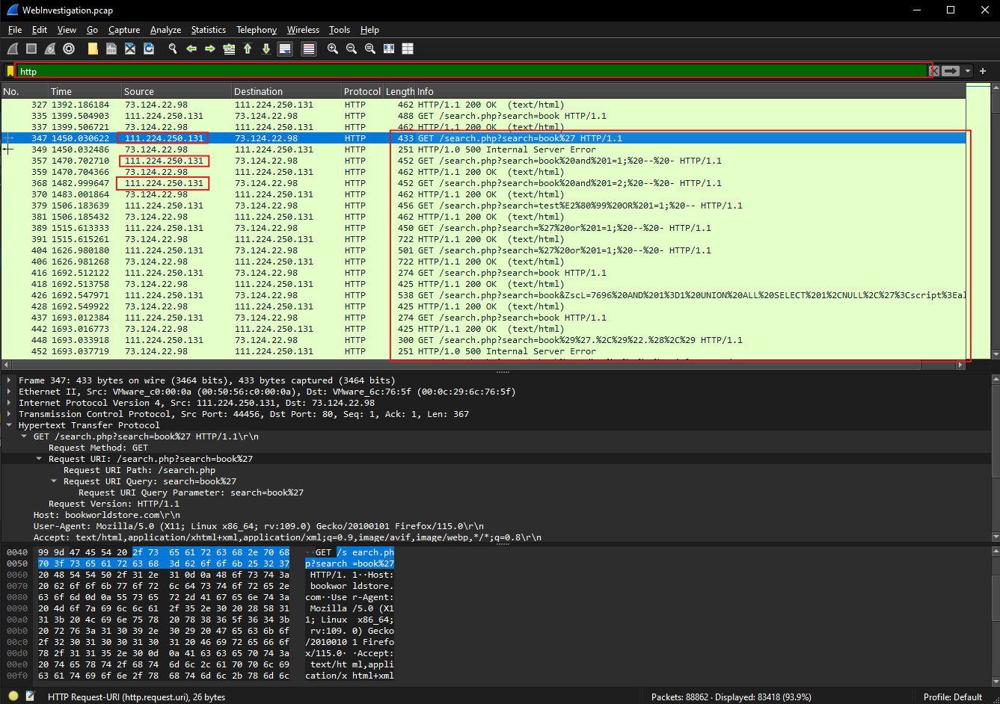  
Based on this request pattern, I identified `111[.]224[.]250[.]131` is the attacker's IP address, while `73[.]124[.]22[.]98` is BookWorld's server responding to those request. I also observed the HTTP GET requests containing suspicious query parameters which warrants for further investigation.  

## If the geographical origin of an IP address is known to be from a region that has no business or expected traffic with our network, this can be an indicator of a targeted attack. Can you determine the origin city of the attacker?

I used IPinfo to analyze the IP address `111[.]224[.]250[.]131`, which revealed that its origin city is `Shijiazhuang`.  
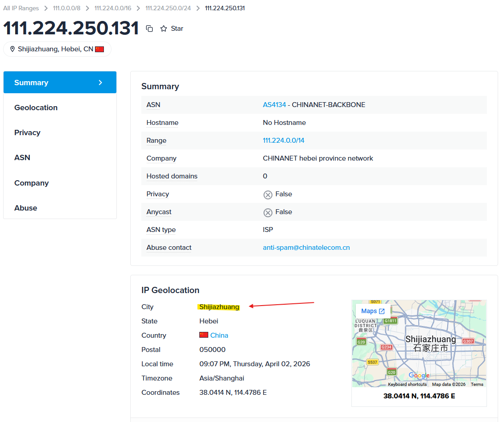  

## Identifying the exploited script allows security teams to understand exactly which vulnerability was used in the attack. This knowledge is critical for finding the appropriate patch or workaround to close the security gap and prevent future exploitation. Can you provide the vulnerable PHP script name?

Packet 426 shows an HTTP GET request targeting `search.php` with suspicious query parameters. The structure of the input suggests a possible SQL injection attempting, indicating that `search.php` is likely the vulnerable script.  
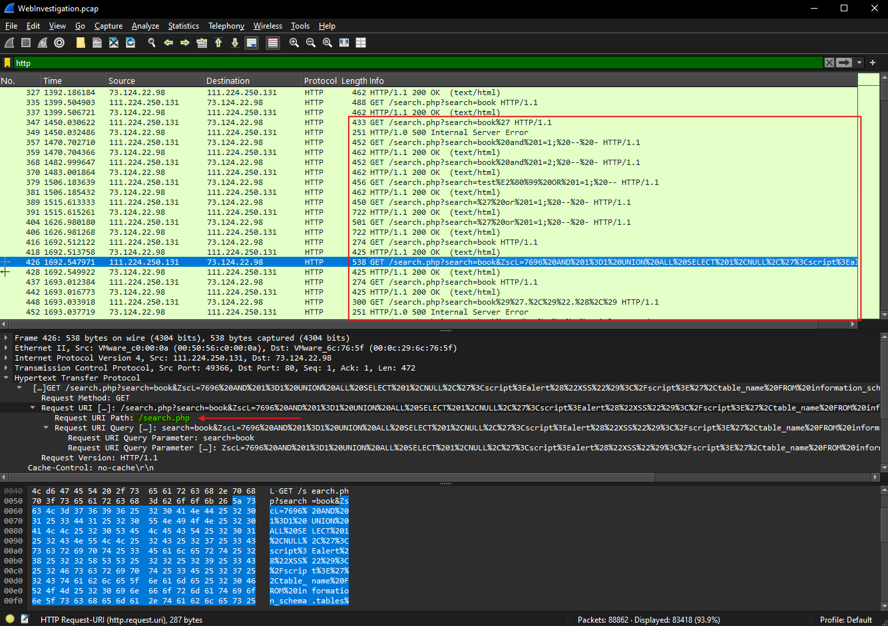  

## Establishing the timeline of an attack, starting from the initial exploitation attempt, what is the complete request URI of the first SQLi attempt by the attacker?

Packet 357 is the first HTTP GET request targeting `search.php` with encoded query parameters that appear suspicious.  
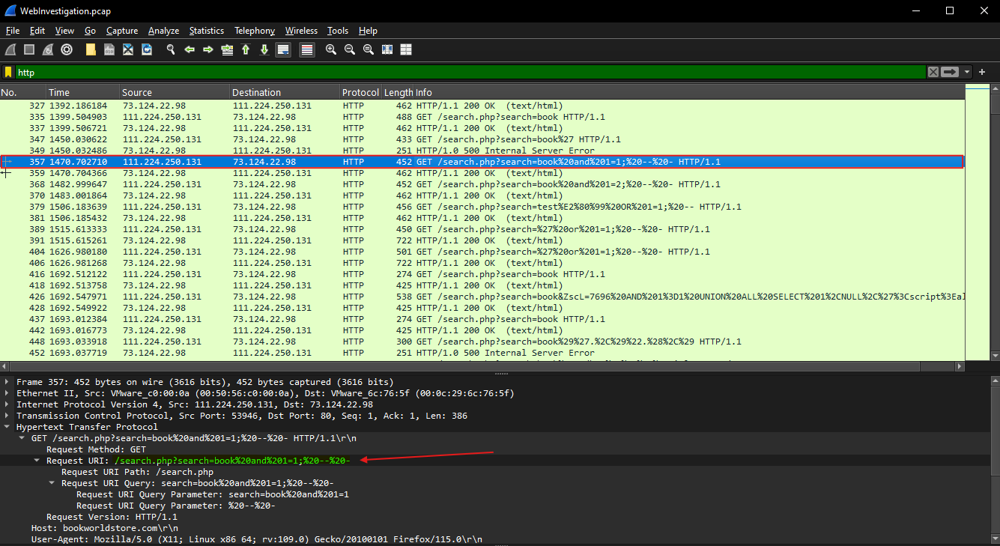  

To further analyze the query, I copied the query string into CyberChef and applied the URL Decode operator to decode the string.  
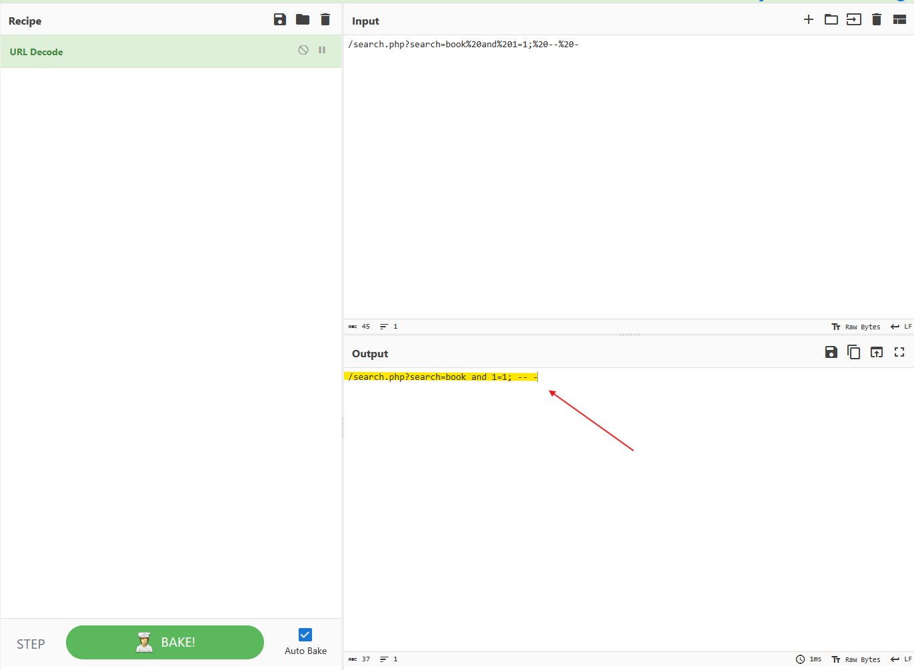  
Upon decoding, the results confirm that the request was an attempt to exploit a SQL injection vulnerability because the query contains the payload `' AND 1=1; -- -` which is used to manipulate query logic and bypass input validation.   

## Can you provide the complete request URI that was used to read the web server's available databases?

To identify the query that was used to read the web server's available databases, I narrowed down the traffic further by applying the search `(ip.src==111.224.250.131 and http) && (http.request.uri.path == "/search.php")`. This search will set the source IP address to the attacker's IP, isolate HTTP traffic, and ensure the request URI is for `search.php`.  
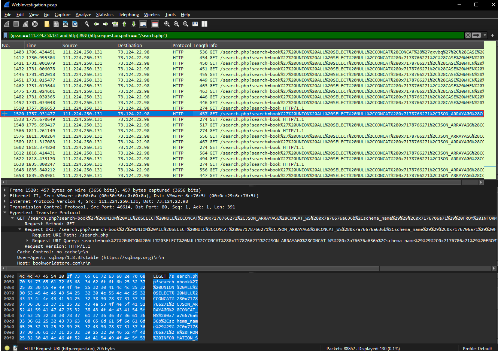  
Based on my analysis, packet 1520 contains the suspicious query that is possibly reading the web server's databases.  

Upon decoding the query string in CyberChef, the payload reveals a `UNION ALL SELECT `querying `INFORMATION_SCHEMA.SCHEMA`. This is used to enumerate the web server's database names.  
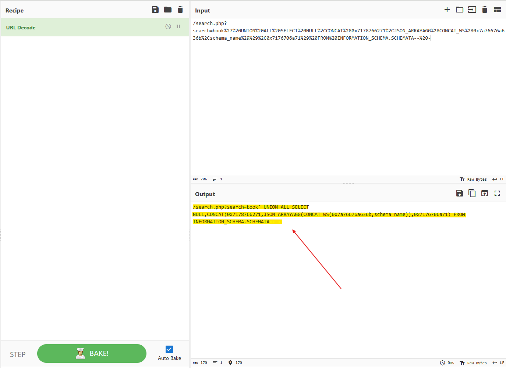  
This confirms that the query in packet 1520 was specifically crafted to read the web server's available databases.  

## Assessing the impact of the breach and data access is crucial, including the potential harm to the organization's reputation. What's the table name containing the website users data?

Now that we know the attacker has queried for all database names, they likely have an idea of the available databases they can query. I applied a new filter `(ip.src==111.224.250.131 or ip.dst==111.224.250.131) and http` to also include server responses to the attacker's requests.  
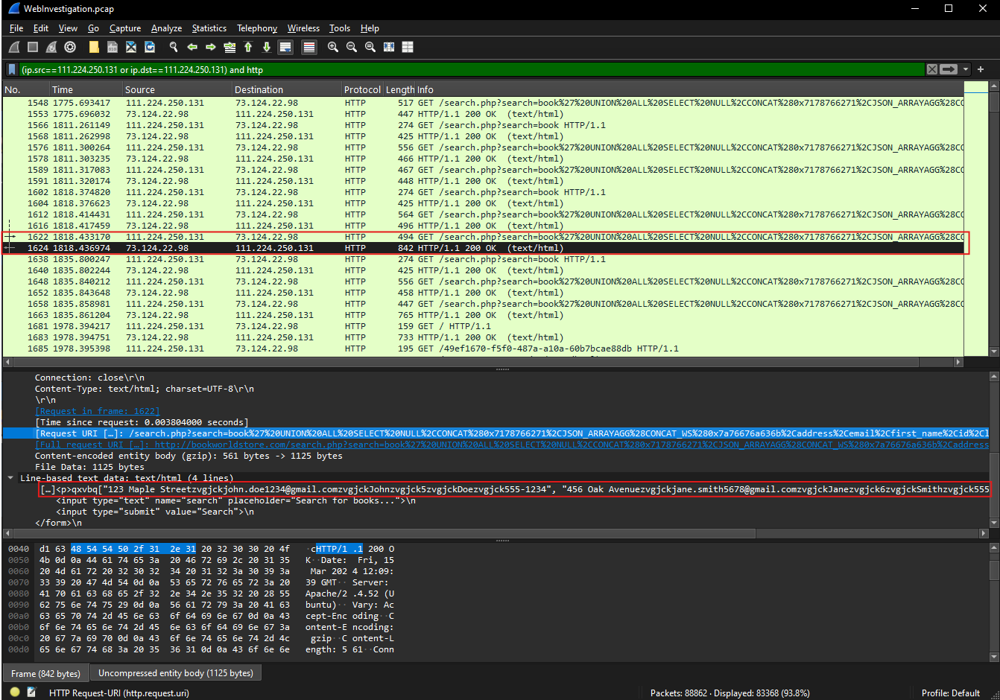  
From the screenshot above, deep packet detail inspection into packet 1624 revealed that it responded to the request from packet 1622 which a list of what appears to be street addresses and email addresses. This likely indicates that packet 1622 has made a successful query to a table that contained user street addresses and email addresses.  

To validate this, I decoded the query string from packet 1622 in CyberChef. The decoded payload revealed a `UNION SELECT ALL` statement querying fields like `address`, `email`, `first_name`, `last_name`, and `phone` from the `bookworld_db.customers` table.  
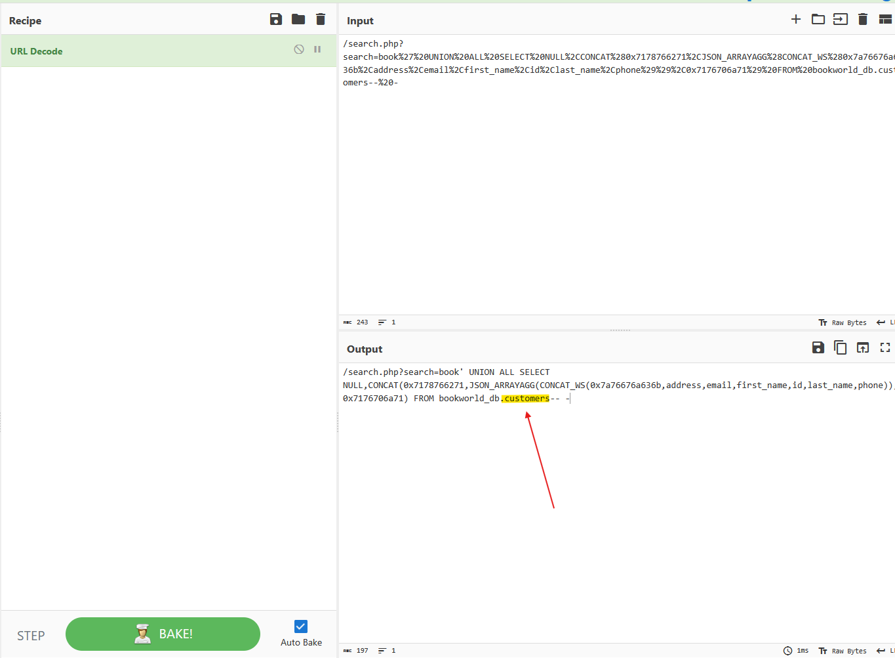  
This confirms that the attacker successfully accessed the `customers` table, which contains sensitive website user data.  

## The website directories hidden from the public could serve as an unauthorized access point or contain sensitive functionalities not intended for public access. Can you provide the name of the directory discovered by the attacker?

To identify any other directories in the traffic, I used the `Statistics > HTTP > Requests` feature to show me a list of all HTTP request URIs observed in the capture.  
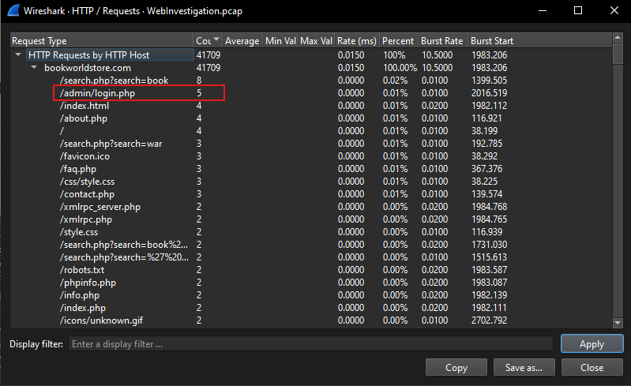  
From the screenshot above, I can see that `/admin/login.php` was captured 8 times which suggests that there are potential attempts to interact with the admin portal.  

To further investigation this, I included the filter `http.request.uri contains /admin/` to my previous search to isolate for HTTP requests to the `/admin/` directory.  
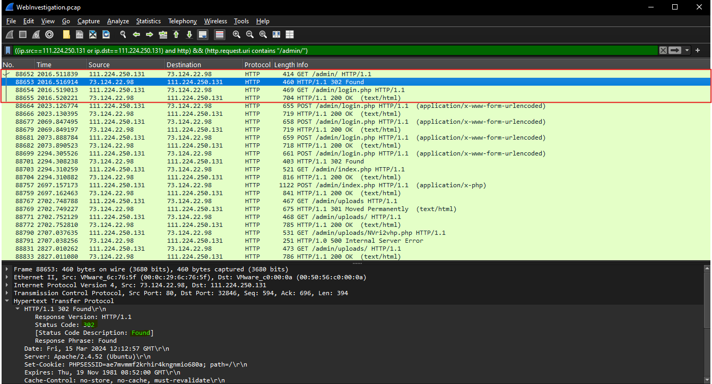  
The results show that the attacker accessed `/admin/` directory and requested `/admin/login.php`. The server responded with an HTTP 200 OK status, confirming that the resource exists and is accessible.  

## Knowing which credentials were used allows us to determine the extent of account compromise. What are the credentials used by the attacker for logging in?

Further analysis into the traffic, there is a sequence of HTTP POST requests to `/admin/login.php` indicating that the attacker is attempting to brute-force login credentials.  
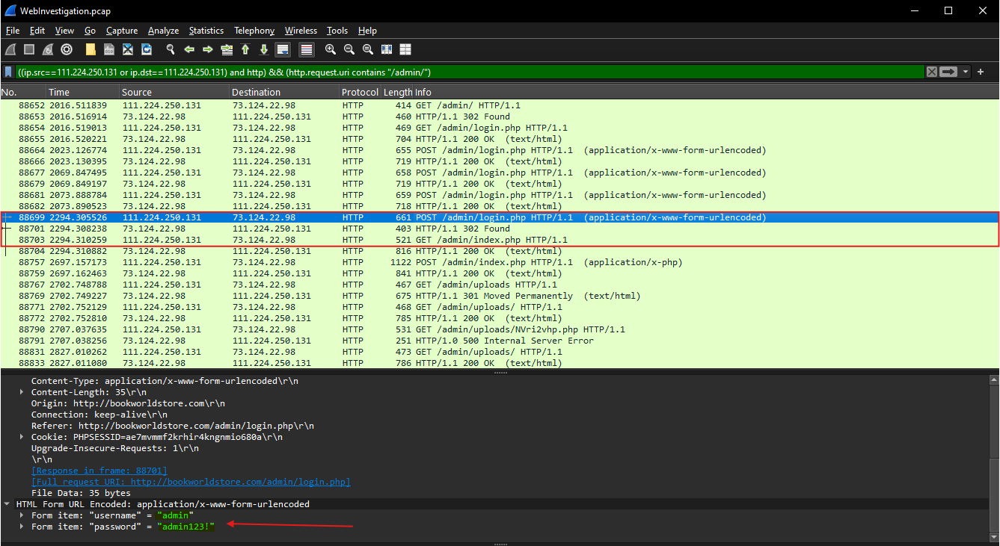  
Towards the end of the POST request to `/admin/login.php`, inspection into the details of packet 88699 revealed that the attacker attempted to login with the username `admin` and password `admin123!`. The subsequent packet 88701 responded with an HTTP 302 Found status meaning the server redirected the client after processing the login request.  

Packet 88703 shows a follow up request to `/admin/index.php` which confirms that access to the administrative panel was granted. This sequence strongly indicates that the attacker successfully authenticated using the provided credentials and gained access to the admin interface.  

## We need to determine if the attacker gained further access or control of our web server. What's the name of the malicious script uploaded by the attacker?

Inspection of packet 88757 reveals a POST request to `/admin/index.php` with a multipart/form-data payload. This indicates that a file upload action was made through the admin portal.  
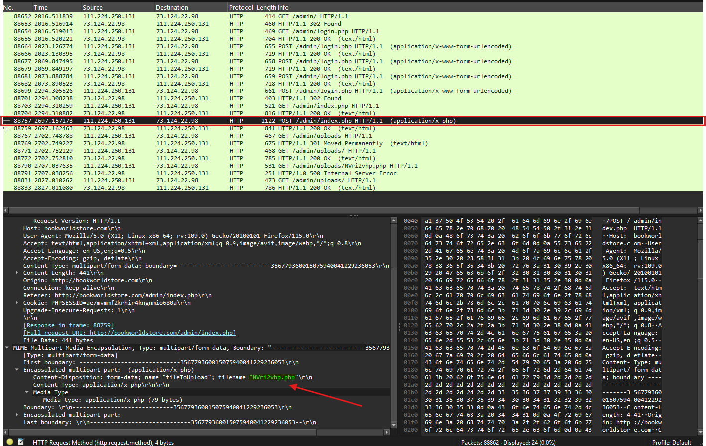  
Within the request body, the Content-Disposition header specifies `filename="NVri2vhp.php"`. This confirms that the attacker successfully uploaded a PHP file named `NVri2vhp.php` to the server.  

The subsequent traffic shows the attacker attempted to access the uploaded file through packet 88790 which made a request to `/admin/uploads/NVri2vhp.php`.  
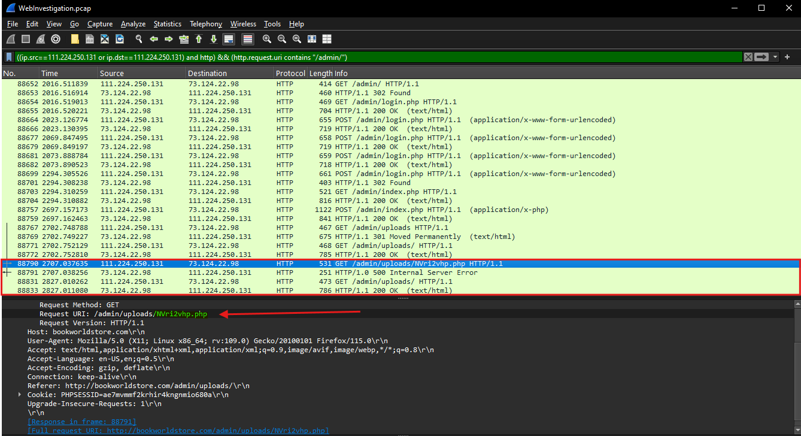  