# Lab Overview
---
**Lab:** [XLMRAT Lab](https://cyberdefenders.org/blueteam-ctf-challenges/xlmrat/)  
**Platform:** CyberDefenders  
**Category:** Network Forensics  
**Difficulty:** Easy  
**Tools:** Wireshark, CyberChef, VirusTotal  

# Summary
---
This lab investigates a malware infection through PCAP analysis using Wireshark, CyberChef and VirusTotal. Analysis showed that the compromised host downloaded an initial script (`xlm.txt`) from a malicious server which then retreived a secondary payload disguised as an image file (`mdm.jpg`).  

Further investigation into the payload revealed obfuscated code that reconstructed and executed malicious binaries including a loader and a secondary malware exectuable identified as AsyncRAT. The malware leveraged a living-off-the-land binaries (LOLBins), RegSvcs.exe, to execute code steathily and evade detection. Analysis also revealed that the script dropped multiple files into the system to allow for persistent execution and control.  

# Scenario
---
A compromised machine has been flagged due to suspicious network traffic. Your task is to analyze the PCAP file to determine the attack method, identify any malicious payloads, and trace the timeline of events. Focus on how the attacker gained access, what tools or techniques were used, and how the malware operated post-compromise.  

# Analysis
---
## The attacker successfully executed a command to download the first stage of the malware. What is the URL from which the first malware stage was installed?

To begin this investigation, the first step I like to do to get an overall understanding of what kind of traffic was captured in this PCAP file is use the `Statistics > Protocol Hierarchy` feature.  
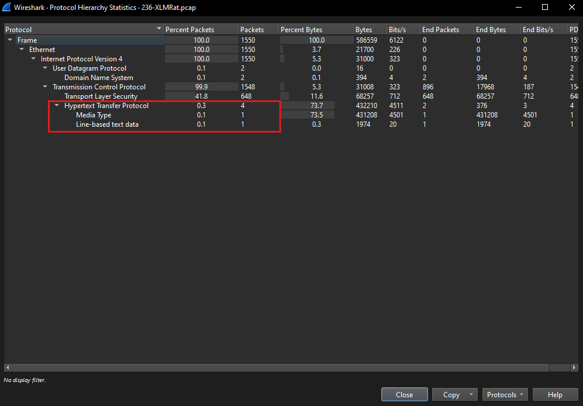  
From the screenshot above, there are 4 HTTP packets that was captured. These packets could be interesting so we will further investigate them.  

Using the `http` display filter, this will isolate HTTP traffic. From the screenshot below, there are 2 HTTP GET requests coming from source IP address `10.1.9.101` to the destination IP address `45.126.209.4`.  
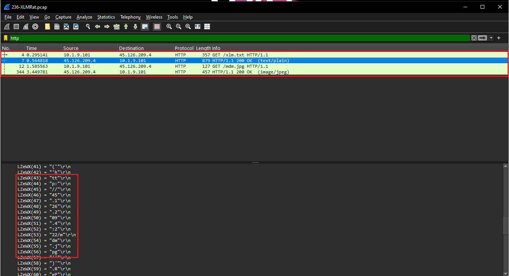  

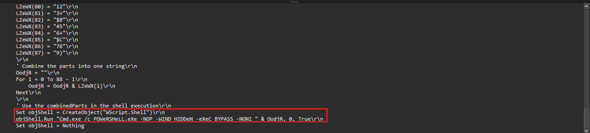  
Further inspection of packet 7, which is an HTTP response to packet 4's HTTP GET request for  `/xlm.txt`, reveals a malicious script embedded in the response body. The script appears to contain some logic to reconstruct obfuscated strings then invoke `cmd.exe` to execute a PowerShell command.  

Packet 12 shows an HTTP GET request to `/mdm.jpg`, which was previously identified in the obfuscated strings. Inspection of packet 344 confirms the request was successful returning an HTTP 200 OK response. The full URI in the details of this packet is `http://45.126.209.4:222/mdm.jpg`.   
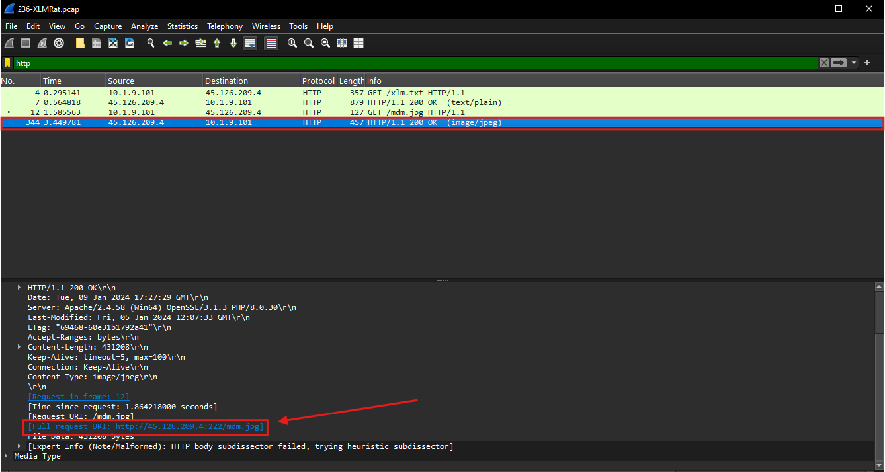  
This confirms that the resource referenced in the script was actively retreived during execution.  

## Which hosting provider owns the associated IP address?

Using IPinfo, the hosting provider for the malicious IP address `45.126.209.4` is identified as `ReliableSite.Net`.  
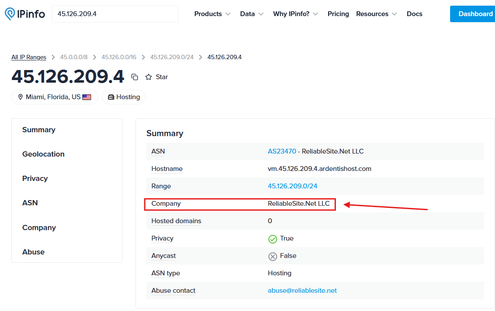  

## By analyzing the malicious scripts, two payloads were identified: a loader and a secondary executable. What is the SHA256 of the malware executable?

Following the HTTP Stream of the previously identified HTTP traffic, on Stream 1, it shows the client's GET request in red and the server's response in blue.  
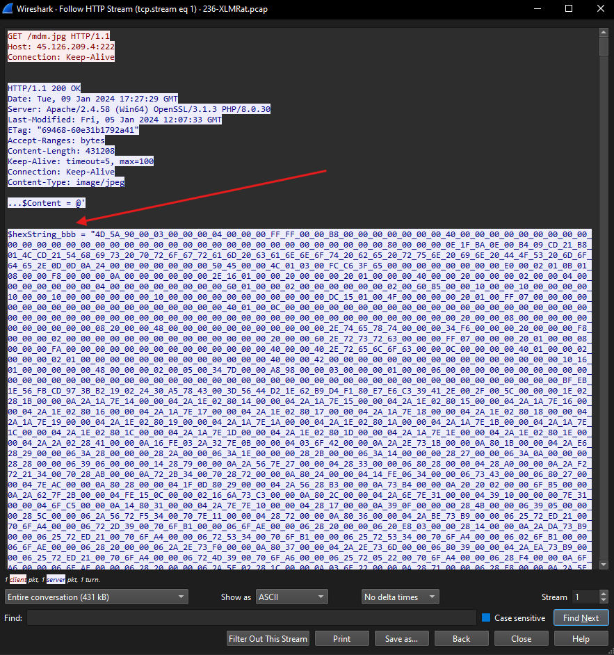  
In the server's reponse body, the contents appear to be in a hex format.  

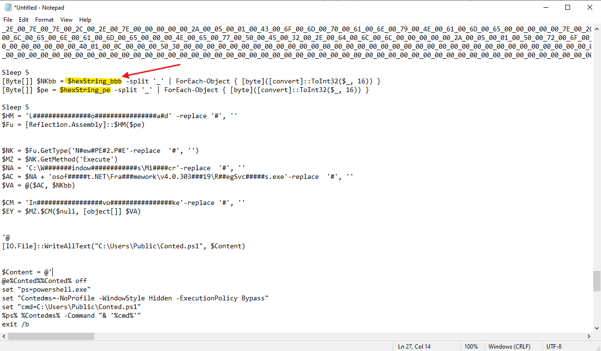  
Scrolling to the bottom of the response's body, there are some malicious code hidden in the `mdm.jpg` file. We can observe that the previously identified `$hexString_bbb` and `$hexString_pe` are some variables that are being used in the code.  

Using CyberChef, I decoded the hex-formatted data of `$hexString_bbb` using the "From Hex" recipe to reconstruct the original binary content then I used the SHA256 recipe to compute its hash which produced the value `1eb7b02e18f67420f42b1d94e74f3b6289d92672a0fb1786c30c03d68e81d798`.  
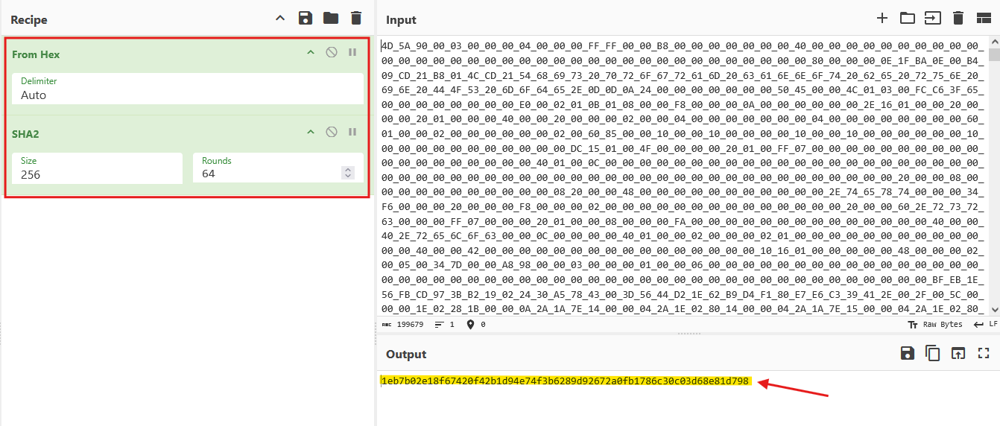  
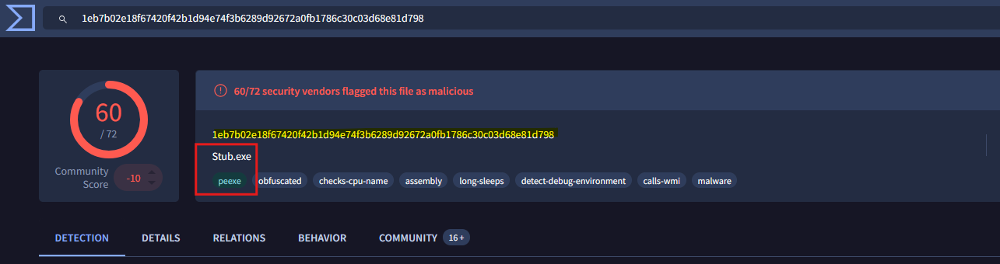  
Upon analyzing this SHA256 value in VirusTotal, the analysis shows that this value is a malicious executable file. This is likely the malware executable that we are looking for.  

Using CyberChef, I decoded the hex-formatted data of `$hexString_pe` using the "From Hex" recipe to reconstruct the original binary content then I used the SHA256 recipe to compute its hash which produced the value `2c6c4cd045537e2586eab73072d790af362e37e6d4112b1d01f15574491296b8`.  
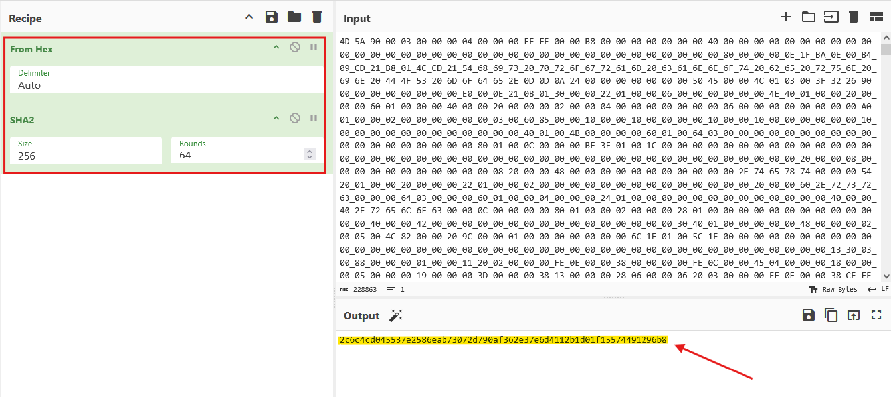  
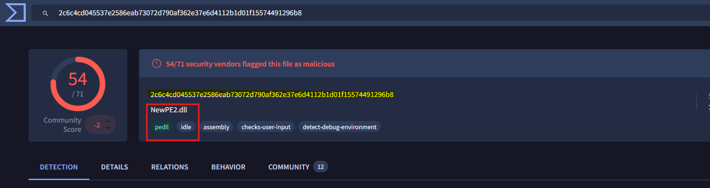  
Upon uploading this hash value to VirusTotal, the analysis shows that this hash is related to a DLL file. This is likely the loader in the malicious script.  

Based on the evidence, the hash value `1eb7b02e18f67420f42b1d94e74f3b6289d92672a0fb1786c30c03d68e81d798` corresponds to the malware executable in the malicious scripts payload.  
## What is the malware family label based on Alibaba?

In the Detection tab in VirusTotal, Alibaba labeled the malware executable as `AsyncRat`.  
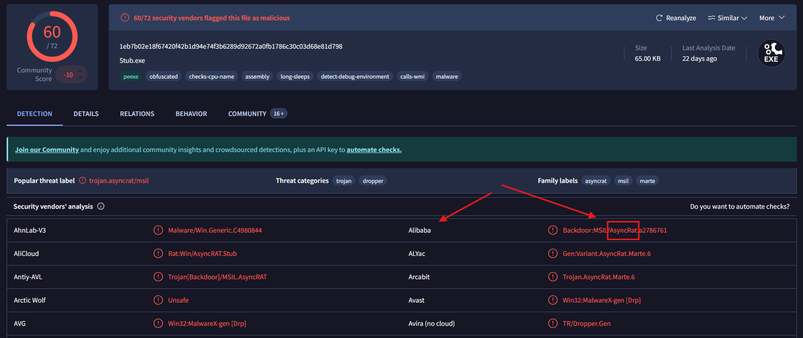  

## What is the timestamp of the malware's creation?

To find the malware's creation timestamp, navigate to the Details Tab then under the History section, we can find the creation time in UTC.  
  

## Which LOLBin is leveraged for stealthy process execution in this script? Provide the full path.

Further analysis of the script shows the use of `RegSvcs.exe`, as a LOLBIN. The script dynamically reconstructs the exectuable path and invokes it to execute malicious code.  
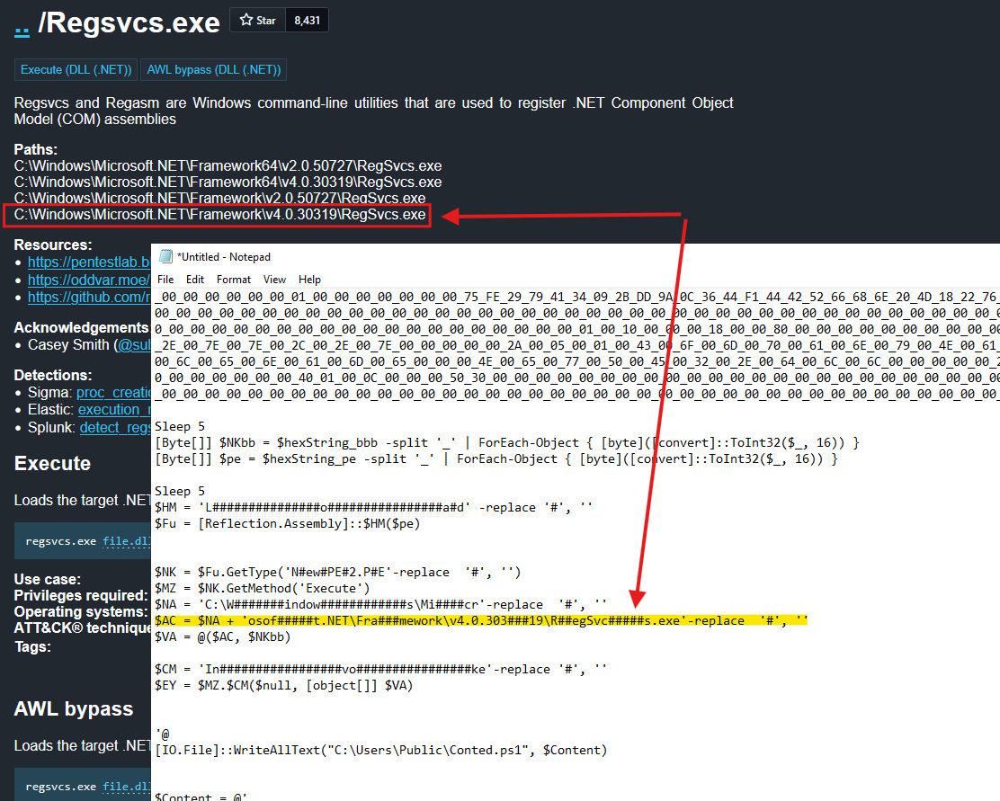  
To validate the use of `RegSvcs.exe` as a LOLBIN, I referenced the LOLBAS project, and it confirms that `RegSvcs.exe` can be leveraged for process execution which aligns with the behavior observed in this script.  

## The script is designed to drop several files. List the names of the files dropped by the script.

To identify the files dropped by the malicious script, I further investigated the code hidden in the `mdm.jpg` file.  
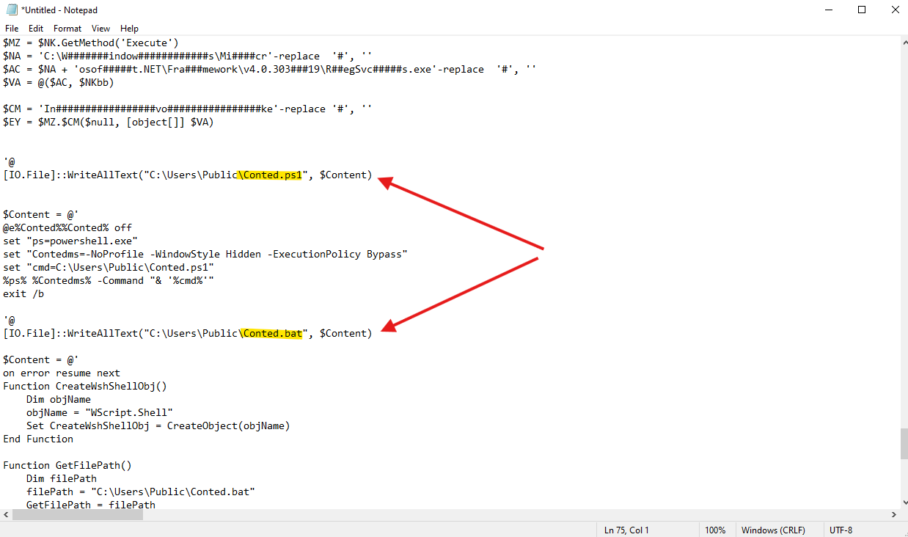  
From the screenshot above, the code appears to write some contents to the files `Conted.ps1` and `Conted.bat` in the `C:\Users\Public\` directory. These two files are likely the files dropped by the script.  

Scrolling down further revealed the third script `Conted.vbs` which is also dropped to the `C:\Users\Public\` directory.  
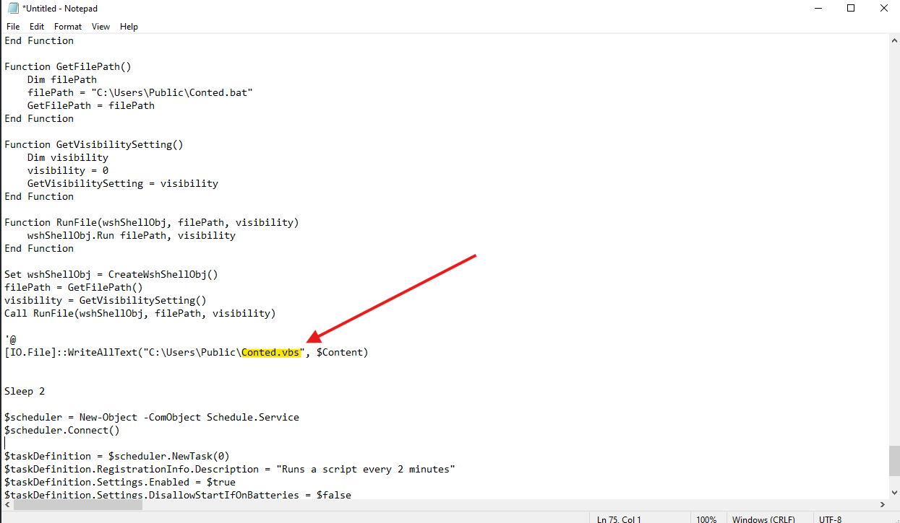  

