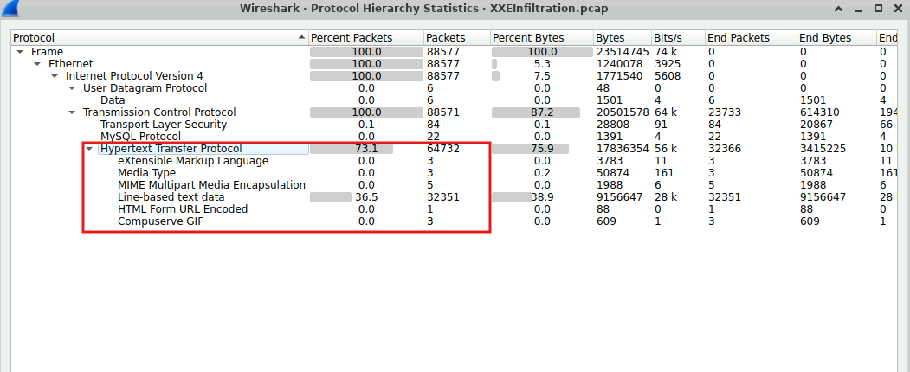
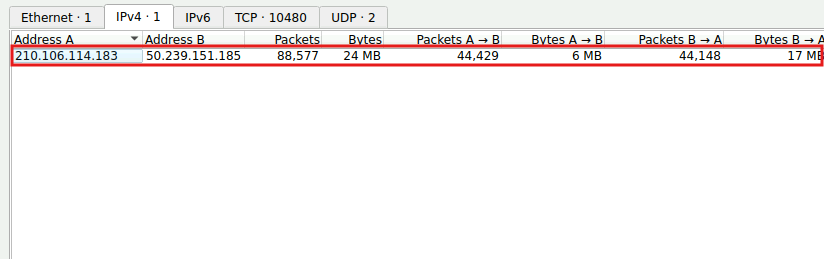
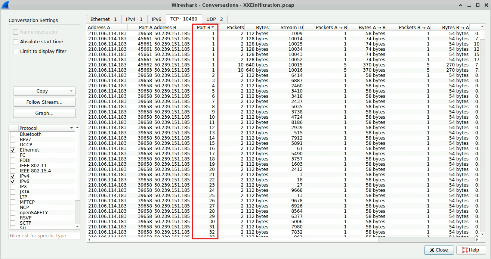
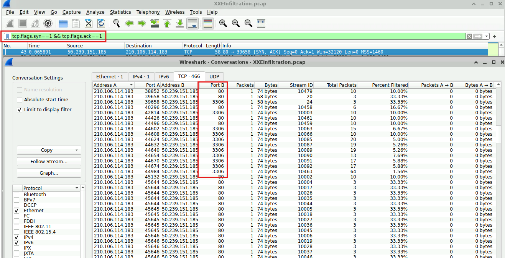
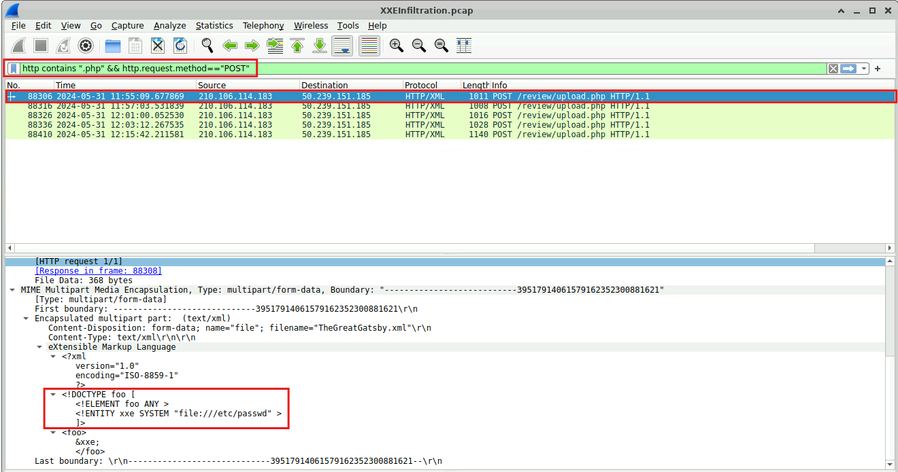
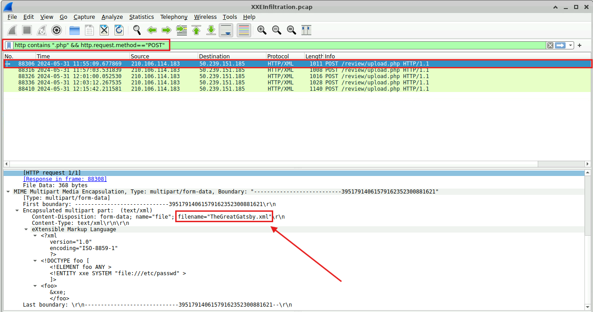
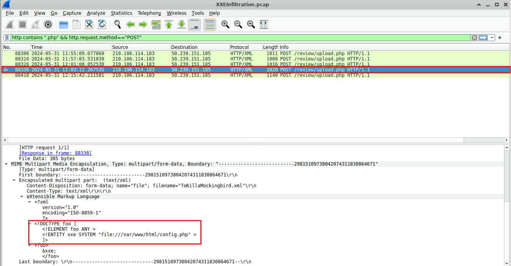
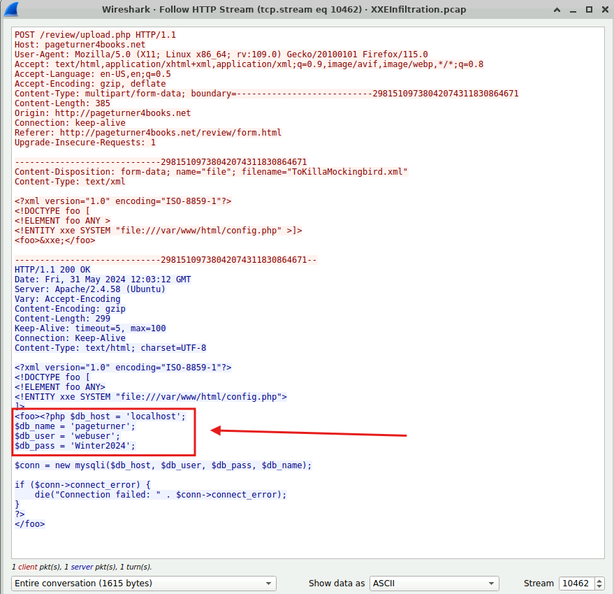
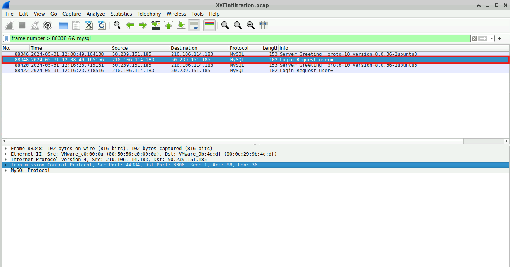
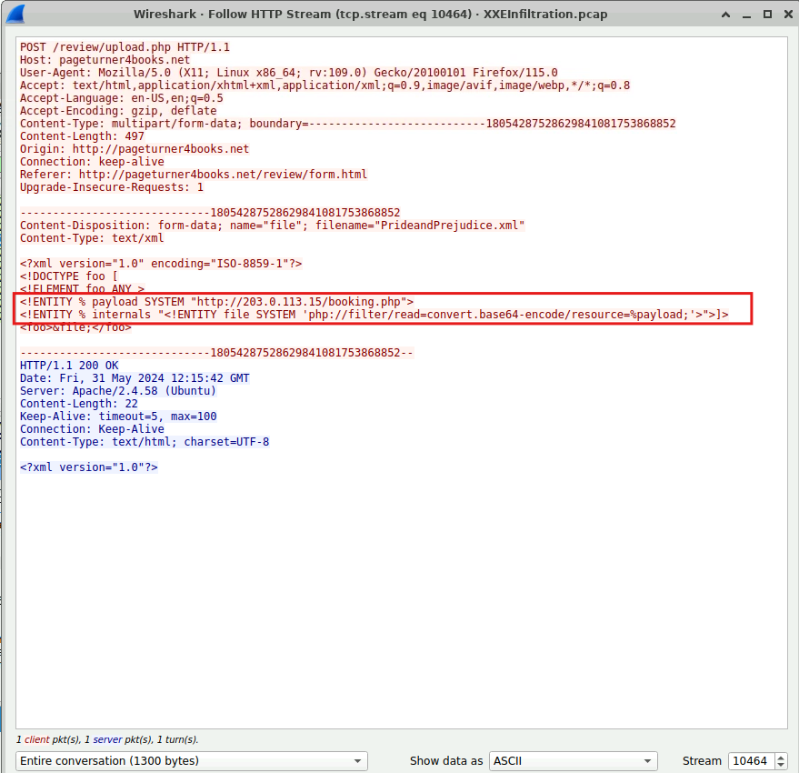

# Lab Overview
---
**Lab:** [XXE Infiltration Lab](https://cyberdefenders.org/blueteam-ctf-challenges/xxe-infiltration/)  
**Platform:** CyberDefenders  
**Category:** Network Forensics  
**Difficulty:** Easy  
**Tools:** Wireshark  

# Summary
---
This lab investigates an XML External Entity (XXE) injection attack against a web application using PCAP analysis. The attacker at IP address `210.106.114.183` performed initial port scanning and identified open ports `80` and `3306` before targeting the vulnerable PHP endpoint `/review/upload.php`.

Using a maliciously crafted XML file named `TheGreatGatsby.xml`, the attacker read the server's `config.php` file and extracted database credentials including the username `webuser` and password `Winter2024`. The attacker then used these compromised credentials to connect directly to the MySQL server on port `3306` within 5 minutes of obtaining them. A second XML payload was uploaded to retrieve a remote web shell named `booking.php` via PHP filter wrappers, establishing a persistent foothold on the server.

# Scenario
---
An automated alert has detected unusual XML data being processed by the server, which suggests a potential XXE (XML External Entity) Injection attack. This raises concerns about the integrity of the company's customer data and internal systems, prompting an immediate investigation.

Analyze the provided PCAP file using the network analysis tools available to you. Your goal is to identify how the attacker gained access and what actions they took.

# Analysis
---
## Identifying the open ports discovered by an attacker helps us understand which services are exposed and potentially vulnerable. Can you identify the highest-numbered port that is open on the victim's web server?

A first look at the `Statistics > Protocol Hierarchy` in Wireshark shows high volume of HTTP traffic.  
  

Looking in the Statistics > Conversation shows only two hosts 210.106.114.183 and 50.239.151.185 talking to each other. These hosts will be the center of the investigation.  
  

In the TCP tab, the IP address 210.106.114.183 shows port scanning activity as the TCP connections to the destination ports are increasing from low to high port numbers. In addition, the number of packets (2) in each conversation tells us that the attacker is likely performing a TCP SYN scan.  
  

By filtering for SYN, ACK traffic, we can identify which ports are open on the web server. Based on the result, ports `80` and `3306` are open on the web server.  
```bash
tcp.flags.syn==1 && tcp.flags.ack==1
```
  

## By identifying the vulnerable PHP script, security teams can directly address and mitigate the vulnerability. What's the complete URI of the PHP script vulnerable to XXE Injection?

To identify the vulnerable PHP script, I filtered for HTTP traffic containing PHP scripts where the HTTP request method is POST to find data sent by the attacker.  
  
In the screenshot above, a POST request is sent to`/review/upload.php` from the IP `210.106.114.183` (attacker). Upon examining the packet details of the POST request, it revealed that the attacker attempted perform an XXE attack by injecting into the web's XML file to obtain the file `/etc/passwd`, which contains stored password hashes.  

## To construct the attack timeline and determine the initial point of compromise. What's the name of the first malicious XML file uploaded by the attacker?

In the same packet as previous, the filename is identified as `TheGreatGatsby.xml`.  
  

## Understanding which sensitive files were accessed helps evaluate the breach's potential impact. What's the name of the web app configuration file the attacker read?

Further inspection of packet 88336 shows the attacker attempting to read from the server's `config.php` file.  
  

## To assess the scope of the breach, what is the password for the compromised database user?

To further inspect the HTTP activity, I followed the HTTP Stream of packet 88336 which was attempting to read from the `config.php` file.  
  
In the screenshot above, the server responded at timestamp `2024-05-31 12:03:12` UTC with the contents of `config.php`, revealing sensitive information like the database name `pageturner`, username to login `webuser`, and password `Winter2024`.  

## Following the database user compromise. What is the timestamp of the attacker's initial connection to the MySQL server using the compromised credentials after the exposure?

We initially identified that port 3306 was open on the web server. This port is typically used by MySQL servers for communications. To identify if the attacker attempted to initiate a connection to the MySQL server, I filtered for all frames after 88338 and MySQL traffic.  
  
In the screenshot above, packet 88348 revealed the attacker initiating a connection from source port 44984 to MySQL's port 3306. We previously identified that the attacker compromised the database credentials at frame 88338 at timestamp `2024-05-31 12:03:12` UTC. Frame 88348 occurred after the credentials were compromised at timestamp `2024-05-31 12:08:49` UTC, so just 5 minutes later the attacker used the credentials to login to the MySQL database server.  

## To eliminate the threat and prevent further unauthorized access, can you identify the name of the web shell that the attacker uploaded for remote code execution and persistence?

At HTTP Stream 10464, the attacker is seen uploading a `PrideandPrejudice.xml` file that contains a crafted XXE payload. The payload defines a `%payload` that points to a remote file located at `http://203.0.113.15/booking.php`.  
  
The `php://filter/read=convert.base64-encode/resource=` wrapper is used to read the contents of a specific file and encode it in Base64 format before outputting it. The attacker likely used this to bypass certain security restrictions that might prevent them from directly viewing or transferring binary file contents.  

In this context, the attacker is likely requesting the web shell via the `php://filter` wrapper, and the server will respond with its Base64-encoded version. Then, the attacker can easily decode the Base64-encoded content to access the file's original content.  

Based on this evidence, the name of the web shell uploaded for remote code execution and persistence is likely `booking.php`.  