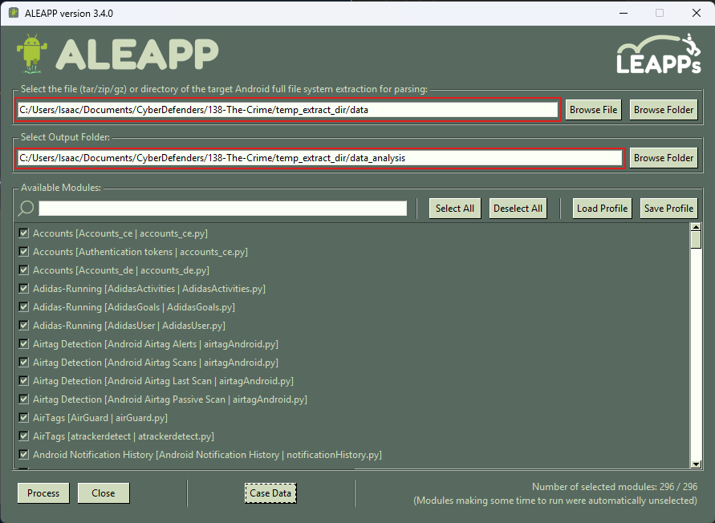
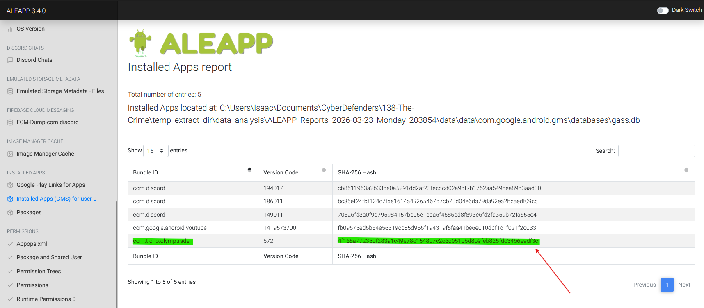
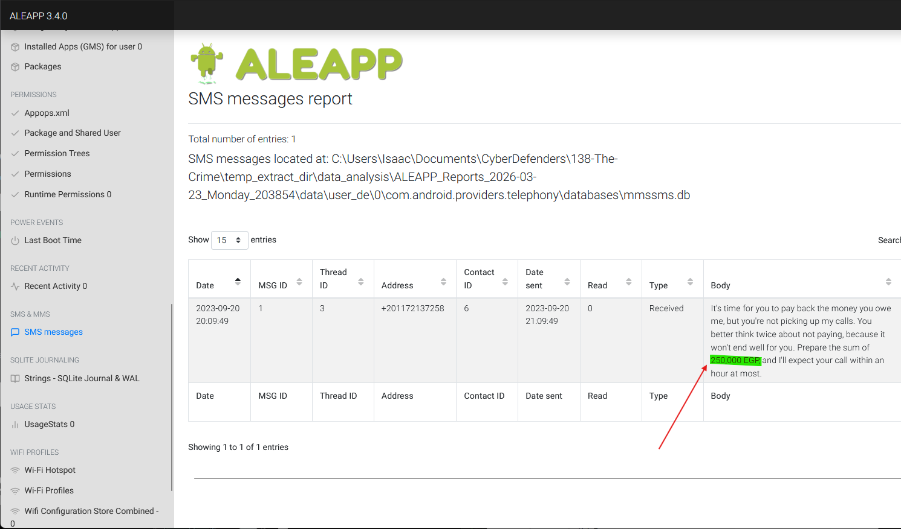
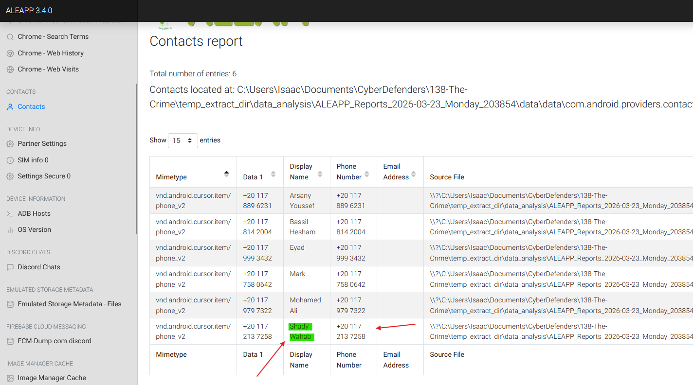
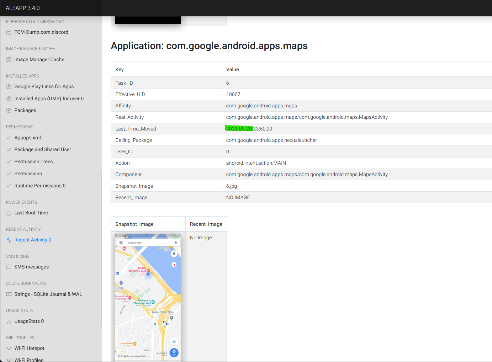
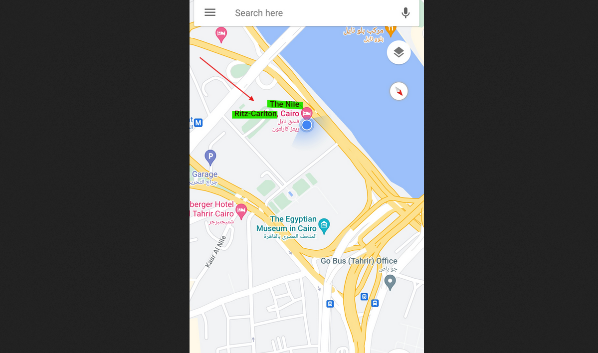
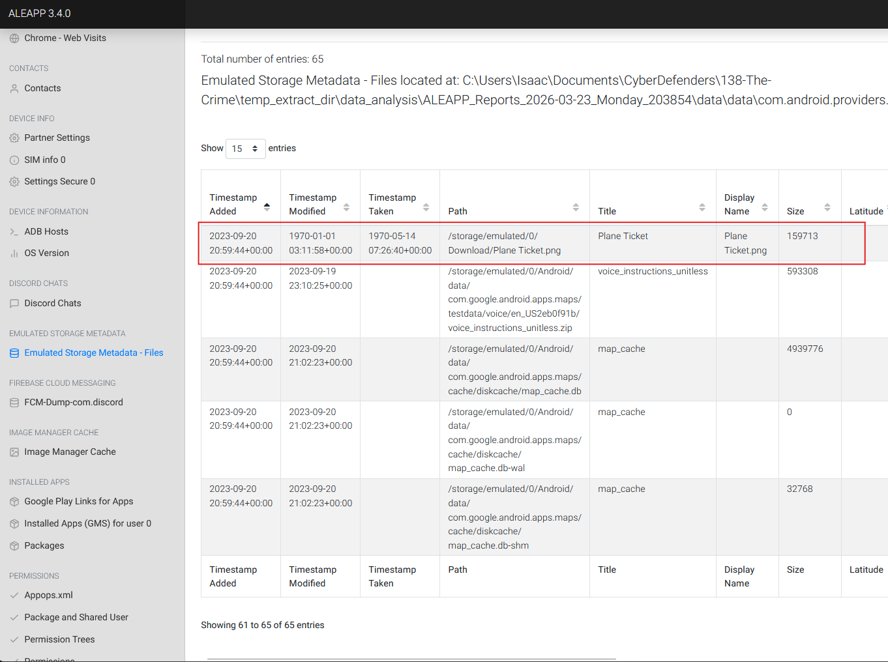
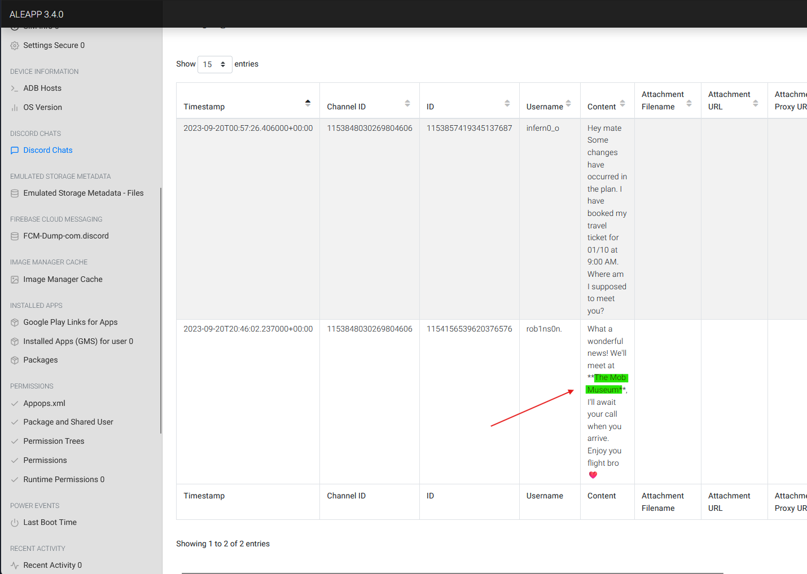

# Lab Overview
---
**Lab:** [The Crime Lab](https://cyberdefenders.org/blueteam-ctf-challenges/the-crime/)  
**Platform:** CyberDefenders  
**Category:** Endpoint Forensics  
**Difficulty:** Easy  
**Tools:** ALEAPP

# Summary
---
This lab focuses on Android forensics investigation where the victim's phone is analyzed to reconstruct events leading up to a suspected murder. Using the ALEAPP tool, key artifacts were extracted from the victim's Android device including installed applications, SMS messages, contacts, location data, and stored files.

The analysis revealed that the victim was heavily involved in trading through a specific application which contributed to a significant financial loss. SMS messages evidence identified a direct threat tied to large unpaid sum and correlation with contact data confirmed the individuals involved. Further investigation into application usage and metadata uncovered the victim's last known location. Additional evidence from Discord conversations revealed a scheduled meeting location.

# Scenario
---
We're currently in the midst of a murder investigation, and we've obtained the victim's phone as a key piece of evidence. After conducting interviews with witnesses and those in the victim's inner circle, your objective is to meticulously analyze the information we've gathered and diligently trace the evidence to piece together the sequence of events leading up to the incident.

# Analysis
---
## Based on the accounts of the witnesses and individuals close to the victim, it has become clear that the victim was interested in trading. This has led him to invest all of his money and acquire debt. Can you identify the SHA256 of the trading application the victim primarily used on his phone?

In this investigation, we begin by using the `Android Logs, Events, and Protobuf Parser (ALEAPP)` tool to parse Android file systems. First, we browse for the target Android directory we want to extract and define the output folder for the extracted data.  
  

Through ALEAPP's output, we can examine the details of installed applications on the victim's device. If we navigate to "Installed Apps (GMS) for user 0", we will find a list of applications installed on the victim's phone. Among that list includes an app of interest with a bundle ID of `com.ticno.olymptrade` along with its SHA256 hash value.  
  

To further analyze the bundle ID, we can perform a Google Play store search of of the app to confirm that the bundle ID is indeed the trading app we were looking for.  
  

## According to the testimony of the victim's best friend, he said, "While we were together, my friend got several calls he avoided. He said he owed the caller a lot of money but couldn't repay now". How much does the victim owe this person?

Examining the SMS messages section of the report revealed that the victim received a message from the phone number `+201172137258` that included a demand for a repayment.  
  
The contents of the SMS message reads `It's time for you to pay back the money you owe me, but you're not picking up my calls. You better think twice about not paying, because it won't end well for you. Prepare the sum of 250,000 EGP, and I'll expect your call within an hour at most.`  
This debt amount `250,000 EGP` aligned with the victim's best friend testimonial who mentioned that the victim was avoiding calls related to money owed.  

## What is the name of the person to whom the victim owes money?

If we navigate to the Contacts section of the report, we can see a list of contacts that was saved on the victim's phone. In the list, we can see the contact `Shady Wahab` has the same phone number `+201172137258` as the SMS message demanding the money.  
  

## Based on the statement from the victim's family, they said that on September 20, 2023, he departed from his residence without informing anyone of his destination. Where was the victim located at that moment?

To find the victim's location, we can examine the victim's recent activities to see that they recently accessed the Google Maps application. The application's `Last_Time_Moved` timestamp `2023-09-20 23:50:29` aligns with the family's statement regarding the victim's departure.  
  

Further analysis into the snapshot image revealed that the victim was last located at `The Nile Ritz-Carlton` on September 20, 2023.  
  

## The detective continued his investigation by questioning the hotel lobby. She informed him that the victim had reserved the room for 10 days and had a flight scheduled thereafter. The investigator believes that the victim may have stored his ticket information on his phone. Look for where the victim intended to travel.

To find where the victim might've stored their plane ticket, we can search through the Storage Metadata extracted by ALEAPP. Looking through the list, we were able to find the `Plane Ticket.png` located in the Downloads folder on the victim's phone.  
  

Navigating to `data > media > 0 > Download` in the Android directory revealed the `Plane Ticket.png` to which we can open and see the plane ticket's destination.  
  

## After examining the victim's Discord conversations, we discovered he had arranged to meet a friend at a specific location. Can you determine where this meeting was supposed to occur?

To examine the victim's Discord conversation, navigate to the Discord Chats section of the ALEAPP report and we can observe two conversations. The conversation with username `rob1ns0n` revealed that the victim was suppose to meet with their friend at `The Mob Museum`.  
  