# Lab Overview
---
**Lab:** [NerisBot Lab](https://cyberdefenders.org/blueteam-ctf-challenges/nerisbot/)  
**Platform:** CyberDefenders  
**Category:** Threat Hunting  
**Difficulty:** Easy  
**Tools:** Splunk, VirusTotal  

# Summary
---
This lab investigates suspicious C2 communications and unauthorized activity within a university network using Splunk to analyze Suricata and Zeek logs. Through log analysis, the external IP address `195.88.191.59` was identified as downloading multiple suspicious executable files from the domain `nocomcom.com` and targeting the internal host `147.32.84.165`.

By pivoting to Zeek logs and correlating file hashes with VirusTotal, all 5 unique files downloaded to the compromised host were confirmed to be malicious. Further analysis linked one file disguised as a `.txt` file to the NerisBot malware family through its SHA256 hash, which was extracted by joining Suricata and Zeek log sources using file size as the correlation field.

# Scenario
---
Unusual network activity has been detected within a university environment, indicating potential malicious intent. These anomalies, observed six hours ago, suggest the presence of command and control (C2) communications and other harmful behaviors within the network.

Your team has been tasked with analyzing recent network traffic logs to investigate the scope and impact of these activities. The investigation aims to identify command and control servers and uncover malicious interactions.

# Analysis
---
## During the investigation of network traffic, unusual patterns of activity were observed in Suricata logs, suggesting potential unauthorized access. One external IP address initiated access attempts and was later seen downloading a suspicious executable file. This activity strongly indicates the origin of the attack. What is the IP address from which the initial unauthorized access originated?

To begin this investigation, we need to explore the available log sources provided in Splunk.  
Run the following query to list all sourcetypes in the Splunk environment. Make sure the search time is set to "All time" to query all events. The search time will be narrowed down later.  
```sql
| metadata type=sourcetypes | dedup sourcetype | table sourcetype
```
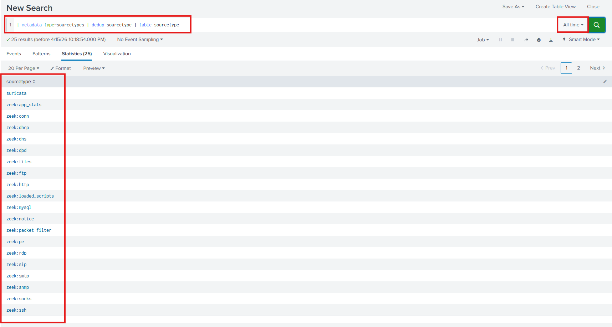  
From the result, the main sourcetypes available for analysis are suricata and zeek logs. We will query the Suricata logs for intrusion detection events.  

Next, we need to find out what event types we can get from Suricata. Run the query below.  
```sql
index=* sourcetype="suricata"
```
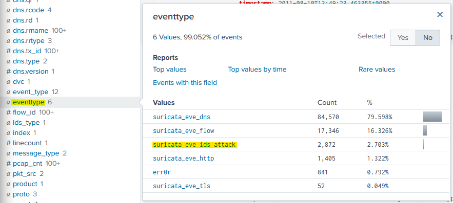  
In the Suricata logs, there is a field called `eventtype` and within this field, there is an event type named `suricata_eve_ids_attack`. We will query this event type to explore intrusion attempts captured.  
```sql
index=* sourcetype=suricata eventtype="suricata_eve_ids_attack"
```

Now that we've narrowed down the number of events to 2,872 (from 107,263), let's be more specific with our queries to find interesting events.  

Given we know that an external IP address downloaded a suspicious executable file, we will 
observe the HTTP traffic captured by Suricata.  
```sql
index=* sourcetype=suricata eventtype="suricata_eve_ids_attack"
| stats values(dest_ip) as dest_ip, values(http.http_user_agent) as user_agents, values(http.url) as urls by src_ip
```
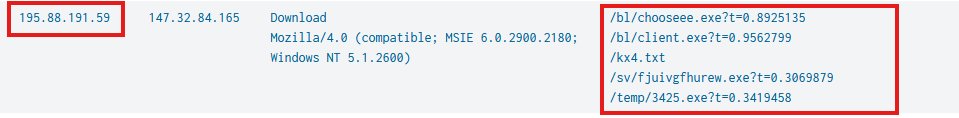  
Scrolling down revealed the IP address `195.88.191.59` downloaded suspicious executable files like `chooseee.exe`, `client.exe`, `3425.exe`, and `fjuivgfhurew.exe`. We also see the user agent used for these activities is `Mozilla/4.0 (compatible; MSIE 6.0.2900.2180; Windows NT 5.1.2600)` and `Download`.  

This is highly suspicious and the IP address `195.88.191.59` is likely the origin of the initial unauthorized access.  

## Investigating the attacker’s domain helps identify the infrastructure used for the attack, assess its connections to other threats, and take measures to mitigate future attacks. What is the domain name of the attacker server?

To determine the domain name of the attacker's server, I refined the query to search for source IP address `195.88.191.59` grouped by the `http.hostname`.  
```sql
index=* sourcetype=suricata eventtype="suricata_eve_ids_attack" src_ip="195.88.191.59"
| stats values(http.http_user_agent) as user_agents, values(http.url) as urls by http.hostname
```
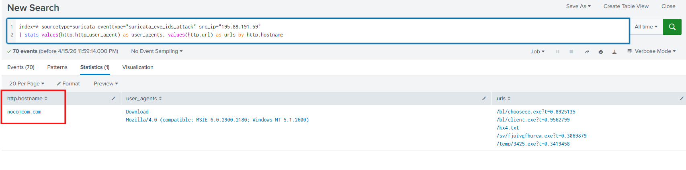  

Based on the result, the domain name of the attacker's server is identified as `nocomcom.com`.  

## Knowing the IP address of the targeted system helps focus remediation efforts and assess the extent of the compromise. What is the IP address of the system that was targeted in this breach?

In the same query from the previous question, I added the destination IP field as a column to the query.  
```sql
index=* sourcetype=suricata eventtype="suricata_eve_ids_attack" src_ip="195.88.191.59"
| stats values(dest_ip) as dest_ip, values(http.http_user_agent) as user_agents, values(http.url) as urls by http.hostname
```
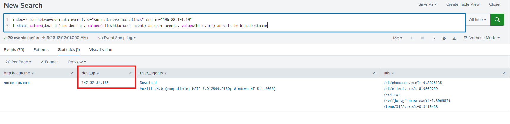  

Based on the result, the attacker targeted the IP address `147.32.84.165`.  

## Identify all the unique files downloaded to the compromised host. How many of these files could potentially be malicious?

Next, we need to pivot to Zeek logs since Suricata does not include hashes for files. Running the query below, this will search files that were transmitted from the host `195.88.191.59` then output the md5 hash values of those files.  
```sql
index=* sourcetype=zeek:files tx_hosts="195.88.191.59"
| dedup md5
| table md5
```
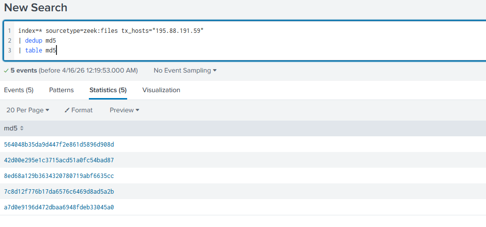  

To determine if these files are malicious, I will run these hash values through VirusTotal for malware analysis.  

Hash 1: `564048b35da9d447f2e861d5896d908d`  
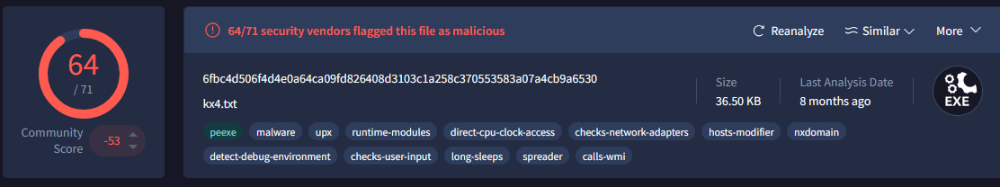  

Hash 2: `42d00e295e1c3715acd51a0fc54bad87`  
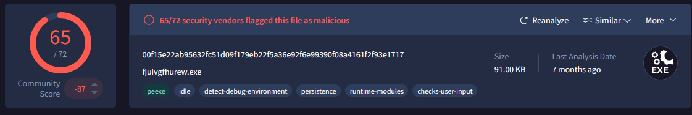  

Hash 3: `8ed68a129b3634320780719abf6635cc`  
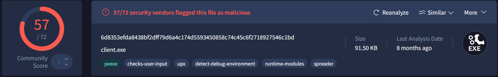  

Hash 4: `7c8d12f776b17da6576c6469d8ad5a2b`  
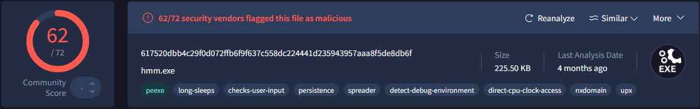  

Hash 5: `a7d0e9196d472dbaa6948fdeb33045a0`  
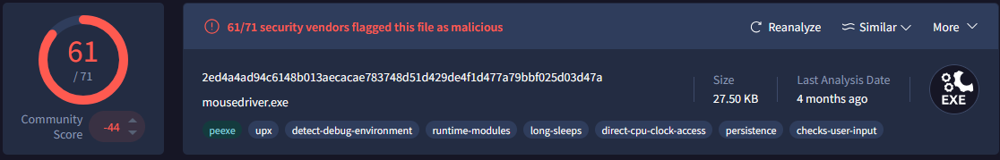  

Based on this evidence, all 5 files are known as malicious.  
## What is the SHA256 hash of the malicious file disguised as a .txt file?

To identify the SHA256 hash of the malicious `.txt` file, we can join both Suricata and Zeek logs together using bytes as the intersecting column. The query below will join both datasets using file size to match HTTP request with the observed file transfer.  
```sql
sourcetype="zeek:files" tx_hosts="195.88.191.59"
| join left=Z right=S where Z.seen_bytes=S.bytes
    [search sourcetype="suricata" src_ip="147.32.84.165" dest_ip="195.88.191.59" url=* ]
| table Z.md5, S.url
```
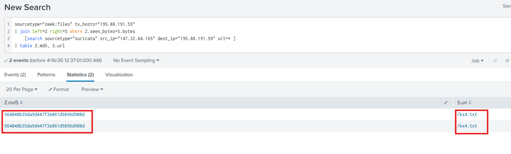  
In the screenshot above, the hash we previously identified `564048b35da9d447f2e861d5896d908d` is associated with file `kx4.txt`.  

Using VirusTotal, the SHA256 hash value for this file is `6fbc4d506f4d4e0a64ca09fd826408d3103c1a258c370553583a07a4cb9a6530`.
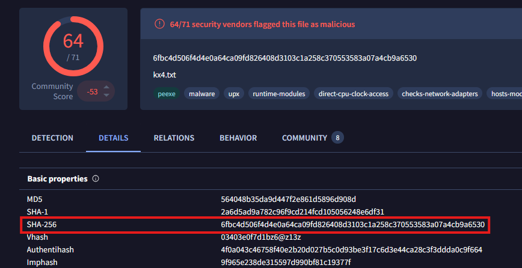  