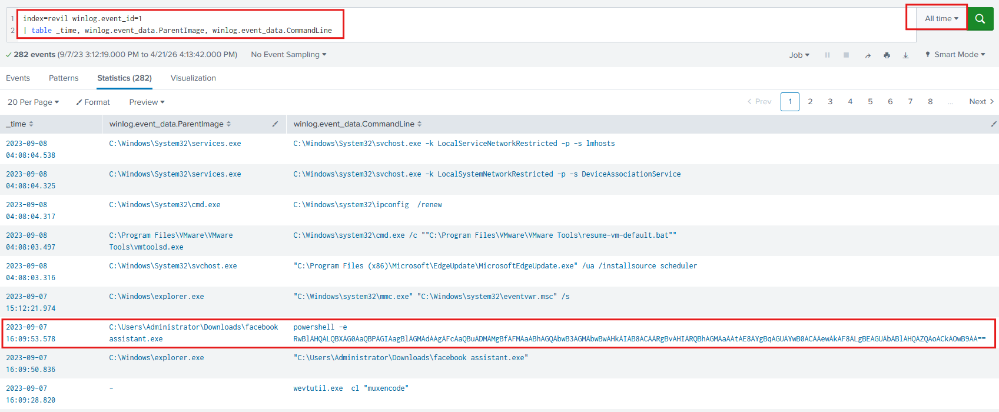
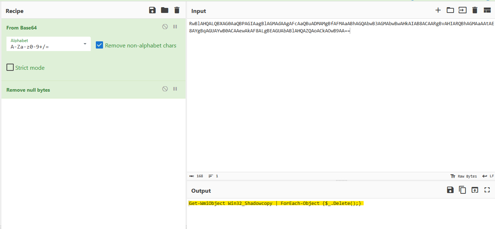
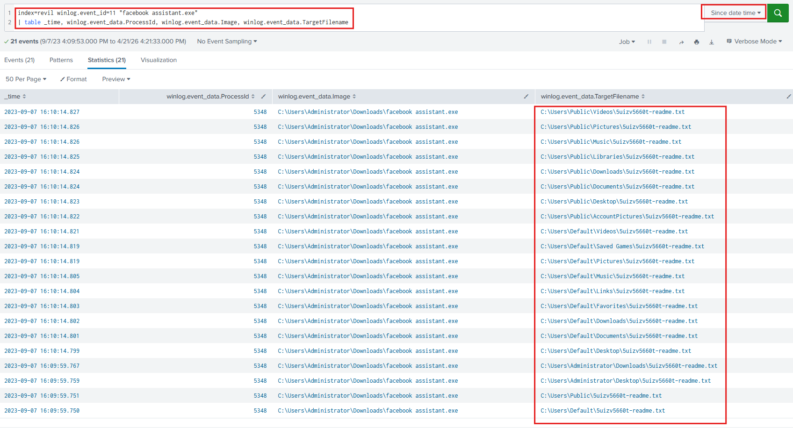
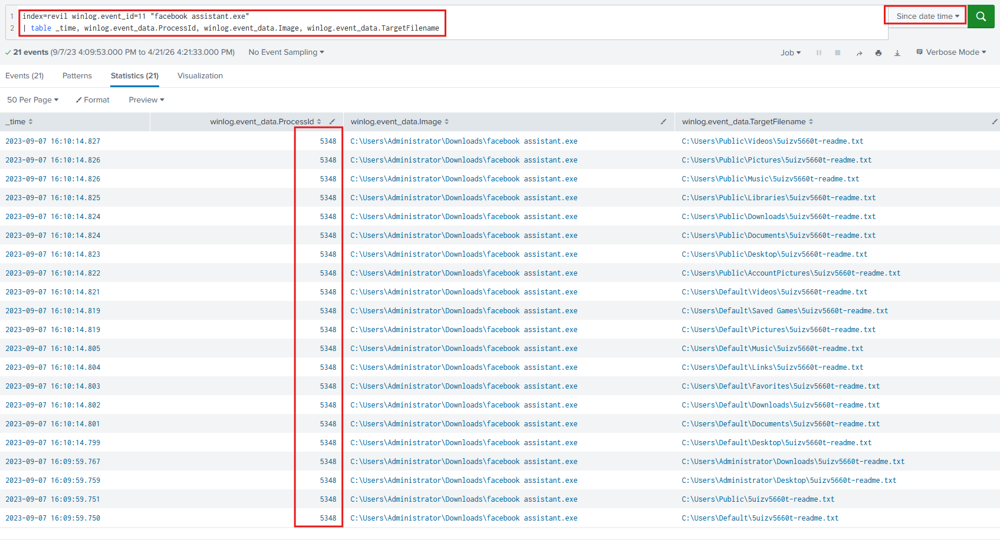
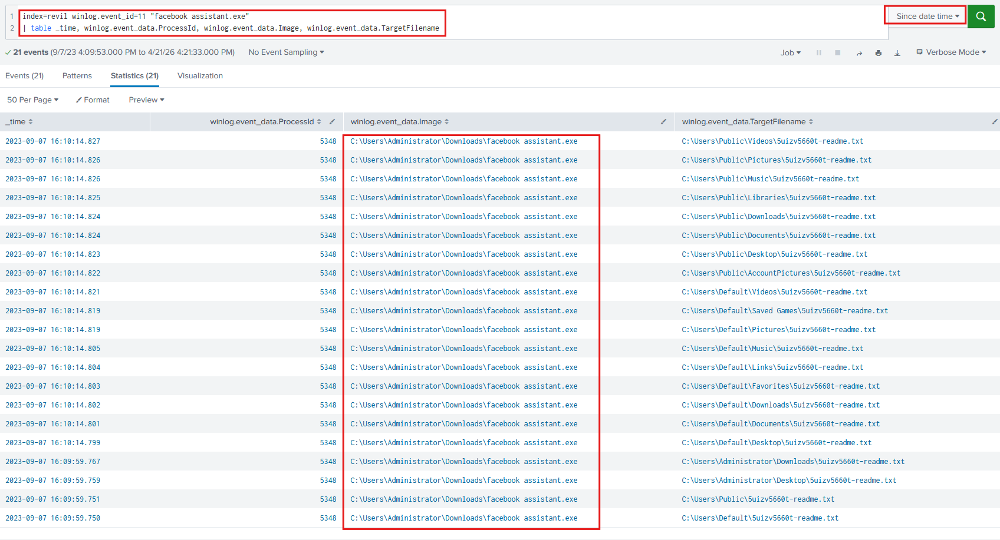
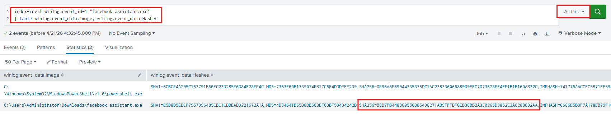
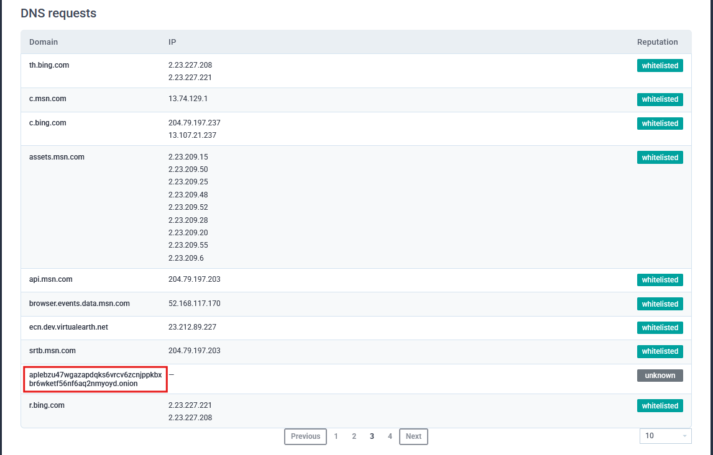

# Lab Overview
---
**Lab:** [REvil - GOLD SOUTHFIELD Lab](https://cyberdefenders.org/blueteam-ctf-challenges/revil-gold-southfield/)  
**Platform:** CyberDefenders  
**Category:** Threat Hunting  
**Difficulty:** Easy  
**Tools:** Splunk, ANY.RUN  

# Summary
---
This lab investigates a REvil ransomware infection at an organization using Splunk to analyze Sysmon event logs. The ransomware was disguised as `facebook assistant.exe` and stored in the user's Downloads directory. Upon execution, the ransomware deleted all shadow copies using a PowerShell command to prevent file recovery, then dropped ransom notes named `5uizv5660t-readme.txt` across multiple directories.

The SHA256 hash of the ransomware was identified through Sysmon process creation logs and confirmed against threat intelligence sources. Analysis of an ANY.RUN sandbox report attributed the ransomware to the GOLD SOUTHFIELD threat group and revealed the attacker's Tor-based `.onion` command-and-control domain used to direct victims to the ransom payment portal.

# Scenario
---
You are a Threat Hunter working for a cybersecurity consulting firm. One of your clients has been recently affected by a ransomware attack that caused the encryption of multiple of their employees' machines. The affected users have reported encountering a ransom note on their desktop and a changed desktop background. You are tasked with using Splunk SIEM containing Sysmon event logs of one of the encrypted machines to extract as much information as possible.

# Analysis
---
## To begin your investigation, can you identify the filename of the note that the ransomware left behind?

To initiate this investigation, we need to analyze Sysmon logs using Splunk to identify the ransomware. First, we will check for any process creation (Event ID 1) for suspicious processes.  
```sql
index=revil winlog.event_id=1
| table _time, winlog.event_data.ParentImage, winlog.event_data.CommandLine
```
  
In the screenshot above, we can see an event captured at 2023-09-07 16:09:53 showing a suspicious file named `facebook assistant.exe` executing a PowerShell command. 

Upon decoding the PowerShell command in CyberChef revealed that it attempts to delete all shadow copies on the system. Shadow copies are essentially snapshots used to restore previous versions of files.  
  

Next, we will refine the search query to Sysmon Event ID 11 (File creation) pertaining to `facebook assistant.exe`. We will also set the time range starting from when the PowerShell command executed to identify suspicious activity occurring after it.  
```sql
index=revil winlog.event_id=11 "facebook assistant.exe"
| table _time, winlog.event_data.ProcessId, winlog.event_data.Image, winlog.event_data.TargetFilename
```
  
In the screenshot above, we can see the suspicious exectuable `facebook assistant.exe` creating the `5uizv5660t-readme.txt` file in many different directories. This text file highly suspicious and is likely the note left by the ransomware.  

## After identifying the ransom note, the next step is to pinpoint the source. What's the process ID of the ransomware that's likely involved

In the same output as the previous, we can identify the process ID of the ransomware as `5348`.  
  

## Having determined the ransomware's process ID, the next logical step is to locate its origin. Where can we find the ransomware's executable file?

In the same output, the full path of the ransomware is `C:\Users\Administrator\Downloads\facebook assistant.exe`.  
  

## Now that you've pinpointed the ransomware's executable location, let's dig deeper. It's a common tactic for ransomware to disrupt system recovery methods. Can you identify the command that was used for this purpose?

As we previously identified, the ransomware executed PowerShell to run the commands `Get-WmiObject Win32_Shadowcopy | ForEach-Object {$_.Delete();}` to delete all shadow copies on the system.  
  

## As we trace the ransomware's steps, a deeper verification is needed. Can you provide the sha256 hash of the ransomware's executable to cross-check with known malicious signatures?

To identify the SHA256 hash of the executable `facebook assistant.exe`, modify the search query for Sysmon Event ID 1, change the search time range to All time, and output the Image and Hashes.  
```sql
index=revil winlog.event_id=1 "facebook assistant.exe"
| table winlog.event_data.Image, winlog.event_data.Hashes
```
  
In the screenshot above, the SHA256 hash value of `facebook assistant.exe` is identified as  `B8D7FB4488C0556385498271AB9FFFDF0EB38BB2A330265D9852E3A6288092AA`.  
## One crucial piece remains: identifying the attacker's communication channel. Can you leverage threat intelligence and known Indicators of Compromise (IoCs) to pinpoint the ransomware author's onion domain?

Using this [ANY.RUN](https://any.run/report/b8d7fb4488c0556385498271ab9fffdf0eb38bb2a330265d9852e3a6288092aa/6a8f9f4e-b6b2-476e-9375-192adf34770b) report of the ransomware, the DNS requests revealed a domain named `aplebzu47wgazapdqks6vrcv6zcnjppkbxbr6wketf56nf6aq2nmyoyd.onion` that has a `.onion` appended to it. This is likely the ransomware's onion domain.  
  