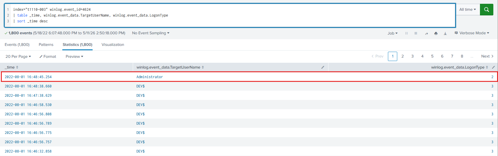
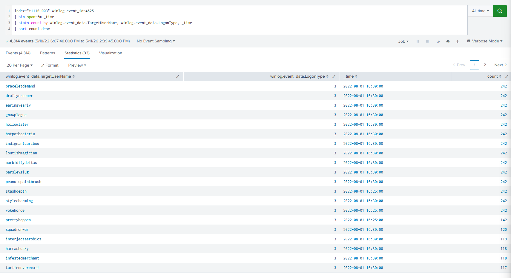
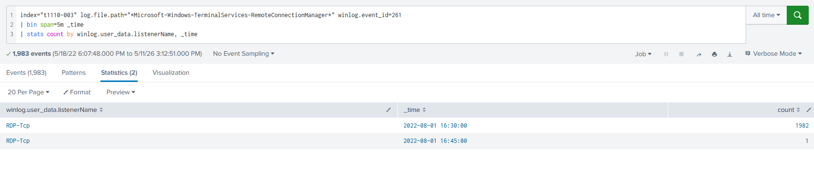
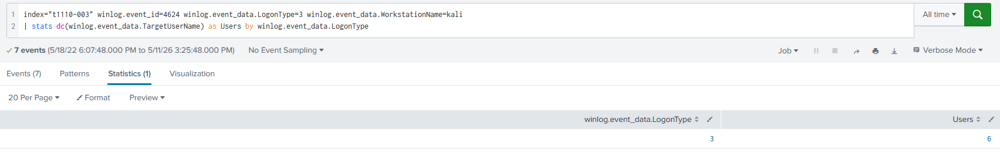
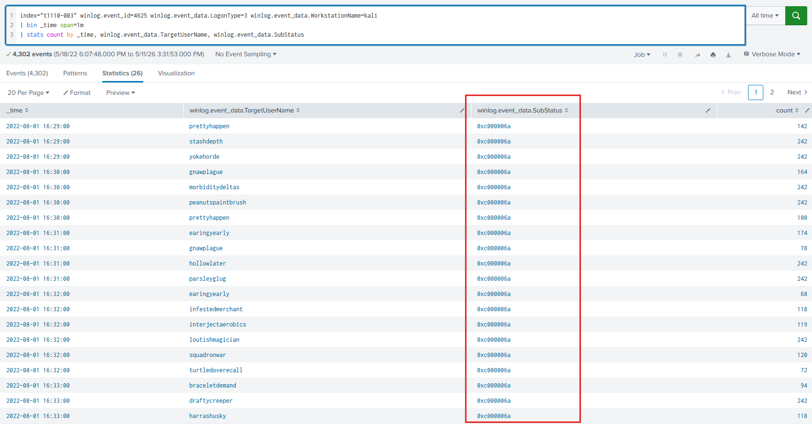
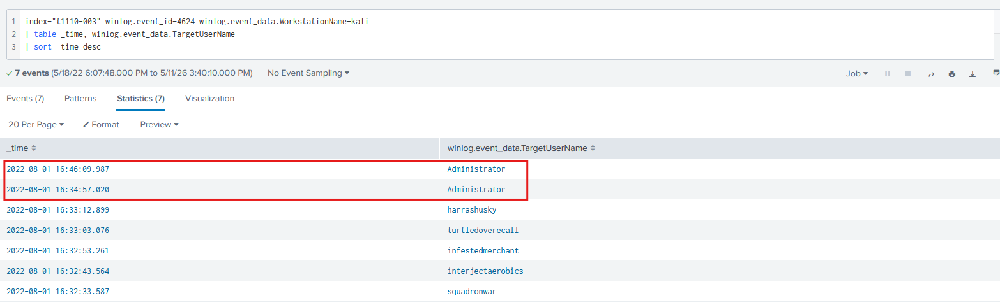

# Lab Overview
---
**Lab:** [T1110-003 Lab](https://cyberdefenders.org/blueteam-ctf-challenges/t1110003/)  
**Platform:** CyberDefenders  
**Category:** Threat Hunting  
**Difficulty:** Easy  
**Tools:** Splunk  

# Summary
---
This lab investigates a password spray attack against a Windows environment using Splunk to analyze Windows event logs. An attacker operating from a Kali Linux workstation performed a network logon brute-force attack over RDP (logon type 3) for approximately 5 minutes and 48 seconds, targeting multiple user accounts simultaneously to avoid triggering account lockout policies.

The attack resulted in 6 user accounts being successfully compromised, with the `Administrator` account identified as the primary target. Analysis of the sub-status code `0xc000006a` for failed logon events confirmed the attacker was submitting incorrect passwords. The attacker returned 11 minutes after the initial successful logon to authenticate again. The lab demonstrates how password spraying differs from brute-forcing and how the Account Lockout policy can help mitigate such attacks.

# Scenario
---
Adversaries may use a single or small list of commonly used passwords against many different accounts to attempt to acquire valid account credentials. Password spraying uses one password (e.g. 'Password01'), or a small list of commonly used passwords, that may match the complexity policy of the domain. Logins are attempted with that password against many different accounts on a network to avoid account lockouts that would normally occur when brute forcing a single account with many passwords.

Typically, management services over commonly used ports are used when password spraying. Commonly targeted services include the following:

- SSH (22/TCP)
- Telnet (23/TCP)
- FTP (21/TCP)
- NetBIOS / SMB / Samba (139/TCP & 445/TCP)
- LDAP (389/TCP)
- Kerberos (88/TCP)
- RDP / Terminal Services (3389/TCP)
- HTTP/HTTP Management Services (80/TCP & 443/TCP)
- MSSQL (1433/TCP)
- Oracle (1521/TCP)
- MySQL (3306/TCP)
- VNC (5900/TCP)

In addition to management services, adversaries may "target single sign-on (SSO) and cloud-based applications utilizing federated authentication protocols," as well as externally facing email applications, such as Office 365.

In default environments, LDAP and Kerberos connection attempts are less likely to trigger events over SMB, which creates Windows "logon failure" event ID 4625.

# Analysis
---
## Who was the last logged-in user?

To get the last logged-in user, we can search for event ID 4624. This event ID logs successful account logons. The query below searches for this event ID and sorts the time from newest to oldest.  
```sql
index="t1110-003" winlog.event_id=4624
| table _time, winlog.event_data.TargetUserName, winlog.event_data.LogonType
| sort _time desc
```
  

The last logged-in user is `Administrator` as identified in the screenshot above.  

## What is the logon type of the failed logons?

We can identify failed logon attempts through event ID 4625. The query below groups the time within a 5 minute time span and displays the target username and logon type.  
```sql
index="t1110-003" winlog.event_id=4625
| bin span=5m _time
| stats count by winlog.event_data.TargetUserName, winlog.event_data.LogonType, _time
| sort count desc
```

The results below show high volume of failed logon attempts across multiple user names. The logon type for these failed attempts is type `3`.  
  

This likely indicates a brute-forcing attack using password spraying by trying simple passwords across multiple accounts.  

## What is the protocol the attacker tried to bruteforce?

Considering that the logon type for failed logon attempts is `3`, this indicates that the failed logon attempts were made over the network. It is likely that the attacker attempted to bruteforce the protocol `RDP` based on this fact.  

We can confirm by searching in the `Microsoft-Windows-TerminalServices-RemoteConnectionManager` log file and looking for event ID 261 which logs when Remote Deskstop Service (RDP) listener has received a connection.  
```sql
index="t1110-003" log.file.path="*Microsoft-Windows-TerminalServices-RemoteConnectionManager*" winlog.event_id=261
| bin span=5m _time
| stats count by winlog.user_data.listenerName, _time
```
  

In the screenshot above, the RDP service shows that a connection was received within the same time bucket as the failed logon attempts. This confirms our hypothesis that the `RDP` service was brute-forced by the attacker.  

## How many users did the attacker succeed in getting their accounts?

If we previously inspect the log for one of the brute-forced failed logon attempts, we see that the source is coming from a Workstation named `kali`. This workstation is Linux system designed for offensive security. Based on this, we can suspect the `kali` machine is behind the brute-forcing attack.  

The query below searches for event ID 4624, logon type `3`, and the workstation name is `kali`. This query helps in determining which accounts were successfully logged in by the `kali` machine which indicates the attacker's success in compromising an account.  
```sql
index="t1110-003" winlog.event_id=4624 winlog.event_data.LogonType=3 winlog.event_data.WorkstationName=kali
| stats dc(winlog.event_data.TargetUserName) as Users by winlog.event_data.LogonType
```
  

The results show that `6` user accounts were compromised by the attacker in the brute-force attack.  

## According to Microsoft. What is the description of the "Sub Status" code for event id 4625?

The query below shows the sub status codes for each user name.  
```sql
index="t1110-003" winlog.event_id=4625 winlog.event_data.LogonType=3 winlog.event_data.WorkstationName=kali
| bin _time span=1m
| stats count by _time, winlog.event_data.TargetUserName, winlog.event_data.SubStatus
```

The sub status code identified is `0xc000006a`.  
  

From [Microsoft](https://learn.microsoft.com/en-us/previous-versions/windows/it-pro/windows-10/security/threat-protection/auditing/event-4625), the sub status code for `0xc000006a` states `User logon with misspelled or bad password`.  

## How long did the bruteforce last? MM:SS

The duration of the brute-force attack can be calculated by looking at the time of the last failed logon attempt and the time the first failed logon attempt.  

Run this query first to get the time of the last failed logon attempt.  
```sql
index="t1110-003" winlog.event_id=4625 winlog.event_data.LogonType=3 winlog.event_data.WorkstationName=kali
| table _time, winlog.event_data.TargetUserName
| sort _time desc
```
The time of the last failed logon attempt is `16:34:57.623`.  

Then run this query to get the time of the first failed logon attempt.  
```sql
index="t1110-003" winlog.event_id=4625 winlog.event_data.LogonType=3 winlog.event_data.WorkstationName=kali
| table _time, winlog.event_data.TargetUserName
| sort _time asc
```
The time of the first failed logon attempt is `16:29:09.460`.  

The duration between these two times is `05:48`.  

## How many minutes passed before the attacker logged into the machine again?

The query below searches for successful logon attempts coming from the `kali` machine.  
```sql
index="t1110-003" winlog.event_id=4624 winlog.event_data.WorkstationName=kali
| table _time, winlog.event_data.TargetUserName
| sort _time desc
```
  
We previously identified that the last logon attempt occured at time `16:34:57`. In the screenshot above, we can also see that the attacker logged into the user `Administrator` at the same time. This likely indicates that the `Administrator` account was the attacker's target.  

Based on this, we can see that the attacker logged into the `Administrator` user account two times. The first logon attempt occured at `16:34:57` and `11` minutes later, the attacker logged in again at `16:46:09`.  
## What is the name of the policy used to lock the account after a certain number of failed login attempts?

From [Microsoft](https://learn.microsoft.com/en-us/previous-versions/windows/it-pro/windows-10/security/threat-protection/auditing/audit-account-lockout) the policy is called `Account Lockout`.  