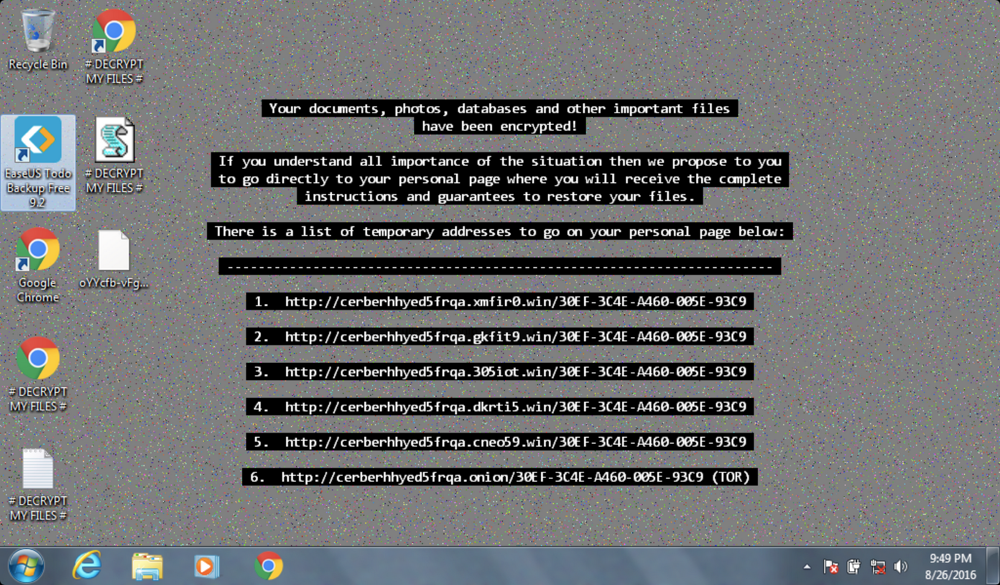
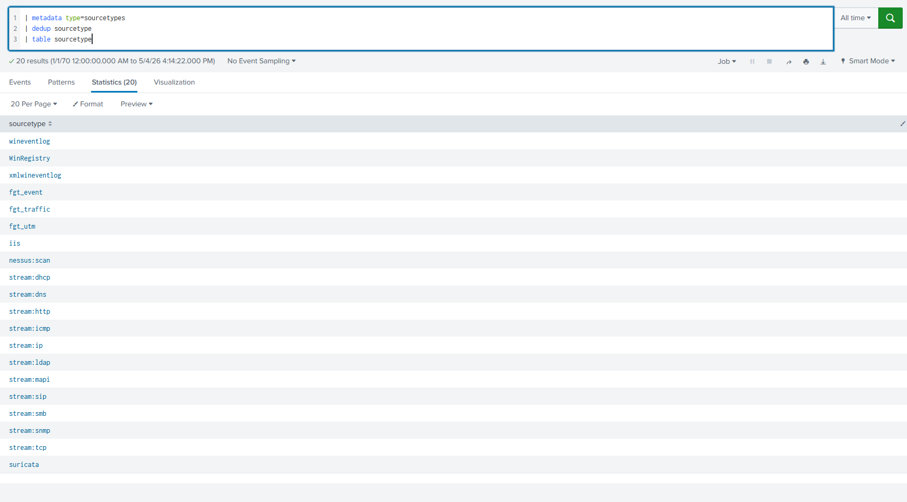
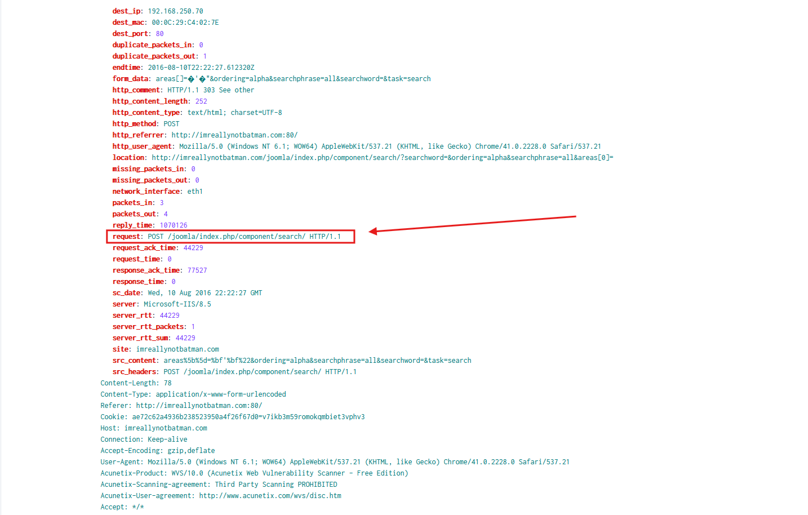
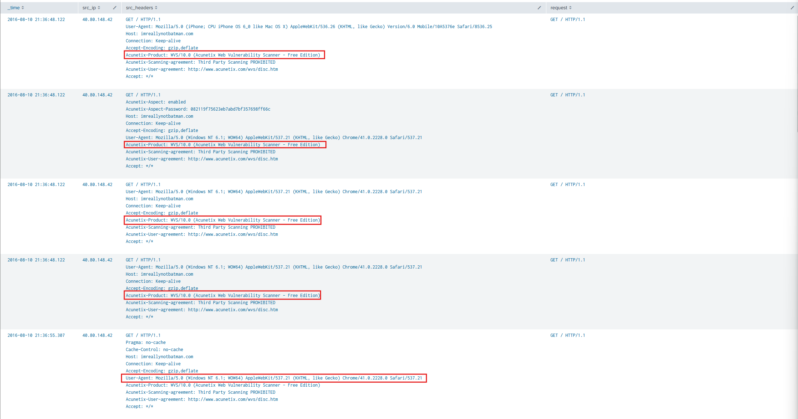
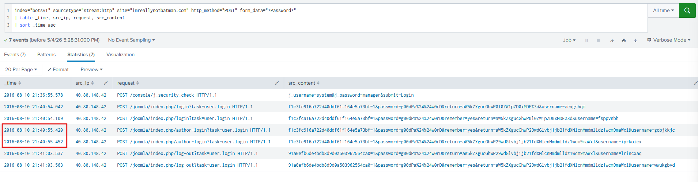
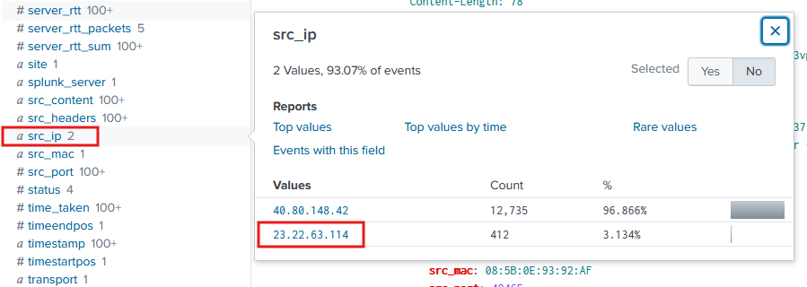
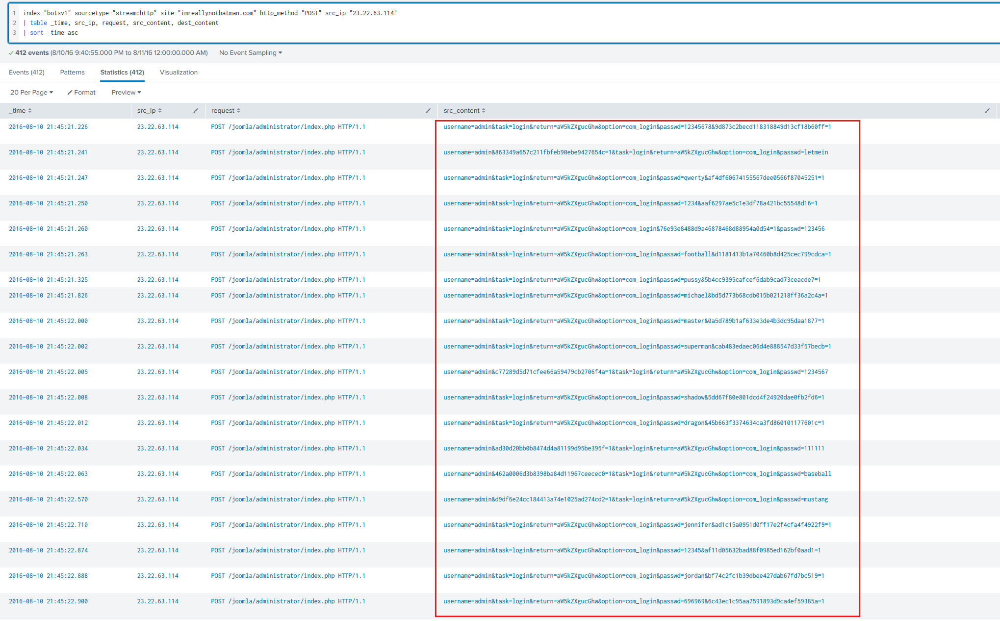
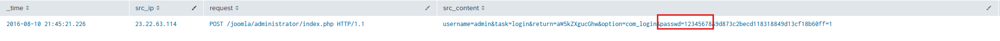

# Lab Overview
---
**Lab:** [Boss Of The SOC v1 Lab](https://cyberdefenders.org/blueteam-ctf-challenges/boss-of-the-soc-v1/)  
**Platform:** CyberDefenders  
**Category:** Threat Hunting  
**Difficulty:** Medium  
**Tools:** Splunk  

# Summary
---
This lab is a two-scenario Splunk investigation set in the fictional Wayne Enterprises environment. The first scenario involves an APT web defacement attack attributed to the Po1s0n1vy group, who targeted the Joomla-based website `imreallynotbatman.com`. The attacker scanned the site for vulnerabilities using the Acunetix Web Vulnerability Scanner and performed a brute-force password attack against the admin panel.

The second scenario investigates a Cerber ransomware infection where a machine belonging to Wayne Enterprises was compromised and its files encrypted. The investigation uses Splunk to analyze stream HTTP logs, Suricata events, and Sysmon telemetry to reconstruct the full attack timeline, identify the tools and techniques used, and attribute the activity.

# Scenario
---
#### Scenario 1 (APT):

The focus of this hands on lab will be an APT scenario and a ransomware scenario. You assume the persona of Alice Bluebird, the soc analyst who has recently been hired to protect and defend Wayne Enterprises against various forms of cyberattack.  

Today is Alice's first day at the Wayne Enterprises' Security Operations Center. Lucius sits Alice down and gives her first assignment: A memo from Gotham City Police Department (GCPD). Apparently GCPD has found evidence online ([http://pastebin.com/Gw6dWjS9](http://pastebin.com/Gw6dWjS9)) that the website www.imreallynotbatman.com hosted on Wayne Enterprises' IP address space has been compromised. The group has multiple objectives... but a key aspect of their modus operandi is to deface websites in order to embarrass their victim. Lucius has asked Alice to determine if www.imreallynotbatman.com. (the personal blog of Wayne Corporations CEO) was really compromised.  

In this scenario, reports of the below graphic come in from your user community when they visit the Wayne Enterprises website, and some of the reports reference "P01s0n1vy." In case you are unaware, P01s0n1vy is an APT group that has targeted Wayne Enterprises. Your goal, as Alice, is to investigate the defacement, with an eye towards reconstructing the attack via the Lockheed Martin Kill Chain.  

  

#### Scenario 2 (Ransomeware):  

In the second scenario, one of your users is greeted by this image on a Windows desktop that is claiming that files on the system have been encrypted and payment must be made to get the files back. It appears that a machine has been infected with Cerber ransomware at Wayne Enterprises and your goal is to investigate the ransomware with an eye towards reconstructing the attack.  

  

# Analysis
---
## Web Defacement: What content management system is imreallynotbatman.com likely using? (Please do not include punctuation such as . , ! ? in your answer. We are looking for alpha characters only.)

To begin this investigation, I used the query below to give me an overview of the type of logs that I will be working with.  
```sql
| metadata type=sourcetypes 
| dedup sourcetype
| table sourcetype
```
  

I'll first identify the infrastructure of `imreallynotbatman.com` by analyzing the sourcetype `stream:http`.  
```sql
index="botsv1" sourcetype="stream:http" site="imreallynotbatman.com"
```
  

This query returned 19,703 events. Analyzing the request of one event reveals that the `imreallynotbatman.com` domain is using the content management system (CMS) `joomla`.  

## Web Defacement: What is the likely IP address of someone from the Po1s0n1vy group scanning imreallynotbatman.com for web application vulnerabilities?

Continuing analysis of the sourcetype `stream:http`, the query below uses regex to search case-insensitive keywords like "Scanner", "Vulnerability", or "Vulnerabilities" that appear in the source headers.  
```sql
index="botsv1" sourcetype="stream:http" site="imreallynotbatman.com" 
| regex src_headers="(?i)(Scanner|Vulnerability|Vulnerabilities)"
| table _time, src_ip, src_headers, request
| sort _time asc
```

This query returned 12,892 events. Upon examining the src_headers field of the results, it includes a field called `Acunetix-Product` that reveals the product `Acunetix Web Vulnerability Scanner - Free Edition` used to scan the web domain `imreallynotbatman.com` for vulnerabilties.  

  

Based on this evidence, it is likely that the IP address `40.80.148.42` belongs to someone from the Po1s0n1vy group attempting to scan the web app for vulnerabilities.  

## Web Defacement: What company created the web vulnerability scanner used by Po1s0n1vy? Type the company name. (For example, "Microsoft" or "Oracle")

In the previous question, we identified the web vulnerability scanner used was `Acunetix Web Vulnerabilitiy Scanner - Free Edition`. The company that created this scanner is `Acunetix`.  
## Web Defacement: What IP address is likely attempting a brute force password attack against imreallynotbatman.com?


```sql
index="botsv1" sourcetype="stream:http" site="imreallynotbatman.com" http_method="POST" form_data="*Password*"
| table _time, src_ip, request, src_content  
| sort _time asc
```
  


```sql
index="botsv1" sourcetype="stream:http" site="imreallynotbatman.com" http_method="POST"
```
  


```sql
index="botsv1" sourcetype="stream:http" site="imreallynotbatman.com" http_method="POST" src_ip="23.22.63.114" 
| table _time, src_ip, request, src_content, dest_content  
| sort _time asc
```
  

## Web Defacement: What was the first brute force password used?


  

## Web Defacement: What is the name of the executable uploaded by Po1s0n1vy? Please include the file extension. (For example, "notepad.exe" or "favicon.ico")


## Web Defacement: What is the MD5 hash of the executable uploaded?


```sql
index="botsv1" sourcetype="suricata" event_type="fileinfo" src_ip="23.22.63.114"
| table _time, filename
| sort _time asc
```


## Web Defacement: What was the correct password for admin access to the content management system running "imreallynotbatman.com"?


## Web Defacement: What is the name of the file that defaced the imreallynotbatman.com website? Please submit only the name of the file with the extension (For example, "notepad.exe" or "favicon.ico").