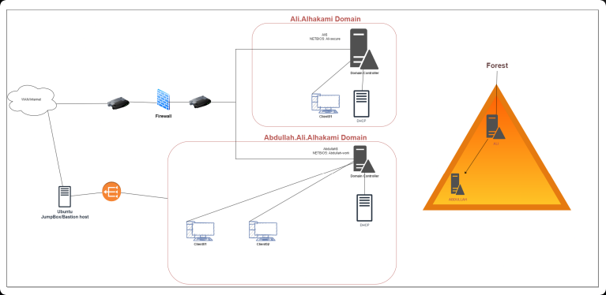

# Lab Overview
---
**Lab:** [FalconEye Lab](https://cyberdefenders.org/blueteam-ctf-challenges/falconeye/)  
**Platform:** CyberDefenders  
**Category:** Threat Hunting  
**Difficulty:** Medium  
**Tools:** Splunk  

# Summary
---
Write a summary of the CTF challenge.

# Scenario
---
As a SOC analyst, you aim to investigate a security breach in an Active Directory network using Splunk SIEM solution to uncover the attacker's steps and techniques while creating a timeline of their activities. The investigation begins with network enumeration to identify potential vulnerabilities. Using a specialized privilege escalation tool, the attacker exploited an unquoted service path vulnerability in a specific process.  
  
Once the attacker had elevated access, the attacker launched a DCsync attack to extract sensitive data from the Active Directory domain controller, compromising user accounts. The attacker employed evasion techniques to avoid detection and utilized a pass-the-hash (pth) attack to gain unauthorized access to user accounts. Pivoting through the network, the attacker explored different systems and established persistence.   
  
Throughout the investigation, tracking the attacker's activities and creating a comprehensive timeline is crucial. This will provide valuable insights into the attack and aid in identifying potential gaps in the network's security.  

  

# Analysis
---
## What is the name of the compromised account?

## What is the name of the compromised machine?

## What tool did the attacker use to enumerate the environment?

## The attacker used an Unquoted Service Path to escalate privileges. What is the name of the vulnerable service?

## What is the SHA256 of the executable that escalates the attacker's privileges?

## When did the attacker download **fun.exe**?

## What is the command line used to launch the DCSync attack?

## What is the original name of **fun.exe**?

## The attacker performed the Over-Pass-The-Hash technique. What is the AES256 hash of the account he attacked?

## What service did the attacker abuse to access the Client03 machine as Administrator?

## The Client03 machine spawned a new process when the attacker logged on remotely. What is the process name?

## The attacker compromises the **it-support** account. What was the logon type?

## What ticket name did the attacker generate to access the parent DC as Administrator?

