# Lab Overview
---
**Lab:** [GoldenSpray Lab](https://cyberdefenders.org/blueteam-ctf-challenges/goldenspray/)  
**Platform:** CyberDefenders  
**Category:** Threat Hunting  
**Difficulty:** Medium  
**Tools:** Splunk, IPinfo  

# Summary
---
This lab investigates a password spray and lateral movement attack at SecureTech Industries using Splunk to analyze Windows event logs. The external IP address `77.91.78.115` from Finland performed a password spray attack, successfully compromising the RDP account `mwilliams` as the initial foothold.

After gaining access, the attacker stored offensive tools including `mimikatz.exe`, `PsExec.exe`, and `PowerView.ps1` in the directory `C:\Users\Public\Backup_Tools\` and established persistence using `OfficeUpdater.exe` via a registry `Run` key. The attacker dumped credentials using `mimikatz` and laterally moved to a second machine by compromising the account `jsmith` via RDP. On the domain controller, a scheduled task named `FileCheck` was created to execute `FileCleaner.exe` hourly. Kerberos ticket analysis revealed the environment uses `RC4-HMAC` encryption, and a compressed archive `Archive_8673812.zip` was created on the file server in preparation for data exfiltration.

# Scenario
---
As a cybersecurity analyst at SecureTech Industries, you've been alerted to unusual login attempts and unauthorized access within the company's network. Initial indicators suggest a potential brute-force attack on user accounts. Your mission is to analyze the provided log data to trace the attack's progression, determine the scope of the breach, and the attacker's TTPs.

# Analysis
---
## What is the attacker's IP address?

To begin this investigation, we need to identify the source of the brute-force attack. The query below will search for event ID 4625 (Failed logon attempts), group time by 5 minute buckets, and group IP addresses and time. This is essentially obtaining the total failed logons by source IP address in each 5-minute period.  
```sql
index=goldenspray winlog.event_id=4625
| bin _time span=5m 
| stats count by winlog.event_data.IpAddress, _time
```
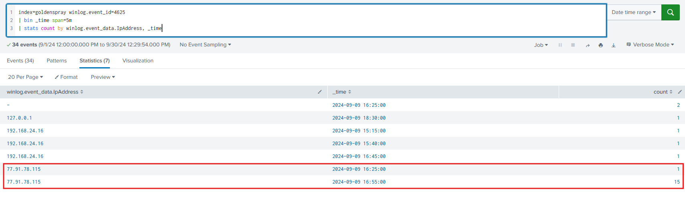  

In the screenshot above, three IP addresses are identified: `127.0.0.1`, `192.168.24.16`, and `77.91.78.115`. The IP `127.0.0.1` is the loopback address and `192.168.24.16` is the internal IP address.   

The external IP address `77.91.78.115` is the suspicious address as it has 16 total events at 2024-09-09 16:25:00 and 16:55:00. The short timeframe of failed logon attempts indicates that this IP address is possibly performing a brute-force attack.  

## What country is the attack originating from?

Using IPinfo, we can perform an analysis on the suspicious IP address to obtain its geolocation.  
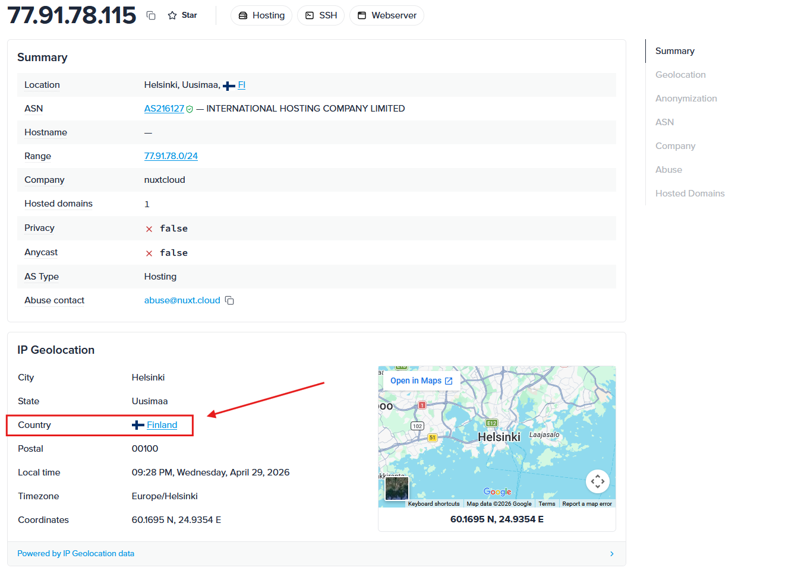  

Based on the result from IPinfo, the IP orginates from the country `Finland`.  

## What's the compromised account username used for initial access?

To find which account the attacker successfully compromised, we need to look at event ID 4624 (Successful logon attempts).  
```sql
index=goldenspray winlog.event_id=4624 winlog.event_data.IpAddress="77.91.78.115"
| table _time, winlog.event_data.TargetDomainName, winlog.event_data.TargetUserName, winlog.event_data.LogonType
| sort _time asc
```
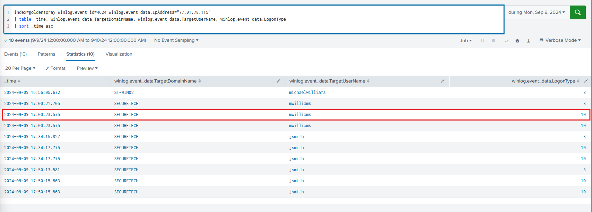  

The results of this query shows multiple usernames `michaelwilliams`, `mwilliams`, and `jsmith`. The most interesting username for initial access is `mwilliams` identified at 2024-09-09 17:00:23. We can observe that at this time, the account `mwilliams` was successfully logged on with logon type 10, which means that this user was logged in through a remote service like Remote Deskstop Protocol (RDP).  

Based on this evidence, this indicates that the attacker had successfully compromised the user `SECURETECH\mwilliams` and logged into the account through remote services.  

## What's the name of the malicious file utilized by the attacker for persistence on `ST-WIN02`?

We'll refine the query to now search for event ID 11 (File creation) involving the user `mwilliams`.  
```sql
index=goldenspray winlog.event_id=11 winlog.event_data.User="SECURETECH\\mwilliams"
| table _time, winlog.computer_name, winlog.event_data.TargetFilename
| sort _time asc
```
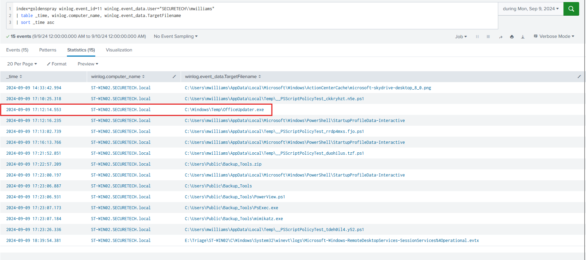  

In the screenshot above, at the time 2024-09-09 17:12:14, we can see a suspicious executable file identified as`OfficeUpdater.exe` located in the `Temp` directory. This event is highly suspicious because executable files typically do not live in the `Temp` directory.  

Now, we'll pivot to further investigate activities for this suspicious exectuable. We'll modify the search query to search for event ID 1 (Process creation) and search for events with command lines containing `OfficeUpdater.exe`. This will allow us to see if this executable was utilized by the attacker.  
```sql
index=goldenspray winlog.event_id=1 winlog.event_data.User="SECURETECH\\mwilliams" winlog.event_data.CommandLine="*OfficeUpdater.exe*"
| table _time, winlog.computer_name, winlog.event_data.Image, winlog.event_data.CommandLine
| sort _time asc
```
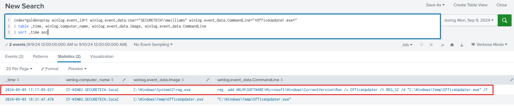  

Based on the result of the query, we can observe that a new registry `Run` key was added to run the `OfficeUpdater.exe` file on startup. This indicates that the executable was configured as a persistence mechanism by the attacker.  

## What is the complete path used by the attacker to store their tools?

Going back to the previous query that searched for event ID 11, we can see a suspicious directory called `Backup_tools` that includes malicious tools like `mimikatz.exe`, `PsExec.exe`, and `PowerView.ps1`.  
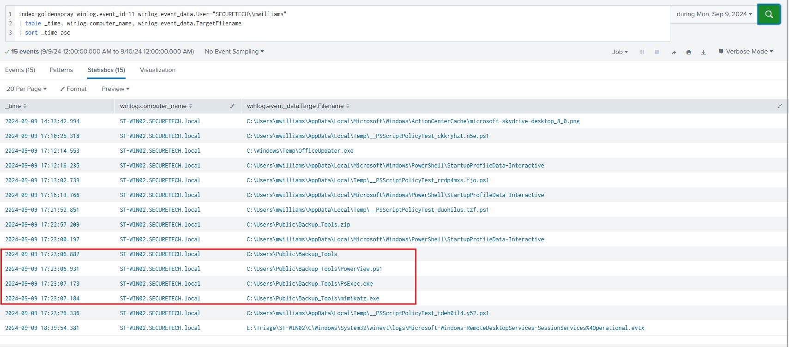  

This is likely the directory used by the attacker to store their tools. The full path of this folder is `C:\Users\Public\Backup_Tools\`.  

## What's the process ID of the tool responsible for dumping credentials on `ST-WIN02`?

Run the query below to find when the `mimikatz.exe` file was executed and its process ID.  
```sql
index=goldenspray winlog.event_id=1 winlog.event_data.User="SECURETECH\\mwilliams" winlog.event_data.CommandLine="*mimikatz*"
| table _time, winlog.computer_name, winlog.event_data.ParentProcessId, winlog.event_data.ParentCommandLine, winlog.event_data.ProcessId, winlog.event_data.CommandLine
| sort _time asc
```
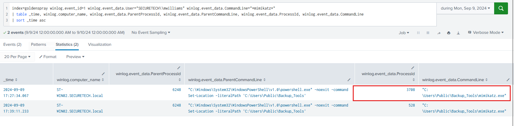  

The process ID for the `mimikatz.exe` file is identified as `3708`.  
## What's the second account username the attacker compromised and used for lateral movement?

Utilizing the previous search for successful logons originating from IP address `77.91.78.115`, the account `jsmith` was the second user with logon type 10, indicating that the attacker also compromised this user through remote services.  
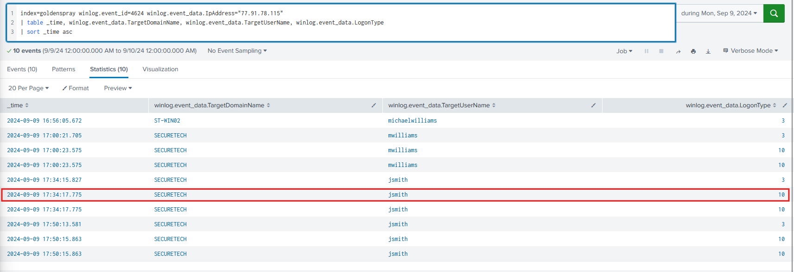  

## Can you provide the scheduled task created by the attacker for persistence on the domain controller?

To search for if the attacker created any scheduled tasks, we will look into activities by the user account `jsmith` that involves the executable `schtasks.exe`. This executable is utilized to create scheduled tasks on Windows.  
```sql
index=goldenspray winlog.event_id=1 winlog.event_data.User="SECURETECH\\jsmith" winlog.event_data.CommandLine="*schtask*"
| table _time, winlog.computer_name, winlog.event_data.Image, winlog.event_data.CommandLine
| sort _time asc
```
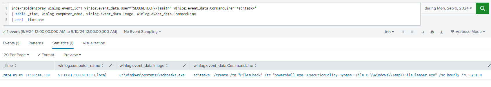  

The query returned one event at 2024-09-09 17:38:44 showing the `schtasks.exe` executable creating a scheduled task called `FileCheck` that runs the file located at `C:\Windows\Temp\FileCleaner.exe` hourly on the system.  

The timing of this event and the suspicious file `FileCleaner.exe` in the `Temp` directory is highly suspicious based on previously identified activities. We can conclude that the attacker created this `FileChecker` scheduled task.  

## What type of encryption is used for Kerberos tickets in the environment?

We can search for event ID 4768 (TGT requested) and 4769 (TGS requested) to get the type of encryption used for Kerberos tickets.  
```sql
index=goldenspray (winlog.event_id=4768 OR winlog.event_id=4769)
| stats count by winlog.event_data.TicketEncryptionType
```
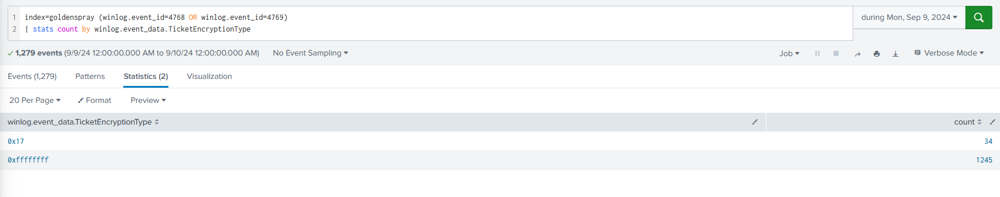  

The results of this query shows two ticket encryption types: `0x17` and `0xffffffff`.  

Based on [documentations](https://learn.microsoft.com/en-us/previous-versions/windows/it-pro/windows-10/security/threat-protection/auditing/event-4769) from Microsoft, the encryption type `0x17` refers to the `RC4-HMAC` algorithm while `0xffffffff` are audit failure events.  
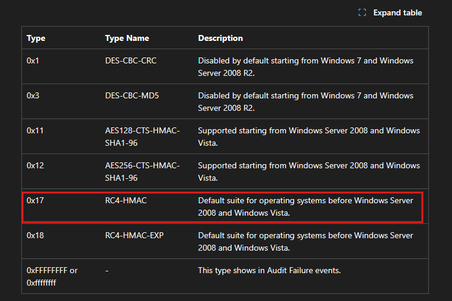  


## Can you provide the full path of the output file in preparation for data exfiltration?

To identify data exfiltration attempts, we will search through event ID 11 from both compromised users for any suspicious files.  
```sql
index=goldenspray winlog.event_id=11 (winlog.event_data.User="SECURETECH\\mwilliams" OR winlog.event_data.User="SECURETECH\\jsmith")
| table _time, winlog.computer_name, winlog.event_data.User, winlog.event_data.TargetFilename
| sort _time asc
```
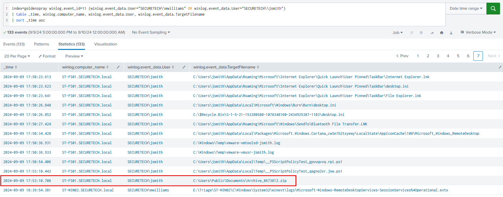  

At 2024-09-09 17:53:10, a suspicious file called `Archive_8673812.zip` was created in the `C:\Users\Public\Documents` folder. Considering that this file is located on the machine `ST-FS01`, likely a file server, this is likely a file that is in preparation for data exfiltration.  