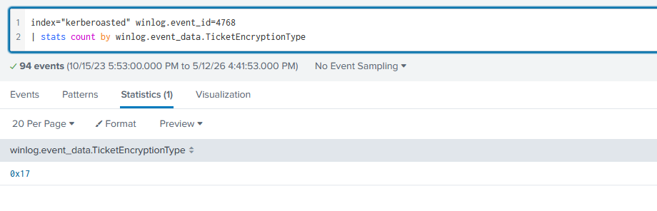
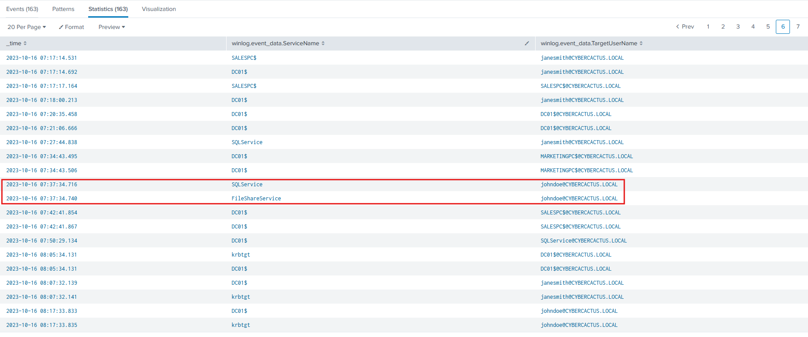
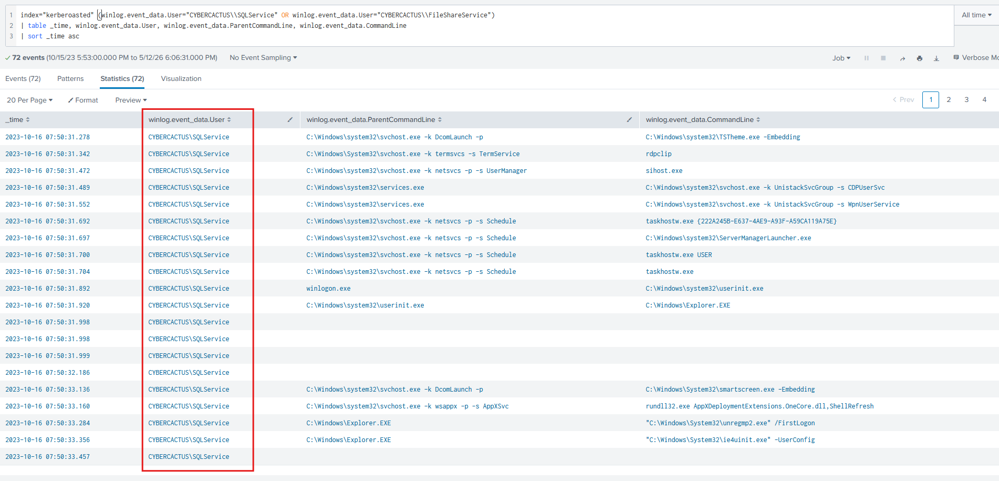
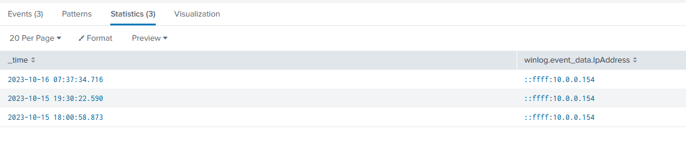
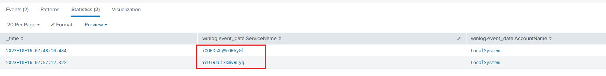
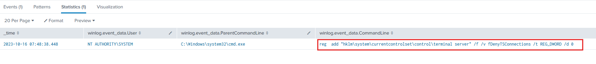
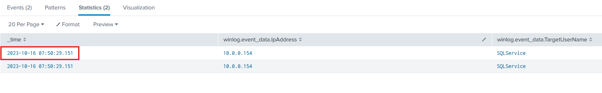
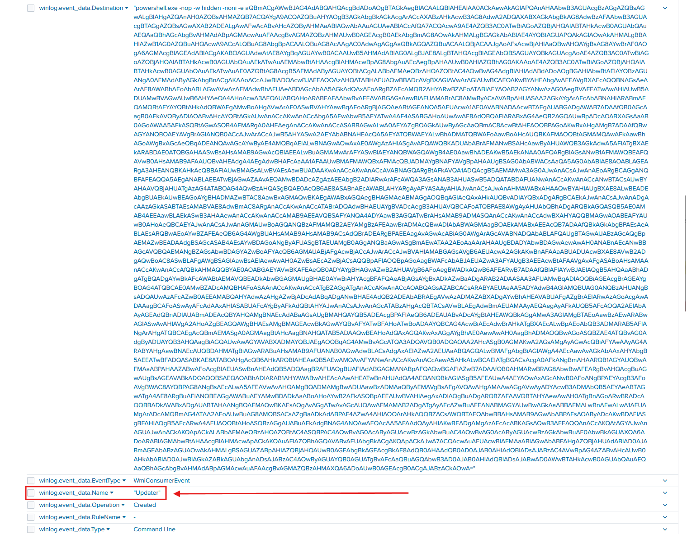
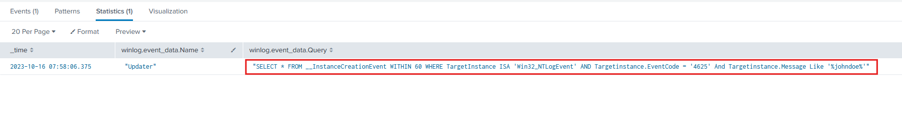

# Lab Overview
---
**Lab:** [Kerberoasted Lab](https://cyberdefenders.org/blueteam-ctf-challenges/kerberoasted/)  
**Platform:** CyberDefenders  
**Category:** Threat Hunting  
**Difficulty:** Medium  
**Tools:** Splunk  

# Summary
---
Write a summary of the CTF challenge.

# Scenario
---
As a diligent cyber threat hunter, your investigation begins with a hypothesis: 'Recent trends suggest an upsurge in [Kerberoasting attacks](https://www.crowdstrike.com/en-us/cybersecurity-101/cyberattacks/kerberoasting/) within the industry. Could your organization be a potential target for this attack technique?' This hypothesis lays the foundation for your comprehensive investigation, starting with an in-depth analysis of the domain controller logs to detect and mitigate any potential threats to the security landscape.

Note: Your Domain Controller is configured to audit Kerberos Service Ticket Operations, which is necessary to investigate kerberoasting attacks. Additionally, Sysmon is installed for enhanced monitoring.

# Analysis
---
## To mitigate Kerberoasting attacks effectively, we need to strengthen the encryption Kerberos protocol uses. What encryption type is currently in use within the network?

To begin this investigation, we'll first identify the encryption type that the Kerberos protocol uses. The query below searches for event ID 4768 (A TGT was requested) and get a total count of the encryption types.  
```sql
index="kerberoasted" winlog.event_id=4768
| stats count by winlog.event_data.TicketEncryptionType
```

The result of the query returned one encryption type `0x17`.  
  

From [Microsoft](https://learn.microsoft.com/en-us/previous-versions/windows/it-pro/windows-10/security/threat-protection/auditing/event-4768#kerberos-encryption-types), the encryption type `0x17` correlates to `RC4-HMAC`.  

## What is the username of the account that sequentially requested Ticket Granting Service (TGS) for two distinct application services within a short timeframe?

The query below focuses in on event ID 4769, which logs when a TGS was requested, and outputs the service name and the target username.  
```sql
index="kerberoasted" winlog.event_id=4769
| table _time, winlog.event_data.ServiceName, winlog.event_data.TargetUserName
| sort _time asc
```

Upon analyzing the output, two logs at 2023-10-16 07:37:34 reveals the user `johndoe` requested a Ticket Granting Ticket (TGS) for the `SQLService` and `FileShareService` just miliseconds apart.  
  

This evidence is highly suspicious since two distinct services were requested in a very short timeframe.  

## We must delve deeper into the logs to pinpoint any compromised service accounts for a comprehensive investigation into potential successful kerberoasting attack attempts. Can you provide the account name of the compromised service account?

In our current timeline, we know that the user `johndoe` had requested a TGS for both `SQLService` and `FileShareService` at 2023-10-16 07:37:34. We'll now look into both of these services to identify which of these was compromised.  

The query below searches for command line execution originating from either the `SQLService` or `FileShareService`.  
```sql
index="kerberoasted" (winlog.event_data.User="CYBERCACTUS\\SQLService" OR winlog.event_data.User="CYBERCACTUS\\FileShareService")
| table _time, winlog.event_data.User, winlog.event_data.ParentCommandLine, winlog.event_data.CommandLine
| sort _time asc
```

In the screenshot below, the query resulted in multiple logs originating from `SQLService` starting from 2023-10-16 07:50:31. In addition, the `SQLService` executed a suspicious command line pertaining to rdpclip, which is used to facilitate RDP clipboard sharing between local computer and a remote desktop.  
  

This timeframe of events aligns with our previous timeline and the suspicious command execution indicates that the `SQLService` is the compromised service account.  

## To track the attacker's entry point, we need to identify the machine initially compromised by the attacker. What is the machine's IP address?

To identify the IP address of the machien running `SQLService`, we can go back to searching for event ID 4769 and filter the service name for `SQLService` and target user name for `johndoe`.  
```sql
index="kerberoasted" winlog.event_id=4769 winlog.event_data.ServiceName="*SQLService*" winlog.event_data.TargetUserName="*johndoe*"
| table _time, winlog.event_data.IpAddress
```

In the screenshot below, the IP `10.0.0.154` belongs to the machine running `SQLService`.  
  

## To understand the attacker's actions following the login with the compromised service account, can you specify the service name installed on the Domain Controller (DC)?

To identify new services installed on the Domain Controller, we can run the query below to search for event ID 7045. Event ID 7045 logs the creation of new services on a system.  
```sql
index="kerberoasted" winlog.event_id=7045
| table _time, winlog.event_data.ServiceName, winlog.event_data.AccountName
| sort _time asc
```

The query returned two events occurring at 2023-10-16 07:48:10 and 2023-10-16 07:57:12, both which closely align with our previous timeline.    
  

The services named `iOOEDsXjWeGRAyGl` and `YeDIRrUiXDmvRLyq` appear to be obfuscated, likely to hide its intent, and were installed using the `LocalSystem` acount which has high-privileges on Windows systems. Based on this evidence, this is a strong indicator of malicious activity.  

## To grasp the extent of the attacker's intentions, What's the complete registry key path where the attacker modified the value to enable Remote Desktop Protocol (RDP)?

For RDP to be enabled on a machine, the `FDenyTSConnections` registry value must be set to `0`. That means that if an attacker were to enable RDP, they'd need to interact with the `reg.exe` tool to modify the registry.  

Based on this, we can filter for Sysmon event ID 1 where the command line contains the key word `FDenyTSConnections`.   
```sql
index="kerberoasted" winlog.event_id=1 winlog.event_data.CommandLine="*fDenyTSConnections*"
| table _time, winlog.event_data.User, winlog.event_data.ParentCommandLine, winlog.event_data.CommandLine
```

The query resulted in one event at 2023-10-16 07:48:38 showing usage of reg.exe to set the `FDenyTSConnections` registry value to `0` at `hklm\system\currentcontrolset\control\terminal server`.  
  

The complete registry key path is `hklm\system\currentcontrolset\control\terminal server\FDenyTSConnections`.  

## To create a comprehensive timeline of the attack, what is the UTC timestamp of the first recorded Remote Desktop Protocol (RDP) login event?

To identify the first recorded RDP login event, we can search for event ID 4624 (successful logon attempts) where the logon type is type `10` (RemoteInteractive).  
```sql
index="kerberoasted" winlog.event_id=4624 winlog.event_data.LogonType=10
| table _time, winlog.event_data.IpAddress, winlog.event_data.TargetUserName
| sort _time asc
```

In the screenshot below, the first recorded RDP login event occurred at `2023-10-16 07:50:29`.  
  

## To unravel the persistence mechanism employed by the attacker, what is the name of the WMI event consumer responsible for maintaining persistence?

Sysmon event ID 20 logs for WMI consumer creation. We'll search for this event ID for events occurring after 2023-10-16 07:00:00 to narrow down our search to around the time of the malicious events.  
```sql
index="kerberoasted" winlog.event_id=20 @timestamp>=2023-10-16T07:00:00.000Z
| sort _time asc
```

Upon inspecting an event occuring at 2023-10-16 07:58:06, the event shows a suspicious PowerShell command belonging to the WMI event consumer named `Updater`. The use of `-nop -w hidden -noni -e` in the PowerShell script are typical indicators of malicious intent designed to avoid user detection and minimize forensic artifiacts.  
  

In addition to this, the name `Updater` is often used to disguise malicious WMI event consumers as legitimate system processes.  

## Which class does the WMI event subscription filter target in the WMI Event Subscription you've identified?

To analyze WMI event subscription filters, we can examine Sysmon event ID 19 logs which captures the creation of WMI event filters.  
```sql
index="kerberoasted" winlog.event_id=19
| table _time, winlog.event_data.Name ,winlog.event_data.Query
| sort _time asc
```

The query returned one output showing a query that targets the `Win32_NTLogEvent` class. This class represents entries in the Windows event log and allows the attacker to monitor specific event types. In the query, the attacker chose to monitor EventCode 4625 that contains the username `johndoe` in the message.  
  
