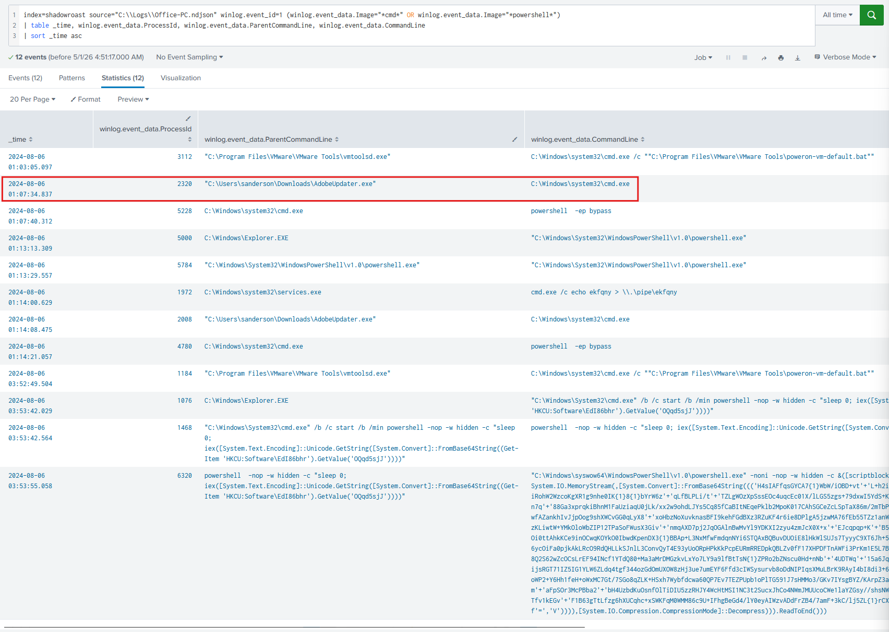
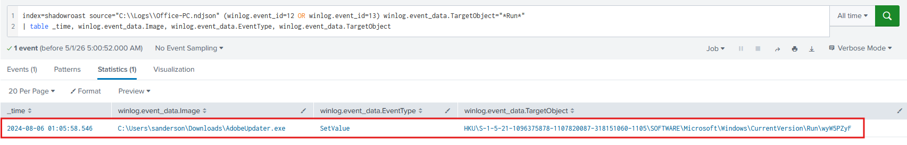
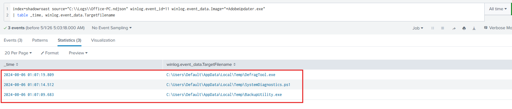
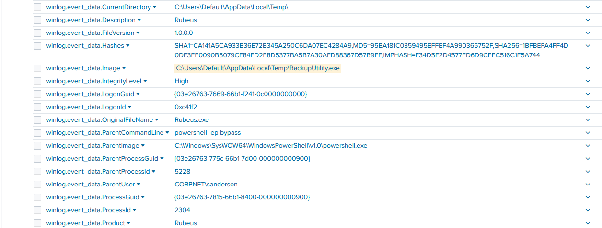
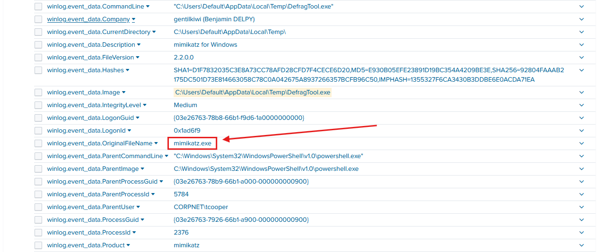
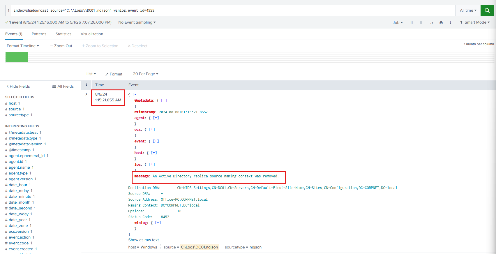
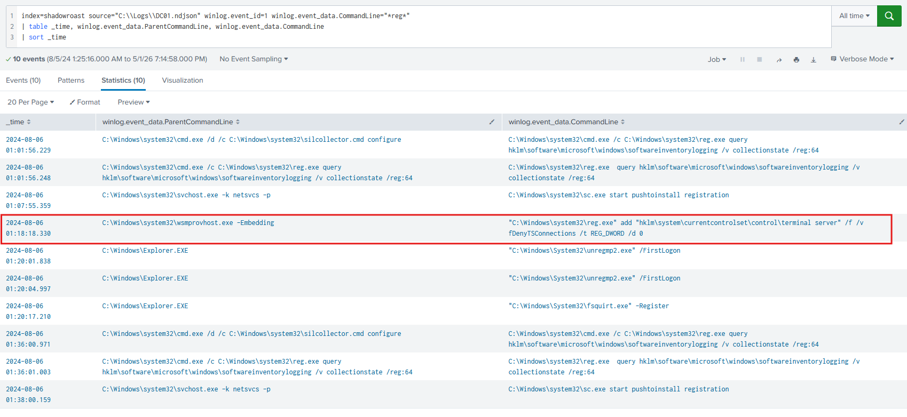
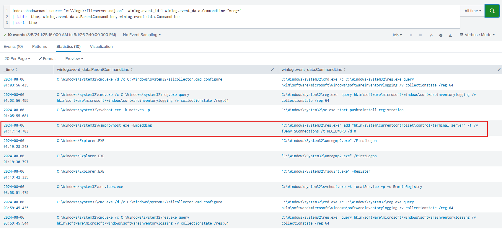
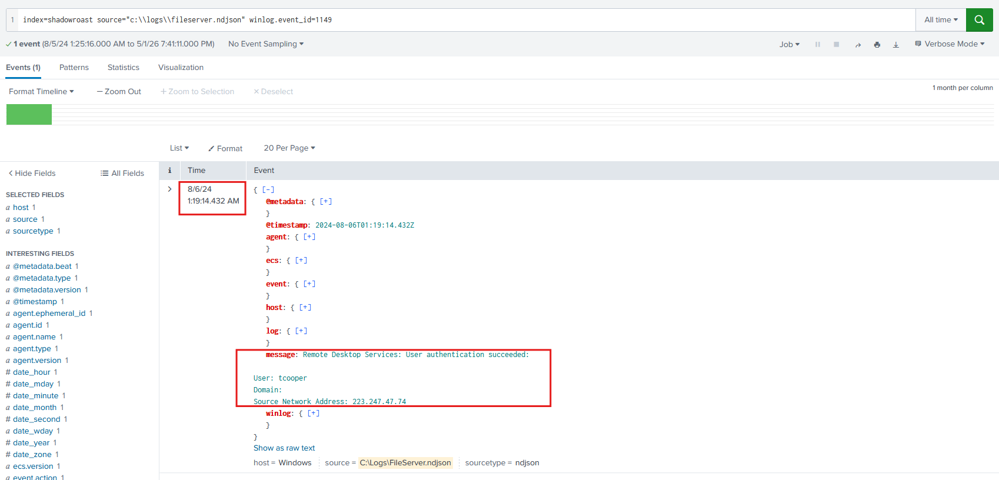
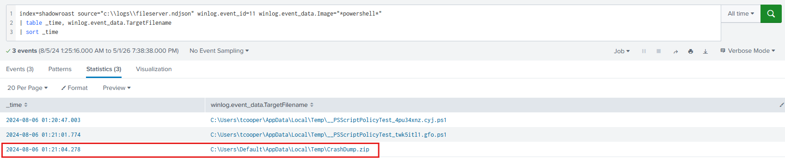

# Lab Overview
---
**Lab:** [ShadowRoast Lab](https://cyberdefenders.org/blueteam-ctf-challenges/shadowroast/)  
**Platform:** CyberDefenders  
**Category:** Threat Hunting  
**Difficulty:** Medium  
**Tools:** Splunk  

# Summary
---
This lab investigates an Active Directory compromise at TechSecure Corp using Splunk to analyze Sysmon event logs across multiple machines. The attacker gained initial access through a malicious file `AdobeUpdater.exe` downloaded from the internet, which established persistence via a registry `Run` key and dropped offensive tools into a temporary directory.

The attacker used Rubeus, disguised as `BackupUtility.exe`, to perform Kerberoasting and harvest credentials, successfully compromising the account `tcooper`. Using mimikatz, disguised as `DefragTool.exe`, the attacker performed a DCShadow attack to register a rogue domain controller and manipulate Active Directory data. The attacker then enabled RDP on both the domain controller and file server via registry modifications, moved laterally, and created the compressed archive `CrashDump.zip` on the file server in preparation for data exfiltration.

# Scenario
---
As a cybersecurity analyst at TechSecure Corp, you have been alerted to unusual activities within the company's Active Directory environment. Initial reports suggest unauthorized access and possible privilege escalation attempts.

Your task is to analyze the provided logs to uncover the attack's extent and identify the malicious actions taken by the attacker. Your investigation will be crucial in mitigating the threat and securing the network.

# Analysis
---
## What's the malicious file name utilized by the attacker for initial access?

To begin this investigation, we'll first search through the Office PC to find indicators of initial access. The query below will look for Sysmon event ID 1 (process creation), specifically for processes where the image path contains either`cmd.exe` or `powershell.exe`. Attackers often use these processes to execute commands after gaining a foothold which makes them useful indicators.  
```sql
index=shadowroast source="C:\\Logs\\Office-PC.ndjson" winlog.event_id=1 (winlog.event_data.Image="*cmd*" OR winlog.event_data.Image="*powershell*")
| table _time, winlog.event_data.ProcessId, winlog.event_data.ParentCommandLine, winlog.event_data.CommandLine
| sort _time asc
```
  

Based on the result of the query, at timestamp 2024-08-06 1:07:34, an executable identified as `AdobeUpdater.exe` located in `C:\Users\sanderson\Downloads\` executed the `cmd.exe` process.  

The location and activity of `AdobeUpdater.exe` is highly suspicious. Execution from the `Downloads` directory typically indicates the file was manually downloaded from the internet, either from a legitimate source or a potentially malicious one.  

## What's the registry run key name created by the attacker for maintaining persistence?

We'll query for Sysmon event ID 12 (registry object added/deleted) and event ID 13 (registry key/value renaming) where the target object contains the keyword `Run`. This will search for any events where the Run keys were modified.  
```sql
index=shadowroast source="C:\\Logs\\Office-PC.ndjson" (winlog.event_id=12 OR winlog.event_id=13) winlog.event_data.TargetObject="*Run*"
| table _time, winlog.event_data.Image, winlog.event_data.TargetObject
```
  

This query returned one event at 2024-08-06 1:05:58 showing the suspicious `AdobeUpdater.exe` executable file changing the Run key `wyW5PZyF`'s value.  

## What's the full path of the directory used by the attacker for storing his dropped tools?

Now that we've established `AdobeUpdater.exe` as the suspicious executable, we'll further examine its activity. We'll search for Sysmon event ID 11 (file creation) where the process Image contains `AdobeUpdater.exe`.  
```sql
index=shadowroast source="C:\\Logs\\Office-PC.ndjson" winlog.event_id=11 winlog.event_data.Image="*AdobeUpdater.exe"
| table _time, winlog.event_data.TargetFilename
```
  

Based on the results above, there are 3 suspicious files created in the `C:\Users\Default\AppData\Local\Temp\` directory. These are likely the tools stored by the attacker.  
## What tool was used by the attacker for privilege escalation and credential harvesting?

Based on our previous findings, we'll need to further investigate the activities from tools dropped by the attacker.  
```sql
index=shadowroast source="C:\\Logs\\Office-PC.ndjson" winlog.event_id=1 (winlog.event_data.Image="*DefragTool.exe*" OR winlog.event_data.Image="*SystemDiagnostics.ps1*" OR winlog.event_data.Image="*BackupUtility.exe*")
| sort _time asc
```

This query returned three events. At timestamp 2024-08-06 1:10:45, the tool `Rubeus`, masquerading as `BackupUtility.exe`, was executed under the user `CORPNET\sanderson`.  
  

5 minutes later at timestamp 2024-08-06 1:15:18, we can observe the tool `mimikatz`, masquerading as `DefragTool.exe`, was executed under a different user identified as `CORPNET\tcooper`.  
  

Based on this finding, the tool `rebeus` was used by the attacker to harvest credentials and they successfully compromised a second user identified as `CORPNET\tcooper`.  

## Was the attacker's credential harvesting successful? If so, can you provide the compromised domain account username?

As we previously identified, the attacker was successful at credential harvesting and compromised the user `tcopper`.  

## What's the tool used by the attacker for registering a rogue Domain Controller to manipulate Active Directory data?

We'll now pivot to searching for logs from the Domain Controller. We are looking specifically for event ID 4929 which logs whenever the Active Directory replica source naming context was removed.  
```sql
index=shadowroast source="C:\\Logs\\DC01.ndjson" winlog.event_id=4929
```
  

This query returned one event at timestamp 2024-08-06 1:15:21. This activity occurred a couple of seconds after the `mimikatz` tool was executed which highly indicates that the attacker utilized the DCShadow feature in the `mimikatz` tool to perform a DCShadow attack.  

## What's the first command used by the attacker for enabling RDP on remote machines for lateral movement?

For RDP to be enabled on a machine, they must set the `FDenyTSConnections` registry value to `0`. That means that if an attacker were to enable RDP, they'd need to interact with the `reg.exe` tool to modify the registry. Based on this, we can filter for Sysmon event ID 1 where the command line contains the key word `reg`.  
```sql
index=shadowroast source="C:\\Logs\\DC01.ndjson" winlog.event_id=1 winlog.event_data.CommandLine="*reg*"
| table _time, winlog.event_data.ParentCommandLine, winlog.event_data.CommandLine
| sort _time
```
  

In the screenshot above, at timestamp 2024-08-06 1:18:18, the event displays the `reg.exe` tool adding the registry `FDenyTSConnections` with value of 0 to the registry key `hklm\system\currentcontrolset\control\terminal server` for the Domain Controller.  

Similarly, if we search through the File Server logs, at timestamp 2024-08-06 1:17:14, the same registry value was created to enable RDP services.  
  

The full command used to enable RDP is `reg add "hklm\system\currentcontrolset\control\terminal server" /f /v fDenyTSConnections /t REG_DWORD /d 0`.  
## What's the file name created by the attacker after compressing confidential files?

Let's check if the attacker logged into the File Server using RDP by searching for event ID 1149.  
```sql
index=shadowroast source="c:\\logs\\fileserver.ndjson" winlog.event_id=1149
```
  

We can see that the attacker successfully logged into the File Server at 2024-08-06 1:19:14.  

Now, let's check the activities of the File Server and we are looking specifically for any compressed file creations as this could indicate data exfiltration attempts. We'll search the logs for Sysmon event ID 11 where the process Image contains using PowerShell.  
```sql
index=shadowroast source="c:\\logs\\fileserver.ndjson" winlog.event_id=11 winlog.event_data.Image="*powershell*"
| table _time, winlog.event_data.TargetFilename
| sort _time
```
  

At timestamp 2024-08-06 1:21:04, a compressed file identified as `CrashDump.zip` was created in the `C:\Users\Default\AppData\Local\Temp` directory using PowerShell.  