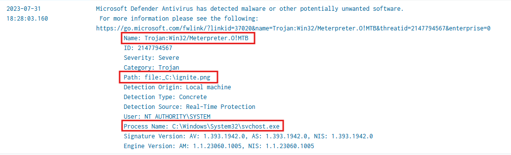
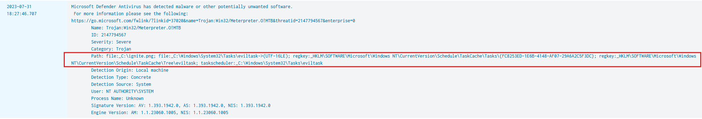
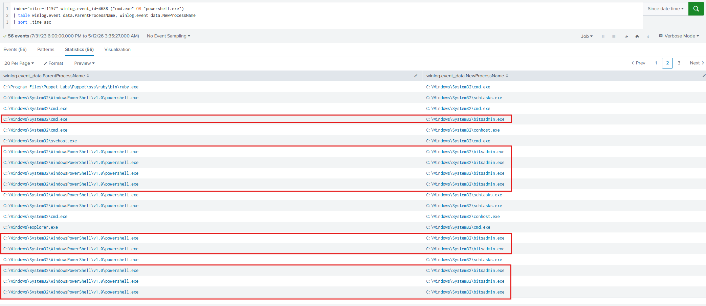
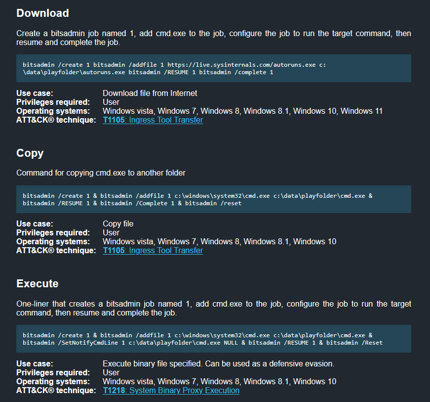
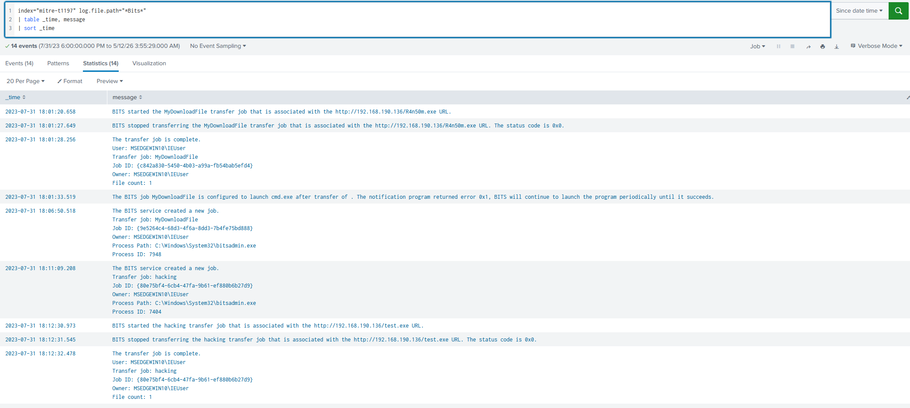
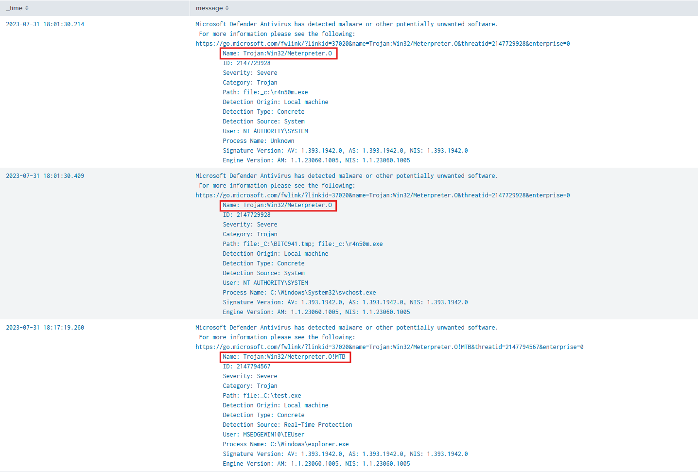
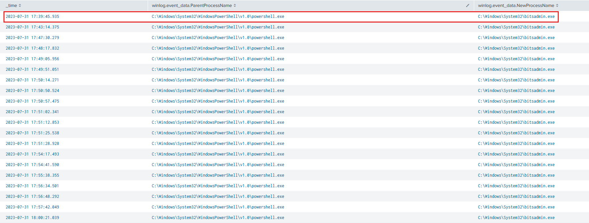
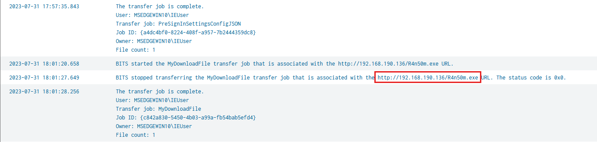
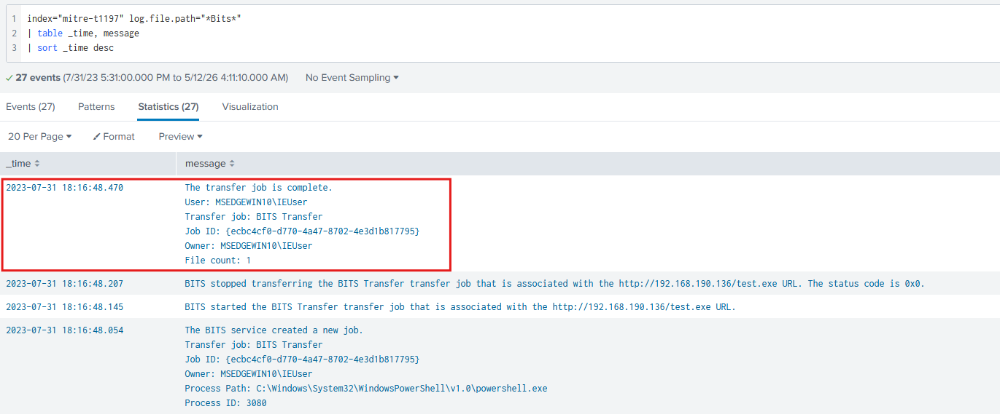

# Lab Overview
---
**Lab:** [T1197 Lab](https://cyberdefenders.org/blueteam-ctf-challenges/t1197/)  
**Platform:** CyberDefenders  
**Category:** Threat Hunting  
**Difficulty:** Medium  
**Tools:** Splunk  

# Summary
---
This lab investigates a BITS-based malware delivery attack against a Windows machine using Splunk to analyze Windows Defender and Windows event logs. The attacker used `bitsadmin.exe`, a legitimate Windows LOLBAS utility, to download malicious Meterpreter backdoor payloads from IP address `192.168.190.136` to the compromised system, bypassing network monitoring by leveraging a trusted Windows component.

Windows Defender detected the threats as `Trojan:Win32/Meterpreter.O!MTB`, identifying files `R4n50m.exe` and `test.exe` as malicious. The attacker also attempted to create a scheduled task named `eviltask` for persistence. The investigation demonstrates how BITS jobs can be abused for file transfer and execution while blending in with legitimate background activity, mapped to MITRE ATT&CK technique T1197.

# Scenario
---
Adversaries can exploit BITS (Background Intelligent Transfer Service) jobs to persistently execute code and carry out various background tasks. BITS is a COM-exposed, low-bandwidth file transfer mechanism used by applications such as updaters and messengers, allowing them to operate in the background without interfering with other networked applications.

In this incident, an employee received multiple alerts from Windows Defender indicating the presence of malicious files on their PC. As you arrive at the scene, your goal is to use SIEM to analyze the event logs from the suspicious machine and determine the nature of the events.

# Analysis
---
## What is the framework used to create the backdoors?

To begin this investgation, I first searched for event ID 1116 (Defender detected malware) in Windows Defender logs.  
```sql
index="mitre-t1197" log.file.path="*Defender*" winlog.event_id=1116
| table _time, message
| sort _time asc
```

Upon examining the results, multiple threats with the threat name `Trojan:Win32/Meterpreter.O!MTB` was detected. An event at `2023-07-31 18:28:03` reveals a benign file named `ignite.png` linked to the process `svchost.exe` which is a legitimate Windows process. The use of `svchost.exe` was likely to blend in with normal system behavior and evade security controls.  
  

Based on this, the attacker used Meterpreter, which is part of the `Metasploit` framework to create backdoors on the system.  

## What is the name of the scheduled task that the attacker tried to create?

From the same result ouput of the previous query, a log event at time `2023-07-31 18:27:46` shows the attacker attempting to create a scheduled task named `eviltask`.  
  

## What is the `LOLBAS` used by the malicious actor to move the backdoors to the targeted machine?

The query below searches for event ID 4688, which logs new process creation, and outputs the parent process name and new process name.  
```sql
index="mitre-t1197" winlog.event_id=4688 ("cmd.exe" OR "powershell.exe")
| table winlog.event_data.ParentProcessName, winlog.event_data.NewProcessName
| sort _time asc
```

Analyzing the results revealed an interesting new process named `bitsadmin.exe` located in the `System32` directory.  
  

According to [LOLBAS](https://lolbas-project.github.io/lolbas/Binaries/Bitsadmin/), the `bitsadmin.exe` can be used to download files, copy files, or execute processes.  
  

To further investigate the usage of `bitsadmin.exe`, I searched through the Microsoft Bits Client Operational logs.  
```sql
index="mitre-t1197" log.file.path="*Bits*"
| table _time, message
| sort _time
```
  

The results show file transfers for the file `R4n50m.exe` and `test.exe`. The name `R4n50m` resembles to the term "ransom" which suggest malicious intent.  

We can further confirm this suspicion using the previous query for event ID 1116.  
```sql
index="mitre-t1197" log.file.path="*Defender*" winlog.event_id=1116 (winlog.event_data.Path="*r4n50m*" OR winlog.event_data.Path="*test*") 
| table _time, message
| sort _time asc
```

In the screenshot below, Windows Defender identified both `r4n50m.exe` and `test.exe` threats as `Trojan:Win32/Meterpreter.O`.  
  

## When was the first attempt made by the attacker to execute the `LOLBAS`?

Refine the previous query below to include time into the output. and search specifically for `bitsadmin.exe`. Also set the time range to `All time`.   
```sql
index="mitre-t1197" winlog.event_id=4688 ("cmd.exe" OR "powershell.exe") winlog.event_data.NewProcessName="*bitsadmin.exe*"
| table _time, winlog.event_data.ParentProcessName, winlog.event_data.NewProcessName
| sort _time asc
```

The results show that the first attempt made by the attacker to execute `bitsadmin.exe` occurred at `2023-07-31 17:39:45`.  
  

## What is the IP address of the attacker?

Using this previous query to search for logs related to BITS, we can find the IP of the attacker by observing where the attacker downloaded the malicious files from.  
```sql
index="mitre-t1197" log.file.path="*Bits*"
| table _time, message
| sort _time asc
```

In the screenshot below, the attacker transferred the file `r4n50m.exe` from the location `http://192.168.190.136`. This indicates that the attacker's IP address is `192.168.190.136`.  
  

## When was the most recent file downloaded by the attacker to the targeted machine?

Using the previous query, we can change the sort to descending order to display the newest events first.  
  

In the screenshot above, the most recent file downloaded by the attacker occurred at `2023-07-31 18:16:48`.  
