# Lab Overview
---
**Lab:** [3CX Supply Chain Lab](https://cyberdefenders.org/blueteam-ctf-challenges/3cx-supply-chain/)  
**Platform:** CyberDefenders  
**Category:** Threat Intel  
**Difficulty:** Easy  
**Tools:** VirusTotal  

# Summary
---
This lab investigates a supply chain attack involving the 3CX Desktop Application where a legitimate software was compromised to deliver malware into an enterprise environment. Through threat intelligence analysis, it was identified that specific Windows versions of the 3CX application was infected with the trojan malware.  

Using VirusTotal to perform the analysis, the `.msi` installer revealed that it dropped two malicious DLLs `ffmpeg.dll` and `d3dcompiler_47.dll` and executed them using DLL side-loading techniques to maintain persistence. These payloads were classified as trojans and demonstrated evasion tactics including sandbox and virtualization detection specifically targeting the VMWare hypervisor. Additionally, the malware leveraged obfuscation techniques using the RC4 encryption algorithm to conceal its activities.  

It was determined that this attack is linked to the AppleJeus campaign that is associated with the APT Lazarus Group, a sophisticated North Korean state-sponsored threat actor.  
# Scenario
---
A large multinational corporation heavily relies on the 3CX software for phone communication, making it a critical component of their business operations. After a recent update to the 3CX Desktop App, antivirus alerts flag sporadic instances of the software being wiped from some workstations while others remain unaffected. Dismissing this as a false positive, the IT team overlooks the alerts, only to notice degraded performance and strange network traffic to unknown servers. Employees report issues with the 3CX app, and the IT security team identifies unusual communication patterns linked to recent software updates.  

As the threat intelligence analyst, it's your responsibility to examine this possible supply chain attack. Your objectives are to uncover how the attackers compromised the 3CX app, identify the potential threat actor involved, and assess the overall extent of the incident. 

# Indicators of Compromise (IOCs)
---

| INDICATOR     | TYPE | VALUE                            |
| ------------- | ---- | -------------------------------- |
| MSI File Hash | MD5  | 0eeb1c0133eb4d571178b2d9d14ce3e9 |

# Analysis
---
## Understanding the scope of the attack and identifying which versions exhibit malicious behavior is crucial for making informed decisions if these compromised versions are present in the organization. How many versions of 3CX running on Windows have been flagged as malware?

To begin this investigation, we will do a quick Google search to identify all affected versions of the compromised software.  
Searching for `versions affected by 3CX malware` on Google led me to this [article](https://blogs.vmware.com/security/2023/03/investigating-3cx-desktop-application-attacks-what-you-need-to-know.html) created by VMware that detailed what versions were affected for Windows. From the VMware, "the affected 3CX desktop app versions were 18.12.407 and 18.12.416 for Windows."  

Based on this detail, we can conclude that the two versions `18.12.407` and `18.12.416` were flagged as malware on Windows.  

## Determining the age of the malware can help assess the extent of the compromise and track the evolution of malware families and variants. What's the UTC creation time of the `.msi` malware?

To determine the creation time of the malware, we can upload the `.msi` to VirusTotal to do an analysis on the malware. Navigating to the Details tab, under the History section we can find the UTC creation time of the `.msi` malware.  
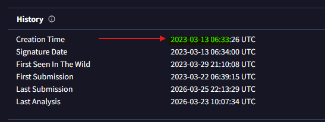  

## Executable files (`.exe`) are frequently used as primary or secondary malware payloads, while dynamic link libraries (`.dll`) often load malicious code or enhance malware functionality. Analyzing files deposited by the Microsoft Software Installer (`.msi`) is crucial for identifying malicious files and investigating their full potential. Which malicious DLLs were dropped by the `.msi` file?

Navigating to the Relations tab, we can observe two DLL files that have high detections under Bundled Files. Although there are other DLL files present, these two have the highest detection rate indicating that these have malicious activity.  
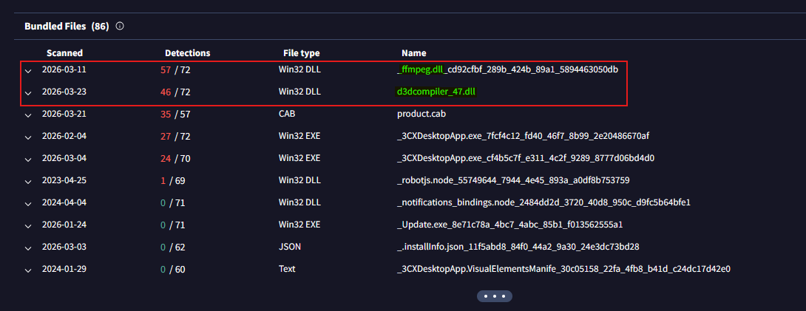  
The files `ffmpeg.dll` and `d3dcompiler_47.dll` are likely to be the malicious DLLs dropped by the `.msi` file.  

## Recognizing the persistence techniques used in this incident is essential for current mitigation strategies and future defense improvements. What is the MITRE Technique ID employed by the `.msi` files to load the malicious DLL?

To find the persistence technique ID used, we can utilize the MITRE ATT&CK matrix in the Behavior tab. Under the Persistence tactic, we see the technique `Hijack Execution Flow` that involves DLL side loading as its sub-technique.  
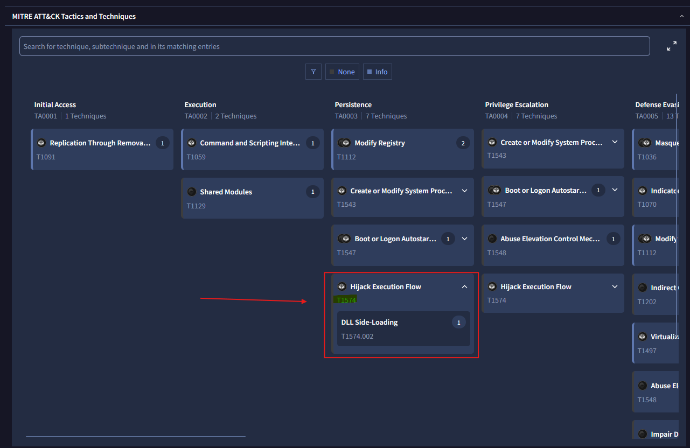  
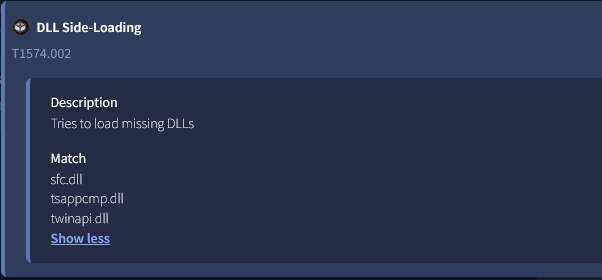  
Further inspection of the sub-technique `DLL Side-Loading` confirms that this is the technique used by the malware to load malicious DLLs.

## Recognizing the malware type (`threat category`) is essential to your investigation, as it can offer valuable insight into the possible malicious actions you'll be examining. What is the threat category of the two malicious DLLs?

To identify the threat category of the DLLs, we can perform an analysis of both DLLs in VirusTotal. A quick way to do this is by navigating to the Relations tab of the `.msi` malware then expanding each of the DLLs to reveal its SHA256 hash. Clicking on each will run a VirusTotal analysis on the hash.  
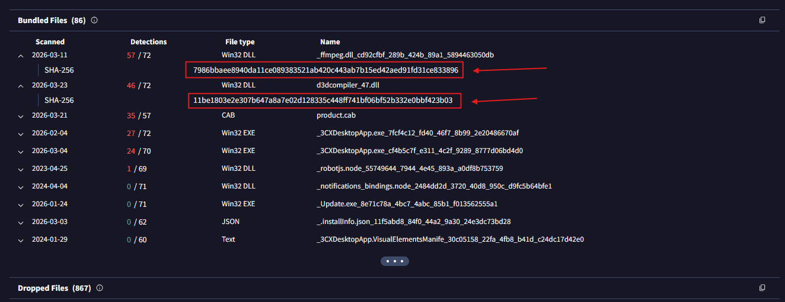  

From the screenshots below, VirusTotal has identified both DLLs as a `trojan` in the threat categories.
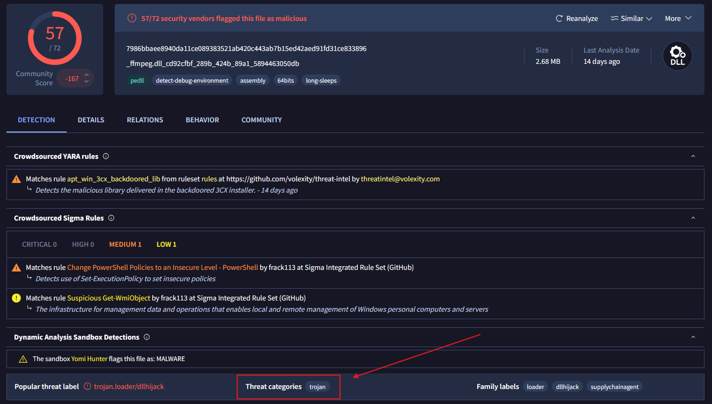  
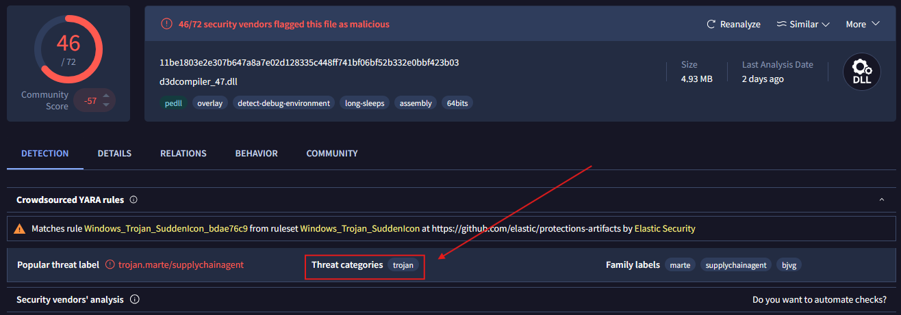  

## As a threat intelligence analyst conducting dynamic analysis, it's vital to understand how malware can evade detection in virtualized environments or analysis systems. This knowledge will help you effectively mitigate or address these evasive tactics. What is the MITRE ID for the virtualization/sandbox evasion techniques used by the two malicious DLLs?

Checking the MITRE ATT&CK matrix of each DLL revealed it used technique `T1497` to evade detection in virtualized environments.  
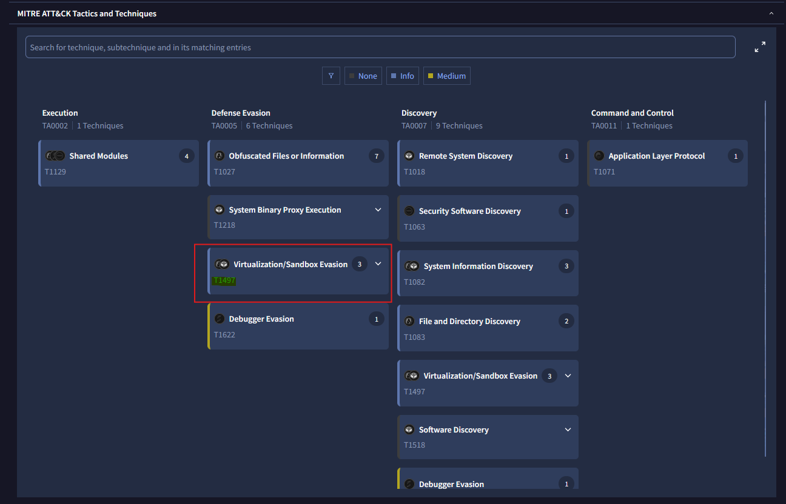  

## When conducting malware analysis and reverse engineering, understanding anti-analysis techniques is vital to avoid wasting time. Which hypervisor is targeted by the anti-analysis techniques in the `ffmpeg.dll` file?

While analyzing the `ffmpeg.dll` file, we can click on the sub-technique `System Checks` to reveal the hypervisor that was targeted.  
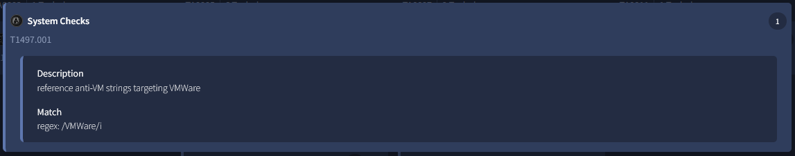  
We can conclude that `VMWare` was the targeted hypervisor by the `ffmpeg.dll` file.  

## Identifying the cryptographic method used in malware is crucial for understanding the techniques employed to bypass defense mechanisms and execute its functions fully. What encryption algorithm is used by the `ffmpeg.dll` file?

In the MITRE ATT&CK matrix, the technique `T1027` likely deals with encryption as it pertains to obfuscated files or information.  
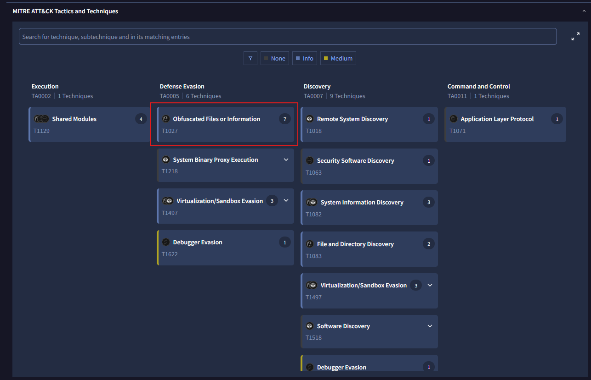
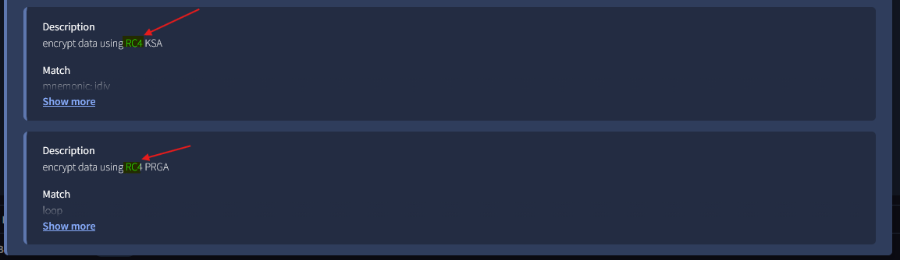  
Upon further inspection of the technique, we can see it uses the `RC4` algorithm to encrypt data.  
## As an analyst, you've recognized some TTPs involved in the incident, but identifying the APT group responsible will help you search for their usual TTPs and uncover other potential malicious activities. Which group is responsible for this attack?

To find the original APT group responsible for this supply chain attack, we can review the 3CX Supply Chain Attack campaign posted by the MITRE ATT&CK. MITRE linked this attack to a group called `AppleJeus`.  
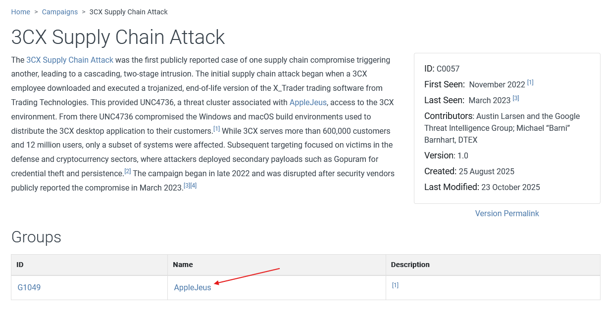  

Further analysis into `AppleJeus` revealed that it is part of the larger North Korean threat group `Lazarus`.  
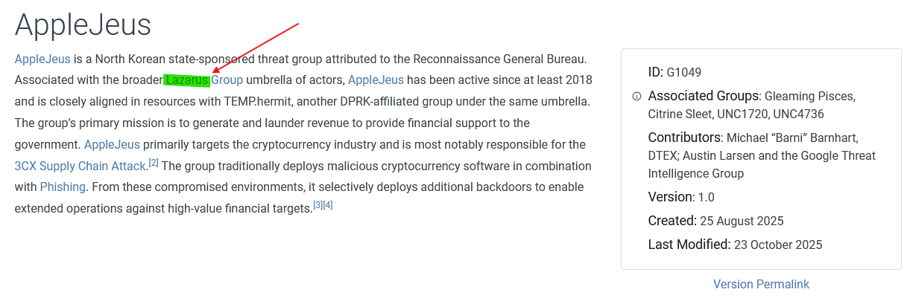  