# Lab Overview
---
**Lab:** [GrabThePhisher Lab](https://cyberdefenders.org/blueteam-ctf-challenges/grabthephisher/)  
**Platform:** CyberDefenders  
**Category:** Threat Intel  
**Difficulty:** Easy  
**Tools:** VSCode  

# Summary
---
This lab investigates a cryptocurrency phishing campaign targeting users of a decentralized finance (DeFi) platform by impersonating the PancakeSwap exchange. Through threat intelligence analysis, it was identified that the attacker specifically targeted MetaMask wallets.  

Analysis of the phishing kit revealed that it was written in PHP and used external services like Sypex Geo API to collect victim geolocation data. Captured credentials including wallet seed phrases were locally stored and exfiltrated in real time via a Telegram bot.  

Further investigation uncovered multiple compromised seed phrases and embedded Telegram bot tokens, chat IDs, and developer aliases provided key indicators of compromise (IoCs).  

# Scenario
---
A decentralized finance (DeFi) platform recently reported multiple user complaints about unauthorized fund withdrawals. A forensic review uncovered a phishing site impersonating the legitimate PancakeSwap exchange, luring victims into entering their wallet seed phrases. The phishing kit was hosted on a compromised server and exfiltrated credentials via a Telegram bot.

Your task is to conduct threat intelligence analysis on the phishing infrastructure, identify indicators of compromise (IOCs), and track the attacker’s online presence, including aliases and Telegram identifiers, to understand their tactics, techniques, and procedures (TTPs).

# Indicators of Compromise (IOCs)
---

| INDICATOR                    | TYPE               | VALUE                                          |
| ---------------------------- | ------------------ | ---------------------------------------------- |
| Telegram Bot Token           | API Token          | 5457463144:AAG8t4k7e2ew3tTi0IBShcWbSia0Irvxm10 |
| Telegram Chat ID             | Account Identifier | 5442785564                                     |
| Phishing Kit Developer Alias | Threat Actor       | j1j1b1s@m3r0                                   |

# Analysis
---
## Which wallet is used for asking the seed phrase?

One of the first things I noticed in the phishing infrastructure is an interesting directory named `metamask`. Based on my research, MetaMask is a cryptocurrency wallet that is used to manage Ethereum assets.  
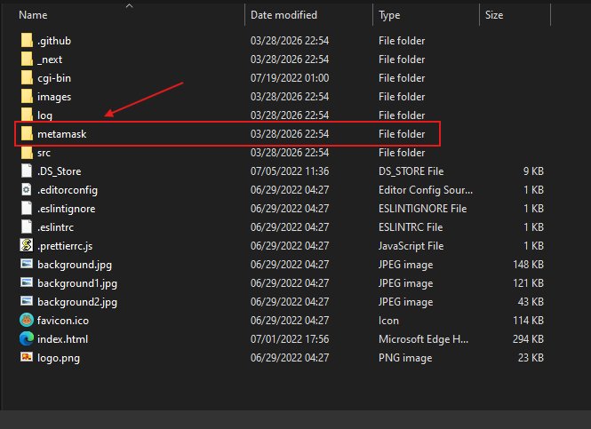  
The presence of this directory likely indicates that this phishing site is targeting MetaMask wallets.  

## What is the file name that has the code for the phishing kit?

Upon analyzing the contents of the `metamask` directory, there is an interesting file named `metamask.php` which is likely the code of the phishing kit.  
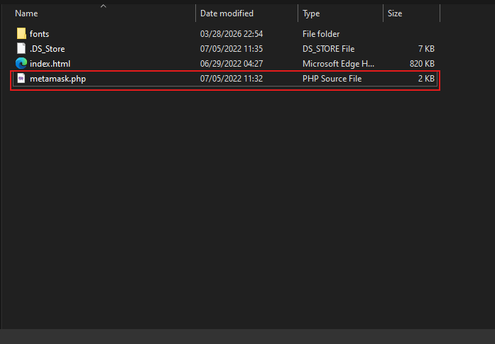  

## In which language was the kit written?

In the file extension of `metamask.php`, we can see it has the `.php` extension which indicates that this phishing kit was written in the PHP coding language.  
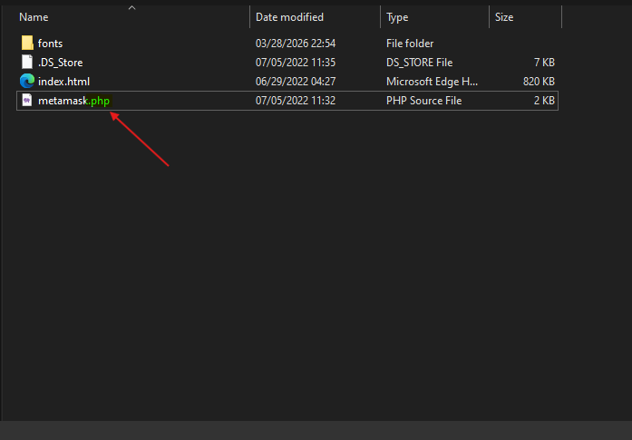  

## What service does the kit use to retrieve the victim's machine information?

To identify the service used by the kit, I performed a static analysis into the file `metamask.php`, and I observed that the code is using a geolocation service to fetch information about the victim's machine.  
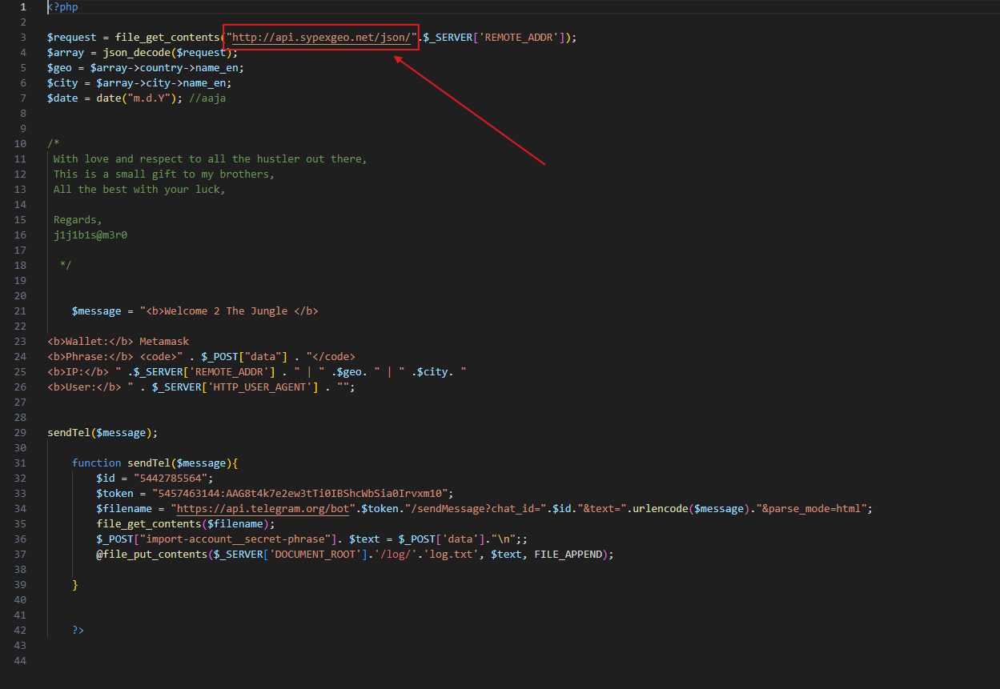  
I identified the phishing script is utilizing the `Sypex Geo` API to retrieve geolocation details based on the victim's IP address. `Sypex Geo` is a tool used for identifying an individual's geolocation given an IP address.  

## How many seed phrases were already collected?

Further analysis into the phishing script revealed that it sends collected information, specifically wallet seeds, to the `log.txt` file.  
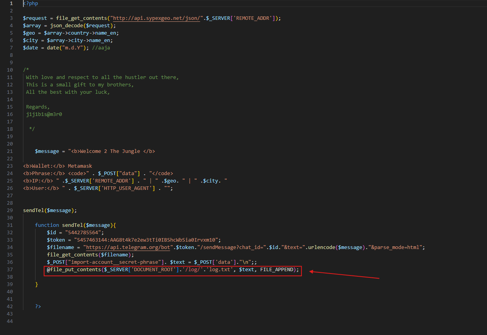  

Upon examining the `log.txt` file, the content displays three entries where each entry contains 12 words. Typically wallet seeds are comprised of 12 or 24 words and they are used by users to recover their crypto wallet and assets.  
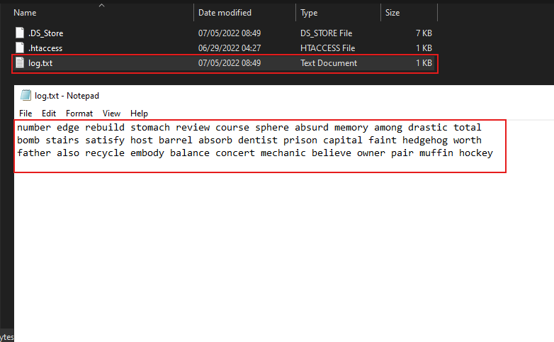  

## Could you please provide the seed phrase associated with the most recent phishing incident?

The most recent seed phrase captured in the `log.txt` file is the last entry.  
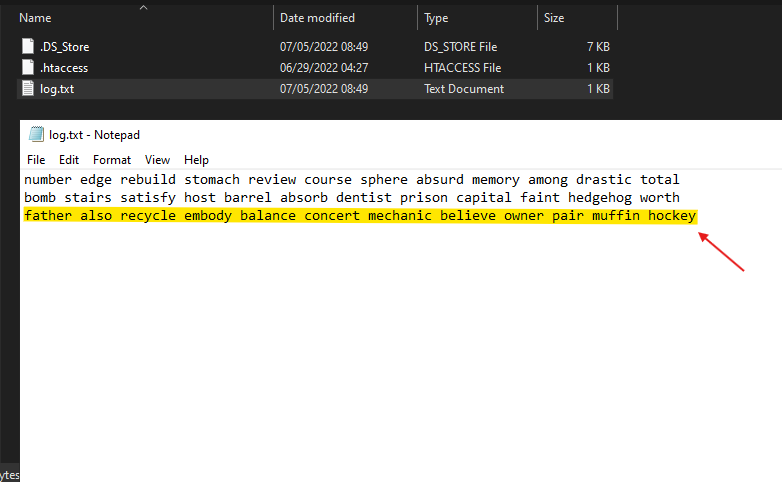  

## Which medium was used for credential dumping?

In the phishing script, I identified that it is likely sending the captured information via a `Telegram` bot for data exfiltration.  
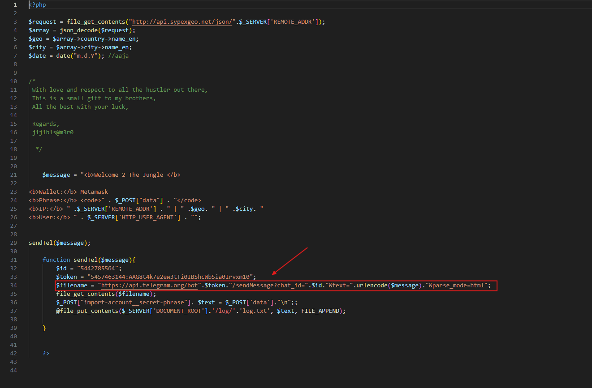  

## What is the token for accessing the channel?

In the phishing script, the `$token` value indicates the token for the Telegram bot channel.  
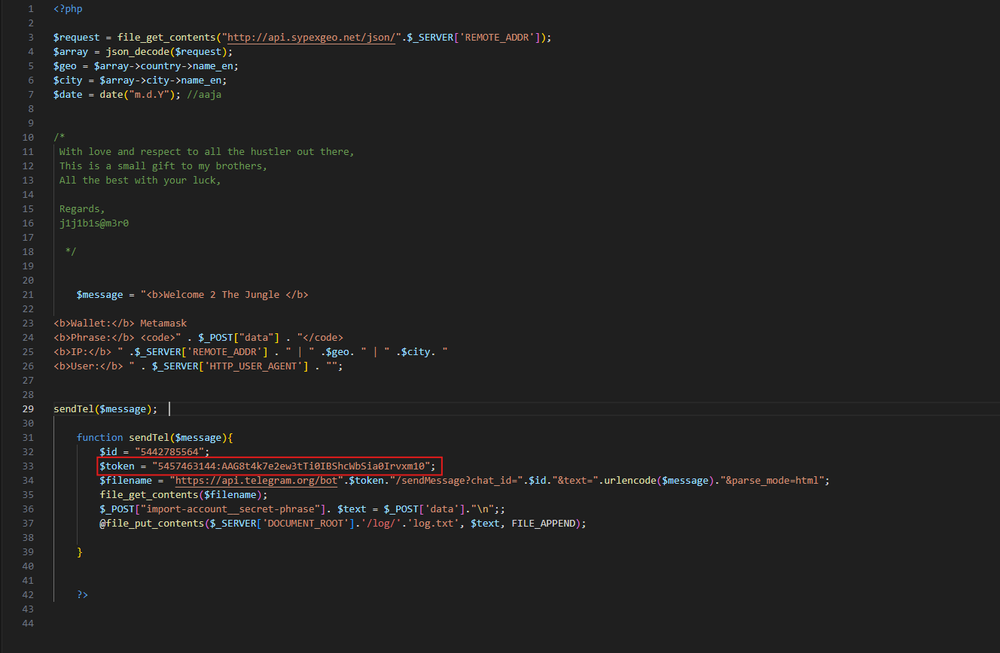  

## What is the Chat ID for the phisher's channel?

In the phishing script, the `$id` value indicates the chat ID of the phisher's Telegram channel.
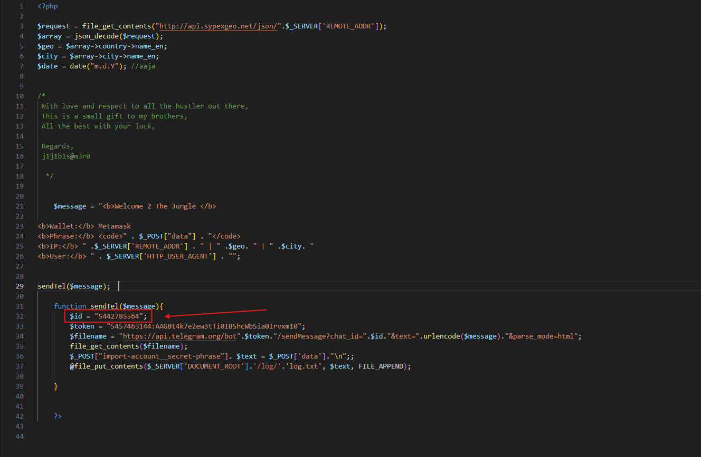  

## What are the allies of the phish kit developer?

The alias of the phishing kit developer is noted in the code comments.  
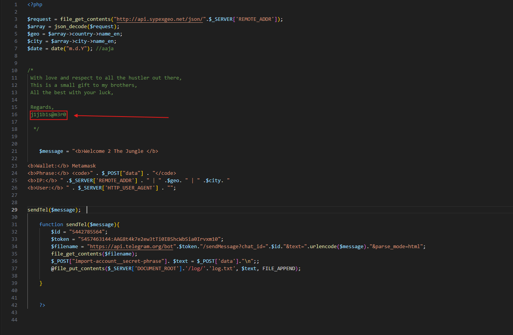  
