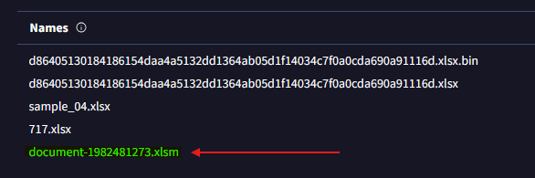
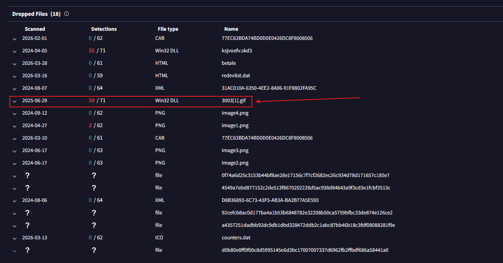
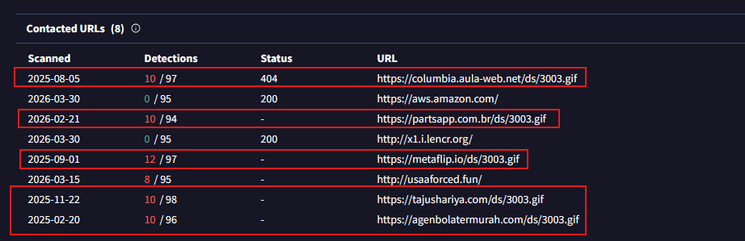
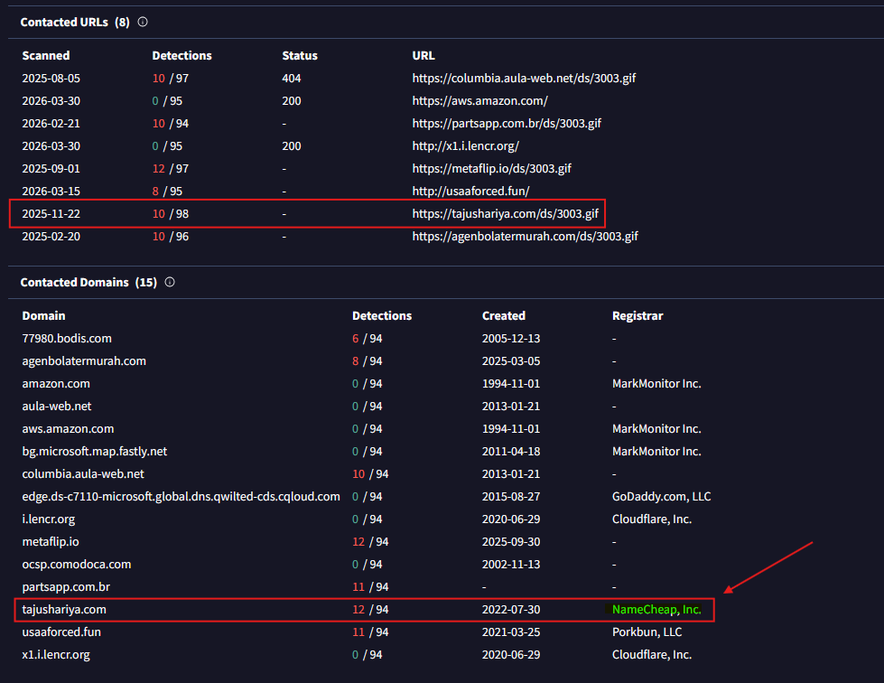
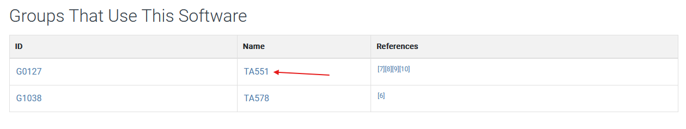
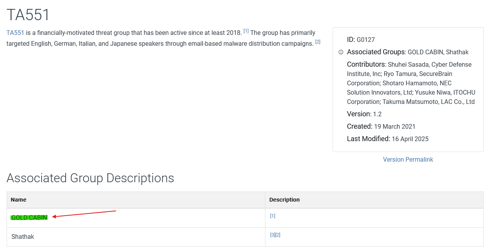
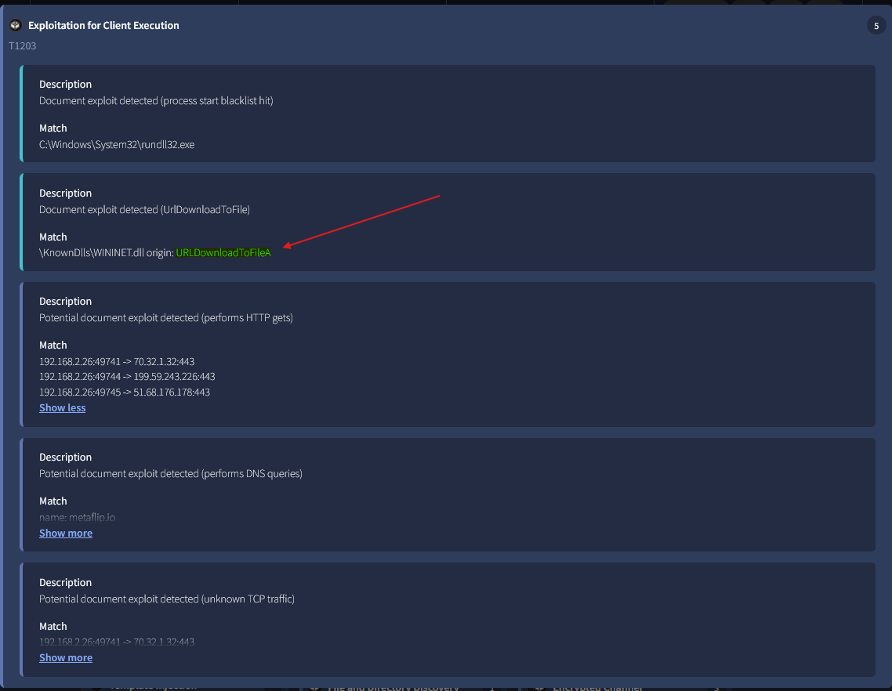

# Lab Overview
---
**Lab:** [IcedID Lab](https://cyberdefenders.org/blueteam-ctf-challenges/icedid/)  
**Platform:** CyberDefenders  
**Category:** Threat Intel  
**Difficulty:** Easy  
**Tools:** VirusTotal, MITRE ATT&CK  

# Summary
---
This lab focuses on threat intelligence analysis of an IceID malware sample. By analyzing the provided hash in VirusTotal, the sample was identified as a malicious Excel macro file (`.xlsm`) used as the initial infection vector.  

Analysis revealed that the malware dropped an additional payload, a .gif file, and attempted to retrieve more payloads from multiple malicious domains. Behavioral analysis using the MITRE ATT&CK framework showed that the malware used the `URLDownloadToFileA` function to download additional payloads and its efforts are linked back to threat group `TA551` (Gold Cabin).  

# Scenario
---
A cyber threat group was identified for initiating widespread phishing campaigns to distribute further malicious payloads. The most frequently encountered payloads were IcedID. You have been given a hash of an IcedID sample to analyze and monitor the activities of this advanced persistent threat (APT) group.

# Indicators of Compromise (IOCs)
---

| INDICATOR      | TYPE | VALUE                                    |
| -------------- | ---- | ---------------------------------------- |
| XLSX File Hash | SHA1 | 191eda0c539d284b29efe556abb05cd75a9077a0 |

# Analysis
---
## What is the name of the file associated with the given hash?

I uploaded the SHA1 hash value to VirusTotal to run an analysis on it. Navigating to the Details tab, under the Names section, I discovered the name `document-1982481273.xlsm` to be associated with the given hash.  
  

## Can you identify the filename of the GIF file that was deployed?

In the Relations tab under the Dropped Files section, I identified it dropped a malicious file named `3003.gif`. From the screenshot below, it has a high malicious detection rate of `59/71`.  
  

## How many domains does the malware look to download the additional payload file in Q2?

In the Relations tab under the Contacted URLs, I observed multiple domains that included the malicious `3003.gif` file. Based on this observation, I can conclude that the 5 domains highlighted in the screenshot below was used to download the additional payload.  
  

## From the domains mentioned in Q3, a DNS registrar was predominantly used by the threat actor to host their harmful content, enabling the malware's functionality. Can you specify the Registrar INC?

From the previous question, a domain that stood out was `tajushariya[.]com` as it might be a website the threat actor hosted. Under the Contacted Domains section, the registrar for this domain is `NameCheap`.  
  

## Could you specify the threat actor linked to the sample provided?

Using the MITRE ATT&CK framework, I discovered the group `TA551` to have been associated with the IceID malware.  
  
  
Upon investigation into who `TA551` is, I identified the group name `Gold Cabin`.  

## In the Execution phase, what function does the malware employ to fetch extra payloads onto the system?

In VirusTotal, the MITRE ATT&CK matrix in the Behavior tab identified that this malware utilized technique ID `T1203`. Further investigation into this technique revealed it used the `URLDownloadToFileA` function to download extra payload onto the compromised system.  
  