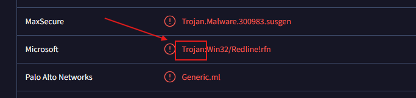
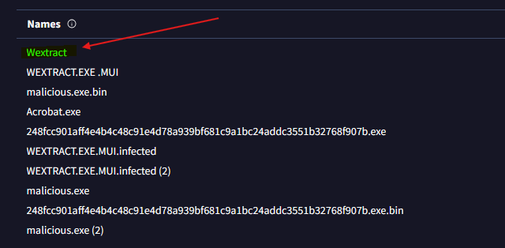
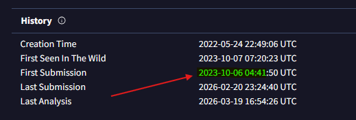
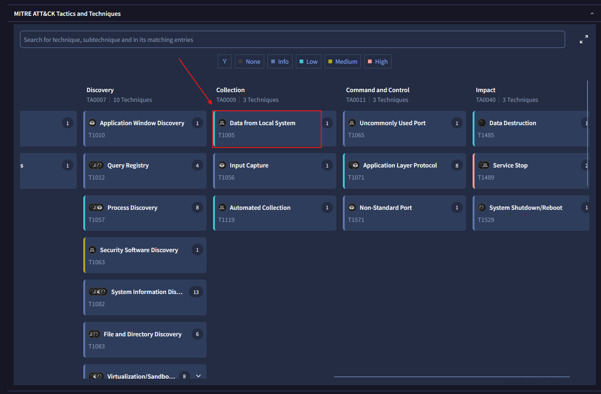
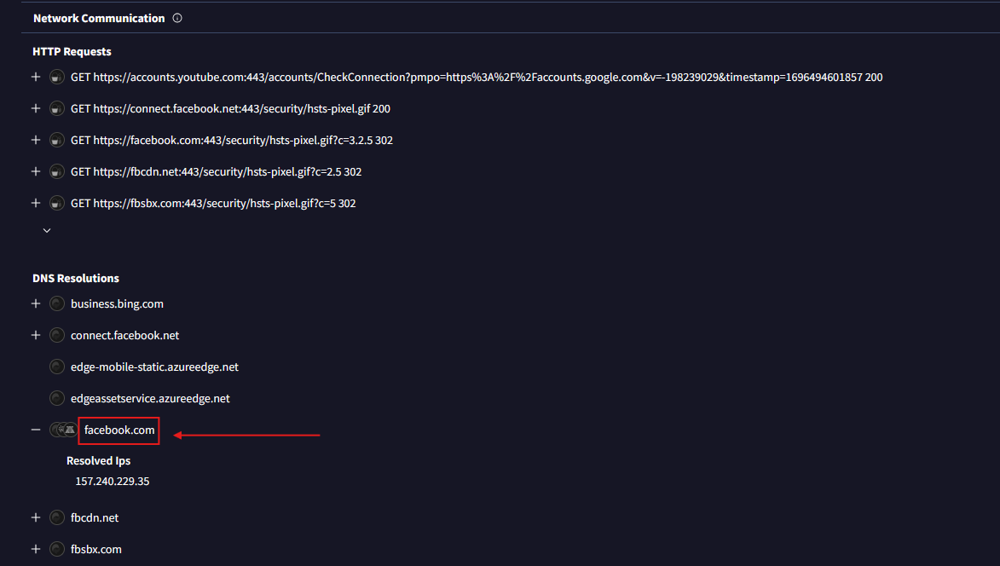
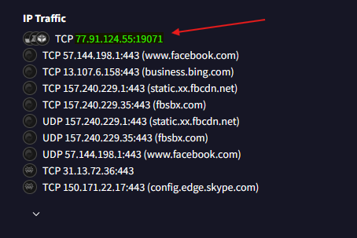
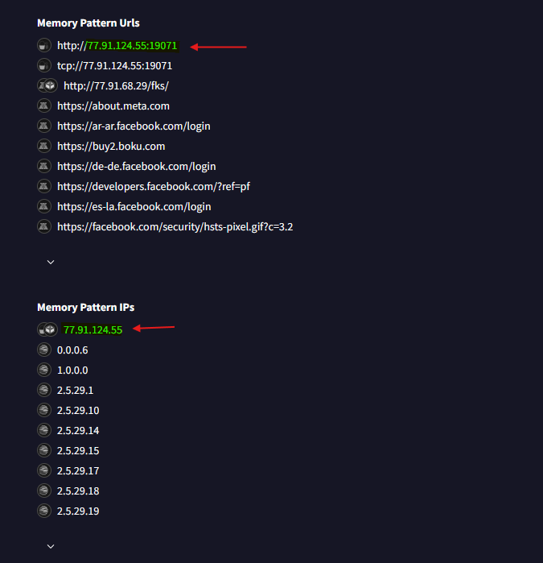
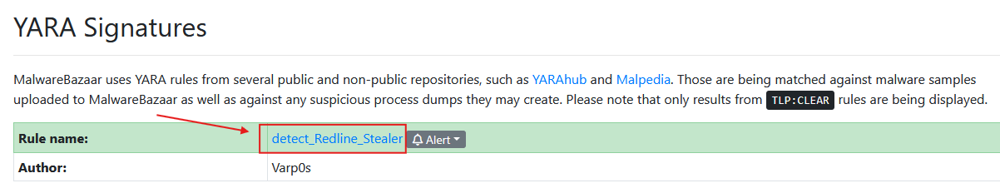
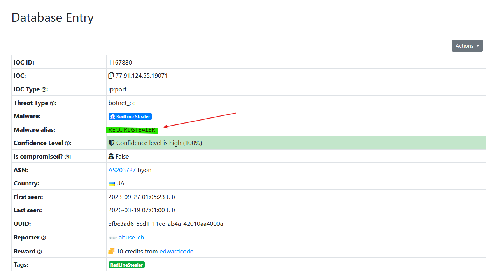
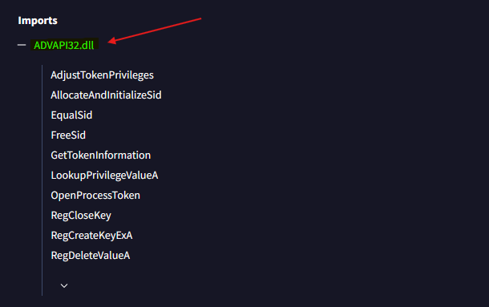

# Lab Overview
---
**Lab:** [Red Stealer Lab](https://cyberdefenders.org/blueteam-ctf-challenges/red-stealer/)  
**Platform:** CyberDefenders  
**Category:** Threat Intel  
**Difficulty:** Easy  
**Tools:** VirusTotal, MalwareBazaar, ThreatFox  

# Summary
---
This lab focuses on analyzing a suspicious executable by using threat intelligence platforms like VirusTotal, MalwareBazaar, and ThreatFox. By investigating the file's hash, key indicators were identified, including its classification as an information stealer, associated file names, and initial VirusTotal submission timeline. Behavioral analysis revealed techniques aligned with MITRE ATT&CK, including data collection from local systems and communication with a Command and Control (C2) server.

Further analysis uncovered DNS activity tied to social media platform Facebook, along with malicious network connections to a specific IP address and uncommon port, indicating potential data exfiltration. This lab demonstrates how combining multiple threat intelligence sources help to quickly identify, classify, and respond to malware infections.  

# Scenario
---
You are part of the Threat Intelligence team in the SOC (Security Operations Center). An executable file has been discovered on a colleague's computer, and it's suspected to be linked to a Command and Control (C2) server, indicating a potential malware infection.  

Your task is to investigate this executable by analyzing its hash. The goal is to gather and analyze data beneficial to other SOC members, including the Incident Response team, to respond to this suspicious behavior efficiently.  

# Indicators of Compromise (IOCs)
---

| INDICATOR     | TYPE   | VALUE                                                            |
| ------------- | ------ | ---------------------------------------------------------------- |
| EXE File Hash | SHA256 | 248FCC901AFF4E4B4C48C91E4D78A939BF681C9A1BC24ADDC3551B32768F907B |

# Analysis
---
## Categorizing malware enables a quicker and clearer understanding of its unique behaviors and attack vectors. What category has Microsoft identified for that malware in VirusTotal?

Uploading the SHA256 hash to VirusTotal, then under the Detections tab, find the Microsoft detection.  
  

## Clearly identifying the name of the malware file improves communication among the SOC team. What is the file name associated with this malware?

Navigate to **Details > Names** to find the name associated with the malware.  
  

## Knowing the exact timestamp of when the malware was first observed can help prioritize response actions. Newly detected malware may require urgent containment and eradication compared to older, well-documented threats. What is the UTC timestamp of the malware's first submission to VirusTotal?

Navigate to **Details > History** to find the date for when the malware was first submitted to VirusTotal.  
  

## Understanding the techniques used by malware helps in strategic security planning. What is the MITRE ATT&CK technique ID for the malware's data collection from the system before exfiltration?

Navigate to **Behavior > MITRE** and find the technique `Data from Local Systems` to obtain the technique ID.  
  

## Following execution, which social media-related domain names did the malware resolve via DNS queries?

Navigate to **Behavior > Network Communication** then search for a domain name resembling a social media website. Based on the DNS Resolutions, we see `facebook.com` was resolved via DNS queries.  
  

## Once the malicious IP addresses are identified, network security devices such as firewalls can be configured to block traffic to and from these addresses. Can you provide the IP address and destination port the malware communicates with?

In the same Behavior tab and Network Communication section, if we look under IP Traffic we can observe a suspicious traffic to `77[.]91[.]124[.]55[:]19071`. The port number `19071` is not commonly used so we can conclude this is the IP address and port the malware communicates with.  
  
  

## YARA rules are designed to identify specific malware patterns and behaviors. Using MalwareBazaar, what's the name of the YARA rule created by "Varp0s" that detects the identified malware?

Using MalwareBazaar, run the search `sha256:248fcc901aff4e4b4c48c91e4d78a939bf681c9a1bc24addc3551b32768f907b` and scroll down to YARA Signatures to find the rule name created by "Varp0s".  
  

## Understanding which malware families are targeting the organization helps in strategic security planning for the future and prioritizing resources based on the threat. Can you provide the different malware alias associated with the malicious IP address according to ThreatFox?

Using ThreatFox, run the search `ioc:77.91.124.55` to find the malware alias.  
  

## By identifying the malware's imported DLLs, we can configure security tools to monitor for the loading or unusual usage of these specific DLLs. Can you provide the DLL utilized by the malware for privilege escalation?

Back in VirusTotal, navigate to **Details >  Portable Executable Info** and under Imports section, we can find DLL `ADVAPI32.dll` that involves privileges which likely indicates that this DLL was used by the malware for privilege escalation.  
  