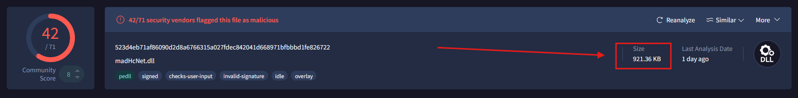
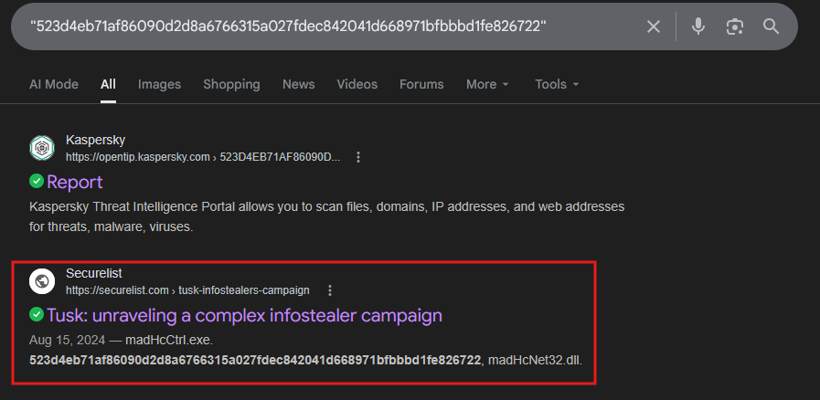
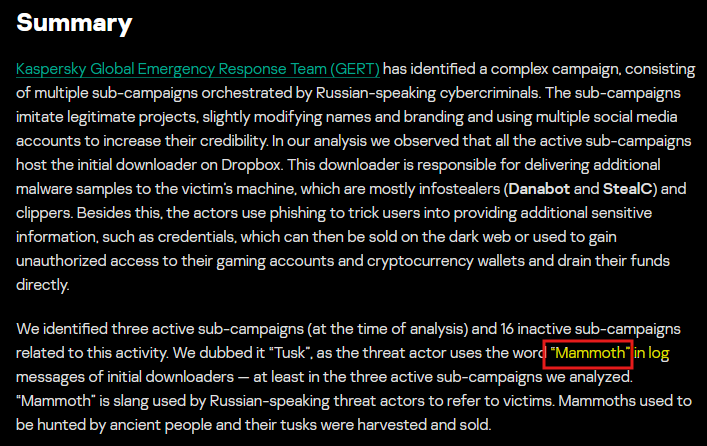
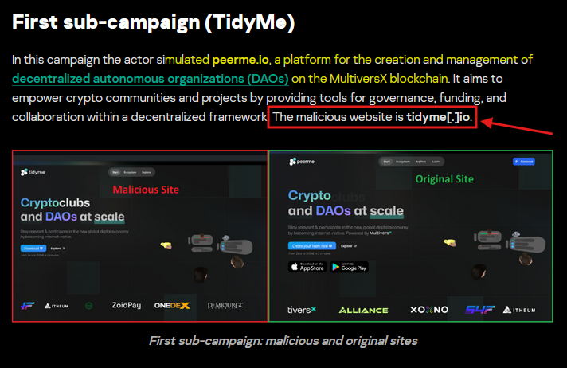
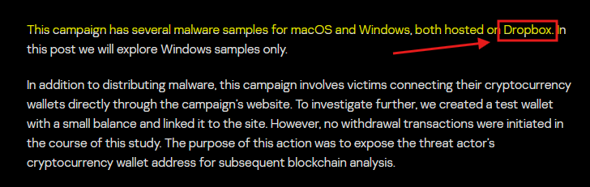
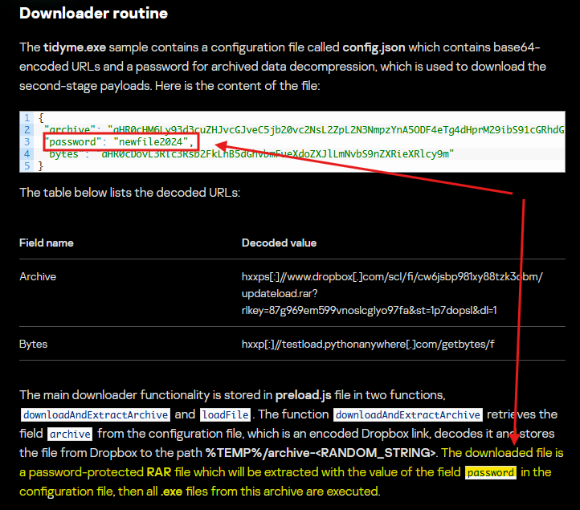
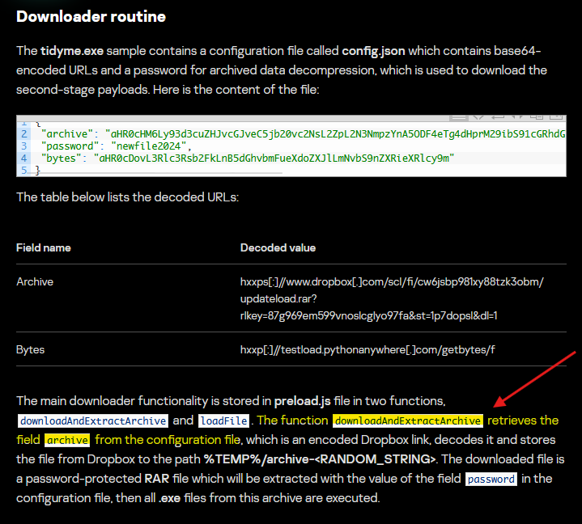
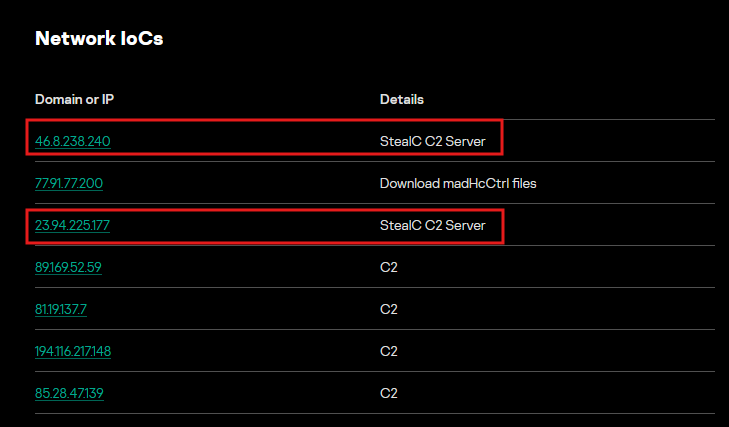
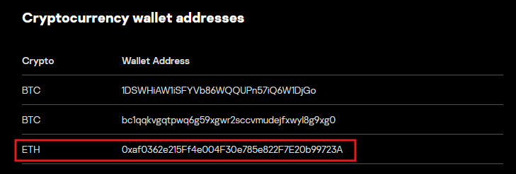

# Lab Overview
---
**Lab:** [Tusk Infostealer Lab](https://cyberdefenders.org/blueteam-ctf-challenges/tusk-infostealer/)  
**Platform:** CyberDefenders  
**Category:** Threat Intel  
**Difficulty:** Easy  
**Tools:** VirusTotal, Threat Intelligence Report

# Summary
---
This lab investigates the Tusk infostealer campaign, a multi-sub-campaign operation targeting cryptocurrency and blockchain users by impersonating legitimate decentralized platforms. Using threat intelligence sources and VirusTotal, the analysis revealed that the attacker created fake websites mimicking services like the MultiversX blockchain platform `peerme.io` to lure victims into downloading malicious executables.

The malware contained a base64-encoded configuration file with URLs for downloading second-stage payloads protected by an archive password. Hosted via cloud storage, the malware deployed secondary infostealers including StealC and DanaBot that communicated with identified C2 servers. An Ethereum wallet was also used as part of the campaign's financial infrastructure. The campaign's operators referred to victims as "mammoths," referencing an ancient hunted creature, and targeted multiple platforms across different operating systems.

# Scenario
---
A blockchain development company detected unusual activity when an employee was redirected to an unfamiliar website while accessing a DAO management platform. Soon after, multiple cryptocurrency wallets linked to the organization were drained. Investigators suspect a malicious tool was used to steal credentials and exfiltrate funds.

Your task is to analyze the provided intelligence to uncover the attack methods, identify indicators of compromise, and track the threat actor’s infrastructure.

# Analysis
---
## In KB, what is the size of the malicious file?

  

## What word do the threat actors use in log messages to describe their victims, based on the name of an ancient hunted creature?

  
  

## The threat actor set up a malicious website to mimic a platform designed for creating and managing decentralized autonomous organizations (DAOs) on the MultiversX blockchain (peerme.io). What is the name of the malicious website the attacker created to simulate this platform?

  

## Which cloud storage service did the campaign operators use to host malware samples for both macOS and Windows OS versions?

  

## The malicious executable contains a configuration file that includes base64-encoded URLs and a password used for archived data decompression, enabling the download of second-stage payloads. What is the password for decompression found in this configuration file?

  

## What is the name of the function responsible for retrieving the field archive from the configuration file?

  

## In the third sub-campaign carried out by the operators, the attacker mimicked an AI translator project. What is the name of the legitimate translator, and what is the name of the malicious translator created by the attackers?

  

## The downloader is tasked with delivering additional malware samples to the victim’s machine, primarily infostealers like StealC and Danabot. What are the IP addresses of the StealC C2 servers used in the campaign?

  

## What is the address of the Ethereum cryptocurrency wallet used in this campaign?

  