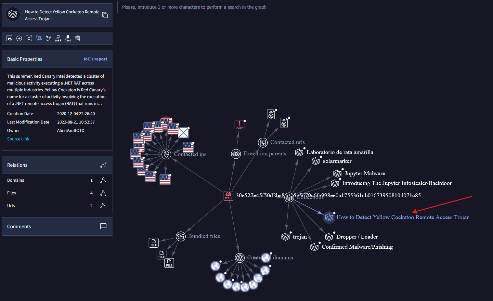
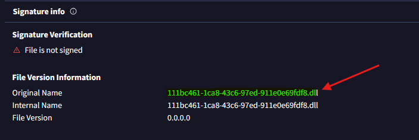
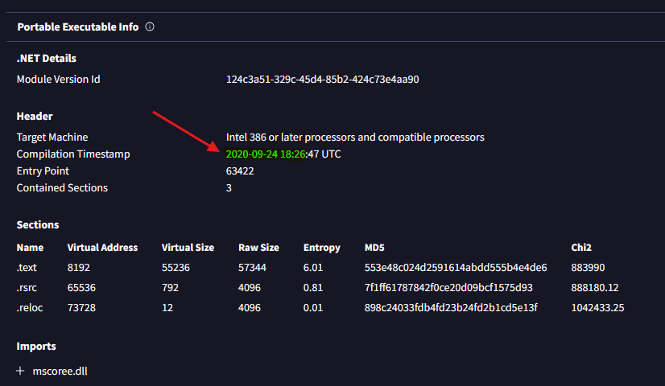
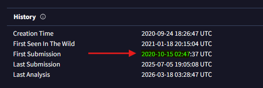
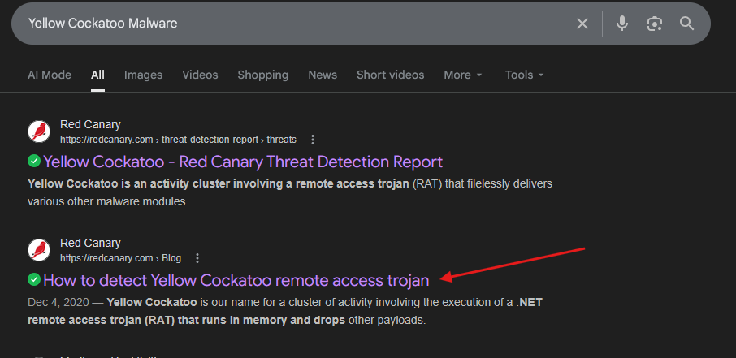
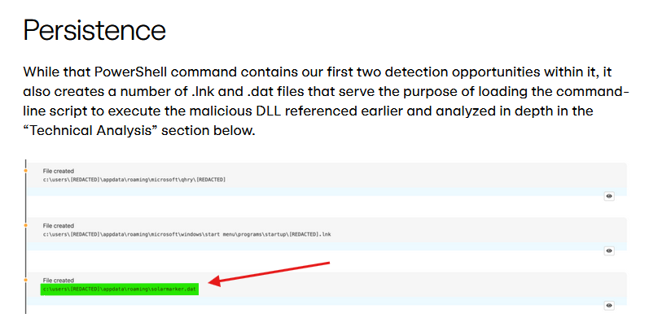
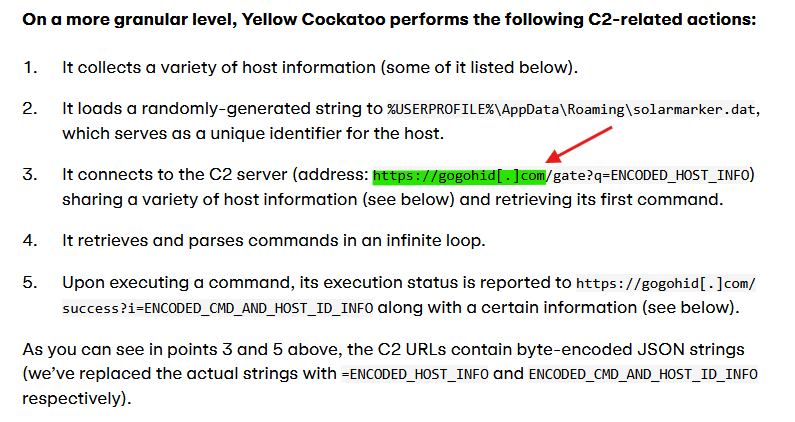

# Challenge Overview
---
**Challenge:** [Yellow RAT Lab](https://cyberdefenders.org/blueteam-ctf-challenges/yellow-rat/)  
**Platform:** CyberDefender  
**Category:** Threat Intel  
**Difficulty:** Easy  
**Tools:** VirusTotal, Red Canary  

# Summary
---
This lab involves using tools like VirusTotal and Red Canary to gather information on a malware.

# Scenario
---
During a regular IT security check at GlobalTech Industries, abnormal network traffic was detected from multiple workstations. Upon initial investigation, it was discovered that certain employees' search queries were being redirected to unfamiliar websites. This discovery raised concerns and prompted a more thorough investigation. Your task is to investigate this incident and gather as much information as possible.

# Challenge
---
## Understanding the adversary helps defend against attacks. What is the name of the malware family that causes abnormal network traffic?

Upload the malware hash to VirusTotal then navigate to the Relations tab and explore the graph summary.  
What we will find is that there are several associations with the hash, however, the most interesting one that relates to network is Yellow Cockatoo.  
  

## As part of our incident response, knowing common filenames the malware uses can help scan other workstations for potential infection. What is the common filename associated with the malware discovered on our workstations?

Navigate to the Details tab, then under the **Signature Info** section we can find the original name of the malware.  
  

## Determining the compilation timestamp of malware can reveal insights into its development and deployment timeline. What is the compilation timestamp of the malware that infected our network?

Navigate to the Details tab, then under **Portable Executable Info** section we can find the malware's compilation timestamp.  
  

## Understanding when the broader cybersecurity community first identified the malware could help determine how long the malware might have been in the environment before detection. When was the malware first submitted to VirusTotal?

Navigate to the Details tab, then under **History** section we can find the malware's first submission timestamp.   
  

## To completely eradicate the threat from Industries' systems, we need to identify all components dropped by the malware. What is the name of the .dat file that the malware dropped in the AppData folder?

I was unable to find any relevant information regarding a `.dat` file dropped by the malware so I search `Yellow Cockatoo Malware` in Google to find more information.  
  

Using the Red Canary article, if we scroll down to the **Persistence** section we can observe a `.dat` file created by the malware.  
  

## It is crucial to identify the C2 servers with which the malware communicates to block its communication and prevent further data exfiltration. What is the C2 server that the malware is communicating with?

Scrolling down further in the Red Canary article, we can find the C2 server's address.  
  
