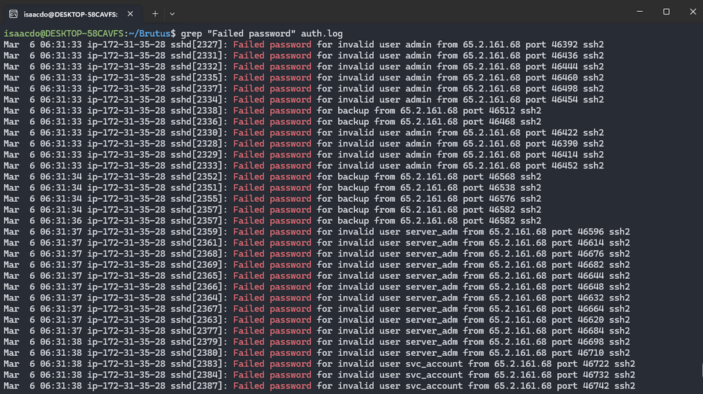
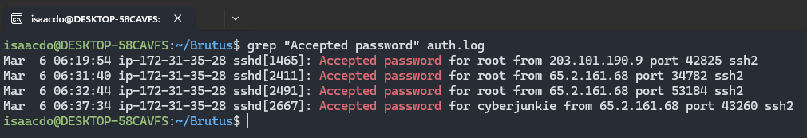
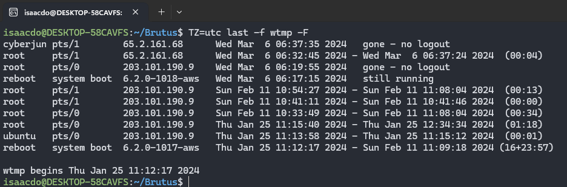
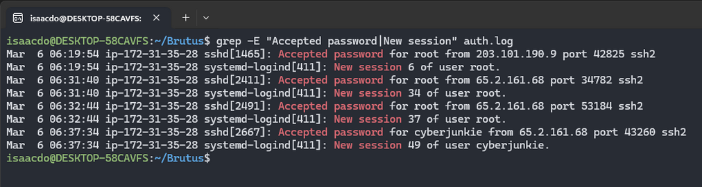
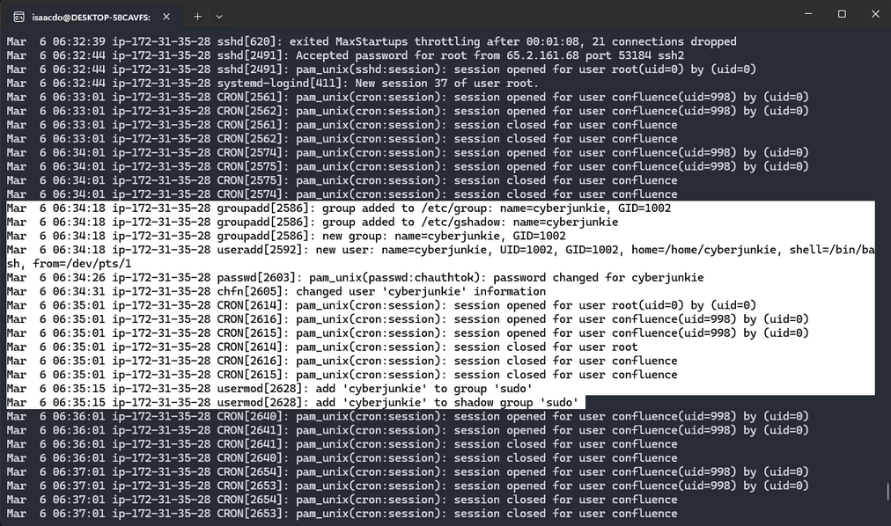
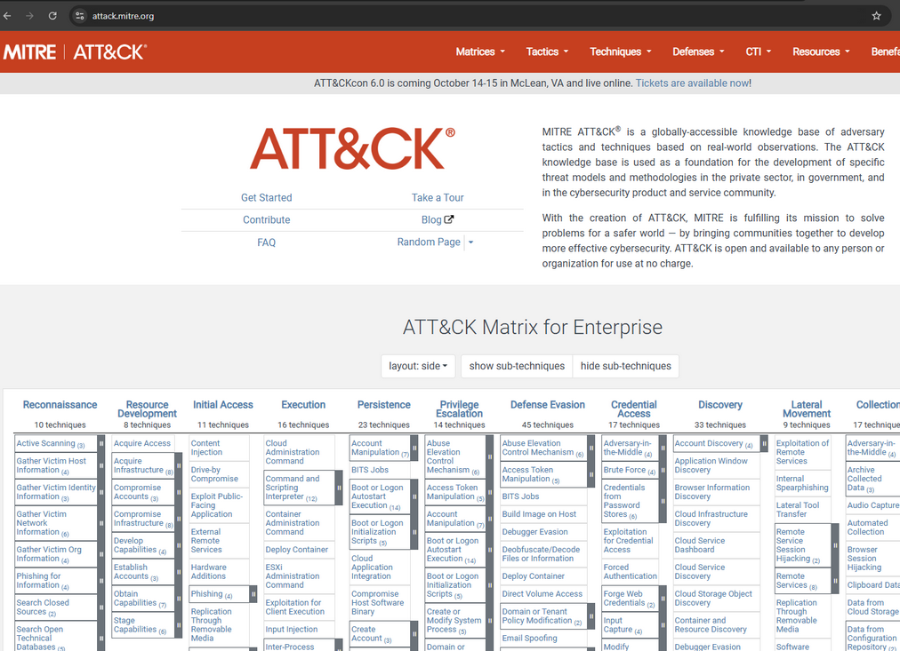
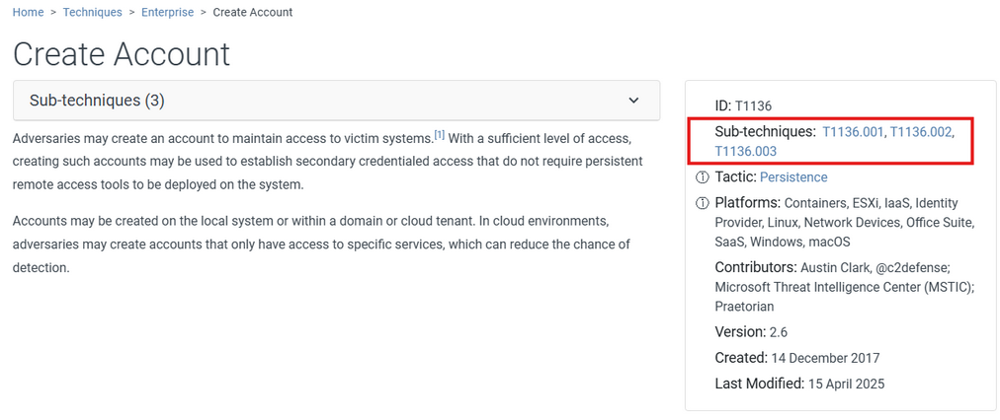
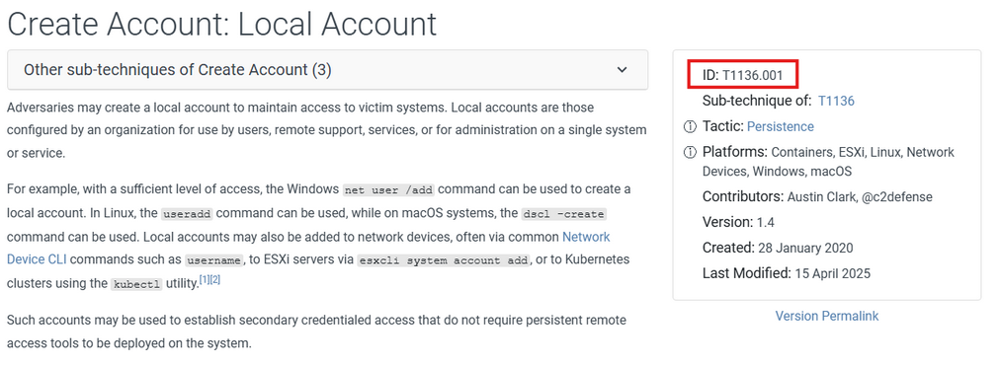
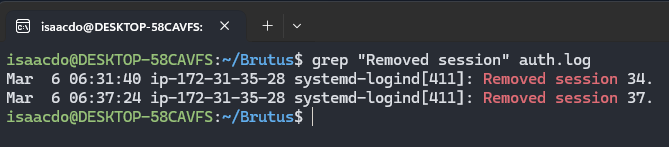
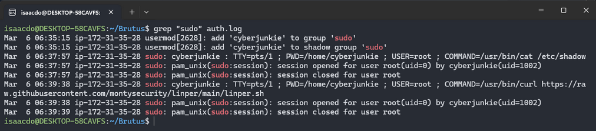

# Challenge Overview
---
**Challenge:** [Brutus](https://app.hackthebox.com/sherlocks/Brutus?tab=play_sherlock)  
**Platform:** HackTheBox  
**Category:** DFIR  
**Difficulty:** Very Easy  
**Tools:** grep, cat, MITRE ATT&CK  

# Summary
---
This lab focuses on investigating a successful SSH brute-force attack against a Linux server by analyzing authentication logs. Using artifacts such as auth.log and wtmp, the investigation identifies repeated failed login attempts that eventually lead to a successful compromise of the root account. The analysis traces the attacker’s activity after gaining access, including session creation, privilege actions, and the establishment of persistence through a new user account. The lab highlights how system authentication logs can be used to reconstruct attacker behavior and build a timeline of the intrusion.  

# Scenario
---
In this very easy Sherlock, you will familiarize yourself with Unix auth.log and wtmp logs. We'll explore a scenario where a Confluence server was brute-forced via its SSH service. After gaining access to the server, the attacker performed additional activities, which we can track using auth.log. Although auth.log is primarily used for brute-force analysis, we will delve into the full potential of this artifact in our investigation, including aspects of privilege escalation, persistence, and even some visibility into command execution.  

# Challenge
---
## Analyze the auth.log. What is the IP address used by the attacker to carry out a brute force attack?
  
I filtered down the auth.log to check for unusual amounts of failed password attempts. From my observation, there are multiple failed password attempts coming from IP address 65.2.161.68. From this, I conclude that the attacker's IP address is 65.2.161.68.  

## The bruteforce attempts were successful and attacker gained access to an account on the server. What is the username of the account?
  
Now that I know the attacker's IP address is 65.2.161.68, I applied a new filter to the logs to check for successful attempts. From the screenshot, I can see that the attacker had successfully logged into the **root** user at 06:31:40.  

## Identify the UTC timestamp when the attacker logged in manually to the server and established a terminal session to carry out their objectives. The login time will be different than the authentication time, and can be found in the wtmp artifact.
  
I ran the commands `TZ=utc last -f wtmp -F` to set the timezone to UTC, format the date and time, and read the wtmp file. I observe that the line `root pts/1 65.2.161.68 Wed Mar 6 06:32:45 2024 - Wed Mar 6 06:37:24 2024 (00:04)` looks to be when the attacker gained access and maintained access to carry out their objective. The correct UTC timestamp is `2024-03-06 06:32:45`.  

## SSH login sessions are tracked and assigned a session number upon login. What is the session number assigned to the attacker's session for the user account from Question 2?
  
I now apply a new filter to auth.log to look for when there was an accepted password and a new session was opened. From my observation, the attacker first established a connection to the root user in session 34.  

**NOTE:** HTB says that the answer is 37, which I believe is the incorrect answer, as this is the second session and not the first session.  

## The attacker added a new user as part of their persistence strategy on the server and gave this new user account higher privileges. What is the name of this account?
  
I ran the command `cat auth.log` to view the full auth.log to analyze further when the attacker added a new user. I noticed at 06:34:18, a group was added for a user named "cyberjunkie". Around the same time frame, there were lots of user configurations made for that user. I conclude that the new user the attacker added is `cyberjunkie`.  

## What is the MITRE ATT&CK sub-technique ID used for persistence by creating a new account?

  
  
To find out the sub-technique ID, I navigated to the MITTRE ATT&CK site, then under the "Persistence" tactics, I went into the "Create Account" technique. From there, I see there are three different sub-techniques: T1136.001, T1136.002, and T1136.003.  

To understand what each sub-technique was, I opened each sub ID and read into its technique, and I determined that sub-technique `T1136.001` (local account) was the most appropriate in this situation. T1136.002 was regarding domain accounts, and T1136.003 is about cloud accounts, which were not applicable in this case.  

## What time did the attacker's first SSH session end according to auth.log?
  
To find when the attacker's first SSH session ended, I applied a filter `Removed session` to get a list of when each sessions were closed. From my observation, the first SSH session ended on 2024-03-06 06:31:40.

**NOTE:** HTB says that the answer is 2024-03-06 06:37:24, which I believe is the incorrect answer, as this is the second session and not the first session.

## The attacker logged into their backdoor account and utilized their higher privileges to download a script. What is the full command executed using sudo?
  
I filtered down auth.log to show all sudo commands and I observe that at 06:39:38, the attacker ran the `curl` command to download a script.