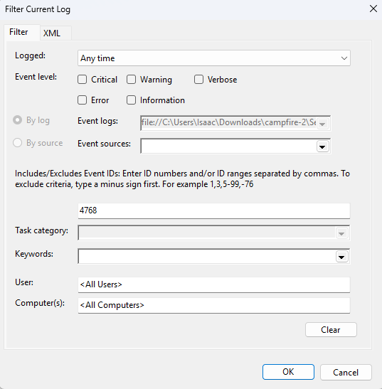
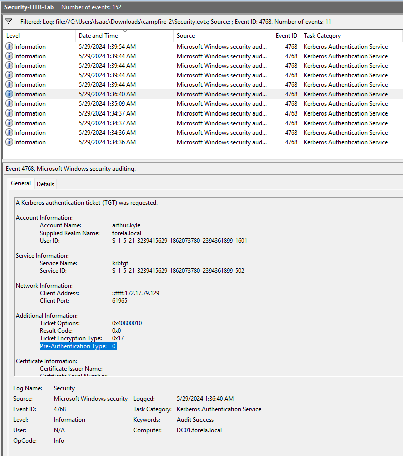
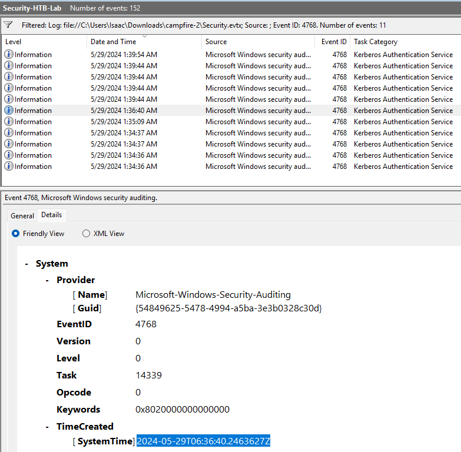
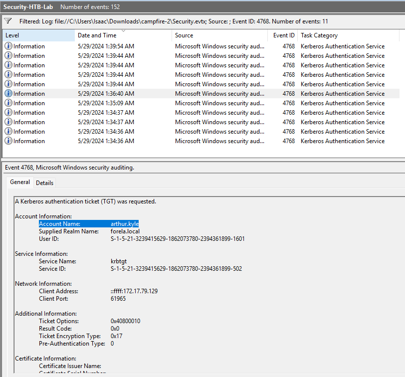
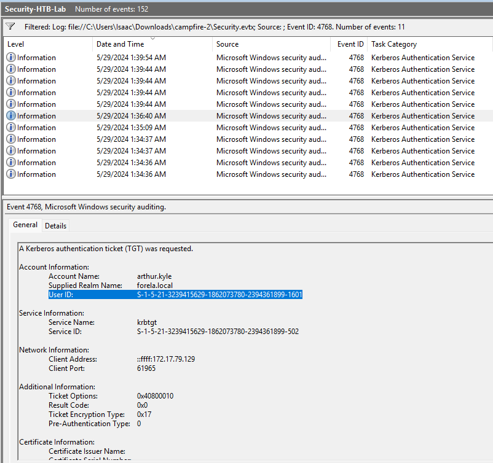
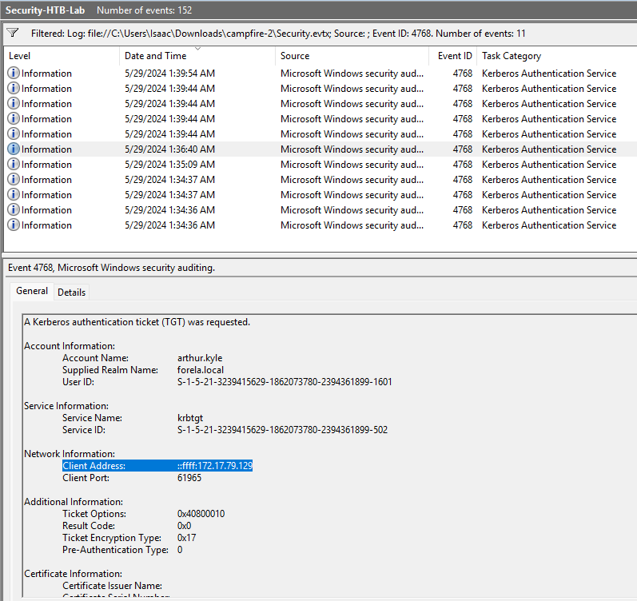
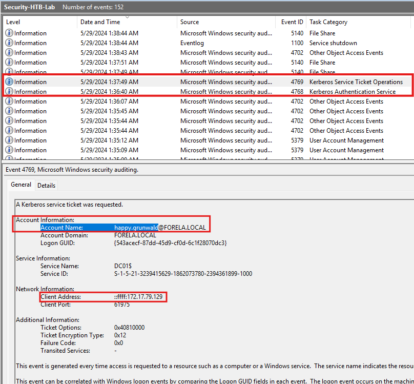

# Challenge Overview
---
**Challenge:** [Campfire-2](https://app.hackthebox.com/sherlocks/Campfire-2?tab=play_sherlock)  
**Platform:** HackTheBox  
**Category:** DFIR  
**Difficulty:** Very Easy  
**Tools:** Event Viewer  

# Summary
---
This lab focuses on investigating suspicious Kerberos authentication activity within a Windows domain. By analyzing domain controller security logs, the investigation identifies evidence of an AS-REP Roasting attack, where an attacker requests Kerberos tickets for accounts with pre-authentication disabled. The analysis traces the targeted user account and the source system responsible for the request, revealing indicators of credential harvesting within the Active Directory environment.  

# Scenario
---
Forela's Network is constantly under attack. The security system raised an alert about an old admin account requesting a ticket from KDC on a domain controller. Inventory shows that this user account is not used as of now so you are tasked to take a look at this. This may be an AsREP roasting attack as anyone can request any user's ticket which has preauthentication disabled.  

# Challenge
---
## When did the ASREP Roasting attack occur, and when did the attacker request the Kerberos ticket for the vulnerable user?
  
  
  
I filtered the event logs to show only events with event ID 4768. Event ID 4768 indicates that a Kerberos authentication ticket was requested. Going through the list of events, I came across an event at 1:36:40 AM (my local time), and I noticed the pre-authentication type is 0, which is an indicator that the pre-authenticator was bypassed.  

I then switched to the Details tab and looked under "System" and "TimeCreated" to get the time in UTC.

## Please confirm the User Account that was targeted by the attacker.
  
From the General tab on the same event as Task 1, the Account name logged is `arthur.kyle`.  

## What was the SID of the account?
  
From the General tab on the same event as Task 1, the User ID logged is `S-1-5-21-3239415629-1862073780-2394361899-1601`.  

## It is crucial to identify the compromised user account and the workstation responsible for this attack. Please list the internal IP address of the compromised asset to assist our threat-hunting team.
  
From the General tab on the same event as Task 1, the Client Address logged is `172.17.79.129`.  

## We do not have any artifacts from the source machine yet. Using the same DC Security logs, can you confirm the user account used to perform the ASREP Roasting attack so we can contain the compromised account/s?
  
Looking at the next immediate event that occurred after the pre-authentication bypass, I observe that the IP address is the same one that I identified before. From this, this is a strong indicator that the user `happy.grunwald` is the compromised account performing the attack.