# Challenge Overview
---
**Challenge:** [Dream Job-1](https://app.hackthebox.com/sherlocks/Dream%2520Job-1?tab=play_sherlock)  
**Platform:** HackTheBox  
**Category:** Threat Intelligence  
**Difficulty:** Very Easy  
**Tools Used:** MITRE ATT&CK, VirusTotal  

# Summary
---
This lab focuses on investigating the cyber-espionage campaign Operation Dream Job, which targets individuals through malicious job-related lures. The analysis involves researching threat intelligence sources and examining provided indicators of compromise (IOCs) such as file hashes to uncover details about the campaign. The lab demonstrates how threat intelligence and IOC analysis can be used to attribute activity, understand attacker behavior, and uncover infrastructure associated with a targeted phishing campaign.  

# Scenario
---
You are a junior threat intelligence analyst at a Cybersecurity firm. You have been tasked with investigating a Cyber espionage campaign known as Operation Dream Job. The goal is to gather crucial information about this operation.  

# Challenge
---
### Who conducted Operation Dream Job?
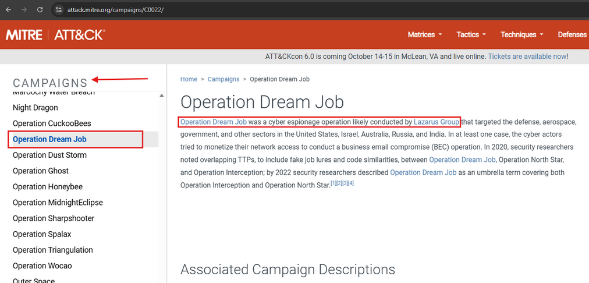  
First, I visited the MITRE ATT&CK page, which is used for threat intelligence. Then I navigated to "CTI", then under CTI to "Campaign". Under the "Campaigns" side menu, I scrolled down until I found Operation Dream Job. The first sentence stated who conducted Operation Dream Job.

### When was this operation first observed?
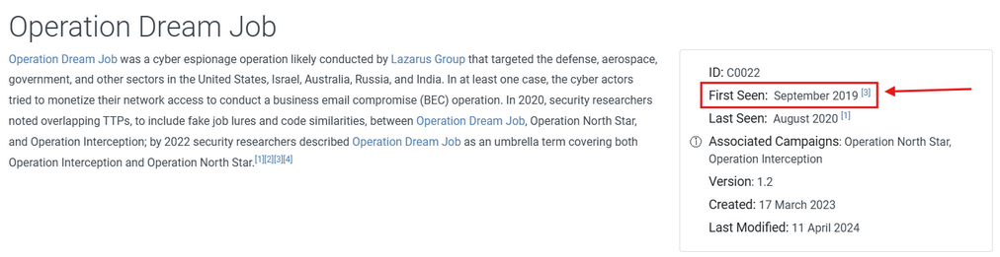

### There are 2 campaigns associated with Operation Dream Job. One is Operation North Star, what is the other?
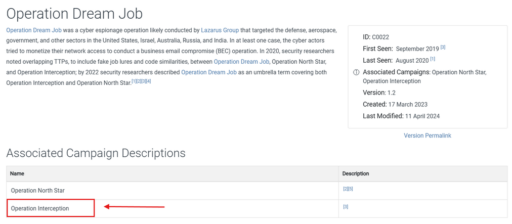  

### During Operation Dream Job, there were the two system binaries used for proxy execution. One was Regsvr32, what was the other?
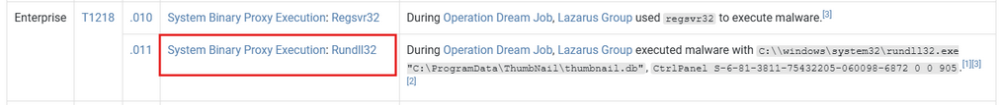  
I used Ctrl-F to find "Proxy execution" and found the second technique used.

### What lateral movement technique did the adversary use?
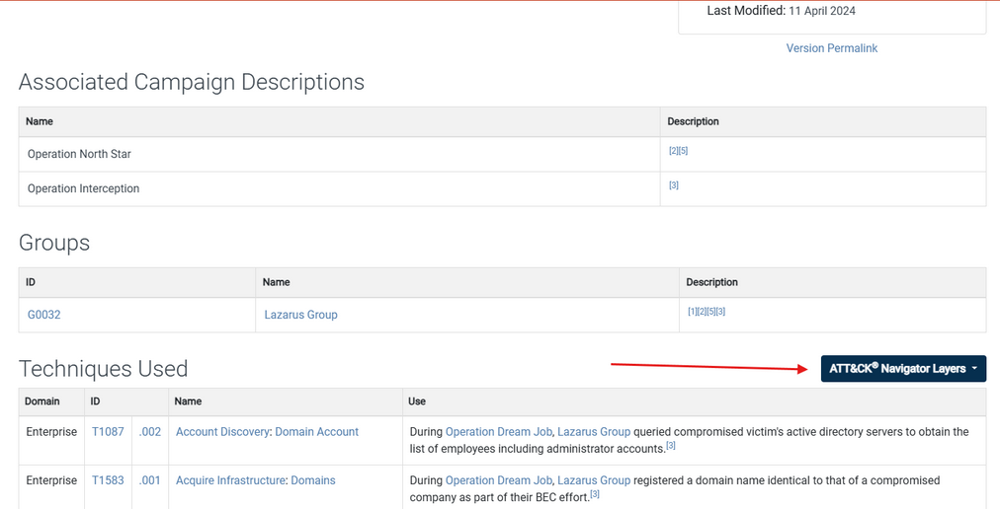
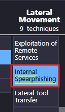  
I navigated to the ATT&CK Navigator Layers, then scrolled to the right to find "Lateral movement".

### What is the technique ID for the previous answer?
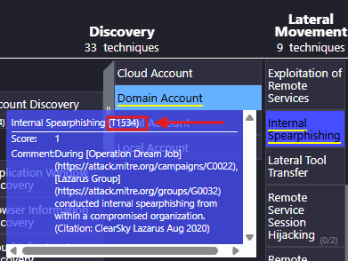  
Hovering over Internal Sphishing reveals the technique ID.

## What Remote Access Trojan did the Lazarus Group use in Operation Dream Job?
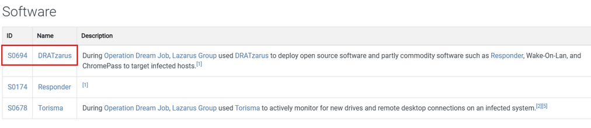  
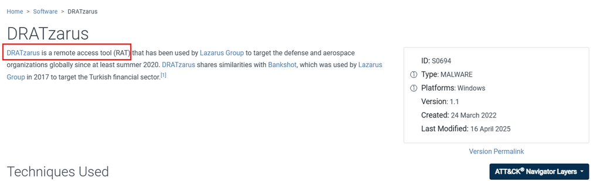  

## What technique did the malware use for execution?
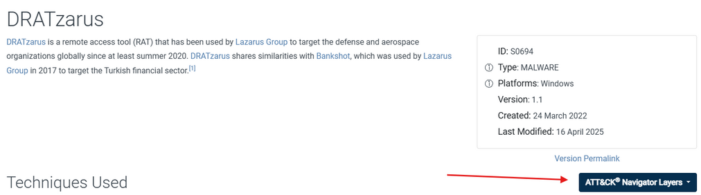  
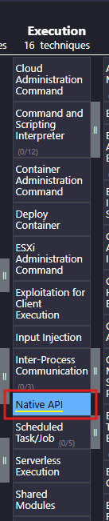  

## What technique did the malware use to avoid detection in a sandbox?
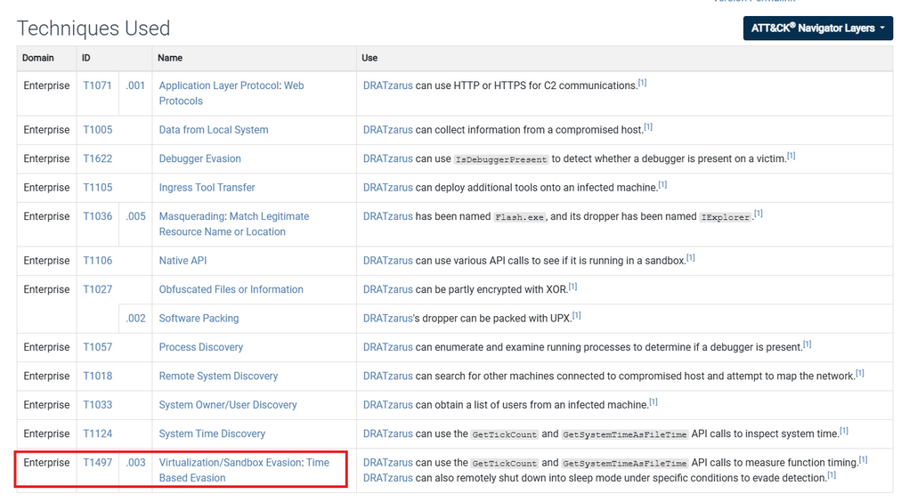

## To answer the remaining questions, utilize VirusTotal and refer to the IOCs.txt file. What is the name associated with the first hash provided in the IOC file?
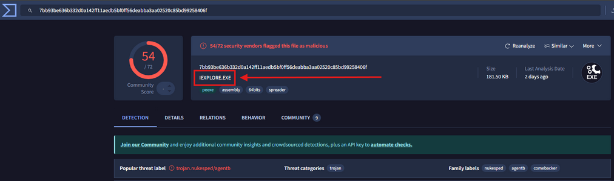  

## When was the file associated with the second hash in the IOC first created?
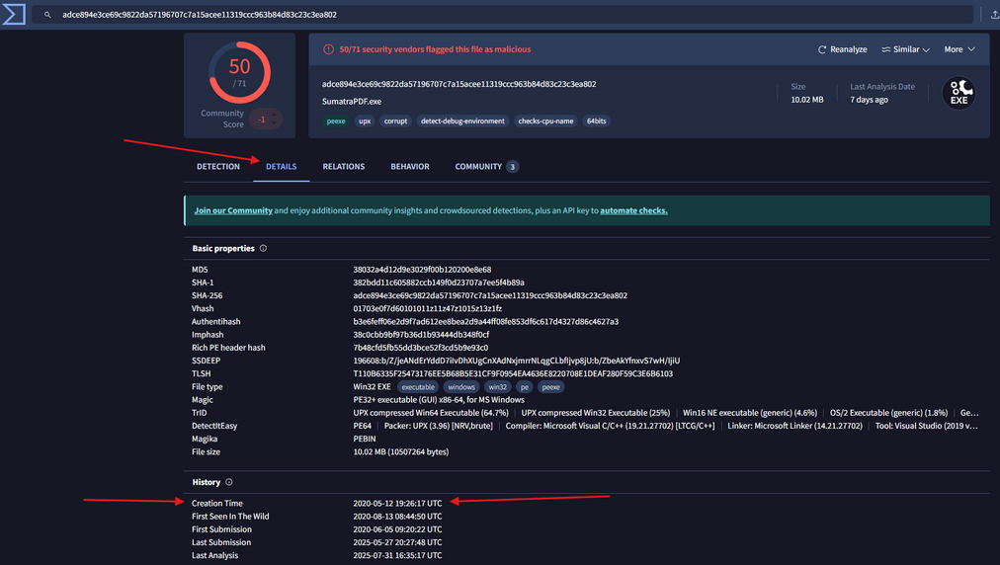  

## What is the name of the parent execution file associated with the second hash in the IOC?
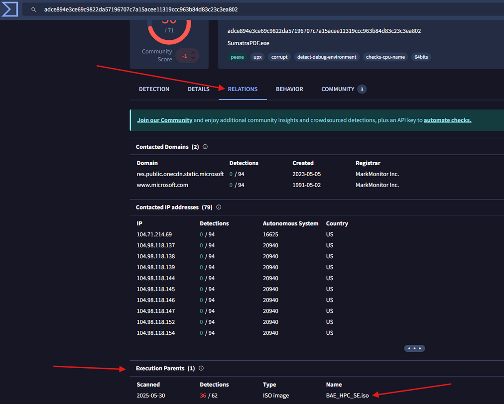  

## Examine the third hash provided. What is the file name likely used in the campaign that aligns with the adversary's known tactics?
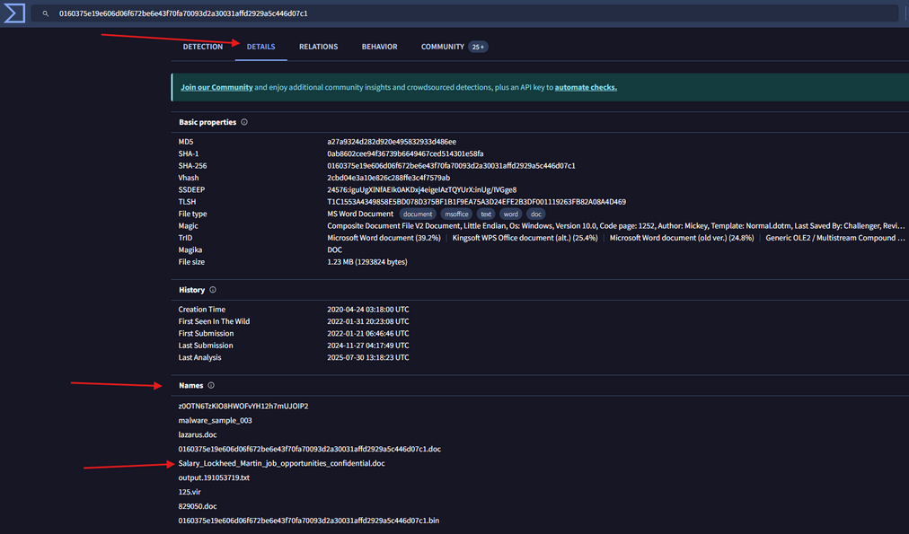  

## Which URL was contacted on 2022-08-03 by the file associated with the third hash in the IOC file?
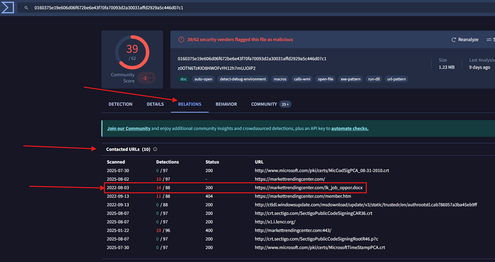  